# **1.4.1 三个模块的作用**

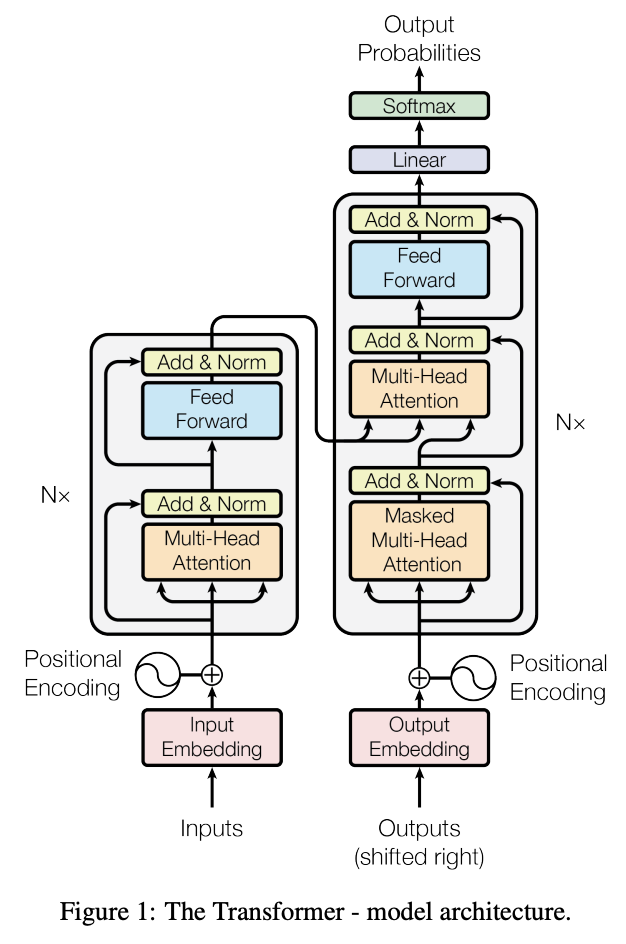

## **FFN 前馈层**

> ### **FeedForwardNetwork，FFN**
>
> 过了MHA之后，tokens只是互相查看了一下信息，但是还没思考他们从其他token那里发现了什么。所以**当token通过MHA把信息聚集起来之后，再通过前馈网络独立的去思考学习这些信息，简而言之就是交流加计算**

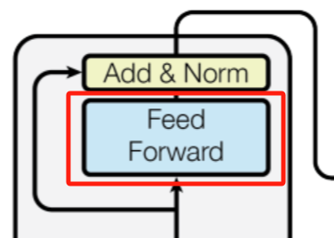

## **Add 残差连接**

> ### **Residual Add**
>
> **transformer结构一般会堆叠多个block，产生类似神经网络深度增加的优化问题**。**残差链接**提供**梯度回传的高速公路，一开始残差块的影响比较小，这样梯度也可以很好的回传到输入，即使网络很深，随着训练继续，残差块的梯度逐渐扩大影响**。加法会平等的分散梯度。这样的话，至少在初始化的时候，梯度是可以很好的从监督信号回传到输入，从而避免因为很深的网络对优化的难度

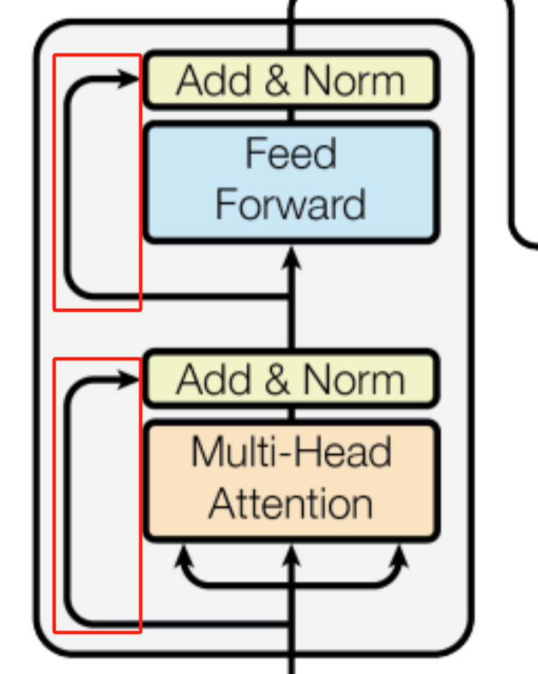

## **Layer Norm 层归一化**

> ### **Layer Norm**
>
> **加速模型收敛，缓解梯度消失和爆炸问题（相关：Batch Norm，注意二者的区别和应用场景）**

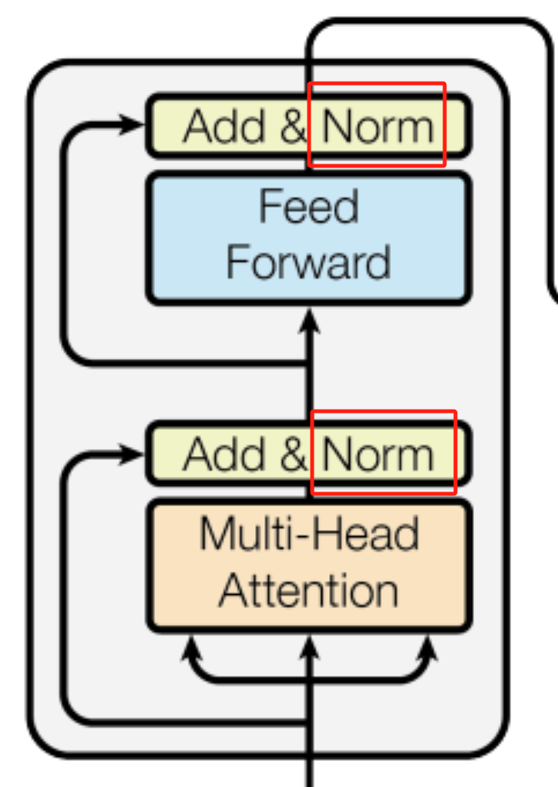

> 一般来说，**Batch Norm适用于CV**，**Layer Norm适用于NLP**。关键是要看需要保留什么信息，举个例子就明白
>
> * NLP中，`['搜推yyds', 'LLM大法好', 'CV永不为奴']`三句话做normalization，假设一个词是一个token，Batch Norm效果是`['搜', 'L', 'C']`, `['推', 'L', 'V']` ...做归一化；Layer Norm是三句话分别各自归一化；前者归一到同一分布后变无法保留一个句子里的分布信息了（比如`'搜推yyds'`用Batch Norm后就变了），而Layer Norm可以成功保留上下文分布信息
>
> * 【了解就行】CV中Batch Norm是对一个图像的不同channel（比如RGB通道）各自进行归一化，本身CV任务不需要channel之间的信息交互，归一化后仅保留各channel的分布信息作后续判断即可

> ### **多种Norm方法示意图**
>
> * **H（Height）：**&#x9AD8;度，通常指图像或特征图的垂直维度
>
> * **W（Width）：**&#x5BBD;度，通常指图像或特征图的水平维度
>
> * **C（Channel）：**&#x901A;道，通常指图像或特征图中的颜色通道（例如 RGB 图像中的红、绿、蓝通道）或特征通道（例如在卷积神经网络中的不同特征图）
>
> * **N（Number of samples）：**&#x6837;本数量，通常指批次中的样本数量（例如在 Batch Norm 中）或实例数量（例如在 Instance Norm 中）
>
> 这些维度在不同的归一化操作中有不同的处理方式：
>
> * **Batch Norm：**&#x5728;批次（N）维度上进行归一化，通常用于深度学习中的批量归一化
>
> * **Layer Norm：**&#x5728;通道（C）维度上进行归一化，通常用于对层的输入进行归一化
>
> * **Instance Norm：**&#x5728;通道（C）和样本（N）维度上进行归一化，通常用于风格迁移等任务
>
> * **Group Norm：**&#x5728;通道（C）维度上进行分组归一化，通常用于替代 Batch Norm 以避免批次大小对模型性能的影响

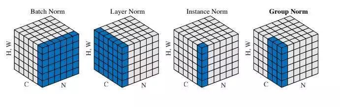

# **1.4.2 Layer Norm的位置和计算**

## **Layer Norm的位置影响**

> ### **Norm出现在各个位置的影响**
>
> * **Post-norm：深层容易出现训练不稳定的情况，深层的梯度范数逐渐增大**
>
> * **Pre-norm：每层的梯度范数近似相等，训练比较稳定，但是牺牲了深度**
>
> * **Sandwich-norm：平衡，有效控制每一层的激活值，避免它们过大，模型能够更好地学习数据特征，但是训练不稳定可能导致崩溃**
>
> * **Post-Norm和Pre- Norm的异同：**
>
>   * 一般认为，**Post-Norm在残差之后做归一化，对参数正则化的效果更强，进而模型的收敛性也会更好；而Pre-Norm有一部分参数直接加在了后面，没有对这部分参数进行正则化，可以在反向时防止梯度爆炸或者梯度消失**，大模型的训练难度大，因而使**用Pre-Norm较多**。目前比较明确的结论是：**同一设置之下，Pre-Norm结构往往更容易训练，但最终效果通常不如Post Norm**。一个𝐿层的Pre Norm模型，其**实际等效层数不如𝐿层的Post Norm模型**，而层数少了导致效果变差了
>
>   * Pre-Norm结构**无形地增加了模型的宽度而降低了模型的深度**，而深度通常比宽度更重要，所以是无形之中的降低深度导致最终效果变差了。而Post-Norm刚刚相反，它每Norm一次就削弱一次恒等分支的权重，所以Post Norm反而是更突出残差分支的，因此Post-Norm中一旦训练好之后效果更优，但是因为残差支路被削弱了，所以一开始不好训练，需要**warmup**
>
>   * Post norm的**不稳定性主要来自于梯度消失**，以及初始化时候更新太大陷入局部最优
>
>   * 输入经过了Norm之后，基本上能保持同一量级，然后Attention、MLP这些运算，一般不会大幅改动输入数值的量级（否则容易梯度消失或者爆炸），因此输出的范围也大致相同

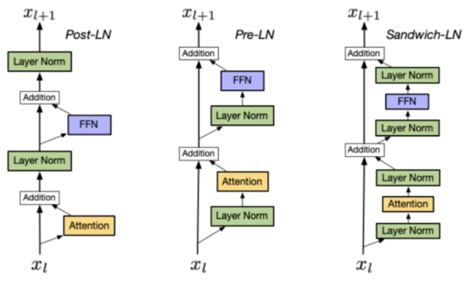

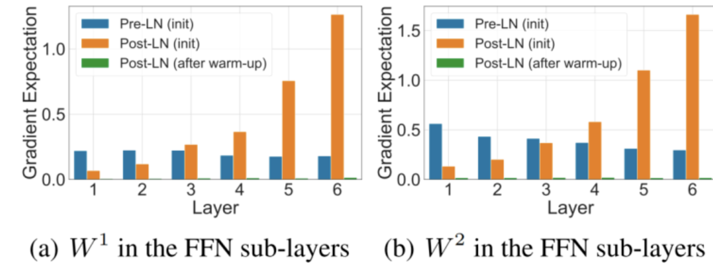

## **Layer Norm的计算**

> ### **Layer Norm**
>
> **对每个样本的所有特征做归一化，这消除了不同样本间的大小关系，但是保留了一个样本内不同特征之间的大小关系。LayerNorm 适用于 NLP 领域，这时输入尺寸为 $$b\times l\times d$$(批量大小 x 序列长度 x 嵌入维度)，公式如下，**&#x5176;&#x4E2D;**&#x20;**$$\gamma$$和 $$\beta$$是**可学习的缩放和偏移参数**
>
> $$\mu = E(X) \leftarrow \frac{1}{H} \sum_{i = 1}^{H} x_i$$
>
> $$\sigma \leftarrow \sqrt{\operatorname{Var}(x)}=\sqrt{\frac{1}{H} \sum_{i = 1}^{H}\left(x_{i}-\mu\right)^{2}+\epsilon}$$
>
> $$y=\frac{x - E(x)}{\sqrt{\operatorname{Var}(X)}} \cdot \gamma+\beta$$

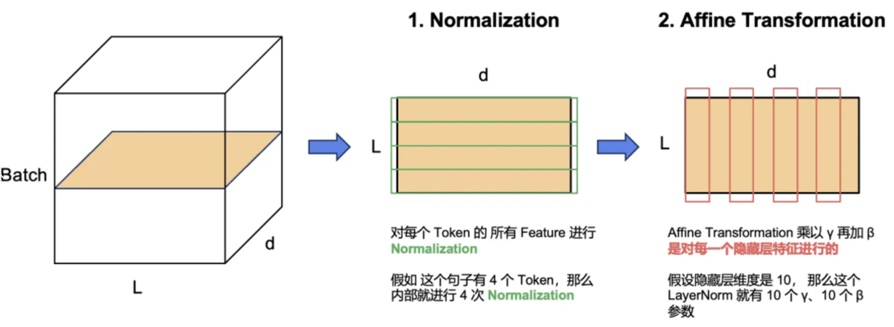

```python
import torch
from torch import nn
 
class LN(nn.Module):
    # 初始化
    def __init__(self, normalized_shape,  # 在哪个维度上做LN
                 eps:float = 1e-5, # 防止分母为0
                 elementwise_affine:bool = True):  # 是否使用可学习的缩放因子和偏移因子
        super(LN, self).__init__()
        # 需要对哪个维度的特征做LN, torch.size查看维度
        self.normalized_shape = normalized_shape  # [c,w*h]
        self.eps = eps
        self.elementwise_affine = elementwise_affine
        # 构造可训练的缩放因子和偏置
        if self.elementwise_affine:  
            self.gain = nn.Parameter(torch.ones(normalized_shape))  # [c,w*h]
            self.bias = nn.Parameter(torch.zeros(normalized_shape))  # [c,w*h]
 
    # 前向传播
    def forward(self, x: torch.Tensor): # [b,c,w*h]
        # 需要做LN的维度和输入特征图对应维度的shape相同
        assert self.normalized_shape == x.shape[-len(self.normalized_shape):]  # [-2:]
        # 需要做LN的维度索引
        dims = [-(i+1) for i in range(len(self.normalized_shape))]  # [b,c,w*h]维度上取[-1,-2]维度，即[c,w*h]
        # 计算特征图对应维度的均值和方差
        mean = x.mean(dim=dims, keepdims=True)  # [b,1,1]
        mean_x2 = (x**2).mean(dim=dims, keepdims=True)  # [b,1,1]
        var = mean_x2 - mean**2  # [b,c,1,1]
        x_norm = (x-mean) / torch.sqrt(var+self.eps)  # [b,c,w*h]
        # 线性变换
        if self.elementwise_affine:
            x_norm = self.gain * x_norm + self.bias  # [b,c,w*h]
        return x_norm
 
if __name__ == '__main__':
 
    x = torch.linspace(0, 23, 24, dtype=torch.float32)  # 构造输入层
    x = x.reshape([2,3,2*2])  # [b,c,w*h]
    # 实例化
    ln = LN(x.shape[1:])
    # 前向传播
    x = ln(x)
    print(x.shape)
```

> ### **RMS Norm**
>
> 均方根Norm，全称为root mean square layer normalization，与layer norm相比，RMS Norm **去除掉计算均值进行平移的部分**，理解是把均值看成0了，计算速度更快效果基本相当
>
> Layer norm通过对输入进行归一化，使其均值和方差保持不变。LayerNorm成功的一个著名解释是其重新居中和缩放不变性属性。前者使得模型对于输入和权重上的偏移噪声不敏感，而后者在输入和权重都被随机缩放时保持输出表示不变，**RMS Norm作者假设LN的成功是缩放不变性而不是重新居中**
>
> $$ 
> RMS(x) = \sqrt{\frac{1}{H} \sum_{i = 1}^{H} x_i^2}
>
> \\
> x = \frac{x}{RMS(x)} \cdot \gamma
>  $$
>
> RMS测量输入的平方均值，它**将加权和输入强制缩放到一个 $$\sqrt{n}$$倍的单位球中**。通过这样做，**输出分布不受输入和权重分布的缩放影响，有利于层激活的稳定性**。虽然欧几里得范数与RMS仅差一个 $$\sqrt{n}$$的因子，已经成功应用于一些领域，但经验证明，它在层归一化中并不奏效
>
> ### **Deep Norm**
>
> 可以缓解 Transformer 过深导致爆炸式模型更新训练不稳定的问题，把模型更新限制在常数，使得模型训练过程更稳定。Deep Norm方法在**执行Layer Norm之前，up-scale了残差连接(alpha>1)另外，在初始化阶段down-scale了模型参数(beta<1)**
>
> 1. 使用 DeepNorm 时，拿它来替换 Post-LN
>
> 2. DeepNorm 其实就是 LN，只是在执行层归一化之前 up-scale 了残差连接。 $$x∗α + f(x) $$里面的 $$f(x)$$ 代表 Self-Attention 等等的 Token-mixer，x 代表 Token-mixer 的输出，α 是常数
>
> 3. `torch.nn.init.xavier_normal_(tensor, gain=1)`是 xavier 高斯初始化，参数由0均值，标准差为`  gain × sqrt(2 / (fan_in + fan_out))  `的正态分布产生，其中`fan_in` 和 `fan_out `是分别权值张量的输入和输出元素数目。 这种初始化同样是为了保证**输入输出的方差不变**
>
> $$std=gain×\sqrt{\frac{2}{fan\_in+fan\_out}}$$
>
> * DeepNorm 还在初始化期间 down-scale 了参数。值得注意的是，对于 `ffn，v_proj，out_proj`和 `q_proj，k_proj`的初始化，是不一样的
>
> * 不同架构的 α 和 β 值不一样
>
> > **导致训练不稳定的原因**
> >
> > 1. 训练的**起始阶段模型参数更新非常快**，它使模型陷入一个坏的局部最优，这反过来增加了每个 LN 的输入
> >
> > 2. Pre-LN在底层的梯度往往大于顶层

```python
def deepnorm(x):
    return LayerNorm(x * α + f(x))
def deepnorm_init(w):
    if w in ['ffn', 'v_proj', 'out_proj']:
        nn.init.xavier_normal_(w, gain=β)
    elif w in ['q_proj', 'k_proj']:
        nn.init.xavier_normal_(w, gain=1)
```

## **Batch Norm的计算**

> * **BatchNorm**是对整个 batch 样本内的每个特征做归一化，这消除了不同特征之间的大小关系，但是保留了不同样本间的大小关系。BatchNorm 适用于 CV 领域，这时输入尺寸为  $$b\times c\times h\times w$$ (批量大小x通道x长x宽)，图像的每个通道 c 看作一个特征，BN 可以把各通道特征图的数量级调整到差不多，同时保持不同图片相同通道特征图间的相对大小关系
>
> * 在train模式下参数会随着网络的反向传播进行梯度更新，计算每一个batch里的方差和平均值，在eval模式，模型不可能等到预测样本数量达到一个batch时，再进行归一化，而是直接使用train模式得到的统计量

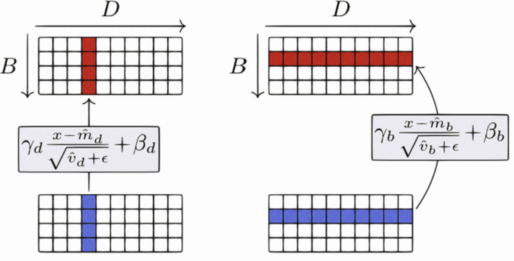

**BN和LN的区别**

```python
import torch
import torch.nn as nn

bs = 64

print("Pytorch Batch Norm Layer详解")
print("--- 2D input:(mini_batch, num_feature) ---")
# With Learnable Parameters
m = nn.BatchNorm1d(400)  # 例如，房价预测：x的特征数是400，y是房价
# Without Learnable Parameters（无学习参数γ和β）
# m = nn.BatchNorm1d(100, affine=False)
inputs = torch.randn(bs, 400)
print(m(inputs).shape)


print("Batch Norm层的γ和β是要训练学习的参数")
print("γ:", m.state_dict()['weight'].shape)  # gammar
print("β:", m.state_dict()['bias'].shape)  # beta
print("")


print("--- 3D input:(mini_batch, num_feature, other_channel) ---")
m = nn.BatchNorm1d(32)
inputs = torch.randn(bs, 32, 32)  # 这种格式的数据不常用
print(m(inputs).shape)

print("Batch Norm层的γ和β是要训练学习的参数")
print("γ:", m.state_dict()['weight'].shape)  # gammar
print("β:", m.state_dict()['bias'].shape)  # beta
print("")


print("--- 4D input:(mini_batch, num_feature, H, W) ---")
m = nn.BatchNorm2d(3)  # 例如, CIFAR10数据集是三通道的，3x32x32

inputs = torch.randn(bs, 3, 32, 32)
print(m(inputs).shape)

print("Batch Norm层的γ和β是要训练学习的参数")
print("γ:", m.state_dict()['weight'].shape)  # gammar
print("β:", m.state_dict()['bias'].shape)  # beta
print("Batch Norm层的running_mean和running_var是统计量（主要用于预测阶段）")
print("running_mean:", m.state_dict()['running_mean'].shape)
print("running_var:", m.state_dict()['running_var'].shape
```

# **1.4.4 FFN计算和激活函数**

> ### **FFN块计算**
>
> * **一般激活函数计的FFN块算公式：** $$FFN(x) = ReLU(xW_1+b1)W_2+b_2$$
>
> * **GLU线性门控单元的FFN块计算公式：**
>
>   $$GLU(x) = xV \cdot \sigma(xW + b)\ \ \ 
>   FFN_{GLU} = (xV \cdot \sigma(xW_1 + b))W_2$$
>
>   输出两个线性变换，然后对一个做sigmoid，乘以线性变换的，**相当于做了门控机制**，选择哪些过，哪些不过，**进行了信息过滤，处理信息时更有针对性，增强表达能力**
>
>   **SwiGLU、GeGLU**就是用**Swish、GeLU激活函数**分别去**替换GLU中的sigmoid激活函数。一个例子**：在LLaMA2-7B中，FFN的原始输入维度为4096，一般而言**中间层是输入维度的4倍等于16384**，由于SwiGLU的原因**FFN从2个矩阵变成3个矩阵**，为了使得模型的参数量大体保持不变，**中间层维度做了缩减，缩减为原来的2/3即10922，进一步为了使得中间层是256的整数倍，又做了取模再还原的操作，最终中间层维度为11008**
>
> * **Swish激活函数：** $$Swish(x) = x \times sigmoid(\beta * x)$$
>
> * **GeLU激活函数：** $$GeLU(x) \approx 0.5x\left(1 + tanh\left(\sqrt{\frac{2}{\pi}}\left(x + 0.044715x^{3}\right)\right)\right)$$
>
> * 现在大模型**通常使用SwiGLU替换掉传统的FFN结构**

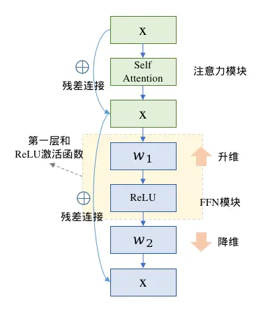

**一般激活函数**

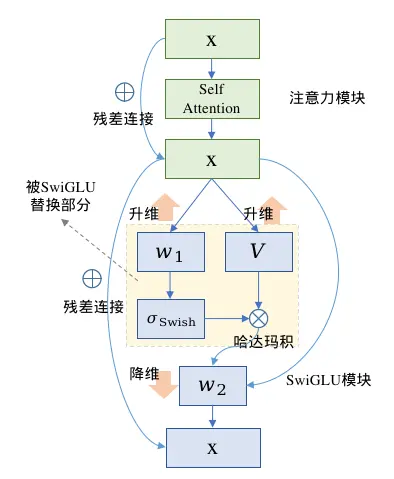

**GLU**

# **1.4.5 常见激活函数公式及图示**

## **Sigmoid**

> **缺点：**
>
> * **输入较大或较小时候梯度接近于0，容易导致梯度消失**
>
> * **函数输出不是以 0 为中心的，梯度可能就会向特定方向移动，从而降低权重更新的效率**
>
> * **Sigmoid 函数执行指数运算，计算机运行得较慢，比较消耗计算资源**
>
>   $$f(x) = \frac{1}{1+e^{-x}}\\
>   f'(x) = f(x)f(1-x)$$

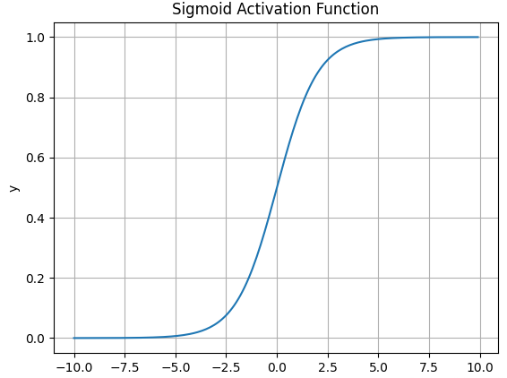


## **Tanh**

> **优点：tanh**是“零为中心”的。因此在实际应用中，tanh会比sigmoid更好一些
>
> **缺点：**
>
> * **仍然存在梯度饱和的问题**
>
> * **依然进行的是指数运算**
>
> $$f(x)=\frac{e^{x}-e^{-x}}{e^{x}+e^{-x}}$$

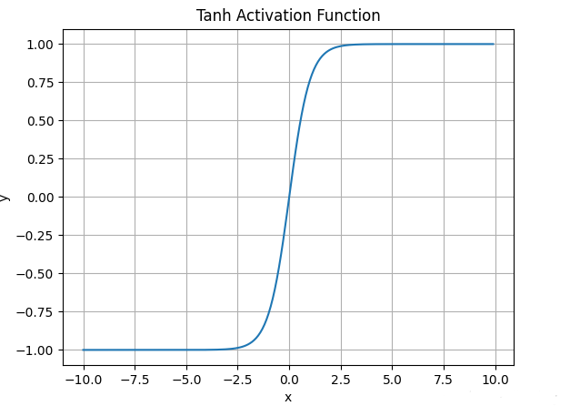

## **ReLU**

> **优点：**
>
> * **ReLU解决了梯度消失的问题，当输入值为正时，神经元不会饱和**
>
> * **由于ReLU线性、非饱和的性质，在SGD中能够快速收敛**
>
> * **计算复杂度低，不需要进行指数运算**
>
> **缺点：**
>
> * **与Sigmoid一样，其输出不是以0为中心的**
>
> * **Dead ReLU 问题。当输入为负时，梯度为0。这个神经元及之后的神经元梯度永远为0，不再对任何数据有所响应，导致相应参数永远不会被更新**
>
> $$f(x) = \max(0,x)$$


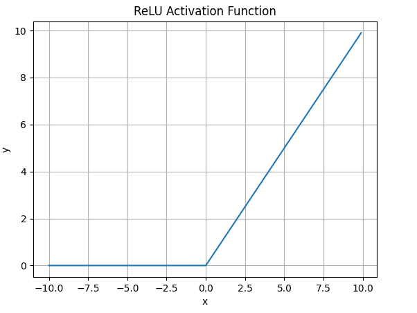

## **Leaky ReLU**

> **优点：**
>
> * **解决了ReLU输入值为负时神经元出现的死亡的问题**
>
> * **Leaky ReLU线性、非饱和的性质，在SGD中能够快速收敛**
>
> * **计算复杂度低，不需要进行指数运算**
>
> **缺点：**
>
> * **函数中的α，需要通过先验知识人工赋值（一般设为0.01）**
>
> * **有些近似线性，导致在复杂分类中效果不好**
>
> $$f(x)=\max(\alpha x, x)$$


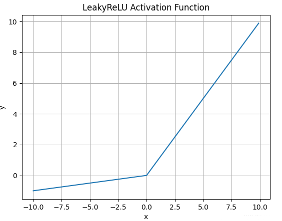

## **ELU**

> **优点：**
>
> * **ELU试图将激活函数的输出均值接近于零，使正常梯度更接近于单位自然梯度，从而加快学习速度**
>
> * **ELU 在较小的输入下会饱和至负值，从而减少前向传播的变异和信息**
>
> **缺点：**
>
> * **计算的时需要计算指数，计算效率低**
>
> $$f(\alpha,x)=\begin{cases}
> \alpha(e^{x}-1), & \text{for } x \leq 0 \\
> x, & \text{for } x > 0
> \end{cases}$$


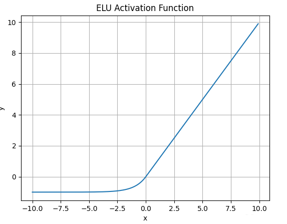

## **Swish**

> **优点：**
>
> **Swish相较于传统的ReLU激活函数，具有光滑的非单调特性，其无界性有助于防止慢速训练期间，梯度逐渐接近 0 并导致饱和**；同时，有界性也是有优势的，因为**有界激活函数可以具有很强的正则化**(防止过拟合， 进而增强泛化能力)，并且**较大的负输入问题也能解决**。Swish激活函数在x=0附近更为平滑，而非单调的特性增强了输入数据和要学习的权重的表达能力
>
> $$f(x) = x * \text{sigmoid}(\beta x)$$
>
> * 当 $$\beta \rightarrow0$$时，Swish接近于线性函数
>
> * 当 $$\beta \rightarrow \infty$$时，它接近ReLU
>
> * 当 $$\beta=1$$时，Swish与SiLU等价
>
> Swish的优势在于其对负值的输入有一定的激活


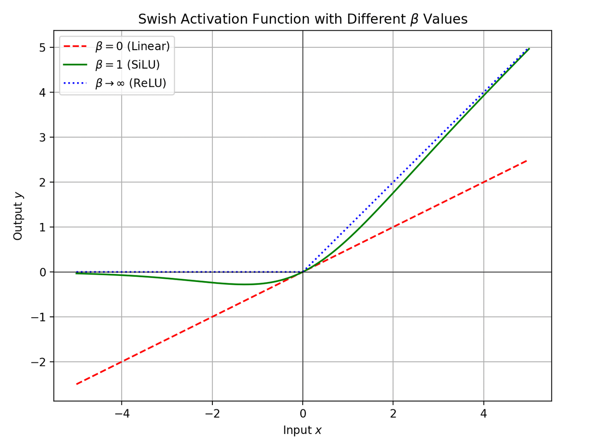


## **Softmax**

> **Softmax**函数常在神经网络输出层充当激活函数，将输出层的值通过激活函数映射到0-1区间，将神经元输出构造成概率分布，用于多分类问题中，Softmax激活函数映射值越大，则真实类别可能性越大
>
> $$f(x) = \frac{e^x}{\sum_i^Ne^{x_i}}$$


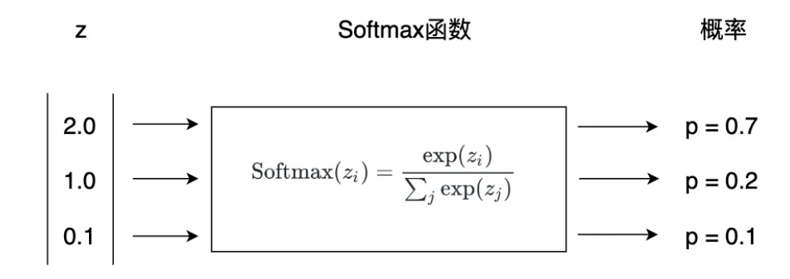

