# **1.5.1 位置编码介绍**

### **位置编码的需求**

> **RNN**的结构包含了序列的时序信息，而**Transformer**却完全把时序信息给丢掉了，比&#x5982;**“他欠我100万”，和“我欠他100万”，两者的意思千差万别**，故为了解决时序的问题，Transformer的作者用了一个绝妙的办法：位置编码(Positional Encoding)
>
> Attention计算是无向的，而各种位置信息在tokens间的关系是很重要的。对于人来说很容易知道tokens的位置信息，比如：
>
> * **绝对位置信息，**&#x61;1是第一个token，a2是第二个token......
>
> * **相对位置信息，**&#x61;2在a1的后面一位，a4在a2的后面两位......
>
> * **不同位置间的距离，**&#x61;1和a3差两个位置，a1和a4差三个位置....
>
> 因此，我们需要这样一种位置表示方式，满足于：
>
> * 它能用来表示一个token在序列中的**绝对位置**
>
> * 在序列长度不同的情况下，**不同序列中token的相对位置/距离也要保持一致**
>
> * 可以用来表示模型在训练过程中从来**没有看到过的句子长度（长度外推问题）**
>
> 需要一个**有界又连续**的函数，最简单的，正弦函数sin就可以满足这一点。频率设成非常低，这样几乎不会有不同T的位置编码重合的情况了：
>
> $$
>PE_t = [\sin(w_0t), \sin(w_1t), \ldots, \sin(w_{i - 1}t), \ldots, \sin(w_{d_{model}-1}t)]
> $$
> 
> $$
>w_i = \frac{1}{10000^{i/(d_{model}-1)}}
> $$

# **1.5.2 绝对位置编码**

## **Transformer的位置编码**

> **Transformer的位置编码加在embedding上**，但是由于使用的是**sin cos 交替**，可以通过**线性变换矩阵得到其他位置的表示**，所以可以期望他包含了**相对位置的信息**，而且由于**三角函数有显示的生成规律，所以可以期望有外推性质**
>
> * **计算公式：**
>
>   $$
>PE_t = [\sin(w_0t), \cos(w_0t), \sin(w_1t), \cos(w_1t), \ldots, \sin(w_{\frac{d_{model}}{2}-1}t), \cos(w_{\frac{d_{model}}{2}-1}t)]
>   $$
>   
>$$
>   \begin{pmatrix}
>   \sin(t + \triangle t) \\
>   \cos((t + \triangle t))
>   \end{pmatrix} =
>   \begin{pmatrix}
>   \cos \triangle t & \sin \triangle t \\
>   -\sin \triangle t & \cos \triangle t
>   \end{pmatrix}
>   \begin{pmatrix}
>   \sin t \\
>   \cos t
>   \end{pmatrix}
>   $$
>   
>* **可视化：**&#x4E0B;图是长度为100，编码维度为512的序列的位置编码可视化，可以发现，由于sin/cos函数的性质，位置向量的每一个值都位于\[-1, 1]之间。同时，纵向来看，图的右半边几乎都是黄色的，这是因为越往后的位置，频率越小，波长越长，所以不同的t对最终的结果影响不大。而越往左边走，颜色交替的频率越频繁

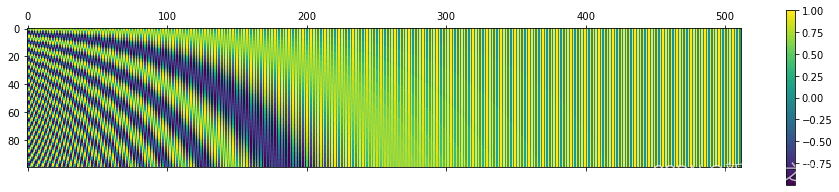

> * **Transformer位置编码的缺点：**&#x7531;于**位置编码点积的无向性**， $$  P E_t^T * P E_{t+\Delta t} = P E_t^T * P E_{t - \Delta t}  $$ 即两个位置编码的乘积仅取决于 $$\Delta T$$，距离是成对分布的，不能用来表示位置的方向性。当随着input embedding被喂入attention的时候会出现**距离意识被破坏的现象**，即**正弦位置编码的相对位置表达能力被投影矩阵破坏掉了**，所以在后续BERT的改进中，采用了可学习的位置编码

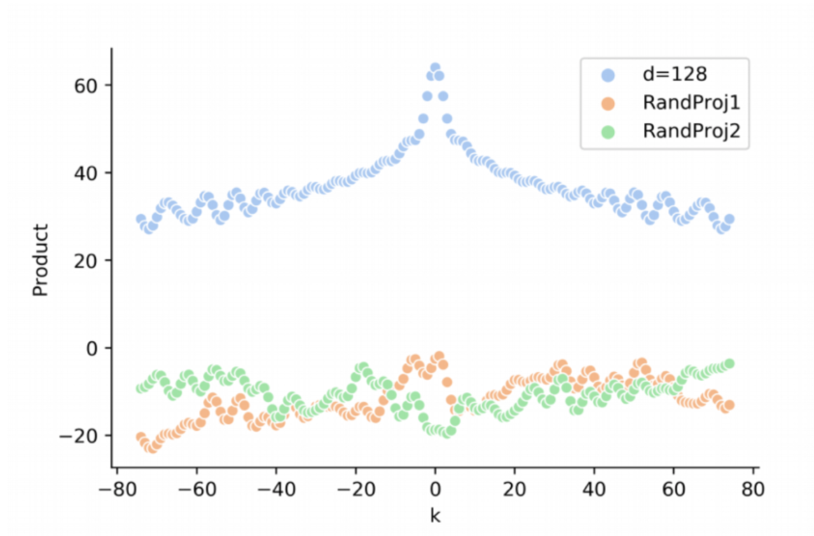

## **BERT的可学习位置编码**

> 直接将**位置编码当作可训练参数**，比如最大长度为512，编码维度为768，那么就初始化一个512×768的矩阵作为位置向量，让它随着训练过程更新。对于这种训练式的绝对位置编码，一般的认为它的**缺点是没有长度外推性**，即如果预训练最大长度为512的话，那么最多就只能处理长度为512的句子，再长就处理不了了。当然，也可以将超过512的位置向量随机初始化，然后继续微调
>
> 具体示意见4.1章[ 4.1 BERT及变体](https://kcnd4kn8i6ap.feishu.cn/wiki/CS5kwhhxeirquCk3bshce7wonnc#share-DVqVdGVEjoNafhxXiNmcLglTnGK)

## **RNN 位置编码**

> **递归式的绝对位置编码，**&#x69;nput后面接一层RNN，可以用RNN学每个位置的位置编码。**优点是外推、灵活，缺点是丧失transformed的并行处理性质**

# **1.5.3 相对位置编码**

## **Relative Position Representation**

> 先对attention公式中的query和key列向量进行拆分， $$x_i, p_i$$分别为输入embedding和位置编码， $$W_Q,W_K$$分别为query和key的投影矩阵，同时展开output部分， $$W_V$$为value的投影矩阵
>
> $$
> q_i k_j^T = (x_i + p_i) W_Q W_K^T (x_j + p_j)^T = (x_i W_Q + p_i W_Q) (W_K^T x_j^T + W_K^T p_j^T)
> \\
> a_{i,j} = \text{softmax}(q_i k_j^T )
> \\
> o_i = \sum_j a_{i,j} v_j = \sum_j a_{i,j} (x_j W_V + p_j W_V)
>  $$
>
> 为了引入相对位置信息，Google将第一项位置去掉，第二项 $$W_K^T p_j^T$$改为二元位置向量 $$R_{i,j}^K$$，同时对output部分也改动得到下面的形式
>
> $$
> a_{i,j} = \text{softmax} \left( x_i W_Q \left( x_j W_K + R_{i,j}^K \right)^{\top} \right)
> \\
> o_i = \sum_j a_{i,j} v_j = \sum_j a_{i,j} (x_j W_V + R^V_{i,j})
>  $$
>
> **二元相对位置向量只依赖于相对位置，而且通常会进行截断处理**，这样只需要有限个位置编码（不管是三角函数式还是训练式），都可以表达出任意长度的相对位置
>
> $$R_{i,j}^K = p_K [\text{clip}(i - j, p_{\text{min}}, p_{\text{max}})]
> \\
> R_{i,j}^V = p_V [\text{clip}(i - j, p_{\text{min}}, p_{\text{max}})]
> $$

## **XLNET式的位置编码**

> **论文链接：https://arxiv.org/pdf/1901.02860**
>
> 源自于Transformer-XL论文，继续对attention公式进行完全展开
>
> $$
> q_i k_j^{\top} = x_i W_Q W_K^{\top} x_j^{\top} + x_i W_Q W_K^{\top} p_j^{\top} + p_i W_Q W_K^{\top} x_j^{\top} + p_i W_Q W_K^{\top} p_j^{\top}
>  $$
>
> Transformer - XL的做法很简单，直接将 $$p_{j}$$替换为相对位置向量 $$R_{i - j}$$，至于两个 $$p_{i}$$，则干脆替换为两个可训练的向量 $$u, v$$：
>
> $$
> x_{i} W_{Q} W_{K}^{\top} x_{j}^{\top} + x_{i} W_{Q} W_{K}^{\top} R_{i - j}^{\top} + u W_{Q} W_{K}^{\top} x_{j}^{\top} + v W_{Q} W_{K}^{\top} R_{i - j}^{\top}
>  $$
>
> 该编码方式中的相对位置向量没有像经典模型那样进行截断，而是直接用了Sinusoidal式的生成方案，由于 $$R_{i - j}$$的编码空间与 $$x_j$$不一定相同，所以前面的 $$W_{K}^{\top}$$换了另一个独立的矩阵 $$W_{K, R}^{\top}$$，还有 $$u W_{Q},v W_{Q}$$可以直接合并为单个 $$u, v$$，所以最终使用的式子是：
>
> $$
> x_{i} W_{Q} W_{K}^{\top} x_{j}^{\top} + x_{i} W_{Q} W_{K, R}^{\top} R_{i - j}^{\top} + u W_{K}^{\top} x_{j}^{\top} + v W_{K, R}^{\top} R_{i - j}^{\top}
>  $$
>
> 此外， $$v_{j}$$上的位置偏置就直接去掉了，即直接令 $$o_{i} = \sum_{j} a_{i, j} x_{j} W_{V}$$。似乎从这个工作开始，后面的相对位置编码都只加到Attention矩阵上去，而不加到 $$v_{j}$$上去了。

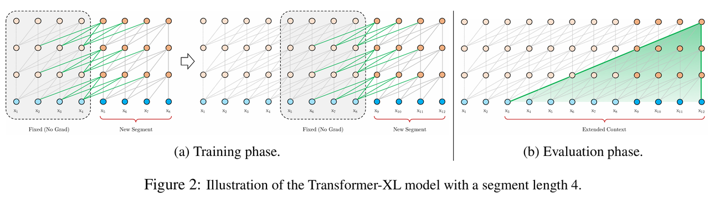

## **T5式的位置编码**

> **T5**模型里边用到了一种更简单的相对位置编码。思路依然源自之前的展开式，如果非要分析每一项的含义，那么可以分别理解&#x4E3A;**“输入-输入”、“输入-位置”、“位置-输入”、“位置-位置”四项注意力的组合**。如果认为输入信息与位置信息应该是独立（解耦）的，那么它们就不应该有过多的交互，所&#x4EE5;**“输入-位置”、“位置-输入”**&#x4E24;项Attention可以删掉，而 $$p_{i} W_{Q} W_{K}^{\top} p_{j}^{\top}$$实际上只是一个只依赖于 $$(i, j)$$的标量，我们可以直接将它作为参数训练出来，即简化为：
>
> $$
> x_{i} W_{Q} W_{K}^{\top} x_{j}^{\top}+\beta_{i, j}
>  $$
>
> 该方法仅仅是**在Attention矩阵的基础上加一个可训练的偏置项**，包含同样的思想的还有微软在ICLR 2021的论文《Rethinking Positional Encoding in Language Pre-training》中提出的**TUPE位置编码，**&#x54;5对相对位置进行了一个“分桶”处理，即相对位置是 $$i - j$$的位置实际上对应的是 $$f(i - j)$$位置，映射关系如下表：
>
> 这个设计的思路其实也很直观，就是比较邻近的位置(0\~7)，需要比较得精细一些，所以给它们都分配一个独立的位置编码，至于稍远的位置(比如8\~11)，不用区分得太清楚，所以它们可以共用一个位置编码，距离越远，共用的范围就可以越大，直到达到指定范围再clip

<table>
<thead>
<tr>
<th>i-j</th>
<th>0</th>
<th>1</th>
<th>2</th>
<th>3</th>
<th>4</th>
<th>5</th>
<th>6</th>
<th>7</th>
</tr>
</thead>
<tbody>
<tr>
<td>f(i-j）</td>
<td>0</td>
<td>1</td>
<td>2</td>
<td>3</td>
<td>4</td>
<td>5</td>
<td>6</td>
<td>7</td>
</tr>
<tr>
<td>i-j</td>
<td>8</td>
<td>9</td>
<td>10</td>
<td>11</td>
<td>12</td>
<td>13</td>
<td>14</td>
<td>15</td>
</tr>
<tr>
<td>f(i-j）</td>
<td>8</td>
<td>8</td>
<td>9</td>
<td>9</td>
<td>9</td>
<td>9</td>
<td>9</td>
<td>9</td>
</tr>
<tr>
<td>i-j</td>
<td>16</td>
<td>17</td>
<td>18</td>
<td>19</td>
<td>20</td>
<td>21</td>
<td>22</td>
<td>23</td>
</tr>
<tr>
<td>f(i-j）</td>
<td>10</td>
<td>10</td>
<td>10</td>
<td>10</td>
<td>10</td>
<td>10</td>
<td>10</td>
<td>11</td>
</tr>
<tr>
<td>i-j</td>
<td>24</td>
<td>25</td>
<td>26</td>
<td>27</td>
<td>28</td>
<td>29</td>
<td>30</td>
<td>...</td>
</tr>
<tr>
<td>f(i-j）</td>
<td>11</td>
<td>11</td>
<td>11</td>
<td>11</td>
<td>11</td>
<td>11</td>
<td>11</td>
<td>...</td>
</tr>
</tbody>
</table>

## **DeBERTa的位置编码**

> 同样还是从 $$q_{i, k}^{j}$$展开式出发，**T5**干脆去掉了第2、3项，只保留第4项并替换为相对位置编码，而DeBERTa则刚刚相反，**扔掉了第4项，保留第2、3项并替换为相对位置编码**：
>
> $$q_{i, k}^{j} = x_{i} W_{Q} W_{K}^{T} x_{k}^{j} + x_{i} W_{Q} W_{K}^{T} R_{i, j}^{k} + R_{j, i}^{k} x_{i} W_{Q} W_{K}^{T} x_{k}^{j}$$
>
> DeBERTa提供了使用相对位置和绝对位置编码的一个新视角，它指出NLP的大多数任务可能都只需要相对位置信息，但确实有些场景下绝对位置信息更有帮助，于是它将整个模型分为两部分来理解。以Base版的MLM预训练模型为例，它一共有13层，前11层只是用相对位置编码，这部分称为Encoder，后面2层加入绝对位置信息，这部分它称之为Decoder，还弄了个简称EMD（Enhanced Mask Decoder）；至于下游任务的微调截断，则是使用前11层的Encoder加上1层的Decoder来进行（**需要注意的是他这里命名的encoder和decoder不是传统意义的，不要混淆了）**

# **1.5.4 RoPE和ALiBi**

## **RoPE**

> **旋转式位置编码 Rotary Position Embedding，通过绝对位置编码的方式实现相对位置编码，综合了绝对位置编码和相对位置编码的优点。主要就是对attention中的q, k向量注入了绝对位置信息，然后用更新的q,k向量做attention中的内积就会引入相对位置信息了。RoPE广泛应用在目前的大模型生态中**
>
> 二维情况下，对于向量 $$\textbf{q}$$ 用复数表示的RoPE如下所示：
>
> $$   f(\textbf{q}, m) = R_f(\textbf{q}, m)e^{i\Theta_f(\textbf{q}, m)} = \|q\|e^{i(\Theta(\textbf{q}) + m\theta)} = \textbf{q}e^{im\theta}  $$
>
> 根据复数乘法的几何意义，该变换实际上对应着向量的旋转，所以称之为“旋转式位置编码”，它还可以写成矩阵形式：
>
> $$f(\textbf{q}, m) = \begin{pmatrix} \cos m\theta & - \sin m\theta \\ \sin m\theta & \cos m\theta \end{pmatrix} \begin{pmatrix} q_{0} \\ q_{1} \end{pmatrix} $$
>
> 由于内积满足线性叠加性，因此任意偶数维的RoPE，都可以表示为二维情形的拼接，即
>
> $$  R_m
>   \begin{pmatrix}
>   \cos m\theta & - \sin m\theta & 0 & 0 & \cdots & 0 & 0 \\
>   \sin m\theta & \cos m\theta & 0 & 0 & \cdots & 0 & 0 \\
>   0 & 0 & \cos m\theta & - \sin m\theta & \cdots & 0 & 0 \\
>   0 & 0 & \sin m\theta & \cos m\theta & \cdots & 0 & 0 \\
>   \vdots & \vdots & \vdots & \vdots & \ddots & \vdots & \vdots \\
>   0 & 0 & 0 & 0 & \cdots & \cos m\theta & - \sin m\theta \\
>   0 & 0 & 0 & 0 & \cdots & \sin m\theta & \cos m\theta
>   \end{pmatrix}
>   \begin{pmatrix}
>   q_{0} \\
>   q_{1} \\
>   q_{2} \\
>   q_{3} \\
>   \vdots \\
>   q_{d - 2} \\
>   q_{d - 1}
>   \end{pmatrix}
>  
>    $$
>
> 也就是说，给位置为m的向量 $$\textbf{q}$$ 乘上矩阵 $$R_{m}$$、位置为n的向量k乘上矩阵 $$R_{n}$$，用变换后的Q、K序列做Attention，那么Attention就自动包含相对位置信息了，因为成立恒等式：
>
> $$(R_{m}q)^T (R_{n}k) = q^T R_{m}^T R_{n} k = q^T R_{m - n} k $$
>
> 值得指出的是，$$R_{m}$$是一个正交矩阵，它不会改变向量的模长，因此通常来说它不会改变原模型的稳定性

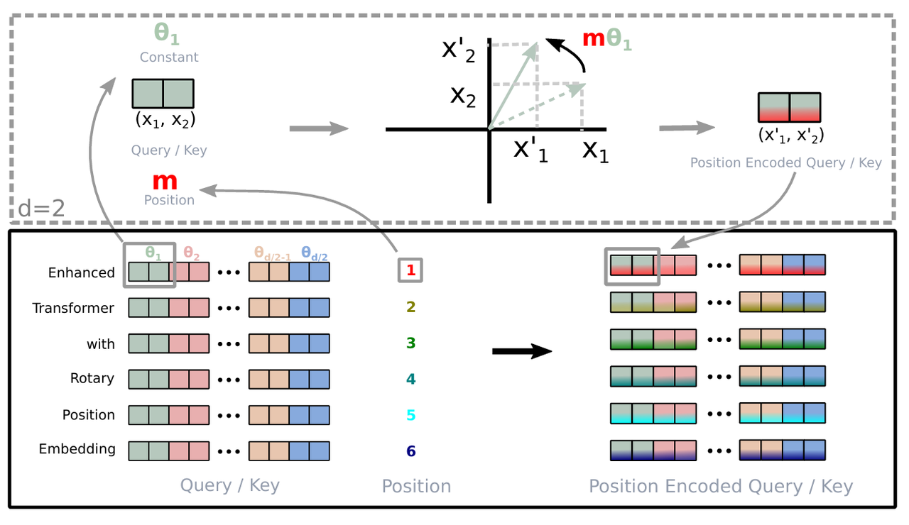

## **ALiBi**

> ALIBI所做的改动非常简单，只是在Softmax之前，将Attention的计算从 $$q_{m}^{T} k_{n}$$改为
>
> $$q_{m}^{T} k_{n} - \lambda |m - n| $$
>
> 其中 $$\lambda > 0$$是超参数，每个head设置不同的值。从这个定义就可以看出ALIBI跟**局部注意力**的相似之处了，两者都是在Softmax之前减去一个非负矩阵，只不过被减去的非负矩阵有所不同，ALIBI可以看成是**局部注意力**的“平滑版”
>
> ALiBi的偏置矩阵**根据q和k的相对距离来惩罚attention score，相对距离越大，惩罚项越大**。相当于两个token的距离越远，相互贡献就越小。
>
> **长度外推问题：**&#x957F;度外推性是一个训练和预测的长度不一致的问题
>
> * 预测的时候用到了**没训练过的位置编码**（不管绝对还是相对）
>
> * 预测的时候注意力机制所**处理的token数量远超训练时的数量**
>
> RoPE等周期震荡函数必须进行位置衰减，到远处的**位置信息趋于直线震荡，基本很难有位置信息区分了，所以外推性比训练式的好不了多少，旋转位置编码基于此改进的自然也是如此**

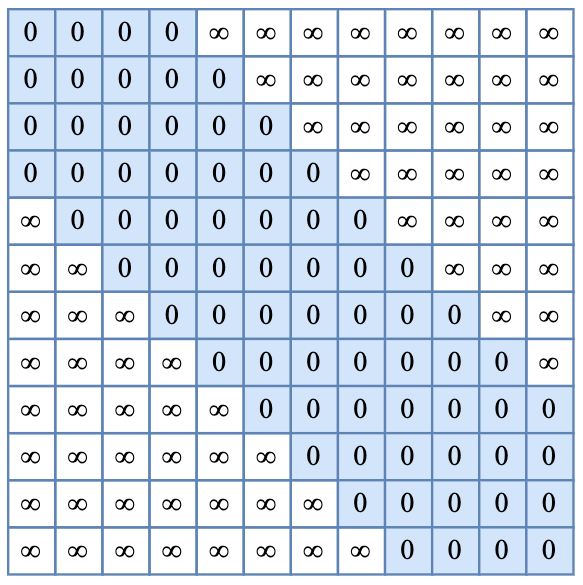

**局部注意力等效减去的矩阵**

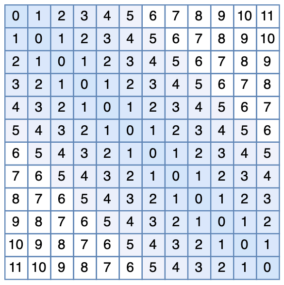

**ALiBi减去的矩阵**

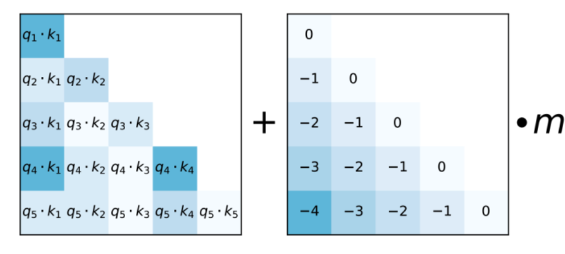

**ALiBi示意图**

# **1.5.5 长度外推优化**

## **进制表示到直接外推**

> * **进制表示：**&#x5047;设我们有一个1000以内（不包含1000）的整数N要作为条件输入到模型中，那么要以哪种方式比较好？
>
>   * **一维浮点向量输入**，然而0～999这涉及到近千的跨度，对基于梯度的优化器来说并不容易优化，缩放到0～1之间也不大好，因为此时相邻的差距从1变成了0.001，模型和优化器都不容易分辨相邻的数字
>
>   * **10进制表示直接输入，**&#x5C06;整数N以一个**三维向量\[a,b,c]**&#x6765;输入，a,b,c分别是n的百位、十位、个位。至于如果想要进一步缩小数字的跨度，还可以进一步缩小进制的基数，如使用8进制、6进制甚至2进制，代价是进一步增加输入的维度
>
> * **直接外推：**&#x5982;果用三维10进制表示训练了模型，又需要将n上限增加到2000以内，那么此时的输入就是一个四维向量了。然而，原本的模型是针对三维向量设计和训练的，所以新增一个维度后，模型就无法处理了。所以解决方案就是**提前预留多几维，训练阶段设为0**，推理阶段改为其他数字，这就是外推Extrapolation。但是推理阶段改为其他数字，因为模型对没被训练过的情况不一定具有适应能力，所以**直接进行外推通常会导致模型的性能严重下降**

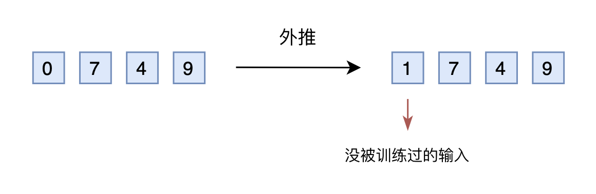

## **线性内插到进制转换**

> * **线性内插**：外推改为内插Interpolation，就是将2000以内压缩到1000以内
>
>   * 比如通过除以2，1749就变成了874.5，然后转为三维向量\[8,7,4.5]输入到原来的模型中，从绝对数值来看，新的\[7,4,9]实际上对应的是1498，是原本对应的2倍，映射方式不一致；从相对数值来看，原本相邻数字的差距为1，现在是0.5，最后一个维度更加拥挤
>
>   * 内插后需要微调训练，以便模型**重新适应拥挤的映射关系**
>
>   * 当处理范围进一步增大时，相邻差异则更小，且集中在个位数，剩下的百位、十位，还是保留了相邻差异为1，内插方法使得不同维度的分布情况不一样，每个维度不对等，模型进一步学习难度也更大

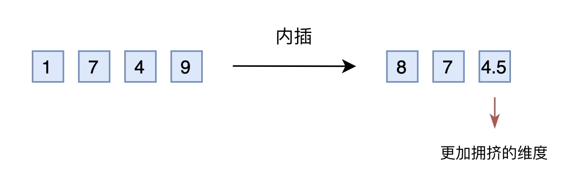

> * **进制转换：**&#x4E0D;用新增维度，又能保持相邻差距
>
>   * 三个数字的10进制编码可以表示0\~999，**16进制可以表示0\~4095**，三维向量就可以覆盖目标范围，代价是**每个维度的数字从0～9变为0～15**
>
>   * 原来训练好的模型已经学会了 875>874，而在16进制下同样有875>874，比较规则是一样的
>
>   * 每个维度超过9之后(10～15)模型，由于一般模型也有一定的泛化能力，所以每个维度稍微往外推一些是没问题，可以正常比较，转换进制可能不微调原来模型也有效

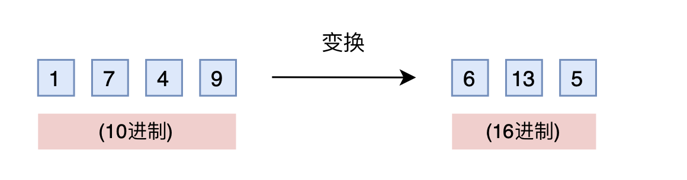

## **Positional Interpolation 位置内插**

语言模型通常是用**固定的上下文长度进行预训练**的，如何通过在**相对较少的数据量上进行微调来扩展上下文长度**，**位置插值将上下文长度扩展到预训练极限之外**

> ### **RoPE的问题**
>
> **直接外推会出现比较大的Attention Score**
>
> RoPE（相对位置编码）使用正弦和余弦函数将位置信息嵌入到词汇向量的旋转矩阵中。然而，由于以下原因，RoPE直接外推会导致Attention Score显著增加：
>
> * **正弦和余弦函数的周期性：**
>
>   * **正弦和余弦函数是周期性的**，周期为 $$2\pi$$，在训练数据中，位置通常在一个相对较小的范围内（例如，0到512或0到2048），这些位置的编码值会保持在周期的某一部
>
>   * 当位置超出这个范围时（例如，位置变为3000或3500），编码值会进入正弦和余弦函数的另一个周期。由于这些函数的周期性，**这些位置的编码值可能与训练数据中的编码值非常不同**，导致模型在计算注意力分数时出现剧烈变化
>
> * **高频成分的影响：**
>
>   * 在RoPE编码中，较高维度的编码（即频率较高的正弦和余弦成分）会对**较大的位置变化更加敏感，这意味着，随着位置数值的增加，这些高频成分会迅速变化**
>
>   * 对于较大的位置值，**正弦和余弦函数的值可能会经历快速变化**，这种快速变化会导致Attention机制中query和key的点积（即Attention Score）出现显著波动、

> ### **Positional Interpolation 位置内插**
>
> * **关键思想：**&#x4E0D;进行外推，而是直接**将位置索引减小，使得最大位置索引与目标长度大小，即预训练阶段的先前上下文窗口限制相匹配。**&#x53EF;以在相邻的整数位置上插值位置编码，毕竟位置编码可以应用在非整数的位置上(而非在训练位置之外 进行外推)。下图所示，如果直接使用位置(2048,4096]进行推理，那么因为模型没有见过这一部分的位置，效果会出现灾难性的下降，就把\[0,4096]这个区间压缩到\[0,2048]，原先的1就变成了0.5，4096就变成了2048，这就是**位置内插法**，即把没见过的位置映射到见过的位置
>
> * **内插公式：**&#x5BF9;于绝对位置 $$m$$，缩放变成 $$  \frac{mL}{L'}  $$， $$L $$ 为原先支持的长度（如2048）， $$L' $$为需要扩展的长度（如4096），计算 query 和 key 的时候，就有 $$  f'_w(x_m, m, \theta_d) =  f_w(x_m,  g(m) , \theta_d)  $$，定义缩放比例 $$s = \frac{L'}{L}, g(m)=\frac{m}{s}$$
>
> * **PI之后是否微调：**&#x6548;果有所区别
>
>   * PI之后，在没有微调的情况下(在步骤0)，模型可以展示出一定的语言建模能力，如扩展到8192上下文窗口的困惑度<20所示(相比之下，直接外推方法导致困惑度>1000)
>
>   * PI之后，经过微调，**困惑度（perplexity）**&#x8FC5;速改善。 在200步时，模型超过了2048上下文窗口大小的原始模型困惑度，表明模型能够有效地使用比预训练设置更长的序列进行语言建模。 在1000步时，我们可以看到模型稳步改善，并取得了显著更好的困惑度
>
>     > **困惑度**（Perplexity）是自然语言处理中常用的一个评价指标，用于衡量语言模型的好坏。语言模型Model在测试集数据 $$T=\left\{w_{1}, w_{2}, \ldots, w_{N}\right\}$$上的困惑度计算，困惑度越低，说明模型对下一个单词的预测越准确，模型性能越好：
>     >
>     > &#x20;                    $$    \text{Perplexity}(Model)=\exp\left(-\frac{1}{N}\sum_{i = 1}^{N}\log P\left(w_{i}\mid w_{1}, \ldots, w_{i-1}\right)\right)$$
>
> * **PI的问题：**
>
>   * 三角函数 $$\sin(\omega x)$$，它的周期是 $$T = 2\pi / \omega$$对应到RoPE里的每个维度 $$(\sin m \theta_j,\cos m \theta_j)$$其中 $$\theta_j = 10000^{-2(j-1)/d},j \in [1, 2, \ldots, d/2]$$（$$m$$为位置，$$j$$为维度）
>
>   * 计算得到周期为： $$\frac{2\pi}{m}b^{\frac{2(j-1)}{d}}$$，其中，用 $$b$$表示base，即10000。从周期计算的公式可以知道，针对不同的维度编码 $$j$$，每个维度对应的三角函数周期是越来越大的（即对应到高频、低频）
>
>   * 如果插值是针对绝对位置 $$m$$，那么对每个维度 $$j$$都同等地生效；但是**周期小（高频）维度，插值之后会变得很密集（本来一个周期包含10个值，内插之后能包含20个值），这样高频的维度就变得很拥挤**

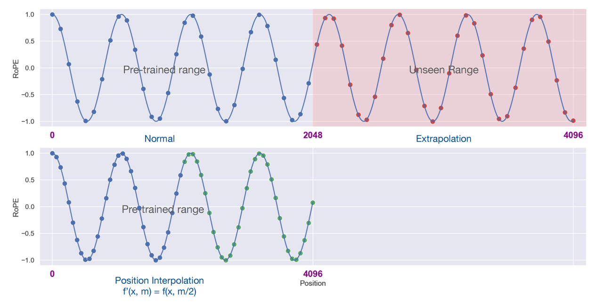

**PI示意图**

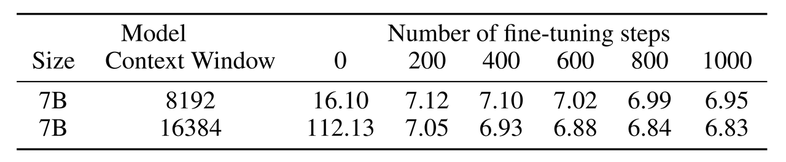

**PI之后微调区别示意图**

## **NTK-aware 插值到 Dynamic NTK插值**

> * **NTK-aware插值：**&#x6838;心思想 **高频外推，低频内插，**&#x4E0D;像PI针对所有维度平均缩放，而是减少对高频区域的缩放和增加对低频区域的缩放，从而将插值压力分散到多个维度
>
>   $$   \left[ \cos \left( \frac{m}{\beta^{0}} \right), \sin \left( \frac{m}{\beta^{0}} \right), \cos \left( \frac{m}{\beta^{1}} \right), \sin \left( \frac{m}{\beta^{1}} \right), \ldots, \cos \left( \frac{m}{\beta^{d/2-1}} \right), \sin \left( \frac{m}{\beta^{d/2-1}} \right) \right]  $$
>
>   * 上述公式最后面的是最低频 $$\frac{m}{\beta^{d/2-1}}$$，引入参数 $$\lambda$$变为 $$\frac{m}{(\lambda\beta)^{d/2-1}}$$，让这一项**与内插一致做缩放**：
>
>   $$\frac{m}{(\lambda\beta)^{d/2-1}}= \frac{m/s}{\beta^{d/2-1}}\\ 
>   \lambda = s^{2/(d-2)}$$
>
>   * 上述公式最前面的是最高频 $$\frac{m}{\beta^0}$$，引入参数 $$\lambda$$变为 $$\frac{m}{(\lambda\beta)^0}$$，由于 $$d_{model}$$一般比较大，所以 $$\lambda$$很接近1，即**不做缩放等价于外推，从而NTK-aware插值把外推和内插结合起来**
>
>   * **缺点：**&#x4E00;些维度被轻微外推到超出边界的值，因此使用NTK-aware插值进行微调的结果有可能不如PI；此外，由于存在“越界”值，理论尺度因子s并不能准确描述真实的上下文扩展尺度。在实践中，对于给定的上下文长度扩展，尺度值s必须设置得高于预期尺度
>
> * **NTK-by-parts 插值：考虑了波长于上下文的关系**
>
>   * **波长：**&#x7EF4;度 $$j$$上嵌入的RoPE执行完整旋转 $$2\pi$$所需要的token长度 $$\lambda_j=\frac{2\pi}{\theta_j}=2\pi b^{\frac{2(j-1)}{d}}$$。PI和NTK-aware插值不关心波长的维数
>
>   * **存在问题：**&#x6709;一些维数的波长长于预训练期间看到的最大上下文长度 $$\lambda > L$$，这表明一些维数的嵌入可能在旋转域中不均匀分布。**当波长很长时，这些维度上的嵌入几乎不变，可以认为它们保持了绝对位置信息，即每个位置的嵌入不因相对位置变化而变化；当波长较短时，嵌入会在较短的距离内完成多次旋转，这使得这些维度上的嵌入反映的是相对位置信息，即它们可以捕捉到标记之间的相对距离变化。**&#x6B64;外，用比例s去对所有维度进行缩放的时候，所有tokens都变得更彼此接近，同样的位移对应的旋转角度变化减小，向量指向更加相似的方向，**这种缩放严重损害了LLM理解其内部嵌入之间的小型和局部关系的能力，**&#x5BFC;致模型在邻近标记的位置顺序上被混淆，从而损害模型的能力
>
>   * **解决方法：**
>
>     * 如果波长 $$\lambda$$ 比上下文长度 $$L $$ 小得多，此时不插值
>
>     * 如果波长 $$\lambda$$ 等于或大于上下文长度 $$L $$ ，此时只做插值，不做任何外推
>
>     * 两者之间的维数可以兼备
>
>     引入比率 $$r(j)=\frac{L}{\lambda_j}=\frac{L}{2\pi b^{\frac{2(j-1)}{d}}}$$，引入边界参数 $$\alpha,\beta$$，定义斜坡函数 $$ 
>     \gamma(r) = 
>     \begin{cases}
>     0, & \text{if } r < \alpha \\
>     1, & \text{if } r > \beta  \\
>     \frac{r - \alpha}{\beta - \alpha}, & \text{otherwise}
>     \end{cases}
>      $$可以得到NTK-by-parts方法的公式：
>
>     $$g(m) = m\\
>     h(\theta_j)=(1-\gamma(r(j)))\frac{\theta_j}{s} + \gamma(r(j))\theta_j$$
>
>     位置索引m不做变化，对不同维度的 $$\theta_j$$通过第二个公式进行调整
>
> * **Dynamic NTK 插值：动态调整缩放因子&#x20;**$$s$$
>
>   * **存在问题：**&#x5728;很多用例中，以从1到最大上下文大小不等的序列长度进行多次前向传递。一个典型的例子是自回归生成，其中序列长度在每一步之后递增1。之前的方法缩放因子不变，模型在长度小于 $$L$$时可能出现性能折扣，当序列长度大 $$L'$$时可能出现突然退化
>
>   * **动态插值：** $$s = max(1,l'/L)$$， $$l'$$是当前序列的长度

## **YaRN (Yet another RoPE extensioN method)**

> 无论数据样本和扩展上下文窗口上的token位置如何，在对logits进行softmax操作之前引入温度t可以统一地影响困惑度，所以可以将注意力权重的计算修改为：
>
> $$\text{softmax} \left(\frac{{\bf{q_m}}^T \bf{k_n}}{t\sqrt{d_k}} \right)$$
>
> 将RoPE嵌入按相同比例缩放，使得query和key都以 $$\sqrt{1/t}$$进行缩放，然后再结合NTK-by-parts方法得到YaRN，推理和训练阶段没有额外开销，因为RoPE嵌入是提前生成的，而且可以重复使用
>
> 对于LLaMA1，2推荐： $$\sqrt{1/t}=\text{0.1}\ln(s)+1$$
