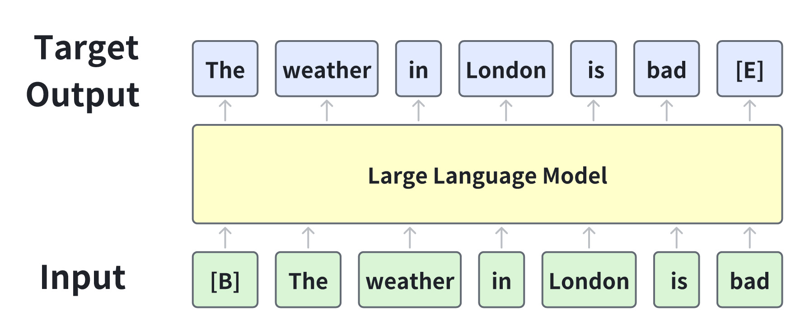

> ### **为什么需要预训练？**&#x20;
>
> 大模型进行预训练的目标是通过**在大规模数据集上学习**，在见到特定任务数据之前，使模型能够**捕捉到数据的通用特征和模式**，从而提升其在各种任务上的性能和泛化能力，同时减少对标注数据的依赖，让模型掌握通用能力，产生一个base模型，并加速模型在新任务上的训练和适应过程。比如在预训练期间，模型会接触大量未标记的文本数据，例如书籍、文章和网站，目标是捕获文本语料库中存在的底层模式、结构和语义知识
>
> * **数据稀缺性：**&#x5728;现实世界的应用中，收集并标注大量数据往往是一项既耗时又昂贵的任务。 特别是在某些专业领域，如医学图像识别或特定领域的文本分类，标记数据的获取更是困难重重。预训练技术使得模型能够从未标记的大规模数据中学习通用特征，从而减少对标记数据的依赖。这使得在有限的数据集上也能训练出性能良好的模型
>
> * **先验知识问题：**&#x5728;深度学习中，模型通常从随机初始化的参数开始学习。然而，对于许多任务来说，具备一些基本的先验知识或常识会更有帮助。预训练模型通过在大规模数据集上进行训练，已经学习到了许多有用的先验知识，如语言的语法规则、视觉的底层特征等。这些先验知识为模型在新任务上的学习提供了有力的支撑
>
> 大模型预训练采用的方法是在**大量无标签语料**上进行**自监督学习**（区别于聚类等无监督学习，NTP利用下一个token作为标签进行自监督学习），具体训练目标是**Next Token Prediction loss：**
>
> $$L=-\sum_{n=1}^N \log p\left(x_n \mid x_1, x_2, \ldots, x_{n-1} ; \theta\right)$$
>
> 其**基本思想是，模型根据上下文预测下一个最可能的单词，Next Token Prediction Loss 通过计算每个预测的对数似然损失，帮助训练模型进行更准确的下一个单词预测**
>
> > **计算loss的时候prompt和response部分都要算**

**Next Token Prediction示意图**
