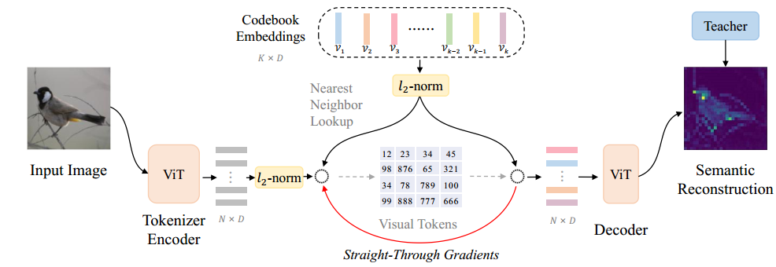
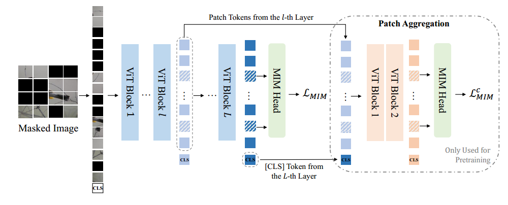
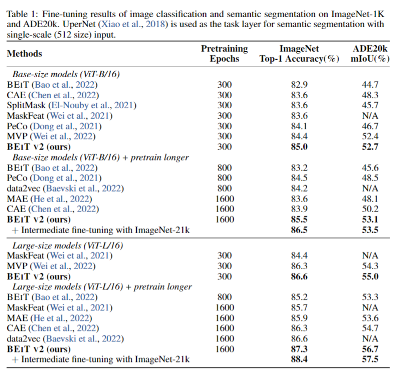

> **论文：BEiT V2: Masked Image Modeling with Vector-Quantized Visual Tokenizers**
>
> **论文链接：https://arxiv.org/pdf/2208.06366**
>
> **可以参考的博客：https://zhuanlan.zhihu.com/p/566511151，https://blog.csdn.net/qq\_39478403/article/details/128125376，https://zhuanlan.zhihu.com/p/661975564，https://blog.csdn.net/weixin\_50862344/article/details/131262830**
>
> **可以参考的视频：**

# 1. **BEiT‑2 概述**

> BEiT‑2 改进自 BEiT，其核心创新在于通过**向量量化知识蒸馏（VQ-KD） 训练语义丰富的视觉 tokenizer，将 Masked Image Modeling (MIM) 的重构目标从像素级提升至语义级**。VQ-KD 通过离散化连续语义空间，生成紧凑的视觉 token 作为重构目标，并引入patch aggregation 策略增强全局语义表示
>
> 实验表明，BEiT‑2 在下游任务中表现优异：在 ImageNet-1K（224 尺寸）上，base 微调准确率达 85.5%，large 达 87.3%；线性探测准确率达 80.1%；在 ADE20K 语义分割任务上，大型版 mIoU 达 56.7%，显著优于现有 MIM 方法

## 1.1 BEiT‑2 的背景

> 早期 MIM 方法如 MAE ，**多依赖像素级或低层次特征重构**，忽视高层语义信息，限制了表示学习的能力。BEiT 系列则将图像 token 化，使预训练更靠近语言模型的 Token 重构思路。
>
> BEiT-2 旨在**通过语义级视觉 token重构，推动 MIM 从像素级升级至语义级**，增强 Transformer 视觉预训练的语义理解能力解决上述局限

## 1.2 BEiT‑2 的动机与核心点

> 1. **语义化 MIM 重构目标**
>    替代低级像素/特征，采用离散 token 来复原 masked patch，使模型更聚焦语义重建
>
> 2. **VQ‑KD（Vector‑Quantized Knowledge Distillation）**
>    利用 teacher 模型（如 CLIP/DINO）对 patch 输出进行蒸馏，以离散 codebook 学习视觉 token 化，达到语义离散化的目的
>
> 3. **Patch Aggregation（补丁聚合）**
>    引入 CLS token 机制及补丁聚合策略，使模型不仅能处理局部，还具备全局语义表达能力

# 2. **BEiT‑2 方法细节**

## 2.1 BEiT‑2 的模型架构

> BEiT-2 继承了 BEiT 的 Masked Image Modeling (MIM) 框架，使用 visual tokenizer 将图像转换为离散的视觉 token，训练目标是恢复被 mask 的视觉 token
>
> * **ViT 主干**：采用 Vision Transformer，输入图像被 patch 切分后，部分 patch 被 mask
>
> * **Tokenizer**：由 VQ‑KD 模块构建的视觉 codebook，将 patch 表示量化为离散 token
>
> * **Transformer Head**：在预训练阶段预测每个 masked patch 的 visual token
>
> #### 图像表示
>
> * 输入图像 $$x \in \mathbb{R}^{H \times W \times C}$$ 被分割为 $$N = \frac{HW}{P^2}$$ 个图像块
>
> * 每个图像块大小为 $$P \times P$$，实验中为 $$16 \times 16$$
>
> * 图像块被展平并投影为 Transformer 的输入 embedding，编码向量为 $$\{h_i\}_{i=1}^N$$

## 2.2 BEiT‑2 向量量化知识蒸馏 (VQ-KD)

> * **目标**：训练 **visual tokenizer 和 decoder**，生成具有高层语义的离散视觉 token，作为 MIM 的重构目标
>
> * **流程如上图：**
>
>   * **Tokenizer**：ViT 将图像编码为离散视觉 token $$z = [z_1; z_2; \cdots; z_N]$$，每个token对应一个图像块
>
>   * **Codebook**：一个包含 $$K$$ 个embedding的查找表，每个向量维度为 $$D$$，$$\mathcal{V} \in \mathbb{R}^{K \times D}$$
>
>   * **量化过程**：
>
>     $$z_i = \arg\min_j \|\ell_2(h_i) - \ell_2(v_j)\|_2$$
>
>     * 为每个图像块 $$h_i$$ 查找 codebook 中最近的嵌入 $$v_j$$，使用 $$L_2$$ 距离度量相似&#x6027;**。即使用$$L_2$$ 归一化最近邻查找，将连续特征映射到离散码本，生成视觉 token**
>
>   * **Decoder**：一个多层 Transformer，重建教师模型（如 DINO、CLIP）的语义特征，通过余弦相似度损失优化
>
> * **训练目标**：
>
>   $$\max \sum_{x \in \mathcal{D}} \sum_{i=1}^N \cos(o_i, t_i) - \|\text{sg}[\ell_2(h_i)] - \ell_2(v_{z_i})\|_2^2 - \|\ell_2(h_i) - \text{sg}[\ell_2(v_{z_i})]\|_2^2$$
>
>   1. 第一项 $$\cos(o_i, t_i)$$：最大化decoder输出 $$o_i$$ 与教师特征 $$t_i$$ 的余弦相似度
>
>   2. 第二项：优化 codebook 嵌入，使其接近编码器输出
>
>   3) 第三项：优化编码器输出，使其接近 codebook 嵌入
>
> * **关键技术：**&#x91C7;用 **直通梯度** 解决量化过程的非可微性，使用指数移动平均更新码本，缓解 码本坍缩 问题
>
>   > VQ-KD 的**量化过程（即通过最近邻查找将连续特征映射到离散码本的过程）是非可微操作**。在神经网络训练中，反向传播依赖梯度的连续性，非可微操作会阻断梯度流动，导致编码器无法通过梯度更新优化参数
>   >
>   > 直通梯度（Straight-Through Gradients）是一种梯度近似方法：
>   >
>   > * **前向传播**：正常执行量化操作，将编码器输出的连续特征向量映射到离散码本向量
>   >
>   > * **反向传播：**&#x5FFD;略量化操作的非可微性，直接将解码器输入的梯度 复制 到编码器的输出端
>   >
>   > 码本坍缩（Codebook Collapse）是向量量化中常见的问题：训练过程中，码本中的大部分向量可能被闲置，只有少数向量被频繁使用，导致离散语义空间的覆盖范围不足，无法有效区分不同的语义特征。指数移动平均（Exponential Moving Average, EMA）是一种平滑更新参数的方法，用于码本向量的更新：
>   >
>   > * 不直接使用当前批次的梯度更新码本，而是通过历史更新的加权平均缓慢调整码本向量，公式可简化为： $$v_t = \alpha \cdot v_{t-1} + (1-\alpha) \cdot \hat{v}_t$$
>   >
>   > * 避免码本向量因单次梯度波动被过度更新，使码本更新更稳定

## 2.3 BEiT‑2 预训练

> ##### Masked Image Modeling (MIM)
>
> 预测掩码图像块对应的视觉 token（由 VQ-KD 生成），损失函数为交叉熵
>
> * **mask策略**：随机mask约 40% 的图像块并用mask token替换。
>
> * **输入**：mask后的图像 $$x_{\mathcal{M}}$$ 和 \[CLS] token。
>
> * **MIM Head**：预测mask位置的视觉token：
>
>   $$p(z_i | h_i) = \text{softmax}_{z_i}(W_c h_i + b_c)$$
>
>   * 基于mask图像的特征 $$h_i$$，使用 softmax 分类器预测原始视觉token $$z_i$$。
>
> * **损失函数**：
>
>   $$\mathcal{L}_{\text{MIM}} = - \sum_{x \in \mathcal{D}} \sum_{i \in \mathcal{M}} \log p(z_i | x_{\mathcal{M}}^i)$$
>
>   * 最小化mask位置的预测误差，通过负对数似然损失函数实现

> ##### 全局表示预训练
>
> 通过 CLS token 聚合 patch token，增强全局图像的语义表达，有效改善编码器对整体语义的感知
>
> * **目标**：增强 `[CLS]` token的全局表示能力
>
> * **方法**：**patch aggregation 策略，**&#x5F15;入额外损失 $$\mathcal{L}_{MIM}^c$$，鼓励 `[CLS] `token 聚合中间层 patch 特征，将 `[CLS]` token与中间层特征拼接，输入浅层 decoder 进行mask预测，增强全局表示能力：
>
>   $$p(z | S) = \text{softmax}_z(W_c S + b_c)$$
>
>   1. 拼接 `[CLS]` token $$h_{\text{CLS}}^L$$ 和中间层特征 $$\{h_i^l\}_{i=1}^N$$，得到 $$S = [h_{\text{CLS}}^L; h_1^l; \cdots; h_N^l]$$。
>
>   2. 使用浅层 decoder 对 $$S$$ 进行 mask 预测，输出视觉token的概率分布
>
> * **最终损失**：原始 MIM 损失与浅层 decoder 损失之和
>
>   * 通过联合优化两部分的损失，增强 `[CLS]` token的全局表示能力

**关键点总结**

* **Visual Tokenizer**：通过 VQ-KD 训练，将图像映射为离散token

* **MIM 预训练**：mask图像块并预测原始视觉token

* **全局表示**：通过 \[CLS] token和浅层 decoder 增强全局信息聚合

* **下游任务：**&#x5C06;预训练得到的 ViT 作为 backbone，连接任务特定 head（如图像分类/分割）微调即可

# 3. **BEiT‑2 实验结果**

1. **实验设置**

   * **预训练数据：**&#x49;mageNet-1K（无标签），分辨率 224×224

   * **模型规格：**&#x57FA;础版（ViT-B/16）、大型版（ViT-L/16），预训练轮次 300-1600 epoch

2. **关键性能对比**

| 任务       | 模型规格            | 指标              | BEIT V2 性能 | 同类最佳对比          |
| -------- | --------------- | --------------- | ---------- | --------------- |
| 图像分类（微调） | ViT-B/16（300e）  | ImageNet-1K 准确率 | 85.0%      | BEIT（82.9%）     |
| 图像分类（微调） | ViT-L/16（1600e） | ImageNet-1K 准确率 | 87.3%      | data2vec（86.6%） |
| 线性探测     | ViT-B/16（300e）  | ImageNet-1K 准确率 | 80.1%      | MoCo v3（76.7%）  |
| 语义分割     | ViT-L/16（1600e） | ADE20K mIoU     | 56.7%      | MVP（52.4%）      |

* **鲁棒性评估**

  * 在 ImageNet 变体（对抗样本、草图等）上，BEIT V2 性能显著优于 MAE：如 ViT-L/16 在 ImageNet-Adversarial 上达 69.0%，远超 MAE 的 57.1%

* **消融实验**

  * **VQ-KD 教师模型：**&#x43;LIP 作为教师时性能优于 DINO（ImageNet 准确率 85.0% vs 84.4%）

  * **patch aggregation：**&#x5F15;入后线性探测准确率提升 2.5%（从 77.6% 到 80.1%），证明其增强全局表示的有效性

# 4. **BEiT‑2 代码**

官方实现：https://github.com/microsoft/unilm/blob/master/beit2/modeling\_pretrain.py

* `VisionTransformerForMaskedImageModeling`，ViT for MIM 模块

# 5. **BEiT‑2 关键问题**

> BEIT V2 通过 VQ-KD 实现语义级 MIM，并结合 patch aggregation 增强全局表示，显著提升下游任务性能，为视觉 - 语言跨模态预训练提供了新方向
>
> 1. **VQ-KD 如何将 MIM 从像素级提升至语义级？&#x20;**
>
>    VQ-KD 通过训练视觉 tokenizer 实现这一升级。具体而言，编码器将图像转化为特征向量，量化器通过码本将其离散化为视觉 token，解码器则基于这些 token 重构教师模型（如 CLIP）的高层语义特征。最终生成的视觉 token 携带语义信息，替代像素作为 MIM 的重构目标，使模型学习语义级表示而非像素细节
>
> 2. **BEIT V2 在图像分类任务上的性能优势体现在哪些方面？&#x20;**
>
>    主要体现在准确率和效率上。在 ImageNet-1K（224 尺寸）中，基础版 BEIT V2（300 epoch）微调准确率达 85.0%，超过 BEIT（82.9%）、CAE（83.6%）等方法；大型版（1600 epoch）达 87.3%，刷新自监督方法纪录。此外，其在 300 epoch 的性能（86.6%）可媲美 data2vec 1600 epoch 的结果（86.6%），体现更高效率
>
> 3. **patch aggregation 策略的核心作用是什么？如何实现？&#x20;**
>
>    核心作用是缓解 MIM 中 “patch 级重构优先” 导致的全局表示能力不足问题。实现方式为：在预训练中引入额外损失函数 $$\mathcal{L}_{MIM}^c$$，鼓励最后一层 \[CLS] token 与中间层 patch 向量关联，通过浅层 Transformer 解码器对掩码位置进行二次预测，强制 \[CLS] token 聚合全局语义信息，提升模型对图像整体的理解能力
