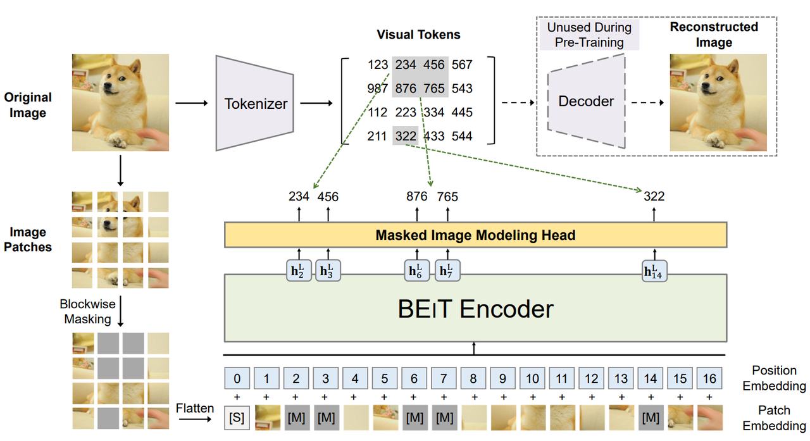
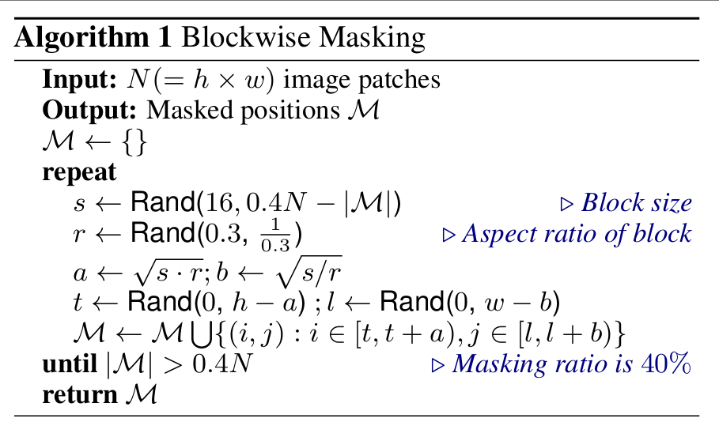
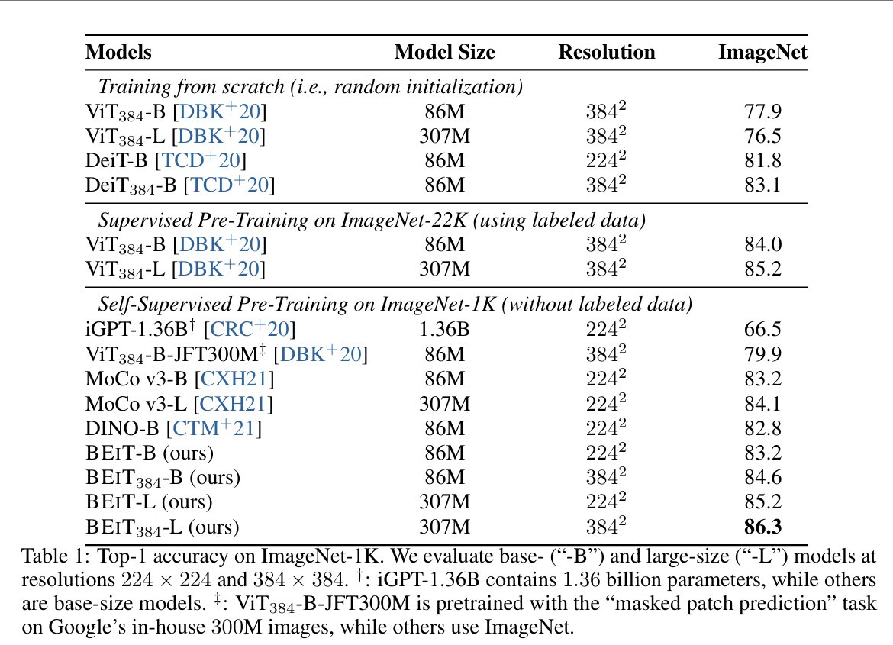
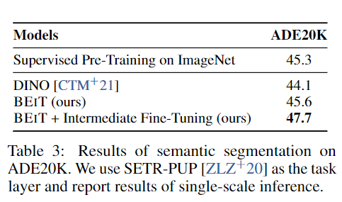
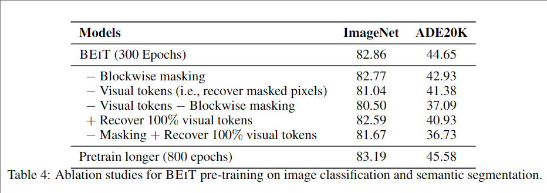

> **论文：BEiT: BERT Pre-Training of Image Transformers**
>
> **论文链接：https://arxiv.org/pdf/2106.08254**
>
> **可以参考的博客：https://blog.csdn.net/qq\_39478403/article/details/128125376，https://zhuanlan.zhihu.com/p/381345343，https://zhuanlan.zhihu.com/p/566565633，https://blog.csdn.net/m0\_63642362/article/details/122005626，https://medium.com/%40deepsiya10/day-10-beit-bert-meets-vision-ad381757a71d?utm\_source=chatgpt.com**
>
> **可以参考的视频：https://www.bilibili.com/video/BV1jb421i7Hw/?spm\_id\_from=333.337.search-card.all.click，https://www.bilibili.com/video/BV1MAK3zkEhT/?spm\_id\_from=333.337.search-card.all.click**

# 1. **BEiT 概述**

> **BEiT（Bidirectional Encoder representation from Image Transformers）**&#x4E00;种自监督视觉表示学习方法，借鉴 BERT 的思想，**提出掩码图像建模（MIM） 任务进行预训练视觉 Transformer**。输入图像经过 patch 分割和视觉 tokenizer 离散化后，随机遮盖部分 patch，并让 Transformer 模型恢复被遮盖区对应的视觉 token，目标是基于损坏图像恢复原始视觉 token
>
> 实验表明，BEiT 在ImageNet 图像分类（86.3% top-1 准确率）和ADE20K 语义分割（47.7 mIoU）上表现优异，且微调收敛更快

## 1.1 **BEiT&#x20;**&#x7684;背景和动机

> * **研究背景：**&#x56;ision Transformer（ViT）的成功证明 Transformer 能在图像领域表现优异，但相比卷积神经网络更需大量标注数据。**自监督预训练是利用大规模无标注图像缓解该问题的有效手段**，现有方法多基于对比学习或自蒸馏方法
>
> * **核心动机：**&#x53D7; NLP 中 BERT 的掩码语言建模（MLM）启发，将**去噪自编码思想应用于视觉 Transformer 预训练**，但需解决两个关键问题：
>
>   * 图像 patch 无预定义词汇表，无法直接用 softmax 预测
>
>   * 像素级回归会让模型过度关注短程依赖和高频细节
>
>   视觉不像文字有离散系统，BEiT 创新地引入 视觉 token：通过预训练的 dVAE 将图像 patch 离散化，构建类似 NLP token 的目标空间
>
> * **核心思想：**
>
>   * **自监督预训练**：避免高昂的人工标注，提升表示学习效率，在无标签图像上进行 MIM 任务
>
>   * **视觉 token 作为预测目标**：相比像素级重建，更能学习语义信息&#x20;
>
>   * **双视角学习**：结合原始 patch 和视觉 token 两种表达方式强化模型语义捕捉能力
>
> * **目标**：通过masked image modeling（MIM）进行自监督预训练，恢复被mask的图像块

# 2. **BEiT 方法细节**

## 2.1 **BEiT 图像表示**

> ##### 图像patch（输入）
>
> * 将图像 $$x \in \mathbb{R}^{H \times W \times C}$$ 分割为 $$N = \frac{HW}{P^2}$$ 个块 $$x_p \in \mathbb{R}^{N \times (P^2 C)}$$。&#x20;
>
>   * $$H \times W$$ 是图像的分辨率，$$P \times P$$ 是每个块的分辨率。&#x20;
>
>   * 例如，224×224 的图像分割为 14×14 网格，每块 16×16
>
> * 展平后经线性投影，类似 BERT 的词嵌入，保留原始像素信息

> ##### 视觉token（输出）
>
> * 图像token化为 $$z = [z_1, \dots, z_N] \in V^{h \times w}$$，词汇表 $$V = \{1, \dots, |V|\}$$。&#x20;
>
>   * 视觉token是通过图像encoder将图像像素映射为离散的token序列
>
>   * 词汇表大小 |V| = 8192，表示token的总数
>
> * 使用 dVAE（离散变分自编码器）学习图像token，目标为：
>
>   $$\mathbb{E}_{z \sim q_\phi(z|x)} [\log p_\psi(x|z)]$$
>
>   * $$q_\phi(z|x)$$：图像encoder，将图像像素映射为离散token
>
>   * $$p_\psi(x|z)$$：解码器，根据token重建图像
>
>   * 目标是最大化图像的重建概率
>
>   * 使用 Gumbel-softmax 解决离散性导致的不可微问题

## 2.2 **BEiT 模型架构**

> * **视觉 tokenizer（dVAE）**：先用 dVAE 将图像编码为离散 token（1\~8192 维），**提供预训练目标**
>
> * **编码器：**&#x9AA8;干网络使用图像 Transformer （ViT），ViT 编码器处理遮盖后图像 patch，采用与 BERT 相似的 **patch embedding + position embedding + Transformer layers 架构**
>
>   * 使用标准 Transformer，输入为图像块序列 $$\{x_p^i\}_{i=1}^N$$，结构与 ViT-Base/Large 一致：
>
>     * Base：12 层 Transformer，隐藏层维度 768，12 个注意力头
>
>     * Large：24 层 Transformer，隐藏层维度 1024，16 个注意力头
>
>     * 图像 patch 通过线性投影转换为 Patch embedding
>
>     * 添加特殊token `[S]` 在开头 和 position embedding $$E_{pos} \in \mathbb{R}^{N \times D}$$，以保留位置信息
>
>     * 掩码 patch 替换为特殊 embedding`[M]`，目标就是重建出
>
>   * 编码器输出：$$H_L = [h_{[S]}^L; h_1^L; \dots; h_N^L]$$
>
>     * $$h_i^L$$ 是第 $$i$$ 个图像块的最终编码表示
>
> * **MIM 任务头**：在 mask 位置即`[M]`处输出 token logits，与视觉 tokenizer 生成的 token ID 进行交叉熵对比

## 2.3 **BEiT 预训练 Masked Image Modeling（MIM）**

> * **掩码策略：**&#x968F;机mask图像 patch，用可学习嵌入 $$e_{[M]}$$ 替换，具体策略为 block-wise 掩码&#x20;
>
>   * 每次掩码一个一个连续的图像块区域，最小 16 个 patch，随机宽高比
>
>   * mask位置记为 M，mask比例为 40%

> * **预训练目标：通过损坏图像的编码向量，预测掩码位置的原始视觉 token**
>
>   $$\max \sum_{x \in \mathcal{D}} \mathbb{E}_M \left[ \sum_{i \in M} \log p_{\text{MIM}}(z_i | x_M) \right]$$
>
>   * $$\mathcal{D}$$ 是训练数据集
>
>   * 目标是最大化所有被 mask 块的正确token的对数似然

> * BEiT 预训练**可视为变分自编码器训练**，目标为：
>
>   $$\sum_{(x_i, \tilde{x}_i) \in \mathcal{D}} \log p(x_i | \tilde{x}_i) \geq \sum_{(x_i, \tilde{x}_i) \in \mathcal{D}} \mathbb{E}_{z_i \sim q_\phi(z|x_i)} [\log p_\psi(x_i | z_i)] - D_{\text{KL}}[q_\phi(z|x_i); p_\theta(z|\tilde{x}_i)]$$
>
>   * $$q_\phi(z|x)$$：图像 encoder，生成视觉token
>
>   * $$p_\psi(x|z)$$：解码器，根据token重建图像
>
>   * $$p_\theta(z|\tilde{x})$$：MIM 任务，根据被mask图像恢复视觉token
>
>   * 目标是最大化图像的重建概率，同时最小化token分布之间的 KL 散度
>
>   **第一阶段：**&#x64;VAE 学习 tokenizer $$q_\phi(z|x)$$和 解码器$$p_\psi(x|z)$$，最小化重构损失
>
>   **第二阶段：**&#x56FA;定 $$q_\phi(z|x)$$和$$p_\psi(x|z)$$，通过 MIM 优化先验$$p_\theta(z|\tilde{x})$$，目标为最大化 $$\log p_\theta(\hat{z}_i|\tilde{x}_i)$$（ $$\hat{z}_i$$为最可能的 token）

> ### **预训练设置**
>
> * **网络架构：**&#x31;2 层 Transformer，隐藏大小 768，12 注意力头
>
> * **数据：**&#x49;mageNet-1K，120 万张图像
>
> * **优化器：**&#x41;dam，学习率 1.5e-3，权重衰减 0.05
>
> * **训练：**&#x35;0 万步，2k batch size，16×Nvidia V100 32GB GPU

## 2.4 **BEiT 下游任务微调**

* **图像分类：**

  * 任务层：平均池化聚合补丁表示，接 softmax 分类器

  * 高分辨率微调：224×224 微调后，额外在 384×384 图像上训练 10 epochs

* **语义分割：**

  * 采用 SETR-PUP 作为任务层，解码器含反卷积层

  * 在 ADE20K 上训练 160K 步，batch size=16

* **中间微调：**

  * 预训练后先在 ImageNet 或 ADE20K 上轻微微调，再迁移至目标任务 fine-tune，可进一步提升效果

# 3. **BEiT 实验结果**

## 3.1 **图像分类（ImageNet-1K）**

* **关键发现：**

  * BEIT 在相同分辨率下优于监督预训练和其他自监督方法（如 MoCo v3、DINO）

  * 高分辨率微调提升 1+ 百分点

  * Large 模型性能提升更显著

## 3.2 **语义分割（ADE20K）**

* **关键发现：**

  * BEIT 无需标注数据，性能超监督预训练

  * 中间微调进一步提升 2.1 个百分点

此外，消融研究表明，**视觉 token prediction 优于像素级预测，block-wise 掩码方式也更适合语义学习**；更长预训练也进一步提升性能。**自注意力头可在掩码训练中自发分离语义区域，特征表达更含层次化信息&#x20;**

# 4. **BEiT 代码**

官方实现：https://github.com/microsoft/unilm/blob/master/beit/modeling\_pretrain.py

代码：

# 5. **BEiT 总结**

> ### **结论和展望**
>
> BEiT 成功将 BERT 式的掩码-预测机制引入视觉域，通过视觉 token 预训练弥补纯像素重构语义不足的问题，极大提升 Transformer 图像模型的效率与性能。它推动了 MIM 研究热潮，并启发后续更高效、更语义齐全的预训练方法
>
> * BEIT 通过 MIM 任务实现了高效的视觉 Transformer 自监督预训练，在图像分类和语义分割上超越现有方法。
>
> * **优势：**&#x65E0;需标注数据、微调收敛更快、适合大规模模型扩展。
>
> * **未来方向：**&#x6269;大数据和模型规模，探索多模态预训练
>
>   * **BEiT-v2**：针对视觉 tokenizer 用 vector‑quantized knowledge distillation，进一步提升性能，达到 85.5%（Base）与 87.3%（Large）
>
>   * **BEiT-3**：跨模态融合，将图像与文本统一处理，支持多模态任务
>
>   * 后续方法如 PeCo 引入 perceptual token，使 token 更符合人类感知语义

> ### **关键问题**
>
> 1. BEIT **如何解决 BERT 式预训练在视觉领域的适配问题？**
>    BEIT 通过两个创新解决适配问题：① 引入由 dVAE 学习的离散视觉令牌（词汇量 8192），替代 NLP 中的预定义词汇，解决图像补丁无词汇表的问题；② 采用掩码图像建模（MIM）任务预测视觉令牌，而非像素级回归，避免模型过度关注短程依赖和高频细节。此外，使用块掩码（40% 比例）增强长程依赖学习，进一步提升预训练效果
>
> 2. BEIT 在图像分类任务上的性能与现有方法相比有何优势？
>    在 ImageNet-1K 上，BEIT 表现显著优于对比学习（如 MoCo v3-B 准确率 83.2% vs BEIT-B 的 84.6%）和自蒸馏方法（如 DINO-B 的 82.8%）；与监督预训练相比，BEIT-L（86.3%）超过 ViT-L（85.2%，基于 ImageNet-22K 监督训练）。此外，BEIT 在扩大模型规模时性能提升更明显（Base 到 Large 提升 2.0 个百分点），且仅需 14M 标注数据即可媲美基于 3B 数据的监督模型，大幅降低标注成本
>
> 3. **消融研究揭示了 BEIT 中哪些组件对性能至关重要？**
>    消融研究表明三个关键组件：① block-wise 掩码：相比随机掩码，块掩码使 ADE20K 的 mIoU 提升 1.72 个百分点，增强对长程语义依赖的学习；② 视觉 token：替换为像素回归后，ImageNet 准确率下降 1.82 个百分点，证明离散令牌能捕捉更高层次抽象特征；③ 预训练时长：从 300 epochs 增至 800 epochs，ImageNet 准确率提升 0.33 个百分点，说明更长时间的预训练有助于模型学习更稳健的表征
