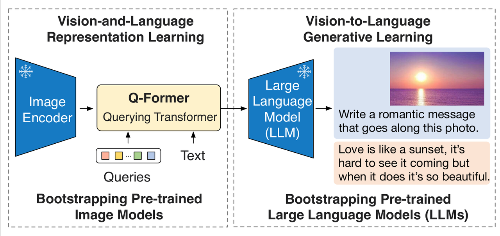
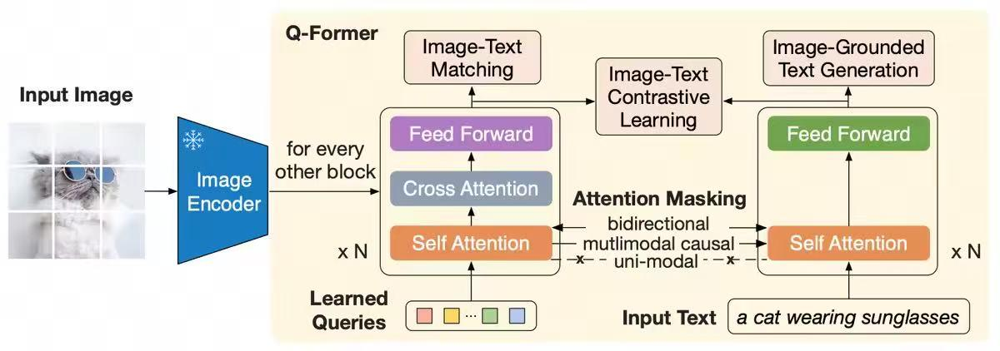
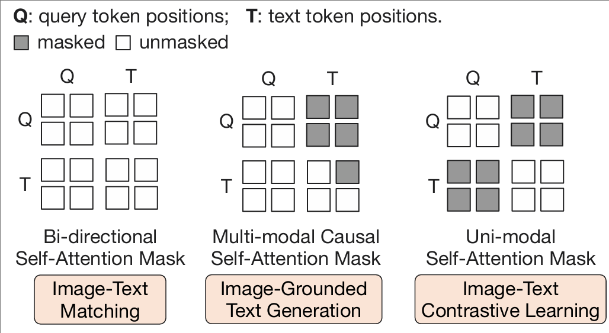
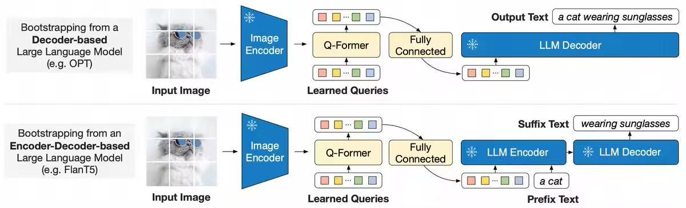

> **论文：BLIP-2: Bootstrapping Language-Image Pre-training with Frozen Image Encoders and Large Language Models**
>
> **论文链接：https://arxiv.org/pdf/2301.12597**
>
> **可以参考的博客：https://zhuanlan.zhihu.com/p/681595636，https://blog.csdn.net/m0\_51976564/article/details/134389066，https://blog.csdn.net/qq\_41994006/article/details/129221701，https://huggingface.co/blog/blip-2，https://www.salesforce.com/blog/blip-2/**
>
> **可以参考的视频：https://www.bilibili.com/video/BV1fA411Z772/?spm\_id\_from=333.337.search-card.all.click，https://www.bilibili.com/video/BV1uT411q7ef/?spm\_id\_from=333.337.search-card.all.click**

# 1. **BLIP-2 简介**

## 1.1 BLIP-2 的背景与动机

> VLP 领域已进入大模型时代，但**端到端训练成本高昂**。BLIP‑2 的动机主要有：
>
> * **降低计算成本**：冻结大模型，仅训练 Q‑Former
>
> * **桥接模态鸿沟**：将视觉信息以可理解形式传递给 LLM，图像编码器、Q‑Former、LLM三段式框架
>
> * **利用已有预训练模型素质**：最大化调用图像编码器和 LLM 的能力
>
> * **实现更强泛化与指令跟随**：支持零样本场景下的指令式图像生成与问答&#x20;

## 1.2 BLIP-2 的核心

> **核心：**&#x42;LIP-2 新引入**Querying Transformer (Q-Former)模块**用于对图文进行对齐
>
> BLIP-2 是一种**高效的视觉-语言预训练（VLP）方法**，旨在解决现有模型预训练成本过高的问题。通&#x8FC7;**&#x20;两阶段预训练的 Querying Transformer（Q-Former） 连接 冻结的大规模图像编码器（如ViT） 和 冻结的大型语言模型（LLM）**，**仅训练一个轻量的中间层 Q-Former**，**避免端到端训练的高成本**
>
> * 第一阶段预训练通过**视觉-语言表示学习（下图左）**，让 Q-Former 提取与文本相关的视觉特征
>
> * 第二阶段预训练通过**视觉到语言生成学习（下图右）**，将 Q-Former 输出适配到 LLM 利用其生成能力
>
> Q-Former 的初始化为 BERT base 仅含 188M 可训练参数，却在多个任务（VQA、图像描述、图文检索）上实现 SOTA，例如在零样本 VQAv2 任务超越 Flamingo80B 达 8.7%，且支持零样本 instruction 的图文生成，兼具高效性与强性能

# 2. **BLIP-2 方法细节**

## 2.1 **BLIP-2 模型结构**

> * **Image Encoder**
>
> 从输入图片中提取视觉特征。文中采用了两种不同的网络结构：CLIP 训练过的 **ViT-L/14** 和 EVA-CLIP 训练过的 **ViT-g/14**

> * **Large Language Model (LLM)**
>
> 大语言模型进行文本生成。文中尝试了两种不同的网络结构：**decoder-based（OPT）** 和 **encoder-decoder-based（FlanT5）**

> * **Q-Former**：弥补视觉和语言两种模态间的差异，实现跨模态间的对齐。Q-Former 使用了一组**可学习的查询向量 (Queries，32x768)&#x20;**&#x6765;从冻结的 Image Encoder 中提取视觉特征，然后传入 LLM 供其生成文本。Q-Former 的结构&#x7531;**&#x20;Image Transformer 和 Text Transformer 两个子模块构成**，它们**共享相同的自注意力层**：
>
>   * **Image Transformer：**&#x7528;于与冻结的图像编码器进行交互，从中提取一定数量的输出特征。创建一组可学习的 Queries 作为 Image Transformer 的输入，这&#x4E9B;**&#x20;Queries 在 Image Transformer 中通过自注意力层相互作用，并通过交叉注意力层与冻结的图像特征进行交互**
>
>   * **Text Transformer：**&#x65E2;可以作为文本编码器，也可以作为文本解码器，本质为BERT结构。可学习的 Queries 还能通过**相同的自注意力层**与文本进行交互

## 2.2 **BLIP-2 模型流程**

> 1. Image Encoder 接收图像作为输入，输出图像的视觉特征
>
> 2. Q-Former 接收文本和 Image Encoder 输出的图像视觉特征，结合查询向量进行融合，学习与文本相近的视觉特征，输出 LLM 能够理解的视觉表示
>
> 3) LLM 模型接收 Q-Former 输出的视觉表示，生成对应文本

## 2.3 **BLIP-2 预训练方法**

| 阶段               | 目标                      | 方法                                                                                                                                    | 关键技术                  |
| ---------------- | ----------------------- | ------------------------------------------------------------------------------------------------------------------------------------- | --------------------- |
| 第一阶段：视觉 - 语言表示学习 | 让 Q-Former 提取与文本相关的视觉特征 | 联合优化三个目标：&#xA;1\. 图像 - 文本对比学习（ITC）：最大化图文对相似度&#xA;2\. 图像 - 文本匹配（ITM）：分类图文对是否匹配&#xA;3\. 图像引导文本生成（ITG）：基于图像生成文本                          | 不同注意力掩码控制查询与文本的交互     |
| 第二阶段：视觉到语言生成学习   | 利用 LLM 的生成能力，实现视觉到语言的生成 | 1. 用全连接层将 Q-Former 输出 Z 投影到 LLM 文本嵌入维度&#xA;2\. 将投影后的 Z 作为软视觉提示， prepend 到 LLM 输入&#xA;3\. 针对不同 LLM（解码器型如 OPT、编码器 - 解码器型如 FlanT5）采用不同损失 | 软提示机制，减轻 LLM 的跨模态对齐负担 |

### 2.3.1 **表示学习阶段**

> 在表示学习阶段，**Q-Former 被连接到冻结的 Image Encoder**，**训练集为图像-文本对**。通过**联合优化三个预训练目标，Q-Former 学习到高质量的跨模态对齐表示**。为了控制 Image Transformer 和 Text Transformer 的交互方式，Q-Former &#x5728;**&#x20;Query 和 Text 之间采用了不同的注意力掩码策略**
>
> 训练数据使用图文对齐任务所需的 web-scale 数据

> ### **图像-文本对比学习（Image Text Contrastive，ITC）**
>
> ITC 的目标是**对齐图像嵌入和文本嵌入**，最大化它们之间的互信息，实现方式是**将正样本对的图像-文本相似度与负样本对的图像-文本相似度进行对比**
>
> * 计算来自 Image Transformer &#x7684;**&#x20;Query 嵌入**与来自 Text Transformer 的**文本嵌入之间的相似度**
>
> * 为了避免信息泄漏，ITC 采用**单模态自注意力掩码，禁止 Query 和 Text 之间的直接交互，如上图右所示，query 和 text 分别独立学习各自的特征**
>
> * Text Transformer 的**文本嵌入是 `[CLS]` token 的输出嵌入**，而 **Query 嵌入包含多个输出嵌入。计算每个 Query 嵌入与文本嵌入的相似度，选择最高的一个作为图像-文本相似度**

> ### 基于图像的文本生成（Image-grounded Text Generation，ITG）
>
> ITG 的目标是在**给定输入图像作为条件**的情况下，**训练 Q-Former 生成文本**，**迫使 Query 提取包含文本信息的视觉特征**
>
> * 由于 Q-Former 的架构不允许冻结的图像编码器和文本标记之间的直接交互，**生成文本所需的信息必须由 Query 提取，并通过自注意力层传递给文本标记**
>
> * ITG 采用**多模态因果注意力掩码（Multi-modal Causal Attention Mask）**，允&#x8BB8;**&#x20;Query 相互关注，但不能关注 Text token。每个 Text token 可以处理所有 Query 及其前面的 Text token。**&#x5177;体如上图中间所示
>
> * 将 \[CLS] 标记替换为新的 \[DEC] 标记，作为第一个文本 token 来指示解码任务

> ### 图像-文本匹配（Image Text Matching，ITM）
>
> ITM 的目标是**细粒度判断图文对是否匹配**，从而增强模态对齐的局部一致性
>
> * 将 Image Transformer 输出的**每个 Query 嵌入输入到一个二分类线性分类器中，获得对应的 logit**
>
> * 将所有 logit 平均，计算匹配分数，然后通过难负例挖掘提升细粒度判别能力
>
> * ITM 使用**双向自注意力掩码，允许所有 Query 和 Text 之间相互关注，因此，输出的查询向量嵌入 捕获了多模态信息。**&#x5177;体如上图左所示

| 优化目标对比         |                                        |                                        |
| -------------- | -------------------------------------- | -------------------------------------- |
| 任务             | 目标                                     | 注意力掩码策略                                |
| 图像-文本对比学习（ITC） | 对齐图像嵌入和文本嵌入，最大化匹配图文对的相似度，最小化不匹配图文对的相似度 | 单模态自注意力掩码，禁止 Query 和 Text 之间的直接交互      |
| 基于图像的文本生成（ITG） | 在给定图像条件下生成文本，迫使 Query 提取包含文本信息的视觉特征    | 多模态因果注意力掩码，允许 Query 相互关注，但不能关注 Text 标记 |
| 图像-文本匹配（ITM）   | 细粒度判断图文对是否匹配，增强模态对齐的局部一致性              | 双向自注意力掩码，允许所有 Query 和 Text 之间相互关注      |

### 2.3.2 **生成学习阶段**

> 在生成学习阶段，Q-Former 被连接到冻结的 LLM，以利用 LLM 的语言生成能力。具体步骤如下：
>
> 1. **特征投影**：使用**全连接层将 Q-Former 输出的 Query 嵌入线性投影到与 LLM 文本嵌入相同的维度**
>
> 2. **输入构造**：将**投影后的 Query 嵌入添加到输入文本嵌入的前面（prefix的感觉）**
>
> 3) **生成任务**：由于 Q-Former 已经过预训练，能够提取包含语言信息的视觉表示，因此它可以作为信息瓶颈，将最有用的信息传递给 LLM，同时过滤不相关的视觉信息，减轻LLM 学习视觉-语言对齐的负担
>
> 4) **训练数据：**&#x52A0;入人工标注或高质量自动 caption，提高语言质量与统一性
>
> BLIP2 试验了两种类型的 LLM：
>
> * **基于解码器的 LLM**：使用语言建模损失进行预训练，冻结的 LLM 根据 Q-Former 的视觉表示生成文本
>
> * **基于编码器-解码器的 LLM**：使用前缀语言建模（prefix LM）损失进行预训练，将**文本分为前缀和后缀两部分**。**前缀文本与视觉表示连接作为 LLM 编码器的输入，后缀文本作为 LLM 解码器的生成目标**
>
> **值得注意的是这个过程中 Q-Former 和 MLP 是一块进行训练的，在第二阶段训练过程中提供更多可调参数，适配下游生成任务**

## 2.4 **BLIP-2 推理过程**

> 1. **图像经过编码器，Q‑Former 提取向量**
>
> 2. 将 query 向量 + 自然语言提示输入 LLM
>
> 3. LLM 输出文本（如 caption、回答或对话）

# 3. **BLIP-2 实验效果**

## 3.1 **零样本任务性能**

| 任务                        | 指标         | BLIP-2 | 对比模型（最佳）           | 优势              |
| ------------------------- | ---------- | ------ | ------------------ | --------------- |
| 零样本 VQAv2（test-dev）       | 准确率        | 65.00% | Flamingo80B（56.3%） | 高 8.7%，参数少 54 倍 |
| 图像 Captioning（NoCaps val） | CIDEr      | 121.6  | BLIP（113.2）        | 高 8.4           |
| 零样本图像 - 文本检索（Flickr test） | 图像到文本 TR@1 | 97.60% | BLIP（96.7%）        | 高 0.9%          |

## 3.2 **微调任务性能**

> * **VQA：**&#x42;LIP-2 ViT-g OPT 6.7B 在 VQAv2 test-std 达 82.30%，接近 SOTA 的 BEIT-3（84.03%）
>
> * **图像-文本检索：**&#x5FAE;调后 COCO 数据集图像到文本 R@1 达 85.4%，文本到图像 R@1 达 68.3%，优于现有方法

# 4. **BLIP-2 代码**

官方源码：https://github.com/salesforce/LAVIS/blob/main/lavis/models/blip2\_models/blip2\_qformer.py

## 4.1 **第一阶段代码**

https://github.com/salesforce/LAVIS/blob/main/lavis/models/blip2\_models/blip2\_qformer.py

* `Blip2Qformer`的初始化，第一阶段模型，集成了 Q-former 和 ViT

* `Blip2Qformer`的前向，分别计算三个loss，ITC、ITM 和 ITG。ITM过程进行了负样本挖掘

* `BertLayer`实现Q-former的共享 self-attention 以及接收 image encoder 输出作为输入的一侧block中的cross attention

## 4.2 **第二阶段代码**

https://github.com/salesforce/LAVIS/blob/main/lavis/models/blip2\_models/blip2\_opt.py

* `Blip2OPT`为例，看一下第二阶段的 Q-former 使用，这里只用到了左侧接收图像特征输入的塔

# 5. **BLIP-2 的局限性和关键问题**

## 5.1 **BLIP-2 的优势与局限**

> ### 优势
>
> * **高效性：**&#x53EF;训练参数仅 188M，预训练成本低（单 16-A100 机器约 9 天）
>
> * **强性能：**&#x5728;零样本和微调任务上均超越现有模型（如 Flamingo、BLIP）
>
> * **泛化性**：支持零样本指令驱动生成（如视觉知识推理、对话），可适配不同图像编码器和 LLM
>
> ### **局限性**
>
> * **缺乏上下文学习能力：**&#x9884;训练数据**仅含单图文对，无法学习多图文对关联**

## 5.2 **BLIP-2 的关键问题**

> 1. BLIP-2 中 **Q-Former 的核心作用是什么？两阶段预训练如何协同实现跨模态对齐？**
>    Q-Former 的**核心作用是作为冻结图像编码器与 LLM 之间的信息瓶颈，提取与文本相关的视觉特征**。第一阶段通过视觉-语言表示学习（ITC、ITM、ITG），让 Q-Former 学会提取语言相关的视觉特征；第二阶段通过将 Q-Former 输出投影为 LLM 的软提示（soft prompt），利用 LLM 的生成能力，实现视觉到语言的对齐。两阶段协同减少了 LLM 的跨模态学习负担，避免灾难性遗忘
>
> 2. BLIP-2 在参数远少于现有模型（如 Flamingo80B）的情况下，性能仍更优的关键原因是什么？
>    关键原因包括：（1）**冻结预训练单模态模型**（图像编码器提供高质量视觉特征，LLM 提供强语言生成能力），无需重新训练；（2）**Q-Former 作为轻量级模块**，通过两阶段训练高效提取关键视觉信息，减少冗余；（3）**利用 LLM 的指令跟随能力**（如 FlanT5），提升零样本任务表现。相比之下，Flamingo 需修改 LLM 结构（插入跨注意力层），参数更多且效率低
>
> 3. BLIP-2 在零样本指令生成中存在哪些典型错误？原因是什么？
>    典型错误包括：（1）信息过时；（2）知识错误；（3）推理错误。原因在于 LLM 自身知识可能过时或不准确；Q-Former 提取的视觉特征可能不完整；预训练未针对复杂推理场景优化

