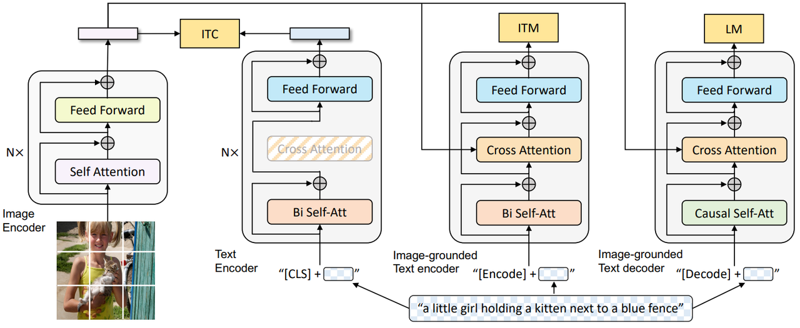
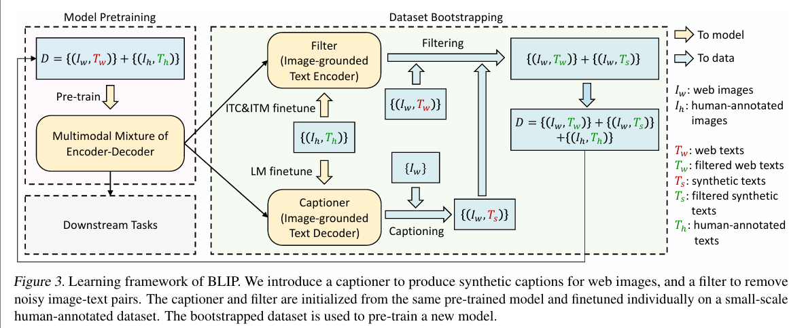

> **论文：BLIP: Bootstrapping Language-Image Pre-training for Unified Vision-Language Understanding and Generation**
>
> **论文链接：https://arxiv.org/pdf/2201.12086**
>
> **可以参考的博客：https://blog.csdn.net/m0\_51976564/article/details/134356373，https://zhuanlan.zhihu.com/p/28392731664，https://zhuanlan.zhihu.com/p/640887802，https://blog.csdn.net/wl1780852311/article/details/148871284**
>
> **可以参考的视频：https://www.bilibili.com/video/BV1fA411Z772/?spm\_id\_from=333.337.search-card.all.click**

# 1. **BLIP 简介**

> **BLIP（Bootstrapping Language-Image Pre-training）** 是一种统一的**视觉-语言预训练框架**，旨在解决现有的**视觉-语言预训练（VLP）**&#x6A21;型在**理解任务与生成任务**上的局限性，以及网页**图像-文本对噪声问题**
>
> 实验表明，BLIP 在图像-文本检索（平均召回率 @1 提升 2.7%）、图像 captioning（CIDEr 提升 2.8%）、VQA（分数提升 1.6%） 等任务上达到 SOTA，并在零样本迁移至视频-语言任务中表现优异

## 1.1 **BLIP 的背景意义与动机**

> ### **模型能力分化问题**
>
> * 传统 VLP 模型**要么擅长理解（Encoder 模型），要么擅长生成（如 Encoder‑Decoder 结构）**，但两者未能统一
>
> * Encoder 模型难迁移至生成任务（如图像 captioning），Encoder‑Decoder 模型在多模态检索任务中表现不佳

> ### **噪声网络语料影响效率**
>
> * 网页爬取的**图像-文本对存在大量噪声（文本与图像内容不匹配）**，虽通过扩大数据量提升性能，但噪声仍然降低学习效率，影响训练质量及下游表现&#x20;
>
> * **BLIP 的目标**：在融合理解与生成能力的同时，通过 **Captioner + Filter（CapFilt）** 机制清洗和增强噪声数据，提高预训练样本质量

## 1.2 **BLIP 的核心创新点**

> ### **多模态混合编码器-解码器架构（MED）&#x20;**
>
> * 支持单模态编码、图像接地文本编码和图像接地文本解码三种功能，通过图像-文本对比学习、匹配和条件语言建模三种目标联合预训练

> ### **CapFilt（Captioning and Filtering） 数据增强方法**
>
> * 通过生成器生成合成字幕并结合过滤器移除噪声，提升数据质量
>
> * Captioner 生成图像的文本标注，Filter去除标注中的噪声，提升数据质量通过不断迭代生成和过滤，BLIP 能够从有限的标注数据中扩展出更多高质量的训练数据。

> BLIP 的核心思想是**通过 Bootstrapping 方法，利用 Captioner-Filter 机制生成高质量的文本标注**，从而提高数据的质量和数量。在 BLIP 中，Bootstrapping 体现在 Captioner-Filter 机制中
>
> > Bootstrapping 是一种统计估计方法，通过对观测数据进行再抽样，进而对总体的分布特性进行统计推断。在机器学习中，Bootstrapping 常用于小数据集场景，通过有放回地抽样生成多个训练集，从而引入随机性，增加模型的多样性，提高泛化能力

# 2. **BLIP 方法细节**

## 2.1 **BLIP 模型架构**

**BLIP&#x20;**&#x6838;心是**多模态混合编解码器结构（Multi-modal mixture of Encoder-Decoder, MED）**，包括三个模块：**Unimodal encoder，Image-grounded text encoder，Image-grounded text decoder**

### 2.1.1 **Unimodal Encoder**

> **Image Encoder**
>
> * 使用**基于 Transformer 的 ViT架构**
>
> * 将输入图像分割为多个 patch，编码为一系列 Image Embedding
>
> * 使用 \[CLS] token 表示全局图像特征
>
> * 目标：**提取图像特征，用于对比学习（类似于 CLIP 中的 Image Encoder）**

> **Text Encoder**
>
> * **基于 BERT 架构**
>
> * **输入：**&#x6587;本开头添加 \[CLS] token 以表示整个句子
>
> * 目标：**提取文本特征，用于对比学习（类似于 CLIP 中的 Text Encoder）**

这一阶段的训练目标是对齐图像和文本的特征空间，通过&#x5C06;**&#x20;Image Encoder 和 Text Encoder 输出的 embedding** 做**对比学习（Image Text Contrastive learning，ITC）**

### 2.1.2 **Image-grounded Text Encoder&#x20;**

> * **结构：**&#x5728; Text Encoder &#x7684;**&#x20;双向 self-attention 层和前馈网络之间添加交叉注意（Cross-Attention, CA）层**，**用于注入视觉信息**
>
> * **输入：文本开头添加 \[Encode] token 以标识特定任务**，然后通过**双向自注意力**之后，与图像 embedding 在**交叉注意力**中进行跨模态学习，最后经过 FFN 得到输出
>
> * **输出：**&#x53D6; \[Encode] token 对应的输出 embedding 用作图像-文本对的多模态表示
>
> * **目标：提取文本特征并与图像特征对齐**（比 CLIP 更精细化的 Text-Image 对齐）。对文本加入**跨模注意力，实现图文匹配（Image Text Matchong，ITM）**，区分正负图像-文本对
>
> * **核心：**&#x63D2;入交叉注意力层融合视觉信息，用于匹配任务

### 2.1.3 **Image-grounded Text Encoder &#x20;**

> * **结构：**&#x5C06; Image-grounded Text Encoder 的**双向 self-attention 层替换为因果自注意力（Causal Self-Attention）层**
>
> * **输入：**&#x6587;本**开头和结尾分别添加 `[Decode]`token 和 `[EOS]` token**，标识序列的开始和结束。这里将图像 **embedding 与当前时刻之前的文本的表征做交叉注意力，然后预测下一个 token**，生成图像描述
>
> * 因果注意力的作用便是防止 Decoder 获得当前 token 之后的信息，一般使用 Casul Mask 实现
>
> * **目标：**&#x751F;成符合图像和文本特征的文本描述（CLIP 不具备此功能）。此阶段主要遵循自回归的**语言建模（Language Modeling，LM）**，进行 Next Token Prediction，以自回归方式生成图像描述
>
> * **核心：**&#x91C7;用因果自注意力，用于文本生成任务

### 2.1.4 **模块对比**

| 模块名称                            | 架构                         | 功能               | 类比                       |
| ------------------------------- | -------------------------- | ---------------- | ------------------------ |
| **Image Encoder**               | 基于 ViT（Vision Transformer） | 提取图像特征，用于对比学习    | 类似于 CLIP 的 Image Encoder |
| **Text Encoder**                | 基于 BERT                    | 提取文本特征，用于对比学习    | 类似于 CLIP 的 Text Encoder  |
| **Image-grounded Text Encoder** | 在 BERT 基础上添加交叉注意力层         | 提取文本特征并与图像特征对齐   | 更精细化的 Text-Image 对齐      |
| **Image-grounded Text Decoder** | self-attention 替换为因果自注意力层  | 生成符合图像和文本特征的文本描述 | CLIP 不具备此功能              |

> 值得注意的是，上图的**三大模块颜色相同的部分之间共享参数**，训练 ITC 任务的时候也完成了 ITM 的部分训练。同时每个图像-文本对只需通过计算量较大的**视觉 Transformer 进行一次前向传播**，再通过**文本 Transformer 进行三次前向传播**

## 2.2 **BLIP 预训练方法**

> BLIP在预训练过程中，联合优化三个目标函数，其中包括**两个基于理解的目标**和一个**基于生成的目标**

### 2.2.1 **图文对比损失**

> ##### 图文对比损失（Image-Text Contrastive Loss, ITC），基于理解
>
> * **目标：对齐图像和文本的特征空间**
>
> * **方法：**
>
>   * 最大化正样本图像-文本对的相似度
>
>   * 最小化负样本图像-文本对的相似度
>
>   * 使用动量编码器（Momentum Encoder）生成伪标签以辅助训练
>
>   > Momentum Encoder 出自论文：Vision and language representation learning with momentum distillation，是一种用于稳定训练、提升特征一致性的技术，尤其在对比学习（如图像-文本对比损失 ITC）中广泛应用。动量编码器本质上是一个 “缓慢更新” 的模型副本，与主编码器（Main Encoder）结构完全相同，但参数更新方式不同，不直接通过梯度更新，而是通过主编码器的参数 “平滑过渡” 更新，公式大致为：
>   > **`动量编码器参数 = 动量系数 × 动量编码器旧参数 + (1-动量系数) × 主编码器新参数`**
>
> * **作用：**&#x7528;于**训练 Image Encoder 和 Text Encoder**

### 2.2.2 **图文匹配损失**

> ##### 图文匹配损失（Image-Text Matching Loss, ITM），基于理解
>
> * **目标：**&#x5B9E;现**视觉和语言之间的细粒度对齐**
>
> * **方法：**
>
>   * 二分类任务，利用一个图像-文本匹配头（一个线性层），根据图像-文本对的多模态特征预测图像-文本对是正样本还是负样本
>
>   * 使用 **hard negative mining** 技术更好地捕捉负样本信息
>
>   > 难负样本（Hard Negatives）：负样本中与正样本 “非常相似” 的样本，模型很难将其与正样本区分开。例如：描述 “猫爬树” 的文本，对应的负样本图像是 “猫卧在地上”（语义接近，比 “汽车” 这类负样本更难区分）；在检索任务中，与查询结果排名较靠前但实际不匹配的样本
>
> * **作用：**&#x7528;于**训练 Image-grounded Text Encoder 和 Image Encoder（图像特征来源）**

### 2.2.3 **语言建模损失**

> ##### 语言建模损失（Language Modeling Loss, LM），基于生成
>
> * **目标：**&#x751F;成**图像的文本描述**
>
> * **方法：**
>
>   * 通过优化交叉熵损失函数，训练模型以自回归的方式最大化下一个输出文本 token 的概率，输出的文本为图像的描述，即 caption 信息
>
>   * 使用 0.1 的标签平滑计算损失
>
>   * 与视觉-语言预训练（VLP）中广泛使用的掩码语言建模（MLM）损失相比，语言建模损失（LM）使模型具备将视觉信息转化为连贯字幕的泛化能力。（从 BERT 到 GPT 的转变）
>
> * **作用：**&#x7528;于训练 **Image-grounded Text Decoder 和 Image Encoder（图像特征来源）**

<table>
<thead>
<tr>
<th><h5>损失函数对比</h5></th>
<th></th>
<th></th>
<th></th>
</tr>
</thead>
<tbody>
<tr>
<td>损失函数</td>
<td>目标</td>
<td>方法</td>
<td>训练模块</td>
</tr>
<tr>
<td><strong>图文对比损失（ITC）</strong></td>
<td>对齐图像和文本的特征空间</td>
<td>最大化正样本相似度，最小化负样本相似度，使用动量编码器生成伪标签</td>
<td>Image Encoder 和 Text Encoder</td>
</tr>
<tr>
<td><strong>图文匹配损失（ITM）</strong></td>
<td>实现视觉和语言之间的细粒度对齐</td>
<td>通过二分类任务预测正负样本，使用 hard negative mining 技术捕捉负样本信息</td>
<td>Image-grounded Text Encoder</td>
</tr>
<tr>
<td><strong>语言建模损失（LM）</strong></td>
<td>生成图像的文本描述</td>
<td>通过交叉熵损失函数，以自回归方式最大化文本概率，使用标签平滑计算损失</td>
<td>Image-grounded Text Decoder</td>
</tr>
</tbody>
</table>

## 2.3 **BLIP CapFilt 机制**

### 2.3.1 **CapFilt 的背景**

> * 由于**标注成本过高，高质量的人工标注图像-文本对`{(I_h, T_h)}`数量有限**（例如 COCO 数据集）
>
> * 近年许多研究利用了数量多得多的，从网页中自动收集的图像与替代文本&#x5BF9;**`{(I_w, T_w)}`**。但是，**这些替代文本（alt-text）往往无法准确描述图像的视觉内容，使其成为一种噪声信号**，对于学习视觉-语言对齐来说并非最优选择

### 2.3.2 **CapFilt 的方法**

> * **核心目的：从噪声网页数据中提取高质量图像-文本对**
>
> * **步骤：Caption and Filtering**
>
>   1. **基于预训练的 MED 微调两个模块：**
>
>      * **生成器（Captioner）：**&#x4E3A;网页图像生成合成字幕 caption（用 COCO 数据集微调），通过模型生成描述，增加样本多样性
>
>      * **过滤器（Filter）：**&#x5224;断文本与图像是否匹配（用 COCO 数据集微调），通过模型评估去除噪声 caption，确保质量
>
>   2. **整合数据：**&#x8FC7;滤原始网页文本和合成文本中的噪声，结合**人工标注数据（如 COCO）**&#x5F62;成新训练集。该机制使训练集在原始网络语料基础上，更加干净且多样，而非盲目扩增&#x20;

### 2.3.3 **CapFilt 方法详解**

> ### 字幕器（Captioner）
>
> * **功能：**&#x57FA;于 **Image-grounded Text Decoder**，生成给定图像的文本描述
>
> * **训练：**&#x5728; COCO 数据集上使&#x7528;**&#x20;LM 损失函数进行微调**
>
> * **输出：给定网络图片$$I_w$$，生成字幕$$T_w$$**

> ### 过滤器（Filter）
>
> * **功能：**&#x57FA;于 **Image-grounded Text Encoder**，去除文本噪声
>
> * **训练：**&#x5728; COCO 数据集上**使用 ITC 和 ITM 损失函数进行微调**
>
> * **方法：**&#x901A;过比对文本和图像的匹配情况，**删除原始 Web 文本$$T_w$$和合成文本$$T_s$$中的噪声**

**&#x20;CapFilt 详细流程**

> **模型预训练**
>
> 基于 MED 框架训练 BLIP，数据包含**含有噪声的网络数据`{(I_w, T_w)}`**
>
> 以及**人工标注的高质量数据`{(I_h, T_h)}`**

> **模型微调**
>
> Captioner 和 Filter 都是**在预训练完成后的 MED 模型上初始化**的，然后在 COCO 数据集上微调 Captioner 和 Filter，分别使用 LM 目标和 ITC+ITM 目标训练

> **数据过滤**
>
> 使用 Captioner 对输入的图&#x50CF;**`{I_w}`**&#x751F;成字幕 caption **`{T_s}`**，然后使用 Filter 判断网络数&#x636E;**`{(I_w, T_w)}`**&#x548C;生成数&#x636E;**`{(I_w, T_s)}`**&#x662F;否匹配，**留下匹配的并与人工标注的合并，形成新的高质量数据集`{(I_h, T_h)+(I_w, T_w)+(I_w, T_s)}`，**&#x9001;给MED继续预训练，使用新的数据量更大且更干净的数据，实现 Bootstrap训练

# 3. **BLIP 实验效果**

## 3.1 **CapFilt 的有效性**

| 预训练数据  | 生成器（C） | 过滤器（F） | 图像-文本检索（COCO，TR@1） | 图像 captioning（COCO，CIDEr） |
| ------ | ------ | ------ | ------------------ | ------------------------- |
| 14M 图像 | 无      | 无      | 78.4               | 127.8                     |
| 14M 图像 | 有      | 有      | 80.6               | 129.7                     |

* 生成器与过滤器结合时效果最佳，14M 图像上检索 TR@1 提升 2.2%，CIDEr 提升 1.9%

* 更大数据集（129M）和模型（ViT-L）进一步提升性能，验证可扩展性

## 3.2 **各任务 SOTA 表现**

> * **图像-文本检索：**&#x31;4M 图像上，COCO 数据集平均 recall@1 较 ALBEF 提升 2.7%；零样本迁移至 Flickr30K，TR@1 达 94.8%
>
> * **图像 captioning：**&#x43;OCO 数据集 CIDEr 达 129.7（14M 图像），NoCaps 零样本 CIDEr 达 105.1
>
> * **VQA：**&#x31;4M 图像上测试集分数达 77.62，较 ALBEF 提升 1.6%
>
> * **零样本视频-语言任务：**&#x6587;本-视频检索 R@1 达 43.3（超微调模型 12.4%），视频 QA 准确率达 19.2（MSRVTT）

# 4. **BLIP 代码**

**官方源码：https://github.com/salesforce/BLIP，主要看models文件夹下的 med.py，blip\_pretrain.py 两个文件**

## 4.1 **med.py**

* `BertSelfAttention`类支持跨模态自注意力机制，通过`is_cross_attention`判断

* `BertSelfAttention`类支持跨模态自注意力机制，通过`is_cross_attention`判断

## 4.2 **blip\_pretrain.py**

* `__init__ `类

* `forward`类，先后计算 ICT、ITM 和 LM loss

# 5. **BLIP 的关键点与关键问题**

> #### 关键点总结
>
> * **Bootstrapping：**&#x901A;过 Captioner-Filter 机制生成高质量数据
>
> * **MED 架构：**&#x7ED3;合单模态和多模态编码器与解码器，实现视觉与语言的对齐与生成
>
> * **预训练目标：**&#x8054;合优化 ITC、ITM 和 LM 三个损失函数
>
> * **CapFilt 机制：**&#x901A;过字幕器和过滤器提升数据质量，扩展训练集

> ### 关键问题：
>
> 1. **BLIP 如何解决现有 VLP 模型在任务适应性上的局限？**
>    BLIP 提出多模态混合编码器-解码器（MED） 架构，**支持三种功能：单模态编码（用于检索）、图像接地文本编码（用于匹配）、图像接地文本解码（用于生成）**，并通过三种目标联合预训练，实现理解与生成任务的灵活迁移
>
> 2. **CapFilt 方法如何提升噪声网页数据的质量？**
>    CapFilt 包含两个模块：（1）生成器基于网页图像生成合成字幕，补充原始文本；（2）过滤器判断文本与图像的匹配度，移除原始网页文本和合成文本中的噪声，两者结合形成高质量训练集
>
> 3. **BLIP 在零样本迁移至视频-语言任务中表现优异的原因是什么？**
>    BLIP 的图像-语言模型通过统一的视觉-语言表示学习，具备强泛化能力。处理视频时，通过均匀采样帧并拼接特征（忽略时序信息），直接迁移至文本-视频检索和视频 QA 任务，1k 测试集上文本-视频检索 R@1 达 43.3，超现有零样本方法 30% 以上
