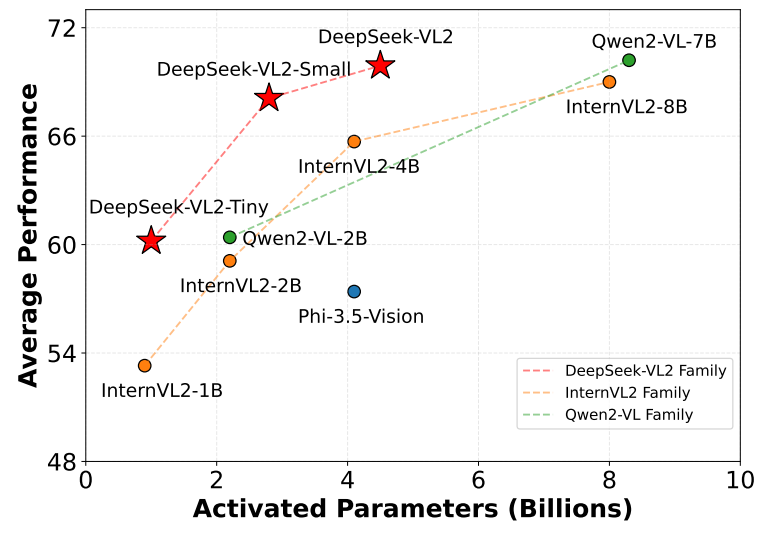
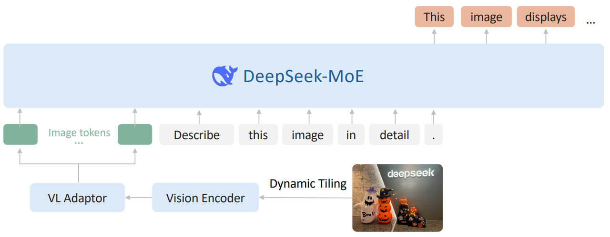
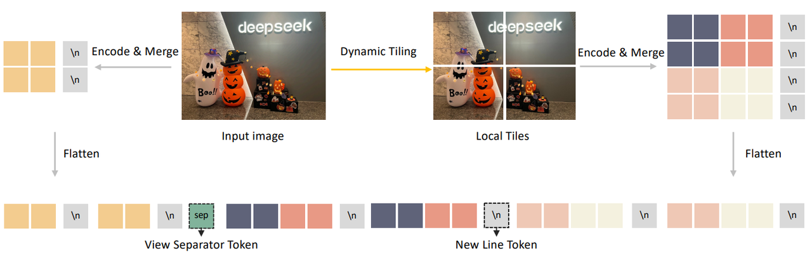
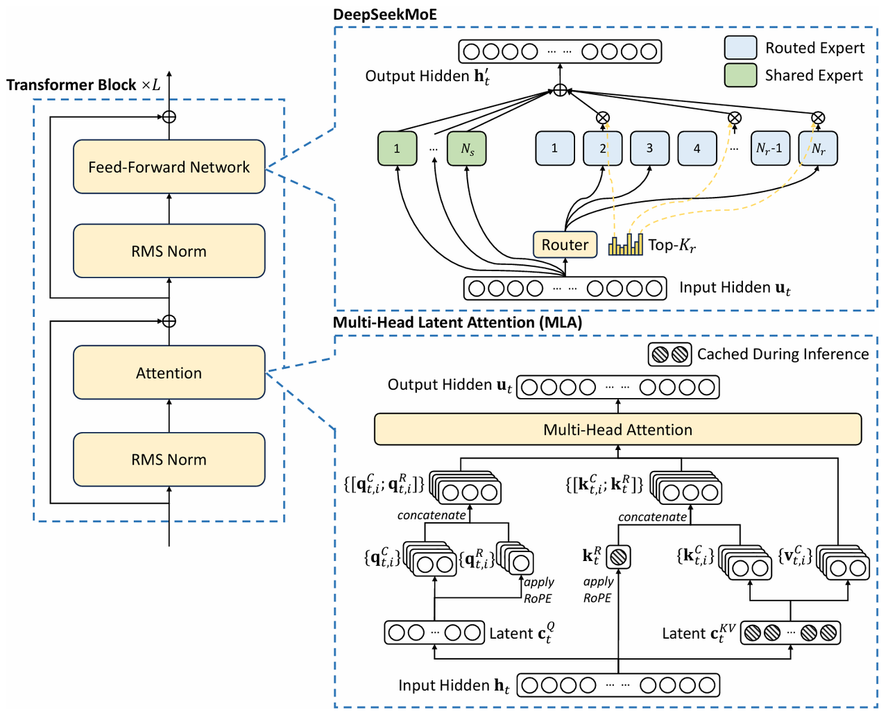
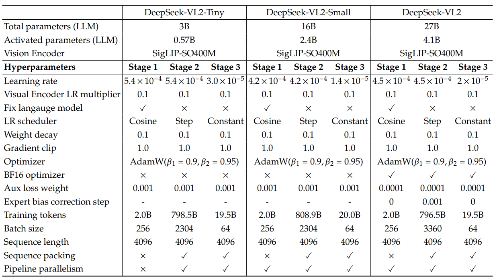
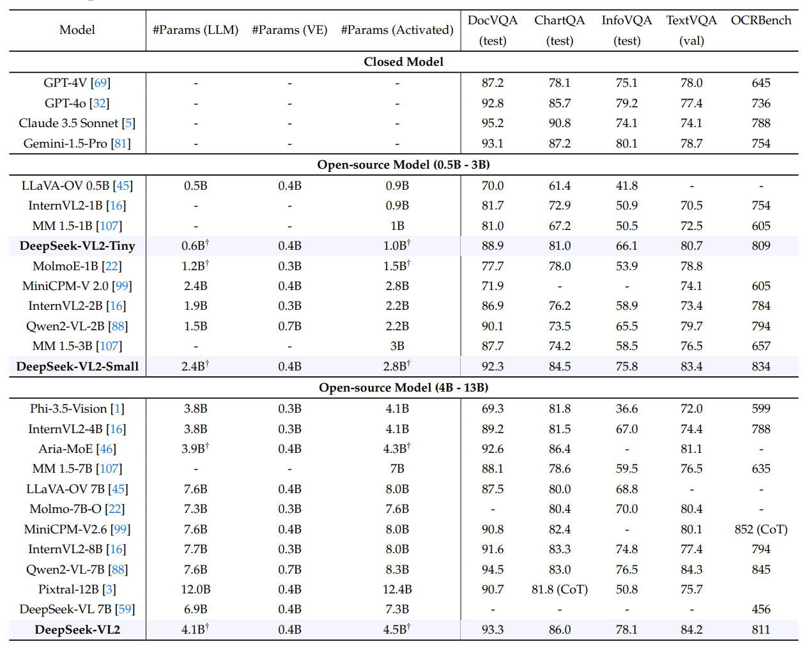
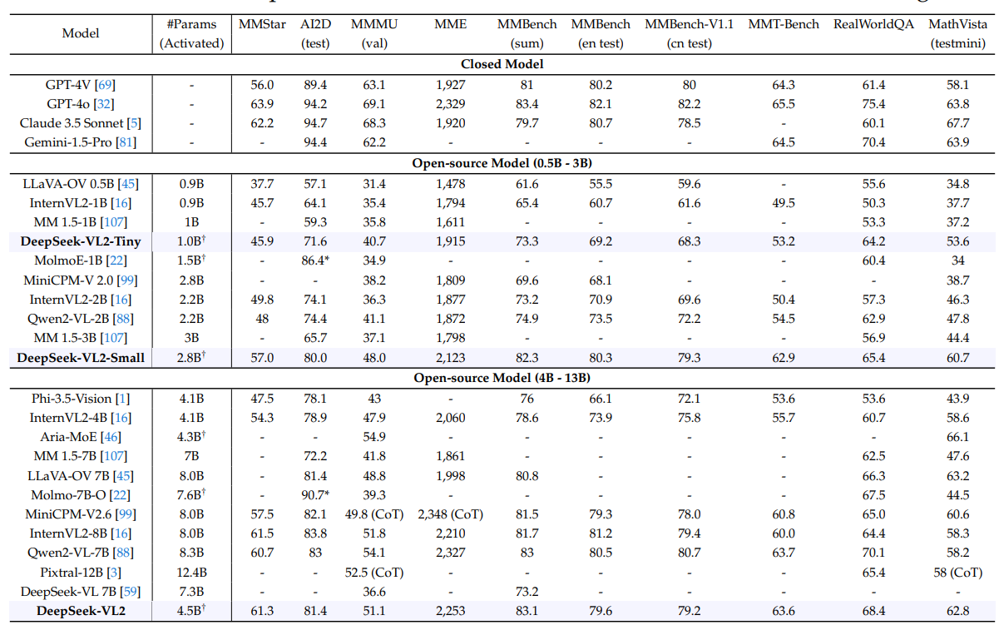
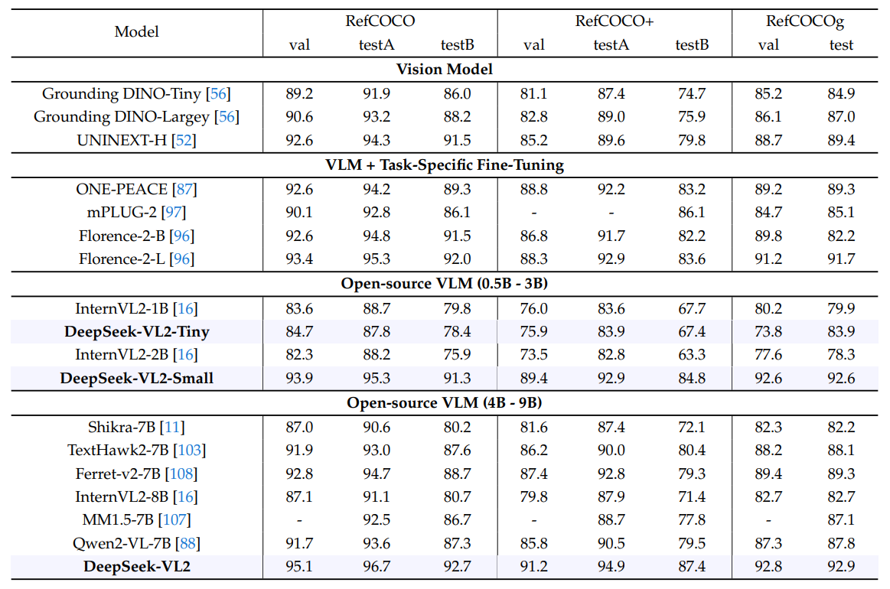

> **论文：DeepSeek-VL2: Mixture-of-Experts Vision-Language Models for Advanced Multimodal Understanding**
>
> **论文链接：https://arxiv.org/pdf/2412.10302**
>
> **可以参考的博客：https://blog.csdn.net/qq\_22337877/article/details/144897525，https://zhuanlan.zhihu.com/p/21049367144**
>
> **可以参考的视频：https://www.bilibili.com/video/BV1pcqoYFEBg/?spm\_id\_from=333.337.search-card.all.click**

# 1. **Deepseek-VL2 简介**

> DeepSeek-VL2 是 DeepSeek-VL 系列的升级版本，专注于高效处理高分辨率视觉输入和文本数据。其核心架构包括三个模块：**视觉编码器、视觉-语言适配器和基于混合专家（Mixture-of-Experts, MoE）的语言模型（老三样架构）**
>
> DeepSeek-VL2 引入了两项重要创新：
>
> * **动态分块编码策略**，以高效处理高分辨率、不同宽高比的图像
>
> * 支持**多头潜在注意力（Multi-head Latent Attention, MLA）的 DeepSeekMoE 语言模型**
>
> 显著提升了模型在视觉-语言任务中的表现

# 2. **Deepseek-VL2 架构设计**

**Vision Encoder + Adaptor + LLM**

## 2.1 **视觉编码器（Vision Encoder**）

DeepSeek-VL2 的视觉编码器采用**动态分块策略**，解决了高分辨率图像处理的效率问题。

* **背景**：DeepSeek-VL 使用 SigLIP 和 SAM-B 混合编码器处理图像，但受限于固定的 1024 × 1024 分辨率，难以处理更高分辨率或极端宽高比的图像（如 InfographicVQA、密集 OCR 和视觉定位任务）

* **实现**： &#x20;

  * 将高分辨率图像分割为多个局部块（tiles），每个块的分辨率为 384 × 384。

  * 定义候选分辨率集合：$$CR = \{(m \cdot 384, n \cdot 384) \mid m \in \mathbb{N}, n \in \mathbb{N}, 1 \leq m, n, mn \leq 9\}$$，其中 (m : n) 表示宽高比

  * 对输入图像 (H, W)，计算每个候选分辨率的填充面积，选择填充面积最小的分辨率$$(m_i \cdot 384, n_i \cdot 384)$$

  * 将图像调整为选定分辨率，并分割为$$(m_i, n_i)$$个局部块和一个全局缩略图块

  * 使用 SigLIP-SO400M-384 编码器处理所有块，生成每块 27 × 27 = 729 个视觉嵌入（每个嵌入 1152 维）

* **优化**： &#x20;

  * 在处理多张图像（> 2）时，禁用动态分块策略以节省计算资源

* **分块后处理**： &#x20;

  * 对**每个块的视觉 token 进行 2 × 2 像素混洗操作，将 token 从 27 × 27 压缩为 14 × 14 = 196 个 token**

* **特殊 token 引入**： &#x20;

  * **全局缩略图块：**&#x5728;每行末尾添加 14 个 \<tile\_newline> token，总计 14 × 15 = 210 个 token

  * **局部块：**&#x5728;每列末尾添加$$m_i \times 14$$个 \<tile\_newline> token，表示一行的结束

  * **视图分隔符：**&#x5728;全局缩略图块和局部块之间插入 \<view\_separator> token

* **最终视觉序列**：视觉序列包含$$210 + 1 + m_i \times 14 \times (n_i \times 14 + 1) $$个 token，通过两层 MLP 投影到语言模型的嵌入空间

## 2.2 视觉-语言适配器（Vision-Language Adaptor）

两层 MLP 将视觉编码器的输出的序列投影到语言模型嵌入空间对齐

## 2.3 基于 DeepSeekMoE 的语言模型（DeepSeekMoE LLM）

DeepSeek-VL2 的语言模型基于 DeepSeekMoE，结合了多头潜在注意力（MLA）和混合专家（MoE）架构，DeepSeek-VL2 提供三种规模：1.0B、2.8B 和 4.5B

* **多头潜在注意力（MLA）**： &#x20;

  * 通过将 Key-Value 缓存压缩为潜在向量，提升推理效率

  * 支持更高的吞吐量

* **混合专家架构（MoE）**： &#x20;

  * 通过稀疏计算实现高效推理

  * 引入全局偏置项（global bias term），优化专家间的负载均衡

# 3. **Deepseek-VL2 训练流程**

DeepSeek-VL2 通过三阶段训练流程实现高效的视觉-语言对齐和多模态理解。其训练流程包括：**视觉-语言对齐阶段、视觉-语言预训练阶段和监督微调阶段**

> **阶段 1：视觉-语言对齐（Vision-Language Alignment）**
>
> **目标：**&#x5728;嵌入空间中建立视觉特征和语言特征之间的强连接，使预训练语言模型能够有效处理视觉输入
>
> * 训练策略：
>
>   * 冻结语言模型（DeepSeekMoE 3B/16B/27B），仅优化视觉编码器和视觉-语言适配器。
>
>   * 使用图像-文本对数据进行训练（ShareGPT4V 1.2M 样本）
>
> * 创新点：
>
>   * 不同于传统方法（如 LLaVA 和 InstructBLIP）固定视觉编码器和语言模型，DeepSeek-VL2 动态适应高分辨率图像

> **阶段 2：视觉-语言预训练（Vision-Language Pre-training）**
>
> **目标：**&#x901A;过大规模数据训练，提升模型在多模态任务中的综合理解能力
>
> * 训练策略：
>
>   * 解冻所有参数（包括视觉编码器、视觉-语言适配器和 DeepSeekMoE 语言模型），进行全模型优化。
>
>   * 使用约 8000 亿图像-文本 token进行训练。70% 视觉 - 语言数据 + 30% 纯文本数据
>
> * 效果：
>
>   * 显著增强模型的多模态理解能力，同时保持语言能力。

> **阶段 3：监督微调（Supervised Fine-Tuning）**
>
> **目标：**&#x901A;过指令微调，提升模型在对话和指令跟随任务中的表现
>
> * 训练策略：
>
>   * 使用内部视觉-语言SFT 数据优化所有参数
>
>   * 仅监督答案和特殊 token，掩码系统提示和用户提示
>
>   * 结合多模态数据和纯文本对话数据（来自 DeepSeek-V2），增强对话理解能力

* **训练参数**

* **评测结果**

**OCR数据集**

**问答和数学相关数据集**

**RefCOCO数据集**

**DeepSeek-VL和DeepSeek-VL2对比：**

| 模块           | DeepSeek-VL                 | DeepSeek-VL2                                              |
| ------------ | --------------------------- | --------------------------------------------------------- |
| **视觉编码器**    | 混合视觉编码器（SigLIP + SAM-B）     | 动态分块策略 + SigLIP-SO400M-384 编码器                            |
| **视觉-语言适配器** | 两层混合 MLP，处理高分辨率和低分辨率特征      | 分块后处理 + 特殊 token 引入（\<tile\_newline>, \<view\_separator>） |
| **语言模型**     | 基于 DeepSeek-LLM（1B 和 7B 规模） | 基于 DeepSeekMoE（1.0B, 2.8B, 4.5B 规模），支持多头潜在注意力（MLA）和 MoE   |

# 4. **Deepseek-VL2 总结**

> ### **关键问题**
>
> 1. **DeepSeek-VL2 在视觉处理上的核心创新是什么？与前代相比有何优势？**
>    核心创新是动态分块视觉编码策略。前代采用固定分辨率（384×384 和 1024×1024）的混合编码器，而该策略通过动态选择候选分辨率、将高分辨率图像分为 384×384 局部块 + 全局缩略块，适配不同宽高比，在保留细节的同时控制视觉令牌数量（210 个）。优势在于提升超高清任务（如文档分析、视觉定位）性能，克服固定分辨率局限
>
> 2. **DeepSeek-VL2 的训练数据有何特点？如何影响模型能力？**
>    训练数据特点包括：①
>
>    1. 三阶段设计（对齐、预训练、微调），覆盖 1.2M 到 800B + 令牌
>
>    2. 质量优化（如重生成 caption、过滤低质量样本）
>
>    3. 多样性（含多语言、OCR、跨图像定位等）
>
>    这些特点使模型在多任务（VQA、OCR、视觉定位）中泛化能力强，尤其支持新能力（如 GUI 感知、跨图像物体定位）
>
> 3. **与同类开源模型相比，DeepSeek-VL2 在性能和效率上有何优势？**
>    性能上，在 MMBench、MathVista 等 14 个基准中，相同激活参数下表现更优（如 4.5B 参数模型平均性能超 8B 的 InternVL2-8B），在视觉定位（RefCOCO val 得分 95.1）、OCR（93.3）等任务中达 SOTA。效率上，依托 MoE 架构和 MLA 机制，推理吞吐量更高，且模型可部署于单 GPU（10GB-80GB 内存），平衡性能与计算成本
