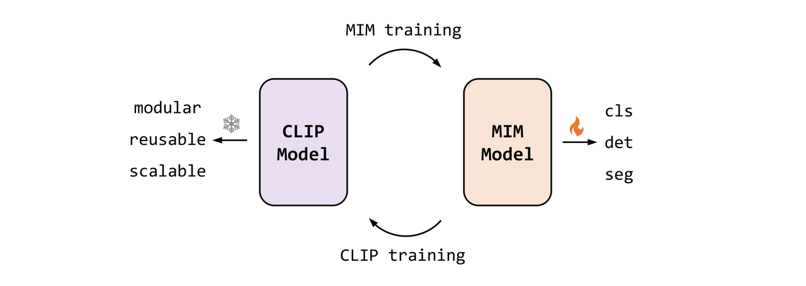
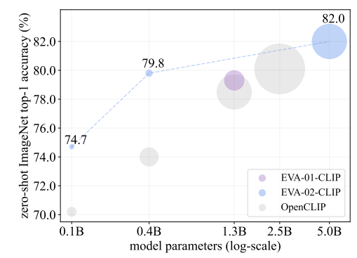
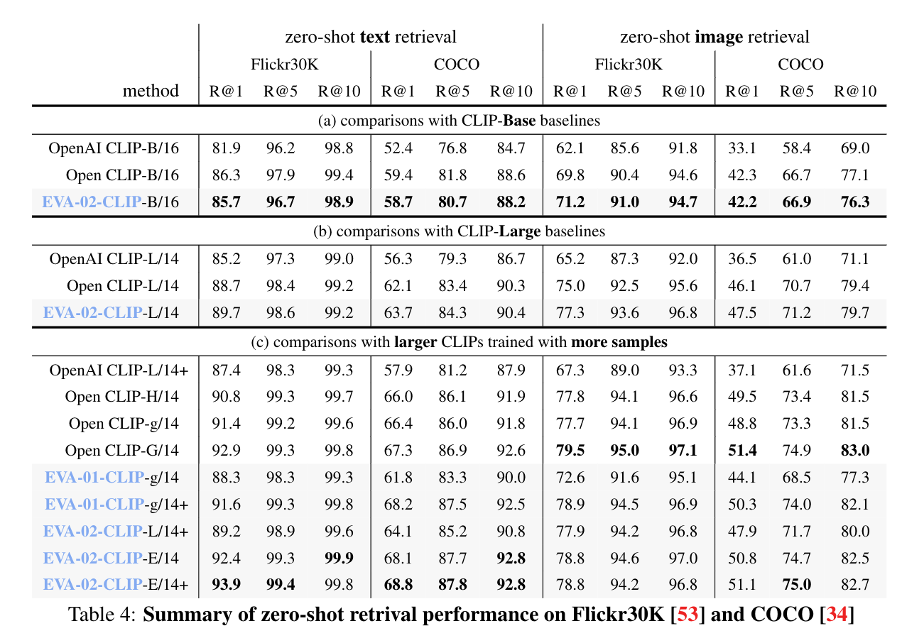
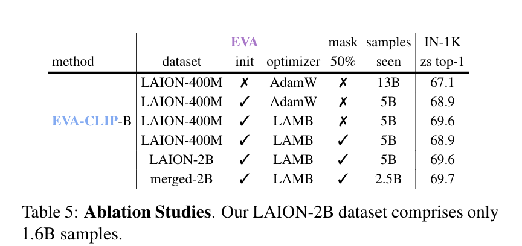

> **论文：EVA-CLIP: Improved Training Techniques for CLIP at Scale**
>
> **论文链接：https://arxiv.org/pdf/2303.15389**
>
> **可以参考的博客：https://zhuanlan.zhihu.com/p/681930130，https://blog.csdn.net/weixin\_43336281/article/details/135502780，https://hub.baai.ac.cn/view/35022，https://zhuanlan.zhihu.com/p/692169836，https://zhuanlan.zhihu.com/p/681782405**
>
> **可以参考的视频：**
>
> **Github 链接：https://github.com/baaivision/EVA/tree/master/EVA-CLIP**

# 1. **EVA-CLIP 简介**

> **EVA-CLIP** 是由 BAAI 智源研究院在 2023 年推出的一系列图文对齐模型，重点在于**提升训练效率和零样本任务表现**。该系列在不扩大模型规模的前提下，通过多项优化策略改进了训练过程，例如使&#x7528;**&#x20;EVA 图像编码器进行初始化、LAMB 优化器、50% 的随机输入 token 掩码，以及 Flash Attention 技术**等，加快了训练速度并减少了计算开销
>
> 在实际表现上：
>
> * **EVA-02-CLIP-E/14+**（约 50 亿参数，5B）用 9 亿对图文样本，在 ImageNet-1K 上达到 82.0% 的零样本 top-1 准确率
>
> * **EVA-02-CLIP-L/14+**（约 4.3 亿参数，0.43B）用 6 亿样本则达到 80.4%
>
> 2024 年发布的更大模型 **EVA-CLIP-18B**在仅使用 6 亿图文对的情况下，在 27 个评测任务中取得了平均 80.7% 的 top-1 准确率，整体表现优于已有的开源 CLIP 模型

## 1.1 **EVA-CLIP  的背景意义**

> CLIP 作为跨模态基础模型，引发了图像-文本预训练模型的广泛关注，具备**强大的 zero-shot 迁移能力**。然而其**训练代价极高，需海量样本与大批量训练，且大规模训练不稳定**。EVA‑CLIP 通过引入更强视觉预训练模型 EVA 作为初始化，并优化训练体系，显著降低训练成本并提升性能

## 1.2 **MVP 的动机与核心**

> * **动机**：解决 **CLIP 模型训练难、训练成本高、模型不稳定、扩展难的问题。希望在样本量和算力有限时仍保持高效与高性能**
>
> * **核心技术**：
>
>   * **更好的初始化：**&#x4F7F;用**预训练的 EVA 模型（EVA-01/EVA-02）初始化 vision encoder 图像编码器**，以提供更优表征和稳定训练基础，加速收敛
>
>   * **优化器选择：**&#x91C7;用 **LAMB 优化器** 替代 AdamW，适配大规模批次训练（支持超 100k batch size），提升训练效率和稳定性
>
>   * **输入 token 随机掩码：随机 mask 50% 图像 token，将时间复杂度降低 50%**，支持批次量翻倍且不增加内存成本，提升训练速度与内存效率，同时略微降低算力成本
>
>   * **flash attention 加速：**&#x91C7;用 **flash attention 技术**，减少 15% 训练时间，降低 GPU 内存占用

# 2. **EVA-CLIP 方法细节**

## 2.1 **训练挑战与解决方案**

> **CLIP 训练难点**：
>
> * 需要大批量训练，计算资源需求高
>
> * 训练过程可能不稳定

> **EVACLIP 的优势**：
>
> * 显著降低计算成本
>
> * 在广泛的基准测试中实现卓越的零样本性能

## 2.2 **更好的初始化**

> * **目标**：提升**特征表示并加速 CLIP 模型的收敛**
>
> * **方法**：使用**预训练的 EVA 模型初始化 EVA-CLIP 的图像编码器**
>
>   * **EVA 结合了图文对比学习的高层语义和掩码图像建模的几何与结构捕捉**
>
> * **效果**：
>
>   * 在多个零样本基准测试中表现优异
>
>   * 加速并稳定了训练过程

## 2.3 **优化器选择**

> * **选择**：使用 LAMB 优化器训练 EVA-CLIP
>
> * **LAMB 优势**：
>
>   * 专为大批量训练设计
>
>   * 自适应元素更新和分层学习率提高了训练效率，加速了收敛
>
> * **批量大小**：
>
>   * 原始 CLIP 模型使用 32,768 的批量大小
>
>   * 一些开源 CLIP 模型使用超过 100k 的批量大小
>
> * **结论**：LAMB 是训练大规模 CLIP 模型的首选优化器

> ### **LAMB（Layer-wise Adaptive Moments optimizer for Batch training）**
>
> **LAMB&#x20;**&#x662F;一种专为大规模预训练（如 CLIP、BERT 等）设计的优化器，旨在加速训练过程，特别是在**大批量大小（如 32k 或更高）下保持梯度更新的精度，避免梯度爆炸或消失问题**
>
> LAMB 优化器结合了**自适应元素级更新和逐层修正的特点，显著提升大规模深度学习模型的训练效率和稳定性**。主要目标是解决在使用 Adam 和 AdamW 等优化器时，batch size 存在隐式上限的问题。一旦突破这个上限，梯度更新的极端取值会导致自适应学习率调整后极为困难的收敛，从而无法享受增加的 batch size 带来的提速增益
>
> 1. **自适应元素级更新**：为每个参数赋予独立的学习率
>
> 2. **逐层修正**：确保每一层的参数更新都能保持精度
>
> > **参考链接：https://blog.csdn.net/flyingluohaipeng/article/details/129870527**

## 2.4 **FLIP 的应用**

> ### **FLIP（Fast Language-Image Pre-training）**
>
> **FLIP 是一种通过随机掩码图像 token 来提升训练效率的方法**。在训练过程中，FLIP 随机掩码 50% 的图像token，从而减少计算量并将训练时间复杂度降低一半。此外，FLIP 允许将批量大小增加 2 倍，而无需额外内存开销。这种方法特别适合大规模视觉-语言预训练任务（如 CLIP），能够显著降低训练成本并加速训练过程，所以 EVA-CLIP 也用了这个方法
>
> * **FLIP 优势**：在大规模设置中表现出色
>
> * **方法**：在训练期间随机掩码 50% 的图像token
>
>   * 显著降低时间复杂度（减少一半）
>
>   * 允许批量大小增加 2 倍，且无需额外内存成本
>
> > **论文链接：https://arxiv.org/abs/2212.00794**

## 2.5 **训练与推理流程**

> **训练流程**：
>
> 1. **初始化：**&#x56FE;像编码器采用 EVA‑02 预训练权重，文本编码器使用 OpenAI CLIP 或 OpenCLIP 预训练权重&#x20;
>
> 2. **优化策略：**&#x4F7F;用 LAMB 优化器，支持大 batch 大规模训练；结合 masking 50% image tokens，加上 flash‑attention 技术，节省时间与显存&#x20;
>
> 3. **&#x20;数据设置：**&#x57FA;础数据来自 LAION‑2B（1.6B 样本）与 COYO‑700M（0.4B），合并构成 Merged‑2B；EVA‑CLIP‑18B 同样使用该开放数据集，训练样本总量为 6B&#x20;
>
> **推理流程（Zero‑shot）**：
> 基于预训练好的图像与文本编码器直接进行 contrastive ranking——对图像和文本分别编码，再用 cosine 相似度计算，选择最匹配文本标签。这也是 CLIP 的经典 zero-shot 推理方式

# 3. **EVA-CLIP 实验**

## 3.1 **实验设置**

* **数据集：**&#x4F7F;用 Merged-2B（16 亿 LAION-2B 样本 + 4 亿 COYO-700M 样本）等

* **训练配置：**

  * 采用 DeepSpeed 库、ZeRO stage-1 优化器、梯度检查点

  * 部分模型用 fp16 精度，大模型（如 EVA-02-CLIP-E/14+）用 bf16 稳定训练

* **评估任务：**&#x96F6;样本图像分类（27 个数据集）、视频分类（UCF-101 等）、图像 / 文本检索（Flickr30K、COCO）

## 3.2 **关键实验结果**

* **性能优势：**&#x45;VA-02-CLIP-E/14 + 在 ImageNet-1K 超越 OpenCLIP-G/14（82.0% vs 80.1%），且样本量仅为其 23%；在 27 个图像分类数据集平均准确率达 80.9%，领先 1.9%

* **跨任务稳健性：**&#x5728; ImageNet 变体（如 IN-A、IN-R）和 ObjectNet 中，性能下降最小（EVA-02-CLIP-L/14 + 仅 0.8% 差距），优于其他模型

| 模型                | 参数规模 | 训练样本 | ImageNet-1K 零样本 top-1 准确率 | 27 个图像分类数据集平均准确率 | 视频分类平均准确率 | 文本检索（Flickr30K R@1） |
| ----------------- | ---- | ---- | ------------------------- | ---------------- | --------- | ------------------- |
| EVA-02-CLIP-B/16+ | 149M | 8B   | 74.7%                     | 66.4%            | 58.3%     | 85.7%               |
| EVA-02-CLIP-L/14+ | 430M | 6B   | 80.4%                     | 79.6%            | 67.7%     | 89.2%               |
| EVA-02-CLIP-E/14+ | 5.0B | 9B   | 82.0%                     | 80.9%            | 71.4%     | 93.9%               |
| OpenCLIP-G/14     | 2.5B | 39B  | 80.1%                     | 76.2%            | 67.9%     | 92.9%               |

## 3.3 **消融实验**

| 技术              | 影响                              |
| --------------- | ------------------------------- |
| EVA 初始化         | 比从头训练提升 1.8% 准确率，样本量减半          |
| LAMB 优化器        | 比 AdamW 提升 0.7% 准确率，相同样本下更高效    |
| 50% 掩码          | 训练速度提升 2×，准确率仅降 0.7%            |
| flash attention | 训练时间减少 15%，GPU 内存从 33GB 降至 16GB |

# 4. **EVA-CLIP 总结**

> EVA-CLIP 通过创新训练技术，在**减少训练样本（低至 1/6）和计算资源的同时，实现了 CLIP 模型在零样本分类、检索等任务中的性能突破**，为高效训练大规模跨模态模型提供了可行方案
>
> ### 关键问题
>
> 1. **EVA-CLIP 采用的核心技术中，哪些对提升效率贡献最大？**
>    主要是**随机掩码 50% 图像 token和flash attention**
>
>    1. 前者将训练时间复杂度降低 50%，支持批次量翻倍
>
>    2. 后者减少 15% 训练时间并降低 GPU 内存占用（如 EVA-CLIP-B 训练内存从 33GB 降至 16GB），两者结合使训练效率显著提升
>
> 2. **与现有 CLIP 模型相比，EVA-CLIP 在性能和资源消耗上的关键优势是什么？**
>
>    1. 性能上，5.0B 参数的 EVA-02-CLIP-E/14 + 以 9B 样本实现 ImageNet-1K 零样本准确率 82.0%，超越 2.5B 参数、39B 样本的 OpenCLIP-G/14（80.1%）
>
>    2. 资源上，EVA-CLIP-L/14+（430M 参数）仅用 6B 样本，性能优于 OpenCLIP-G/14（2.5B 参数，39B 样本），参数和样本量均为后者的 1/6 左右
>
> 3. **消融研究揭示了 EVA 初始化对模型性能的具体影响是什么？**
>    **EVA 初始化（用预训练 EVA 模型初始化图像编码器）能显著提升性能：**
>
>    1. 在 LAION-400M 数据集上，相比从头训练，EVA 初始化使模型在 ImageNet-1K 零样本准确率提升 1.8%（从 67.1% 到 68.9%），且仅需一半训练样本即可达到相同效果，同时加速收敛并稳定训练过程
