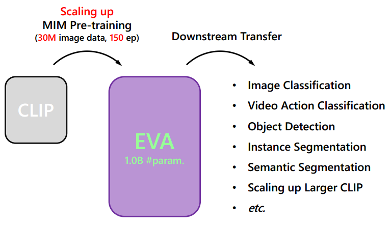
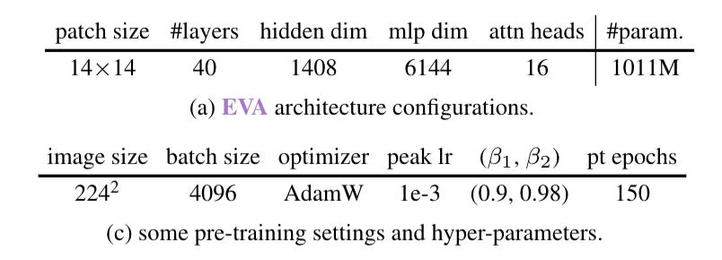
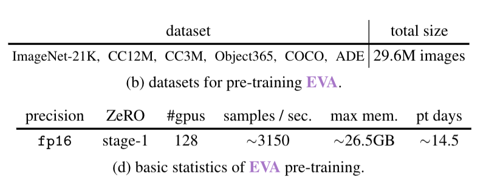
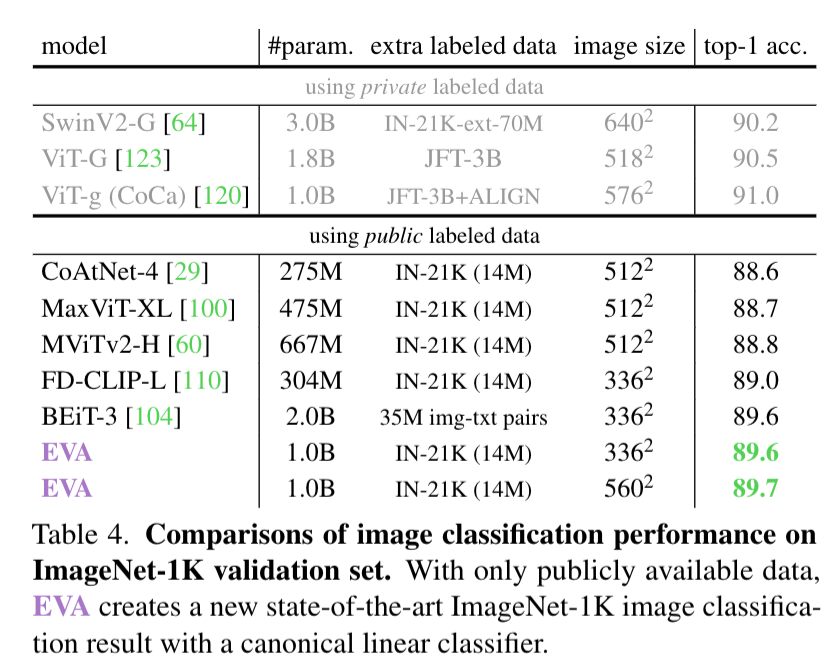
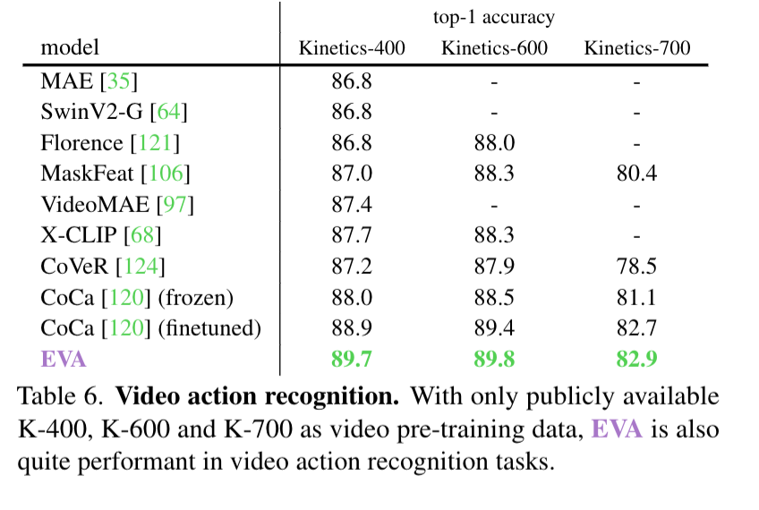
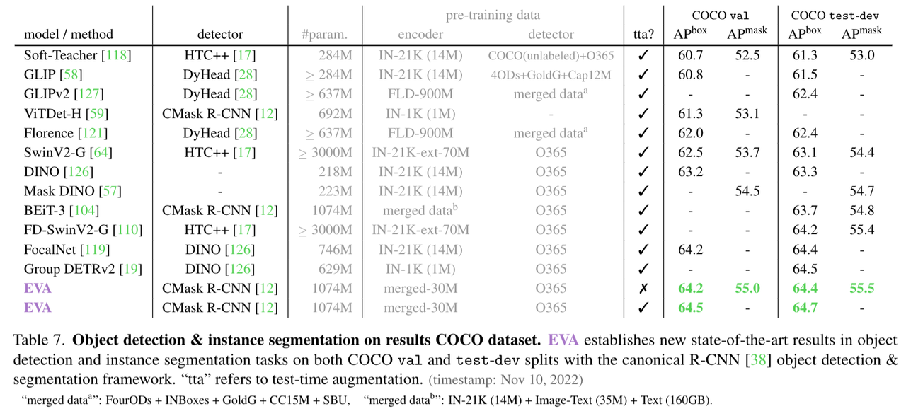
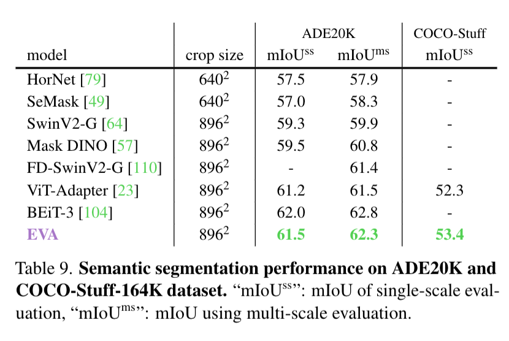
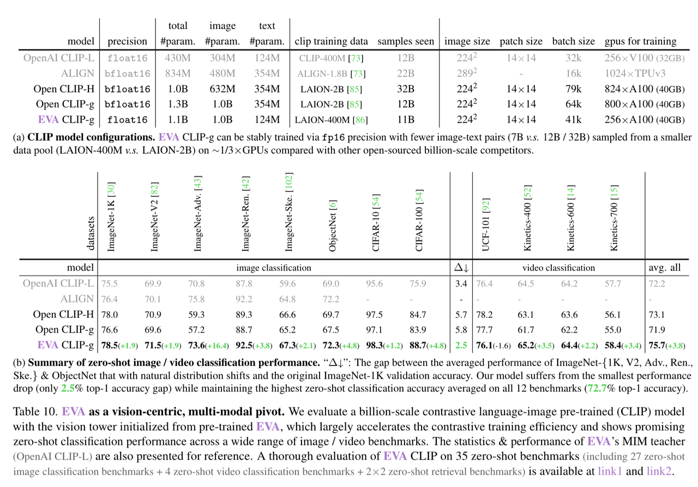

> **论文：EVA: Exploring the Limits of Masked Visual Representation Learning at Scale**
>
> **论文链接：https://arxiv.org/pdf/2211.07636**
>
> **可以参考的博客：https://zhuanlan.zhihu.com/p/672666044，https://zhuanlan.zhihu.com/p/615930607，https://blog.csdn.net/YoooooL\_/article/details/129044031，https://blog.csdn.net/sinat\_37574187/article/details/139925826**
>
> **可以参考的视频：**

# 1. **EVA 简介**

> EVA 是一种规模化视觉 Foundation Model，采用**纯 Vision Transformer（ViT）架构，以 Masked Image Modeling（MIM）为预训练任务，不依赖有标签数据，而是预测 CLIP 图像编码器生成的 vision 特征**
>
> 通过 MIM 任务探索大规模视觉表示的极限，在**2960 万公开无标注图像上预训练，成功将 vanilla ViT 扩展至10 亿参数，**&#x5B9E;现了在图像识别、目标检测、实例/语义分割、视频动作识别等多个视觉任务上的最优或近最优表现

## 1.1 **EVA 的背景意义**

> 其核心思想与 MVP 相近，不同点在于 **EVA 主要探索视觉基础模型的 scaling**
>
> * **背景：**&#x53D7; **NLP 中预训练模型 scaling 成功**（如 **PLMs 通过掩码预测实现百亿参数扩展**）启发，EVA 希望将此成功迁移至视觉领域
>
> * **现有问题：**&#x4E3B;流十亿级参数视觉模型（SwinV2-G、ViT-G）依赖数亿的**专有标注数据**，而且纯 MIM 预训练模型在百亿规模表现不佳。EVA 则**使用公开的无标签图像**
>
> * **核心思路：**&#x901A;过**预测掩码图像块的CLIP 视觉特征，融合图像-文本对齐的高层语义与 MIM 的几何结构捕捉能力，实现视觉模型的高效 scaling**
>
> * **视觉与多模态桥梁**：通过重建 CLIP 特征，**EVA 不仅是视觉模型，也能作为 CLIP 的视觉塔（vision tower）进行初始化，作为多模态枢纽，从而加速大型 CLIP 架构的训练、提升零样本分类表现，并稳定训练过程**

## 1.2 **EVA 的核心动机**

> * **MIM 目标优化**：EVA 在预实验中比较了 token 化特征重建和 CLIP 特征蒸馏，发现**直接回归 CLIP 特征效果最佳，且更稳定可靠**
>
> * **规模与涌现现象**：随着模型规模的增长（到十亿级以上）并训练足够长，模型在迁移任务上的表现会出现质变，而非线性提升，这种涌现行为在其他视觉模型中不常见（大语言模型也出现这种涌现现象）

# 2. **EVA 方法详解**

## 2.1 **预实验**

> * **目标**：选择一个具有出色迁移性能的 MIM 视觉预训练任务
>
> * **候选方法**：
>
>   1. **恢复被掩码的tokenization语义视觉特征**：基于 CLIP 视觉特征，恢复被掩码的语义特征
>
>   2. **特征蒸馏**：从强预训练表示中进行特征蒸馏
>
> * **实验结果**：
>
>   * **无需对 CLIP 特征进行语义 token 化，直接回归特征即可取得优异性能**
>
>   * **特征蒸馏无法随预训练时长增加持续提升性能，而 MIM 任务效果更稳定**
>
>   * **最佳选择**：**基于可见图像块重建被掩码的 CLIP 视觉特征**
>
> * **说明**：该 MIM 任务并非首次提出，已在 MVP 和 MILAN 中研究过。**EVA 展示了该任务可扩展到数十亿参数和数千万未 tokenized 的图像**，且无需：
>
>   1. **语义特征量化 / tokenization**
>
>   2. **显式使用图文对预训练数据**

## 2.2 **模型预训练**

### 2.2.1 **模型架构**

> * **模型架构**：EVA 是**标准 vanilla ViT 架构，保持架构简洁&#x20;**，约 10 亿参数，14×14 patch，40 层，隐藏维度 1408，16 个注意力头
>
> * **特点**：
>
>   * 遵循 ViT giant  和 BEiT-3 的视觉编码器
>
>   * 预训练时**不使用相对位置编码或 layer‑scale 等复杂改进**

### 2.2.2 **预训练目标**

> * **任务**：在可见图像块的条件下，重构被掩码的图像块对应的 **CLIP 视觉特征**（CLIP-L/14 的输出）
>
> * **掩码策略**：
>
>   * 使用 \[MASK] token破坏输入 patches
>
>   * 采用 **block-wise masking，掩码比例为 40%**
>
> * **目标特征**：来自 OpenAI CLIP-L/14 视觉塔（在 224×224 图像上训练）
>
> * **输出处理**：
>
>   * EVA 的输出特征先归一化，再通过线性层投影到与 CLIP 特征相同的维度
>
> * **损失函数**：**负余弦相似度**
>
> * **优势：**&#x540C;时**利用 CLIP 的高层语义抽象与 MIM 对几何结构的捕捉能力，覆盖多数视觉任务需求**

### 2.2.3 **预训练数据**

> * **数据集**：
>
>   * **CC12M 和 CC3M：**&#x4EC5;使用图像数据，无标题
>
>   * **COCO 和 ADE20K：**&#x4EC5;使用训练集数据
>
>   * **ImageNet-21K 和 Object365：**&#x4F7F;用图像数据
>
> * **总计**：2960 万张图像
>
> * **CLIP 特征**：来自 4 亿图文对的自监督训练，EVA 隐式利用了该数据集的知识

### 2.2.4 **设置与超参数**

| 训练配置项        | 具体参数/设置                 |
| ------------ | ----------------------- |
| 优化器          | Adam，权重衰减 0.05          |
| 学习率          | 峰值 1e-3，按余弦学习率计划衰减      |
| 正则化          | 随机深度，速率 0.1             |
| 数据增强         | RandResizeCrop (0.2, 1) |
| 训练轮次（epochs） | 150 轮                   |

## 2.3 **训练推理流程**

> 1. **准备阶段**：先使用 CLIP vision encoder 提取 unlabeled 图像的 vision 特征
>
> 2. **MIM 训练**：给定输入图像随机遮蔽一部分 patch，ViT 模型基于可见 patches 预测这些 patch 对应的 CLIP 特征向量
>
> 3. **长周期训练**：通常训练 150 epochs，使用 deepspeed fp16，分布式训练等技术进行规模化训练
>
> 4. **微调与迁移**：
>
>    * 在 ImageNet‑1K、ImageNet‑22K 数据集上 fine‑tune 可达 89.6–89.7% top‑1 准确率
>
>    * 迁移到 COCO、LVIS、ADE20K 等任务上，EVA 对实例分割、语义分割、目标检测分类等任务取得匹配或优于最先进模型的表现
>
> 5. **多模态初始化**：将 EVA 初始化 CLIP 的视觉塔，能显著提高 CLIP 零样本任务性能，并缩短训练时间、提升稳定性

# 3. **EVA 下游任务迁移实验结果**

## 3.1 **图像分类**

* ImageNet-1K：89.7% top-1 准确率（560×560 输入），超过 BEiT-3 等模型，且仅用线性分类器

* 鲁棒性：在 ImageNet 变体（如 IN-V2、IN-Sketch）上平均准确率 84.0%，与原始数据集差距仅 5.6%，优于 ConvNeXt、SwinV2 等

## 3.2 **视频动作识别**

| 数据集          | EVA 准确率 | 对比模型（最佳）    | 优势    |
| ------------ | ------- | ----------- | ----- |
| Kinetics-400 | 89.7%   | CoCa（88.9%） | +0.8% |
| Kinetics-600 | 89.8%   | CoCa（89.4%） | +0.4% |
| Kinetics-700 | 82.9%   | CoCa（82.7%） | +0.2% |

## 3.3 **目标检测与实体分割**

* COCO：test-dev 上 64.7 APbox、55.5 APmask，超过 SwinV2-G（63.1 APbox）

* LVISv1.0（1200 + 类别）：55.0 APmask，与 COCO（80 类别）性能持平，大幅缩小两者差距（从 5.3 降至 0）

## 3.4 **语义分割**

* ADE20K：62.3 mIoU（多尺度评估），COCO-Stuff：53.4 mIoU，接近 SOTA

# 4. **多模态应用（ EVA-CLIP ）**

> * **作用：**&#x521D;始化 CLIP 的视觉塔，稳定训练并减少样本需求
>
> * **性能：**&#x31;1 亿参数的 EVA-CLIP 在 12 个零样本分类任务上平均准确率 75.7%，超过 Open CLIP-H（73.1%），尤其在对抗样本（IN-Adv.）上提升 16.4%
>
> * **优势：**&#x7528;更少数据（LAION-400M）和计算资源，实现比从零训练更好的性能

# 5. **EVA 总结**

> ### **总结**
>
> * EVA 证明通过CLIP 特征重构的 MIM 任务，可高效扩展视觉模型至 10 亿参数，且仅用公开数据
>
> * 在视觉与多模态任务中展现质的飞跃（如 LVIS 与 COCO 性能持平），为大规模视觉 / 多模态模型训练提供新范式
>
> ### **关键问题**
>
> ### **问题 1：EVA 的预训练任务与现有 MIM 方法相比，核心创新点是什么？**
>
> EVA 的核心创新在于将CLIP 视觉特征作为 MIM 任务的预测目标。该设计融合了两方面优势：一是 CLIP 通过图像 - 文本对比学习获得的高层语义抽象能力，二是 MIM 对图像几何与结构信息的捕捉能力。相比现有 MIM 方法（如 BEiT 的语义 token 化、FD-SwinV2 的特征蒸馏），EVA 无需复杂的 token 化或蒸馏过程，直接回归 CLIP 特征即可实现高效 scaling，且在 10 亿参数规模下仍保持优异的下游迁移性能
>
> ### **问题 2：EVA 在大规模词汇实例分割（如 LVISv1.0）上的表现有何突破？**
>
> EVA 在 LVISv1.0（1200 + 类别）上实现了 55.0 APmask，与 COCO（80 类别）的 55.0 APmask 性能持平，而此前最佳模型在两者间存在 5.3 的差距。这一突破体现了模型 scaling 带来的质变能力—— 从 “在小词汇量任务表现优异但大词汇量任务下滑” 转变为 “跨词汇量规模的稳定性能”，更接近真实世界复杂场景的识别需求，证明了其对长尾类别处理能力的提升
>
> ### **问题 3：EVA 作为 “多模态枢纽” 的价值体现在哪些方面？**
>
> EVA 作为多模态枢纽的价值主要有三点：
>
> 1. 训练效率：初始化 CLIP 的视觉塔可大幅减少训练样本（用 LAION-400M 替代 LAION-2B）和计算资源，同时提升性能
>
> 2. 稳定性：解决了大尺度 CLIP 训练的不稳定性问题（无需 bfloat16，fp16 即可稳定训练）
>
> 3. 性能优势：11 亿参数的 EVA-CLIP 在零样本分类任务上平均准确率 75.7%，超过同类模型，尤其在对抗样本和长尾数据上表现突出，为多模态模型的 scaling 提供了 “MIM + 对比学习” 的高效路径
