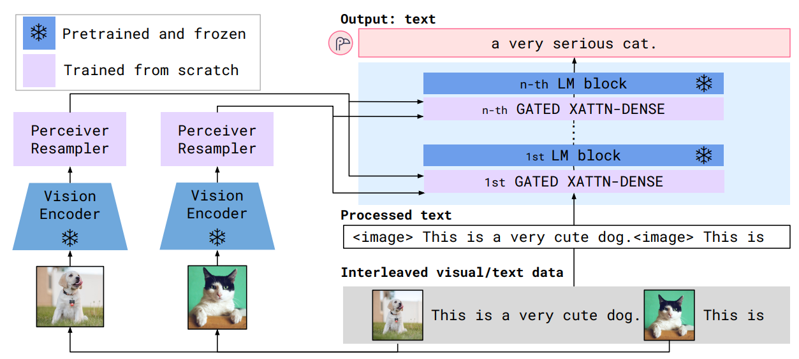
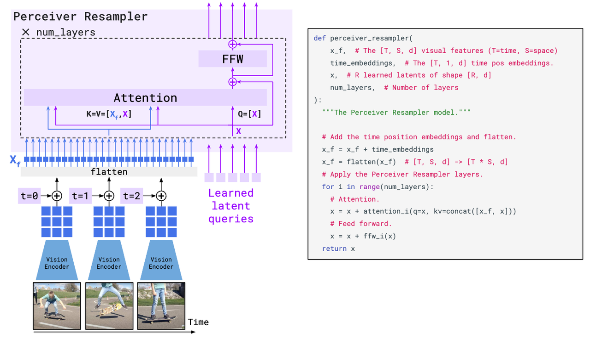
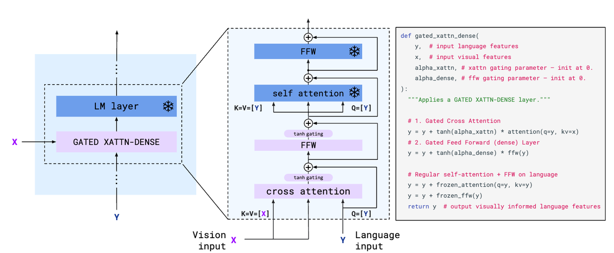
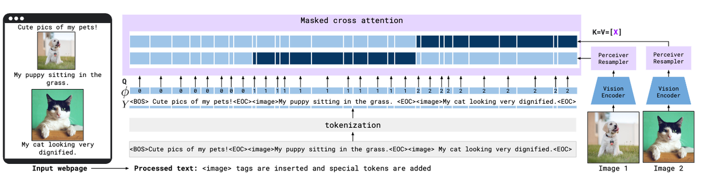
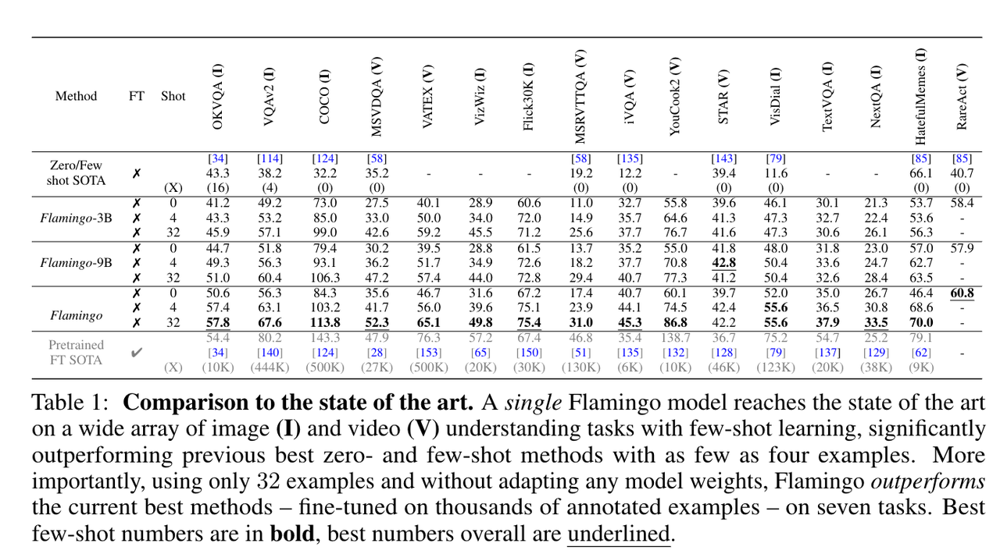
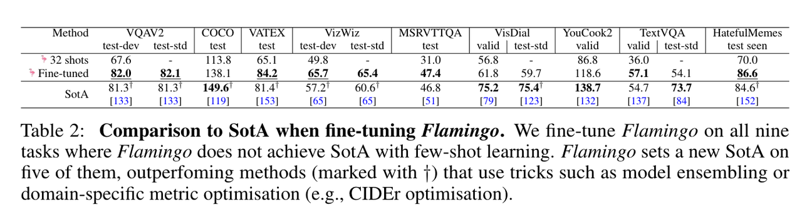
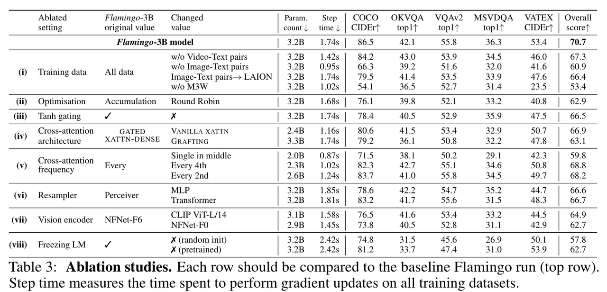
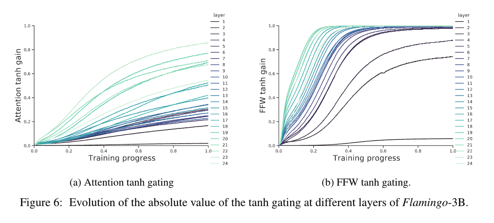

> **论文：Flamingo: a Visual Language Model for Few-Shot Learning**
>
> **论文链接：https://arxiv.org/abs/2204.14198**
>
> **可以参考的博客：https://blog.csdn.net/LoseInVain/article/details/136072993，https://zhuanlan.zhihu.com/p/685233706，https://blog.csdn.net/weixin\_44966641/article/details/136459201，https://deepmind.google/discover/blog/tackling-multiple-tasks-with-a-single-visual-language-model/**
>
> **可以参考的视频：**

# 1. **Flamingo 简介**

> Flamingo 是 DeepMind 于 2022 年提出的视觉语言模型（VLM），主要用于少样本（few-shot）学习任务，能够在仅提供少量标注示例的情况下，完成视觉问答、图文描述、视觉对话等多种图文混合输入任务，并在多个评测上达到新的性能水平
>
> 其架构通过**三项关键设计**实现灵活性：
>
> * **连接强大的预训练纯视觉和纯语言模型**
>
> * **处理任意交错的视觉和文本数据序列**
>
> * **无缝摄入图像或视频输入**
>
> Flamingo 在大规模多模态语料上训练，具备良好的上下文理解与适应能力，少样本条件下的表现甚至超过使用大量任务特定数据微调的模型

> * **背景意义：**&#x4F20;统视觉语言系统常需要大规模监督微调，且每种任务都要重新标注和训练。Flamingo 通&#x8FC7;**“提示中交错图像与文本”**&#x7684;方式，将少量示例直接输入模型（in‑context learning），省去了微调环节。这种灵活性在实际应用中尤其有价值，让非专家用户也可迅速使用模型完成任务&#x20;
>
> * **核心目标：构建能仅用少量标注样本（a handful of annotated examples） 快速适应新任务的模型，解决多模态机器学习的开放挑战**
>
>   * **少样本适应**：希望模型**即插即用，无需每个任务都标注上千张图**
>
>   * **跨模态融合**：将预训练视觉编码器与语言模型结合，处理图文可以任意交错、包括视频输入
>
>   * **保持语言能力**：冻结预训练语言模型，只在其层间插入视觉条件模块，防止模型遗忘原有语言能力

# 2. **Flamingo 方法详解**

Flamingo 是一种**接受交错排列的文本和图像/视频作为输入 Input**，**并输出 Output 自由形式文本的视觉语言模型**。其关键架构组件旨在利用预训练的视觉和语言模型并有效连接它们

> ### **核心组件**
>
> * **Perceiver Resampler**：接收来自Vision Encoder的时空特征（来自图像或视频），输出固定数量的visual tokens

> ### **核心组件**
>
> * **跨注意力层**：新初始化的交叉注意力层交错插入预训练LM层之间，使冻结的LM能够以visual tokens为条件进行next-token预测

> ### **概率建模**
>
> 模型对交错视觉序列𝑥条件下的文本𝑦的似然建模为：
>
> * 其中$$𝑦_ℓ$$是第ℓ个语言token，$$𝑥_{≤ℓ}$$表示$$𝑦_ℓ$$之前的所有图像/视频
>
> * 该设计支持上下文少样本学习（类比GPT-3的文本提示）

## 2.1 **视觉处理与 Perceiver Resampler**

> **Vision Encoder**
>
> * **架构：**&#x51BB;结的NFNet-F6模型
>
> * **预训练目标：**&#x57FA;于图像-文本对的对比损失，类似 CLIP
>
> * **特征处理：**
>
>   * **图像：**&#x8F93;出2D空间特征网格 → 展平为1D序列
>
>   * **视频：**&#x31;FPS采样帧 → 添加temporal embeddings → 3D时空网格 → 1D序列

> **Perceiver Resampler 感知重采样器**
>
> 该模块将**视觉编码器与冻结的语言模型相连**
>
> 接收来自视觉编码器的数量可变的图像或视频特征作为输入，并生成固定数量（64 个）的视觉输出，降低了视觉-文本交叉注意力的计算复杂度。其学习预定义数量的 latent queries，将其输入到 Transformer 中，并与视觉特征进行交叉注意力计算
>
> * **功能：**&#x5C06;可变长度视觉特征压缩为64个固定长度的visual tokens
>
> * **实现方式：**
>
>   * 类似Perceiver和DETR，使用可学习的latent queries
>
>   * 通过Transformer交叉注意力机制处理视觉特征
>
> * **优势：**&#x6D88;融实验表明其性能优于普通Transformer和MLP

> 感知器重采样器模块将视觉编码器输出的可变大小的时空视觉特征网格映射为固定数量的输出 token（图中为 5 个），且这一过程与输入图像的分辨率或输入视频的帧数无关。**该 Transformer 拥有一组经过学习的 latent 向量作为queries，而 keys 和 values 则是时空视觉特征 X\_f 与经过学习的 latent queries X 的拼接**

## 2.2 **基于视觉表示的冻结语言模型条件化**

> ### **文本生成机制**
>
> * **基础：**&#x54;ransformer解码器
>
> * **创新点：**&#x5728;预训练冻结 LM 块之间插入**Gated cross-attention dense layers**
>
>   * **门控机制：**&#x4F7F;用 tanh(𝛼) 缩放新层输出（𝛼初始化为0的可学习参数）
>
>   * 初始化时模型行为与原始LM一致，提升训练稳定性
>
> **在冻结的预训练 LM 原始层之间中交错插入新的GATED XATTN-DENSE层**。这些层从零开始训练，为确保在初始化时，模型能产生与原始语言模型相同的结果，采用了 tanh 门控机制，将新添加层的输出乘以tanh(𝛼)，再将其与来自残差连接的输入表示相加

* **模型规模**

  | 模型名称         | 参数量  | 基础LM            |
  | ------------ | ---- | --------------- |
  | Flamingo-3B  | 1.4B | Chinchilla-1.4B |
  | Flamingo-9B  | 7B   | Chinchilla-7B   |
  | Flamingo-80B | 70B  | Chinchilla-70B  |

> 注：视觉编码器和 Perceiver Resampler 的规模保持固定

## 2.3 **多视觉输入支持：基于注意力掩码的机制**

> ### **图像因果建模**
>
> * 通过掩码文本-图像交叉注意力矩阵实现：
>
>   * 每个文本token仅关注其前最近的图像（而非所有历史图像）
>
>   * 对先前图像的依赖通过LM的自注意力保留

> ### **泛化能力**
>
> * 训练时：每序列最多5张图像
>
> * 推理时：可处理多达32个图像/视频-文本对（shots）
>
> * 消融实验证明该方案优于直接交叉关注所有历史图像

## 2.4 **多模态数据集混合训练**

> **交错输入机制：**&#x6A21;型支持自由交错的图像与文本输入格式：prompt 中可以是图文、视频与文字任意混合，并生成连续文字输出

### **数据集组成**

* **M3W**：4300万网页提取的**交错图文数据**

  * **处理方式：**&#x4F7F;用 vision encoder 和 resampler 处理图片的特征得到 固定长度的 token 序列，在文本中插入`<image>`标签标记图像位置和`<EOC>`标记

  * **采样：**&#x968F;机子序列（L=256 tokens）+ 最多前N=5 张图像。每个 token 只会与前面最近一张图片关联，再之前的会被 mask

  > 训练中随机决定文本关联前图或后图位置，具有数据增强效果

* **配对数据**：

  | 数据集   | 类型      | 规模     |
  | ----- | ------- | ------ |
  | ALIGN | 图像-文本对  | 18亿对   |
  | LTIP  | 长文本-图像对 | 3.12亿对 |
  | VTP   | 视频-文本对  | 2700万对 |

### **训练目标**

最小化加权负对数似然：

## 2.5 **基于少样本上下文学习的任务适应**

> 1. **推理方法**
>
>    * 构建多模态提示： in‑context few‑shot，prompt 中先摆放若干例子（如图像 + 问题 + 回答），再放目标图像与新问题，模型以开放式解码方式生成回答，无需额外微调
>
>    * 评估方式：
>
>      * 开放任务：beam search解码
>
>      * 封闭任务：答案选项的log-likelihood评分
>
> 2. **零样本泛化**
>
>    * 仅使用两个纯文本示例进行提示（无对应图像）

# 3. **Flamingo 实验结果**

| 任务类型          | 具体任务           | 模型表现                                              |
| ------------- | -------------- | ------------------------------------------------- |
| 开放任务          | 视觉问答（根据提示问题回答） | 单个模型通过任务特定示例提示，在少样本学习中达新最先进水平                     |
| Captioning 任务 | 描述场景或事件        | 同上                                                |
| 封闭任务          | 多选视觉问答         | 同上，且性能超过用数千倍（thousands of times more） 任务特定数据微调的模型 |

* **消融实验：**

  * Perceiver Resampler 模块 和 GATED XATTN-DENSE 层 都很有效

  * GATED XATTN-DENSE 层在冻结语言模型中的插入频率（即每隔多少层插入一个新层）：

    * 适当的插入频率能在效率和表达能力之间取得最佳平衡

    * 插入过密会增加计算量但收益边际递减，插入过疏则无法充分利用视觉特征，导致性能下降

# 4. **Flamingo 总结**

> Flamingo 的创新在于：
>
> * 利用预训练 LM 的语言能力与视觉编码器的视觉能力结合，实现少样本适应
>
> * 引入交叉 attention adapter + gated 架构，在不破坏原 LM 功能前提下注入视觉信息
>
> * 利用图文交错训练实现 in-context multimodal few‑shot learning
>
> 这种方法代表了一种更灵活的多模态应用模式：不需要每个任务微调，prompt 就能驱动模型理解新任务。适合对 AI 使用门槛低、任务多样的实际场景

> ### **关键问题**
>
> 1. **Flamingo 的关键架构创新是什么，这些创新解决了多模态学习中的哪些核心问题？**
>    其关键架构创新包括：
>
>    1. 桥接预训练纯视觉和纯语言模型，解决了多模态模型中视觉与语言组件融合不足的问题
>
>    2. 处理任意交错的视觉和文本数据序列，解决了多模态数据格式灵活度低的问题
>
>    3. 无缝摄入图像或视频输入，解决了多模态输入类型兼容性有限的问题。这些创新使模型能灵活处理复杂的多模态数据
>
> 2. **Flamingo 在哪些类型的任务上进行了评估，其少样本学习能力在这些任务中如何体现？**
>    评估任务涵盖三类：
>
>    1. 开放任务（如视觉问答）
>
>    2. captioning 任务（如场景 / 事件描述）
>
>    3. 封闭任务（如多选视觉问答）
>
>    其少样本学习能力体现为：单个模型仅通过任务特定示例提示，就在这些任务中达到新的最先进水平，且性能超过用数千倍任务特定数据微调的模型
>
> 3. **Flamingo 的训练数据有何特点，这对其少样本学习能力有何影响？**
>    训练数据是包含任意交错文本和图像的大规模多模态网络语料。这一特点使其能从丰富的多模态交互中学习通用模式，为在新任务中仅用少量示例快速适应提供了基础，是赋予其上下文少样本学习能力的关键。
