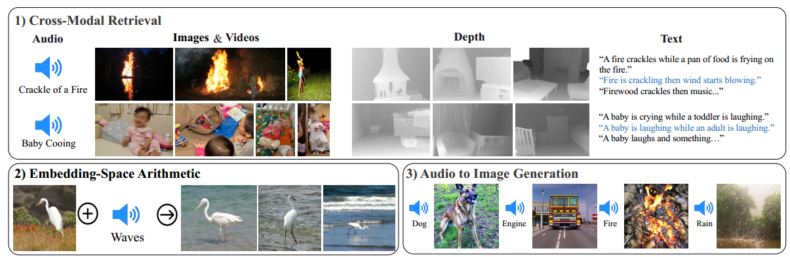
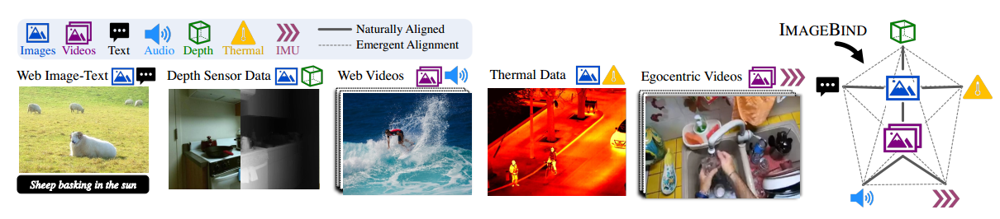
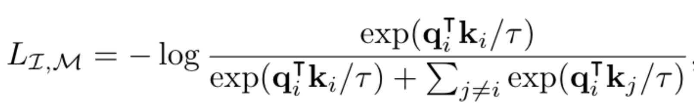

> **论文：IMAGEBIND: One Embedding Space To Bind Them All**
>
> **论文链接：https://arxiv.org/pdf/2305.05665**
>
> **可以参考的博客：https://zhuanlan.zhihu.com/p/629278561，https://zhuanlan.zhihu.com/p/659674342，https://towardsai.net/p/l/from-vision-to-sound-how-metas-imagebind-is-bridging-modalities-in-ai**
>
> **可以参考的视频：https://www.bilibili.com/video/BV1gh4y147oE/?spm\_id\_from=333.337.search-card.all.click**
>
> **GitHub 链接：**

# 1. **ImageBind 简介**

> **ImageBind** 是 Meta 团队于 2023 年推出的一种多模态联合嵌入（embedding）方法，其**目标是在一个共同的向量空间里绑定六种模态——图像、文本、音频、深度图、热图（thermal）、IMU（惯性传感器）数据**。而其核心创新在于：**无需所有模态两两配对数据，只需基于图像的天然配对（image‑paired data）就能把其他模态都“绑定”进来**，从而实现 emergent（涌现的）跨模态检索、组合运算、多模态生成等能力&#x20;

> CLIP 推广了一种基于对齐的（图像，文本）嵌入空间的“零样本”分类任务。这涉及**构建描述数据集中类别的文本描述列表**。输入图像根据其在嵌入空间中与文本描述的相似性进行分类
>
> **为其他模态解锁这种零样本分类需要专门使用配对的文本数据进行训练，例如（音频，文本）或（点云，文本）**。相比之下，**ImageBind 为没有配对文本数据的模态解锁了零样本分类**
>
> * **背景**：传统多模态模型往往需要 m×n 种模态配对数据去训练嵌入空间，比如**图像-文本、文本-音频、图像-深度**等。而这些配对数据收集成本昂贵，数据难以覆盖所有组合
>
> * **核心动机**：**图像作为一种天然载体，能够连接多种模态——图像-文本，图像-音频（视频中），图像-深度（深度传感器），图像‑热图（thermal），视频‑IMU（头戴相机带惯性）等**。ImageBind 利用这些只与图像配对的模态数据对，**将每种模态都对齐到图像 embedding 空间，由此隐式把不同模态之间也连上了桥梁**
>
> > 理论上，只用`(I, M)`每种模态对应图像对，就能通过 contrastive learning 对比学习 把 `M`嵌入空间对齐到图像，再通过图像这个中介，实现模态之间 emergent 对齐

# 2. **ImageBind 方法详解**

## 2.1 **通过图像绑定模态**

> IMAGEBIND 使用模态对`（I,M）` ，其中`I`表示图像，`M`是另一种模态，来学习一个单一的联合嵌入空间。**IMAGEBIND 使用大规模的（图像，文本）配对网络数据集，这些数据集涵盖了广泛的语义概念。然后使用其他模态（音频、深度、热成像和惯性测量单元（IMU））与图像的自然自监督配对**
>
> ### **对齐机制：Image‑paired contrastive Loss**
>
> 考虑具有对齐观测的模态对`（I,M）` ，给定图像`I_i`和其在其他模态中的对应观测`M_i`，我们将它们编码为归一化 embedding：$$q_i = f(I_i)和k_i = g(M_i)$$，其中 $$f, g$$是深度网络，嵌入 embedding 和编码器 encoder 通&#x8FC7;**&#x20;InfoNCE 损失进行优化：**
>
> 其中$$τ$$是控制 softmax 分布平滑度的标量温度， $$j$$表示不相关的观测，也称为“负例”。考虑小批量中的每个样本不为$$i$$的$$j$$为负例。该损失使嵌入$$q_i$$和$$
> k_i$$在联合嵌入空间中更接近，从而对齐`I`和`M`。在实践中，使用对称损失$$L_{I,M} + L_{M,I}$$
>
> **所有模态都对齐到统一 embedding 空间，使得不同模态之间即便没有直接配对，也能通过图像“牵引”实现对齐**

## 2.2 **未见模态对的对齐**

> IMAGEBIND 使用与图像配对的模态，即形式为`（I,M）`的对，将每个模态`M`的嵌入与图像的嵌入对齐。IMAGEBIND 观察到嵌入空间中的一种涌现行为，**即使只使用`（I,M_1）`和`（I,M_2）`对进行训练，也能对齐两个模态对`（M_1,M_2）`。这种行为使 IMAGEBIND 能够执行各种零样本和跨模态检索任务，而无需为它们进行训练**

## 2.3 **实现细节**

> * **编码器架构**：**所有模态采用统一 Transformer 架构**
>
>   * **图像/视频**：Vision Transformer（ViT），视频被转为两帧图像处理
>
>   * **音频**：2秒音频 → 128梅尔频谱图（mel‑spectrogram） → ViT编码
>
>   * **热成像/深度**：单通道图像 → ViT编码，深度来自 SUN RGB‑D，热图来自 LLVIP 等
>
>   * **IMU**：5秒IMU信号 → 1D卷积 → Transformer编码，IMU 与视频配对来自 Ego4D 数据集

| 模态类型  | 具体内容      |
| ----- | --------- |
| 视觉相关  | 图像、深度、热成像 |
| 文本相关  | 文本        |
| 音频相关  | 音频        |
| 传感器数据 | IMU 数据    |

* **损失函数**：对称InfoNCE损失$$L_{I,M} + L_{M,I}$$

* **预训练初始化**：部分编码器（如图像、文本）使用 CLIP 或 OpenCLIP 预训练模型。借助其强大的 embedding 表达能力，也把其他模态映射到 CLIP embedding 空间，从而继承 CLIP zero‑shot 能力向多模态扩展

## 2.4 **训练与推理流程**

> ### 训练流程
>
> * **收集多类 image‑paired 数据源：**
>
>   * **图像+文本**（如网络抓取图文对）
>
>   * **视频+音频**（web 视频、Audioset）
>
>   * **图像+深度**（SUN RGB‑D），**图像+thermal**（LLVIP），**视频+IMU**（Ego4D）
>
> * 对于每种模态，搭配图像对齐训练，各模态间不需直接两两配对，只借助图像即可绑定
>
> * 使用**对比学习 InfoNCE 损失逐步对齐嵌入**

> ### **推理能力与 emergent 应用**
>
> * **跨模态检索**：比如用音频检索图像或文本，用热图检索图片。即便从未看到这些模态两两配对，也能检索成功
>
> * **嵌入空间算术**：向量相加/减可以实现组合语义和生成，比如 image embedding + audio embedding → 可用 DALL·E‑2 decoder 生成图像&#x20;
>
> * **零样本识别与少样本**：在 Modal‑specific benchmarks 上，ImageBind 在 emergent zero‑shot 识别任务上超过专用监督模型，few‑shot 情况下也表现出色

## 2.5 **数据集信息**

| 模态对            | 数据集                | 说明                 |
| -------------- | ------------------ | ------------------ |
| 图像‑文本          | Web image‑text     | 大规模网络图文对           |
| 视频‑音频          | Audioset, Ego4D 视频 | 视频带音频自然配对          |
| 图像‑深度          | SUN RGB‑D          | 深度图与 RGB 图像对       |
| 图像‑热图（thermal） | LLVIP              | 热红外图像与可见光对         |
| 视频‑IMU         | Ego4D              | 视频帧与头戴 IMU 传感器序列配对 |

其中某些较小的数据集如 SUN RGB‑D、LLVIP 被在训练中重复（如 replicate ×50）以提升样本量稳定训练

# 3. **ImageBind 总结**

> * **优点**：
>
>   * 极大降低数据需求，仅需图像作为中介，不要求全面两两配对
>
>   * emergent 跨模态对齐能力强，zero-shot / few-shot 表现优异
>
>   * 可复用 CLIP 等强图像-文本模型，迁移效率高
>
> * **局限**：
>
>   * 各模态编码器结构统一，但不同模态数据质量与分布差异可能导致对齐不均
>
>   * 很依赖图像作为中心，部分模态（如 IMU）可能偏弱
>
>   * emergent 特性虽有惊喜，但对极端任务或精细语义组合仍需评估
>
> 总的来看，ImageBind 提供了一种 **以图像为纽带构建多模态共享空间的高效方法**，开启了 emergent 多模态能力的新思路，并且已经成为多个后续工作的基础：
>
> * **ImageBind‑LLM**：在 ImageBind 基础上做多模态指令调优，将 ImageBind 编码结果注入 LLaMA 等语言模型，实现多模态 instruction prompting，支持音频、3D、视频输入指令响应等&#x20;
>
> * **LanguageBind**：以语言模态为中心桥梁，对齐更多模态（如红外、深度、视频文本等），构建 15 边形多模态联合空间，增强跨模态检索和分类性能，在音频等任务上显著优于 ImageBind

> ### **关键问题**
>
> 1. **ImageBind 在训练数据需求上有何独特之处？**
>    ImageBind 无需所有模态间的配对数据，**仅需图像配对数据即可实现六种模态**（图像、文本、音频、深度、热成像、IMU 数据）的联合嵌入绑定，这是其在训练数据需求上的核心创新
>
> 2. **ImageBind 支持哪些模态？这些模态的覆盖体现了其什么特点？**
>    ImageBind **支持6 种模态，分别是图像、文本、音频、深度、热成像、IMU 数据**。这些模态涵盖了视觉（图像、深度、热成像）、语言（文本）、声音（音频）及传感器数据（IMU），体现了其强大的跨模态融合能力，能处理多种类型的信息
>
> 3. **ImageBind 在性能上有哪些关键优势？**
>    ImageBind 的性能优势主要体现在：
>
>    1. 在新兴零样本识别任务上达到新的最先进水平（SOTA），超越专家监督模型
>
>    2. 同时，其少样本识别结果优于先前工作，且能作为新方式评估视觉模型在视觉及非视觉任务上的表现
