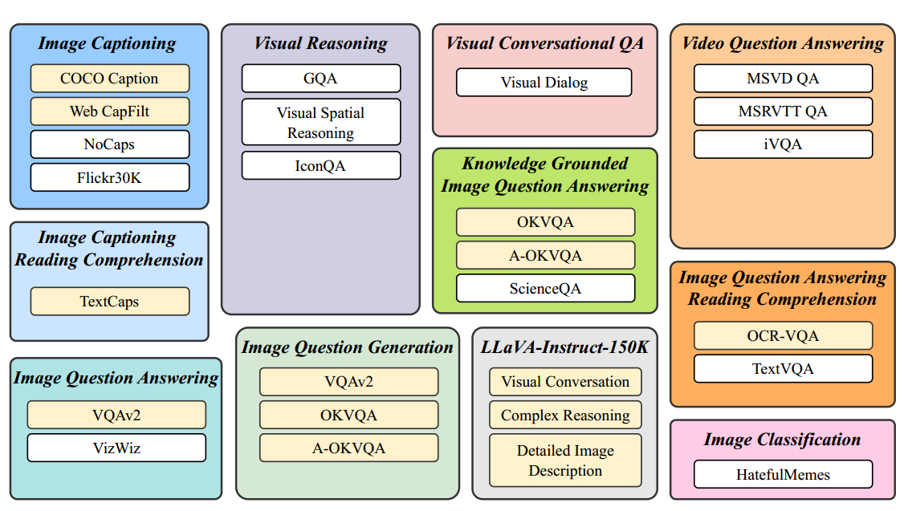
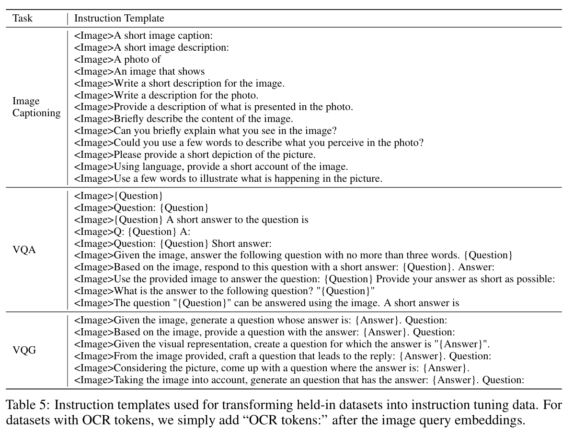
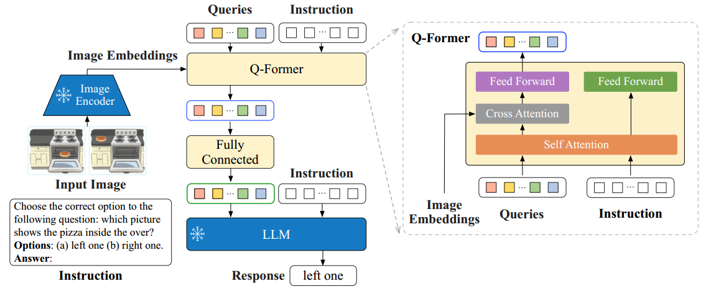

> **论文：InstructBLIP: Towards General-purpose Vision-Language Models with Instruction Tuning**
>
> **论文链接：https://arxiv.org/pdf/2305.06500**
>
> **可以参考的博客：https://zhuanlan.zhihu.com/p/667257688，https://blog.csdn.net/weixin\_43405535/article/details/136331775，https://ritvik19.medium.com/papers-explained-156-instructblip-c3cf3291a823，https://zhuanlan.zhihu.com/p/638103950**
>
> **可以参考的视频：https://www.bilibili.com/video/BV15vsueME7J/?spm\_id\_from=333.337.search-card.all.click，https://www.bilibili.com/video/BV1NJ4m1V7Nh/?spm\_id\_from=333.337.search-card.all.click**

# 1. **InstructBLIP 概述**

> InstructBLIP 是由 Salesforce 团队基于 BLIP-2 提出的一种**视觉-语言多模态指令微调框架**，通过**视觉-语言指令微调（Vision‑Language Instruction Tuning）**，统一自然语言接口来解决多种视觉-语言任务（多任务训练），使模型具备在图像任务上零样本泛化能力。相比 BLIP-2，其在 13 个 held‑out 数据集上实现了全方位 SOTA 性能，甚至超过更大的 Flamingo-80B（平均相对提升 24.8%），并在 ScienceQA 图像问题上达到 90.7% 的准确率 。模型部分基于 FlanT5 和 Vicuna 构建并开源

## 1.1 **InstructBLIP 的背景和挑战**

> 视觉-语言任务因**视觉输入的多样性（如不同领域图像、视频）**，对通用模型的泛化能力提出更高要求。现有方法存在局限：
>
> * **多任务学习（无指令）：**&#x867D;统一输入输出格式，但对未见过的任务泛化差
>
> * **基于图像描述的训练：**&#x6570;据有限，难以支持超出视觉描述的复杂任务（如推理、问答）
>
> 大语言模型因 Instruction Tuning 在单模态 NLP 中取得成功，而视觉-语言模型在预训练后缺乏指令敏感性和下游泛化能力 。为此，InstructBLIP 通过视觉-语言指令微调，实现模型对多样任务的通用解决能力，填补了这一空白：
>
> * **任务多样性**：打通**图像 captioning、视觉 QA、图像推理、对话等 11 类任务**
>
> * **泛化能力**：通过**统一指令形式训练**，实现 unseen 数据集上的零样本强推广&#x20;
>
> * **机制创新**：引入指令感知的 Q‑Former，使提取的**视觉特征与指令对齐**

## 1.2 **InstructBLIP 的核心点**

> * **多任务数据集的构建：**&#x49;nstructBLIP **把26个数据集转换为指令微调格式**，分为 11 个任务类别，其中 13 个作为训练集（held-in），13 个作为零样本评估集（held-out），并保留 4 个任务类别用于任务级零样本评估
>
> * **指令感知的Q-Former：**&#x6307;令感知的视觉特征提取，通过**指令驱动 Q-Former 提取任务相关视觉特征，即将 instruction 同步输入到 Q-Former&#x20;**&#x4E2D;来提取图像编码器中的指令感知视觉特征
>
> * **平衡采样策略：**&#x6309;数据集大小平方根比例采样，避免过拟合 / 欠拟合

# 2. **InstructBLIP 方法细节**

## 2.1 **InstructBLIP 的任务与数据集**

> * **目标**：确保指令微调数据的多样性，同时考虑其可访问性（可获取性）
>
> * **数据集**：收集了26个公开的视觉-语言数据集，涵盖**11个任务类别，**&#x5177;体如下图所示
>
>   * 图像描述生成 、带阅读理解的图像描述生成、视觉推理、图像问答、基于知识的图像问答、带阅读理解的图像问答、图像问题生成、视频问答、视觉对话问答、图像分类以及 LLaVA-Instruct-150K的任务

> * **指令模板**：InstructBLI&#x50;**&#x20;**&#x4E3A;**每个任务精心设计10到15个自然语言指令模板**，用于构建指令微调数据。对于倾向于短 response 的数据集，使用 `short`等术语以减少模型过拟合 短输出的风险
>
>   > 这部分，InstructBLI&#x50;**&#x20;**&#x662F;通过在指令模板中添加很多类似 `short` 的指令，确保模型输出短回答是真的在指令引导下输出的，而不是直接去拟合一些短回答数据集的 answer
>
> * **LLaVA-Instruct-150K：**&#x65E0;需额外指令模板。其本身就天然具备指令格式的结构，因此没有添加额外的指令模板
>
> 具体的模板如下图所示，可以分为三类模板：
>
> 1. **图像描述（Image Captioning），共 13 个模板：**
>
>    * `<Image>Can you briefly explain what you see in the image?`
>
>    * 以上面这个例子说明数据集如何转为指令微调形式，对于分类数据集，图中的物体类别就是 answer，然后image 与上面的 instruction 组成了完整的 question
>
> 2. **视觉问答（VQA），共 10 个模板：**
>
>    * `<Image>Given the image, answer the following question with no more than three words. {Question}`
>
>    * 给定图像以及一个问题，让大模型遵循指令回答问题
>
> 3. **视觉问题生成（VQG），共6个模板：**
>
>    * `<Image>From the image provided, craft a question that leads to the reply: {Answer}. Question:`
>
>    * 根据提供的图像以及给定的回答，让大模型遵循指令生成相应的问题

> 上图注释所示，图中有文本信息的，会将 OCR的tokens加到图像embedding之后，融合进指令中

## 2.2 **InstructBLIP 的训练与评估**

> * **训练测试集划分：**&#x31;3 个作为训练集（held-in，上面第一张图中黄色），13 个作为零样本评估集（held-out，上面第一张图中白色），并保留 4 个任务类别用于任务级零样本评估
>
>   具体来说，这种划分方式的核心目的是：
>
>   * **训练层面：**&#x31;3 个 held-in 数据集的训练数据为模型提供了多样化的任务示例，支撑指令微调过程，帮助模型学习如何响应不同类型的视觉 - 语言指令
>
>   * **评估层面：**&#x68;eld-in 数据集的验证集 / 测试集用于评估模型在训练过程中见过的任务类型上的表现，而 13 个 held-out 数据集则作为零样本评估的关键，用于检验模型对未在训练中接触过的数据集（但可能属于同类任务）的泛化能力，从而更全面地衡量模型的指令遵循和任务适配效果
>
> * **Held-out 评估类型**：
>
>   1. 训练期间未暴露给模型的数据集，但其所属任务在 held-in 数据集中存在
>
>   2. 任务和数据均未见的 held-out 数据集（如视觉推理、视频问答、视觉对话问答、图像分类）
>
>   针对第一类评估，由&#x4E8E;**&#x20;held-in 与 held-out 数据集之间存在数据分布偏移，其处理并非易事**。对于第二类，排除了若干任务，包括视觉推理、视频问答、视觉对话问答以及图像分类
>
> * **数据污染避免**：确保评估数据不出现在保留内训练集中
>
> * **训练方法**：混合所有 **held-in&#x20;**&#x8BAD;练集，均匀采样指令模板，使用标准语言建模损失进行训练。对于涉及场景文本的数据集，添加OCR令牌作为补充信息

## 2.3 **InstructBLIP 指令感知的视觉特征提取**

### 2.3.1 模型架构

> * **问题**：现有零样本图像到文本生成方法（如BLIP-2）采用**指令无关的视觉特征提取方式，这导致无论任务如何，都会向大型语言模型（LLM）输入一组固定的视觉表征，视觉表征是不包含指令信息的**，对于同一输入图像，但是任务指令差距很大的情况不够灵活。相比之下，**具有指令感知能力的视觉模型能够适应多任务指令，并生成最有助于当前任务的视觉表征**
>
> * **解决方案**：InstructBLIP 引入**指令感知的 Q-Former 模块，将指令文本 token 作为额外输入**，通过**自注意力层与查询嵌入交互，提取任务相关的图像特征**

> * **模型架构**：如上图所示，**Q-Former从冻结的图像编码器中提取指令感知的视觉特征，并将其作为软提示（soft prompt）输入冻结的LLM**
>
>   > 值得注意的是，在图&#x4E2D;**，instruction 同时输入了 Q-Former 和 LLM，分别影响视觉特征提取和文本生成**
>
>   * 输入的图片经过 Image Encoder 得到 Image Embedding，输入到 Q-Former 中
>
>   * 对于 Q-Former 来说，其输入有三部分，**可学习的一组 K个 Queries embedding 和 Instruction** 通过**自注意力**部分进行交互，然后 **Image Embedding&#x20;**&#x901A;过**交叉注意力**与自注意力模块的输出进行交互融合特征，最后经过 FFN 输出 融合了 instruction 信息的视觉编码。**Learnable queries 能根据指令调节关注图像区域，实现任务相关的视觉信息提取**
>
>   * Q-Former 输出的视觉编码再次经过 FFN 投影后，作为 soft prompt 结合 instruction 输入 LLM 获取 response

> * **预训练与微调**：与 BLIP-2 相似，Q-Former 分**两阶段预训练**（视觉-语言表示学习和文本生成的软提示适配），随后通过**指令微调微调**。其中，使用图像-标题数据进行预训练
>
>   1. **第一阶段预训练：**&#x5728;**冻结图像编码器**的情况下对 Q-Former 进行预训练，以实现视觉-语言表征学习，训练目标与 BLIP-2 一致，包括**图像文本对比损失、图像文本匹配损失以及语言模型损失（ITC、ITM和LM）**
>
>   2. **第二阶段预训练：**&#x5C06; Q-Former 的输出适配为软视觉提示（soft vision propmt），用于在**冻结的大型语言模型（LLM）**&#x4E0A;进行文本生成，即生成 image caption文本，训练目标为语言模型损失
>
>   3. **指令微调：**&#x5927;型语言模型接收来自 Q-Former 的视觉编码和任务指令作为输入，在之前收集制作的指令数据集上进行指令遵循微调

### 2.3.2 训练策略

> ### **训练策略-平衡采样**
>
> * **问题**：训练数据集数量多且规模差异大，均匀混合可能导致模型过拟合小数据集或欠拟合大数据集
>
> * **解决方案**：按数据集大小的平方根比例采样，并对某些数据集权重进行手动调整（如降低A-OKVQA权重，增加OKVQA权重）
>
>   $$p_d = \sqrt{S_d} / \sum \sqrt{S_i}$$
>
> * **效果**：平衡采样策略提升了 held-in 评估和 held-out 泛化的整体性能

### 2.3.3 推理方法

> 给定图像与自然语言指令，模型通过图像编码器 → (Q‑Former+指令) → LLM，自动生成图像相关答案或说明
>
> * **生成方法**：
>
>   1. **直接生成**：用于图像字幕生成和开放式VQA任务
>
>   2. **词汇排名**：用于分类和多选VQA任务，限制生成词汇为候选列表，选择对数似然最高的候选作为最终预测
>
> * **应用场景**：ScienceQA、IconQA、A-OKVQA（多选）、HatefulMemes、Visual Dialog、MSVD、MSRVTT等数据集
>
> * **二分类扩展**：将正负标签扩展为更广泛的词汇集（如正类：yes、true；负类：no、false）
>
> * **视频问答任务：**&#x6BCF;个视频采用 4 帧均匀采样的画面。每一帧分别由图像编码器和 Q-Former 处理，提取出的视觉特征经拼接后输入到 LLM 中

### 2.3.4 实现细节

> * **架构**：
>
>   * **图像编码器**：ViT-g/14
>
>   * **LLM变体**：FlanT5XL（3B）、FlanT5-XXL（11B）、Vicuna-7B、Vicuna-13B
>
>   * **训练初始化**：从预训练的BLIP-2检查点初始化，仅微调Q-Former参数，Vision Encoder和LLM冻结
>
> * **训练与超参数**：
>
>   * **工具**：LAVIS库
>
>   * **训练步骤**：最大60K步，每3K步验证一次性能
>
>   * **批量大小**：3B模型（192）、7B模型（128）、11B/13B模型（64）
>
>   * **优化器**：AdamW（β1=0.9，β2=0.999，权重衰减=0.05）
>
>   * **学习率**：初始1,000步线性预热（10⁻⁸ → 10⁻⁵），后续余弦衰减（最小学习率=0）
>
> * **硬件**：16个Nvidia A100（40G）GPU，训练时间<1.5天

# 3. **InstructBLIP 实验结果**

## 3.1 零样本性能

* 相较 BLIP-2，InstructBLIP（FlanT5XL）在 held-out 数据集上平均相对提升 15.0%

* 超过更大模型 Flamingo-80B，在 6 个共享数据集上平均相对提升 24.8%

* 在未训练过的任务类别（如视频 QA）上表现优异，MSRVTT-QA 相对提升 47.1%

## 3.2 消融研究

| 模型配置                   | Held-in 平均 | GQA  | ScienceQA | IconQA |
| ---------------------- | ---------- | ---- | --------- | ------ |
| InstructBLIP（FlanT5XL） | 94.1       | 48.4 | 70.4      | 50.0   |
| 无指令感知特征                | 89.8       | 45.9 | 63.4      | 45.8   |
| 无平衡采样                  | 92.6       | 46.8 | 66.0      | 49.9   |

## 3.3 微调性能

InstructBLIP 作为初始化模型，在下游任务微调中表现优于 BLIP-2，如：

* ScienceQA（图像上下文）达 90.7% 准确率（SOTA）

* OCR-VQA、A-OKVQA 刷新 SOTA

* 训练参数从 1.2B 降至 188M，效率显著提升

**与其他方法对比：**

* 指令微调 vs 多任务学习：指令微调在 held-out 数据集上表现远超多任务学习

* 与 GPT-4、LLaVA 等对比：InstructBLIP 输出更贴合视觉细节，推理更连贯，且能自适应调整响应长度（如对 “介绍画作” 的回答更准确，对 “异常点” 的判断更具体）

# 4. **InstructBLIP 代码**

官方代码：https://github.com/dxli94/InstructBLIP-demo/blob/main/lavis/models/blip2\_models/blip2\_vicuna\_instruct.py

* `Blip2VicunaInstruct`初始化

* `forward`计算loss

* `generate`生成部分，也就是推理部分

# 5. **InstructBLIP 总结**

> * **创新性**：将 instruction tuning 引入视觉-语言模型，并通过指令感知 Q‑Former 建立更精准的视觉任务特征提取机制
>
> * **强泛化性**：在大量 unseen 任务上零样本取得 SOTA，且下游微调能进一步提升表现
>
> * **衍生模型**：
>
>   * MiniGPT‑4、LLaVA 等纷纷采用 instruction‑aware 特征桥接机制
>
>   * BLIVA 在此基础上优化 OCR 图文识别，提升 OCR-VQA 表现
>
> * **局限性：** InstructBLIP 在 hallucination（幻想）问题上仍有约 30% 误描述

> ### **关键问题**
>
> 1. InstructBLIP 在技术上的**核心创新**是什么？这些创新如何解决现有视觉-语言模型的局限？
>    核心创新包括：
>
>    * **指令感知的视觉特征提取：**&#x51;-Former 同时接收图像特征和文本指令，提取与任务相关的视觉特征，解决了传统模型（如 BLIP-2）特征提取与指令无关的问题
>
>    * **平衡采样策略：**&#x6309;数据集大小平方根比例采样，避免小数据集过拟合和大数据集欠拟合，解决了多数据集混合训练时的学习进度不一致问题。这些创新使模型能更好适配多样指令和任务，提升零样本泛化能力
>
> 2. InstructBLIP 在性能上相较现有模型（如 BLIP-2、Flamingo）有哪些优势？具体体现在哪些任务中？
>    优势体现在**零样本泛化和微调性能两方面：**
>
>    * 零样本评估：相较 BLIP-2 FlanT5XL，平均相对提升 15.0%；超过 Flamingo-80B（80B 参数），在 6 个共享数据集上平均相对提升 24.8%，尤其在视频 QA（如 MSRVTT-QA）上提升 47.1%
>
>    * 微调性能：在 ScienceQA（图像上下文）达 90.7% 准确率，OCR-VQA、A-OKVQA 等任务上刷新 SOTA，且训练参数更少（188M vs 1.2B），效率更高
>
> 3. InstructBLIP 的开源和数据集设计对相关研究领域有何意义？
>
>    * **开源价值：**&#x63D0;供基于 FlanT5 和 Vicuna 的模型，降低了通用视觉-语言模型的使用门槛，便于后续研究和应用扩展
>
>    * **数据集设计：**&#x5C06; 26 个数据集标准化为指令格式并划分训练 / 评估集，为视觉 - 语言指令微调提供了统一的基准，有助于后续方法的对比和改进
>
>    * **推动领域发展：**&#x9A8C;证了视觉-语言指令微调的有效性，为构建更通用的多模态模型提供了思路

