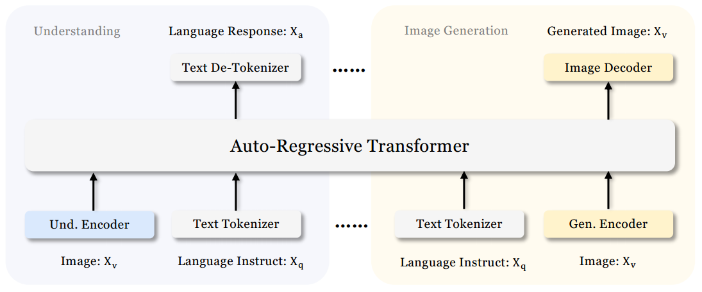
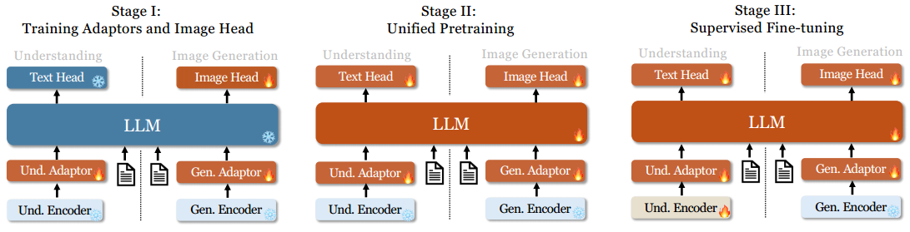
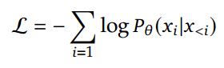
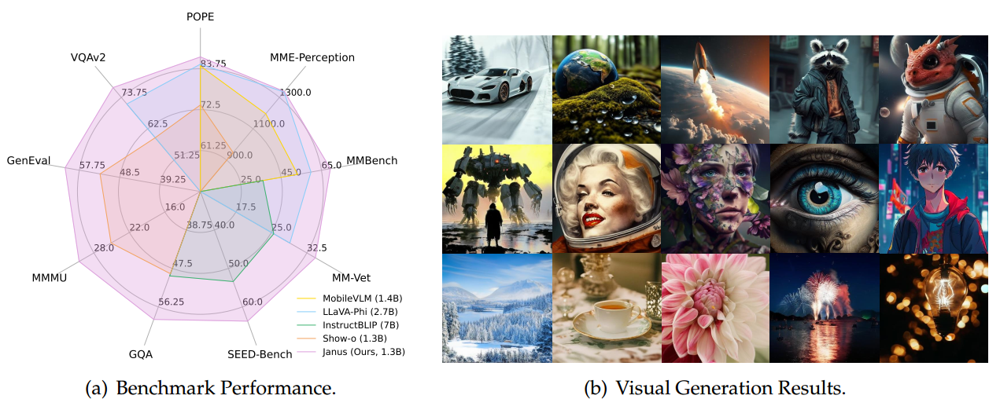
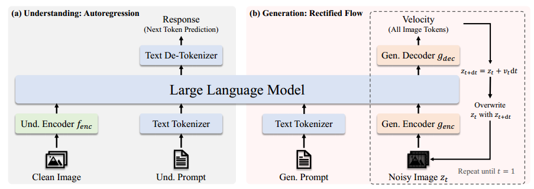
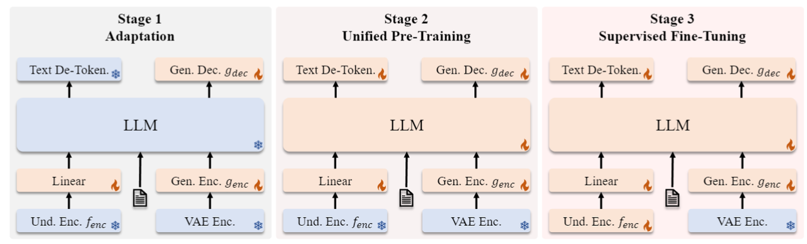
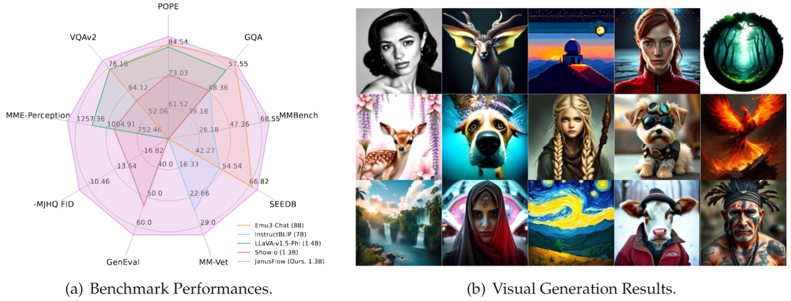
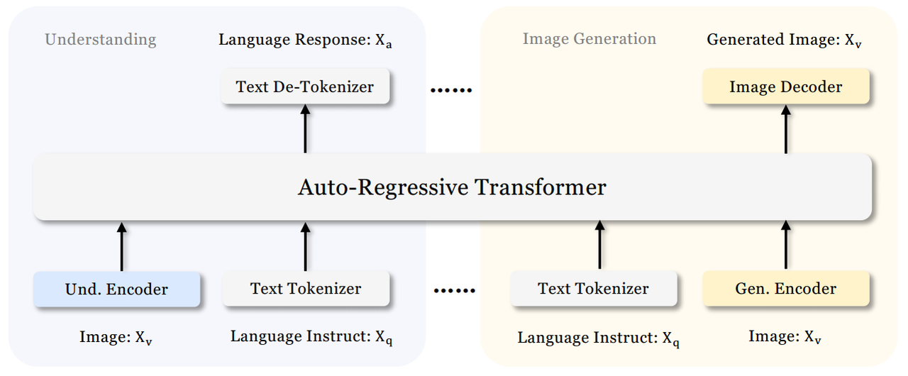

* [ ] 优化排版和内容

### Janus

论文名称：Janus: Decoupling Visual Encoding for Unified Multimodal Understanding and Generation

论文链接: https://arxiv.org/abs/2410.13848

GitHub:https://github.com/deepseek-ai/Janus

#### 架构

Janus针对以下三种任务采用独立的encoding方法将原始输入转换为特征，然后通过统一的autoregressive transformer进行处理： &#x20;

* Pure text understanding (纯文本理解) &#x20;

* Multimodal understanding (多模态理解) &#x20;

* Visual generation (视觉生成) &#x20;

##### 输入特征编码方法

**1.** **文本理解任务** &#x20;

* 使用LLM内置的tokenizer将文本转换为离散的IDs &#x20;

* 获取每个ID对应的feature representations &#x20;

*注：此过程直接利用LLM原生文本处理能力* &#x20;

**2. 多模态理解任务** &#x20;

1. **视觉特征提取**： &#x20;

   * 采用SigLIP encoder从图像中提取高维语义特征 &#x20;

   * 将2-D网格状特征展平为1-D序列 &#x20;

2. **特征空间对齐**： &#x20;

   * 通过understanding adaptor将image features映射到LLM的输入空间 &#x20;

**3. 视觉生成任务** &#x20;

1. **图像离散化**： &#x20;

   * 使用VQ tokenizer将图像转换为离散IDs &#x20;

2. **特征映射**： &#x20;

   * 将flatten后的1-D ID序列通过generation adaptor处理 &#x20;

   * 将codebook embeddings映射到LLM输入空间 &#x20;

##### 特征融合与预测

**1. 多模态特征序列构建** &#x20;

* 将上述不同任务产生的feature sequences进行concatenate &#x20;

* 形成统一的多模态特征序列输入LLM &#x20;

**2. 预测头配置** &#x20;

| 任务类型      | Prediction Head选择       |
| --------- | ----------------------- |
| 纯文本/多模态理解 | 使用LLM内置的prediction head |
| 视觉生成      | 随机初始化的prediction head   |

**3. 自回归框架特性** &#x20;

* 整个模型采用autoregressive框架 &#x20;

* 无需特殊设计的attention masks &#x20;

*注：统一处理文本和视觉token的生成流程* &#x20;

##### 关键组件说明

* **Understanding Adaptor**：桥接SigLIP特征与LLM输入空间 &#x20;

* **Generation Adaptor**：连接VQ tokenizer输出与LLM输入 &#x20;

* **Visual Tokens**：通过VQ tokenizer生成的离散图像表示 &#x20;

#### 训练流程

Janus的训练分为三个阶段，具体细节如下：

##### **Stage I: Adaptors和Image Head训练**

* 目标：在embedding space建立视觉与语言元素的概念联系

* 能力培养：

  * 使LLM能理解图像中的实体

  * 获得初步的visual generation能力

* 参数更新策略：

  * 冻结vision encoders和LLM

  * 仅更新understanding adaptor、generation adaptor和image head的可训练参数

##### **Stage II: 统一预训练**

* 目标：通过多模态语料库使Janus同时学习多模态理解和生成

* 训练数据：

  * 纯文本数据

  * 多模态理解数据&#x20;

  * 视觉生成数据

* 两阶段训练策略（受Pixart 启发）：

  1. 使用ImageNet-1k进行基础visual generation训练（学习像素依赖关系）

  2. 使用通用text-to-image数据增强开放域视觉生成能力

* 参数更新：解冻LLM参数

##### **Stage III: 监督微调**

* 目标：增强指令跟随和对话能力

* 训练策略：

  * 冻结generation encoder

  * 对system和user prompts进行masking

  * 仅监督answer部分的输出

* 数据混合策略：

  * 纯文本对话数据

  * 多模态理解数据

  * 视觉生成数据

* 特点：保持多任务统一模型架构（不针对特定任务单独微调）

#### 训练目标

Janus作为autoregressive模型，采用标准交叉熵损失：

* 𝑃(·|·)：由模型参数𝜃建模的条件概率

* 损失计算方式：

  * 文本/多模态理解任务：计算text sequence的loss

  * 视觉生成任务：仅计算image sequence的loss

* 设计特点：未对不同任务设置差异化loss权重

#### 推理过程

**基础机制**：next-token prediction

**文本/多模态理解**：

* 标准做法：从预测分布中sequential sampling tokens

**图像生成**：

* 采用classifier-free guidance (CFG)

* logit计算公式：

  $$𝑙_𝑔=𝑙_𝑢+𝑠(𝑙_𝑐−𝑙_𝑢)$$

  * $$𝑙_𝑐$$：conditional logit

  * $$𝑙_𝑢$$：unconditional logit &#x20;

  * 𝑠：guidance scale（默认值=5）

#### 性能

### JanusFlow

论文名称：JanusFlow: Harmonizing Autoregression and Rectified Flow for Unified Multimodal Understanding and Generation

论文链接: https://arxiv.org/abs/2411.07975

GitHub: https://github.com/deepseek-ai/Janus

#### Rectified Flow&#x20;

##### 基本概念

Rectified Flow 是一种用于建模数据分布 $$\pi_{1}$$ 的方法，通过学习一个 ordinary differential equation (ODE) 来实现。给定一个包含 $$d$$ 维连续数据点 $$x = (x_1, \cdots, x_d)$$ 的数据集$$\mathcal{D}$$，其核心思想是构建从简单分布 $$\pi_{0}$$（如标准高斯噪声）到目标数据分布的转换。

##### ODE 定义

Rectified Flow 的 ODE 定义为：

$$\frac{\rm{d} z_t}{\rm{d} t} = v_{\theta_{NN}}(z_t, t), z_0 \sim \pi_{0} $$

其中：

* $$z_t$$ 是时间 $$t \in [0,1]$$ 的状态变量

* $$v_{\theta_{NN}}$$ 是由神经网络参数化的**velocity field**

* $$\theta_{NN}$$ 是神经网络的参数

* $$\pi_{0}$$ 通常是 $$\mathcal{N}(0, I)$$ 高斯分布

##### 训练目标

通过最小化以下损失函数来训练 velocity network：

$$\min_{\theta} {\mathbb{E}}_{t\sim {\rm{P}}(t), z_0 \sim \pi_0, x\sim \pi_1} \left [ \left|\left| v_{\theta_{NN}}(z_t, t) - (x - z_0) \right|\right|^2 \right ]$$

其中：

$$z_t = t x + (1-t) z_0 $$

这里：

* $$\rm{P}(t)$$ 是时间 $$t \in [0,1]$$ 上的分布

* $$x - z_0$$ 表示从噪声到数据点的线性路径方向

##### 理论性质

当满足以下条件时：

1. 神经网络 capacity 足够大

2. 目标函数被完美最小化

最优 velocity field $$v_{\theta^*_{NN}}$$ 可以将基础分布 $$\pi_0$$ 映射到真实数据分布 $$\pi_1$$。具体来说：

$$z_1 = \int_{0}^1 v_{\theta^*_{NN}}(z_t, t) {\rm{d}} t $$

其中 $$z_0 \sim \pi_0$$ 的分布将遵循 $$\pi_1$$。

#### 多模态理解与生成的统一框架

##### 框架概述

该工作提出了一个统一框架，可同时处理vision understanding和image generation任务。以下说明如何在单一LLM架构中实现这两种功能。

##### 多模态理解 (Multimodal Understanding)

**输入处理流程**

* **文本处理**：

  * 通过tokenizer将文本转换为discrete tokens

  * 每个token被映射为维度$$D_{emb}$$的embedding

* **图像处理**：

  * 使用image encoder $$f_{enc}$$将图像$$x_{im}$$编码为特征图，形状为$$H_{im} \times W_{im} \times D_{enc}$$

  * 特征图被展平并通过线性层投影为$$H_{im} W_{im} \times D_{emb}$$的embedding序列

* **序列构建**：

  * 在图像embedding前后添加特殊token：`|BOI|`和`|EOI|`

  * 文本和图像embeddings拼接形成LLM的输入序列

**输出预测**：LLM以自回归(autoregressive)方式基于输入序列预测下一个token。

##### 图像生成 (Image Generation)

1. **潜在空间初始化**：

   * 采样高斯噪声$$z_0$$，形状为$$H_{latent} \times W_{latent} \times D_{latent}$$

   * 通过generation encoder $$g_{enc}$$转换为$$H_{gen} W_{gen} \times D_{emb}$$的embedding序列

2. **时间步处理**：

   * 拼接时间步$$t$$的embedding（初始$$t=0$$）

   * 使用causal attention机制（实验表明无需复杂mask策略）

3) **ODE求解**：

   $$z_{t + \rm{d} t} = z_t + v(z_t, t) \rm{d} t $$

   其中：

   * $$\rm{d} t$$为用户定义的步长

   * $$v(z_t, t)$$由LLM输出经$$g_{dec}$$转换得到

4) **CFG增强**：

   $$v(z_t, t) = w v(z_t, t~|~x^{con}) + (1-w) v(z_t, t~|~\varnothing) $$

   * $$w \geq 1$$控制classifier-free guidance强度

   * 增大$$w$$可提升semantic alignment

5. **最终解码**：

   * 迭代至$$z_1$$后通过VAE decoder生成图像

   * 序列开头添加`|BOI|`标记

##### &#x20;编码器解耦设计 (Decoupling Encoders)

**传统方法的局限**：先前工作使用相同encoder处理两种任务，但存在以下问题：

* 在VAE latent space共享U-Net或线性encoder

* 使用MAGVIT-v2等统一tokenizer

* 实验证明这种设计是次优的

**该方案改进**：采用分离的encoder设计：

* **理解任务**：

  * 使用预训练SigLIP-Large-Patch/16作为$$f_{enc}$$

  * 提取语义连续特征

* **生成任务**：

  * 使用ConvNeXt blocks构建$$g_{enc}$$/$$g_{dec}$$

  * 包含long skip connection

  * 从头开始训练

#### 训练方案

模型训练分为三个阶段：

##### Stage 1: 随机初始化组件适配

* **训练目标**：仅训练随机初始化的组件

  * generation encoder ($$g_{enc}$$)

  * generation decoder ($$g_{dec}$$)

  * 线性变换层

* **作用**：使新模块与预训练LLM和SigLIP encoder协同工作

* **特点**：本质上是新组件的初始化阶段

##### Stage 2: 统一预训练

* **训练范围**：除visual encoder外的全部模型

* **数据组成**：

  1. 多模态理解数据（初期占比较高）

  2. 图像生成数据（后期逐步增加）

  3) 纯文本数据

* **设计依据**：

  * 参考LLaVA和DeepSeekVL方案

  * 扩散模型收敛需要更多生成数据（参考ADM, DiT）

##### Stage 3: 监督微调(SFT)

* **训练数据**：

  * 对话数据

  * 任务导向对话

  * 高质量文本条件图像生成样本

* **关键操作**：

  * 解冻SigLIP encoder参数

  * 参考DeepSeekVL和Janus方案

#### 训练目标

##### 数据格式

所有数据表示为$$x = (x^{con}, x^{res})$$，其中：

* $$x^{con}$$：任务条件（如生成任务的text prompts）

* $$x^{res}$$：响应结果

* 序列长度：$$\ell = \ell_{con} + \ell_{res}$$

##### 自回归目标（多模态理解）

$$\mathcal{L}_{AR}(\theta) = - \mathbb{E}_{x \sim \mathcal{D}_{und}} \left[ \sum_{i = \ell_{con}}^{\ell-1} \log {\rm{P}}_\theta \left(x_{i+1} | x_{1}, \dots, x_{i} \right) \right ] $$

* 仅计算$$x^{res}$$部分的token损失

* 基于最大似然原则

##### Rectified Flow目标（图像生成）

$$\mathcal{L}_{RF}(\theta) = {\mathbb{E}}_{x \sim \mathcal{D}_{gen}, t\sim {\rm{P}}(t), z_0 \sim \mathcal{N}(0, I)} \left [ \left|\left| v_\theta(z_t, t~|~x^{con}) - (x^{res} - z_0) \right|\right|^2 \right ] $$

其中：

$$z_t = t x^{res} + (1-t) z_0 $$

* 时间分布$$\rm{P}(t)$$采用logit-normal分布（参考SD3）

* 10%概率随机丢弃text prompts以实现CFG训练

##### 表征对齐正则化

$$\mathcal{L}_{REPA}(\theta, \phi) = - \mathbb{E}_{x \sim \mathcal{D}_{gen}} \left [ \text{sim} \left (\text{\texttt{stop\_grad}}(f_{enc}(x^{res})), h_\phi(q_\theta(z_t)) \right) \right ] $$

关键设计：

1. 对齐$$f_{enc}$$与LLM中间特征

2. $$h_\phi$$为可训练MLP，投影到$$D_{enc}$$维度

3) 计算reshape后特征的余弦相似度均值

4) 确保$$H_{gen}=H_{im}$$且$$W_{gen}=W_{im}$$

5. 梯度不反向传播至understanding encoder

##### 目标函数总结

* 多模态理解：$$\mathcal{L}_{AR}$$

* 图像生成：$$\mathcal{L}_{RF} + \mathcal{L}_{REPA}$$

* 所有阶段均应用对应目标函数

#### 性能

### JanusPro

论文名称：Janus-Pro: Unified Multimodal Understanding and Generation with Data and Model Scaling

论文链接: https://github.com/deepseek-ai/Janus/blob/main/janus\_pro\_tech\_report.pdf

GitHub: https://github.com/deepseek-ai/Janus

#### 1. Janus-Pro 架构概述

Janus-Pro的架构与Janus相同，其核心设计原则是解耦视觉编码（decouple visual encoding），分别服务于多模态理解（multimodal understanding）和生成任务（generation）。具体流程如下： &#x20;

##### 1.1 输入特征处理流程

* **原始输入转换**：采用独立的编码方法将原始输入转换为特征，再由统一的autoregressive transformer处理。 &#x20;

* **多模态理解路径**： &#x20;

  * 使用SigLIP encoder从图像中提取高维语义特征。 &#x20;

  * 将2D网格状特征展平为1D序列。 &#x20;

  * 通过understanding adaptor将图像特征映射到LLM的输入空间。 &#x20;

* **视觉生成路径**： &#x20;

  * 使用VQ tokenizer将图像转换为离散IDs。 &#x20;

  * 将ID序列展平为1D后，通过generation adaptor将每个ID对应的codebook embeddings映射到LLM输入空间。 &#x20;

##### 1.2 多模态特征融合与预测

* **特征拼接**：将上述两条路径生成的特征序列拼接，形成统一的多模态特征序列，输入LLM处理。 &#x20;

* **预测头设计**：  除LLM内置的prediction head外，视觉生成任务中额外使用随机初始化的prediction head进行图像预测。 &#x20;

* **整体框架**：整个模型遵循autoregressive框架。 &#x20;

#### 2. Janus旧版训练流程分析

Janus先前版本采用三阶段训练策略，但存在效率问题：

##### 2.1 原始三阶段训练架构

* **Stage I（适配器训练阶段）**：

  * 主要训练understanding adaptor、generation adaptor和image prediction head

  * 其他组件（包括LLM主体）参数保持冻结

* **Stage II（统一预训练阶段）**：

  * 解锁除understanding encoder和generation encoder外的所有参数

  * 采用PixArt的两段式文本-图像训练：

    * 第一阶段：使用ImageNet数据（占66.67%训练步数）

      * 以图像类别名作为prompt

      * 重点建模像素依赖关系（pixel dependence）

    * 第二阶段：常规文本-图像数据训练

* **Stage III（监督微调阶段）**：

  * 在Stage II基础上解锁understanding encoder参数

  * 原始数据比例：多模态数据 : 纯文本数据 : 文本-图像数据 = 7:3:10

##### 2.2 已发现问题

* 两段式训练策略被证明是次优方案

* 计算效率显著低下（computational inefficiency）

* ImageNet类别名训练与后续密集描述（dense descriptions）训练存在gap

#### 3. 训练策略优化方案

针对上述问题进行两项关键改进：

##### 3.1 Stage I的延长训练

* 增加ImageNet数据集训练步数

* 重要发现：

  * 即使LLM参数固定

  * 模型仍能有效建模pixel dependence

  * 仅凭类别名即可生成合理图像

##### 3.2 Stage II的聚焦训练

* 移除ImageNet数据

* 直接使用常规文本-图像数据

* 训练目标：基于密集描述（dense descriptions）生成图像

* 优势：

  * 提升数据利用效率

  * 改善整体训练效率

##### 2.3 Stage III的数据比例调整

* 新数据配比：

  * 多模态数据 : 纯文本数据 : 文本-图像数据 = 5:1:4 &#x20;

* 调整效果：

  * 保持视觉生成能力的同时

  * 提升多模态理解性能（multimodal understanding）

| 优化点       | 原始方案     | 改进方案     | 优势                     |
| --------- | -------- | -------- | ---------------------- |
| Stage I   | 短训练      | 延长训练     | 更好建立pixel dependence基础 |
| Stage II  | 两段式训练    | 直接密集描述训练 | 减少33%计算浪费              |
| Stage III | 7:3:10比例 | 5:1:4比例  | 平衡生成与理解能力              |

#### 4. 数据规模扩展 (Data Scaling)

Janus在multimodal understanding和visual generation两方面进行了训练数据的扩展升级。

##### 4.1 多模态理解数据增强 (Multimodal Understanding)

* **Stage II预训练数据**：

  * 参考DeepSeekVL2新增约9000万样本

  * 包含：

    * 图像描述数据集（如YFCC）

    * 表格/图表/文档理解数据（如Docmatix）

* **Stage III监督微调数据**：

  * 新增DeepSeek-VL2中的特色数据集：

    * MEME理解数据

    * 中文对话数据集

    * 对话体验增强专用数据

  * 效果：

    * 显著扩展模型多任务处理能力

    * 大幅提升对话体验

##### 4.2 视觉生成数据优化 (Visual Generation)

* **旧版问题**：

  * 真实世界数据质量差、噪声大

  * 导致text-to-image生成不稳定

  * 输出结果美学质量较低

* **新版改进**：

  * 新增约7200万合成美学数据样本

  * 统一预训练阶段数据比例：真实数据 : 合成数据 = 1:1

  * 合成数据prompt来源：公开数据集

* **实验效果**：

  * 模型在合成数据上收敛更快

  * 生成结果：

    * 稳定性显著提升

    * 美学质量大幅改善

#### 5. 模型规模扩展 (Model Scaling)

##### 5.1 模型参数升级

* 旧版基础：使用1.5B LLM验证visual encoding decoupling有效性

* 新版扩展：升级至7B LLM

##### 5.2 扩展效果

* 训练表现：

  * multimodal understanding损失收敛速度加快

  * visual generation训练效率提升

* 重要发现：

  * 验证了该架构的强扩展性(scalability)

  * 大模型展现更优的multi-task学习能力

| 维度     | 旧版Janus  | Janus-Pro | 提升效果        |
| ------ | -------- | --------- | ----------- |
| 理解数据量  | 基准量      | +9000万样本  | 多任务处理能力↑30% |
| 生成数据构成 | 100%真实数据 | 1:1真实合成比  | 美学评分↑2.5个点  |
| LLM规模  | 1.5B参数   | 7B参数      | 收敛速度加快40%   |
