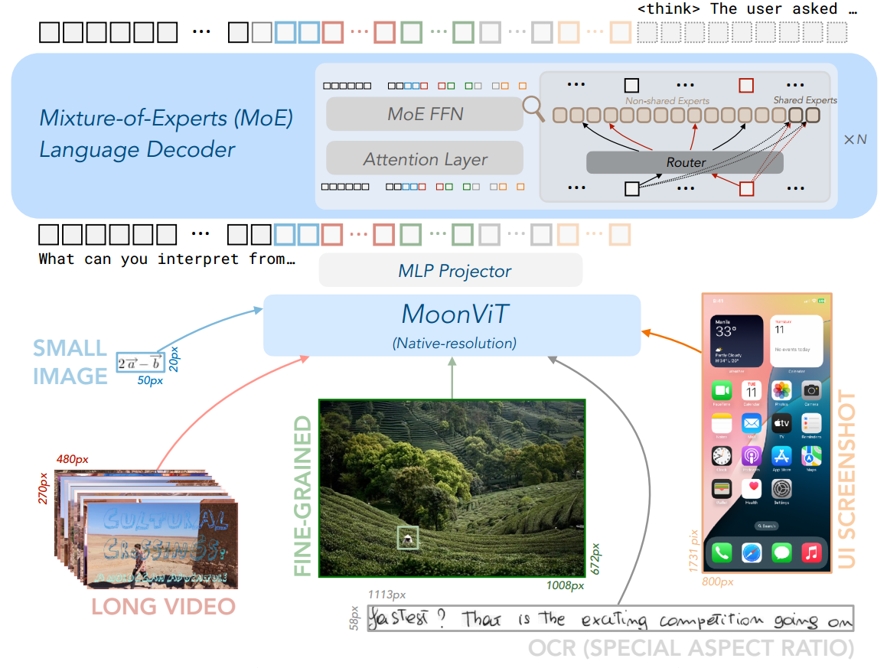
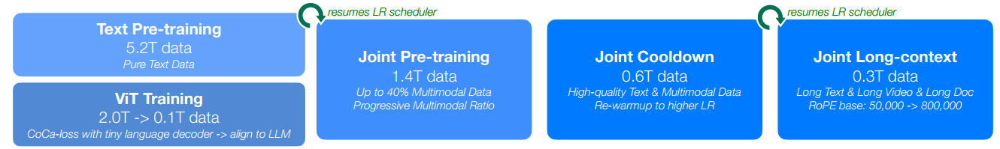
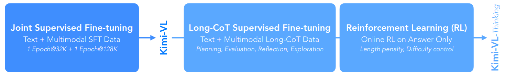
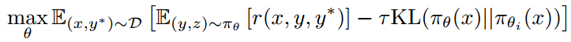
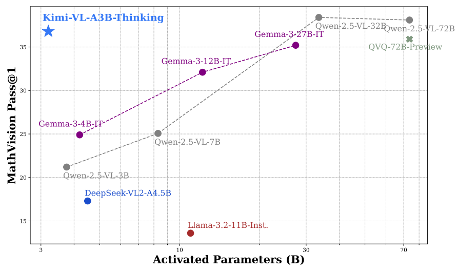
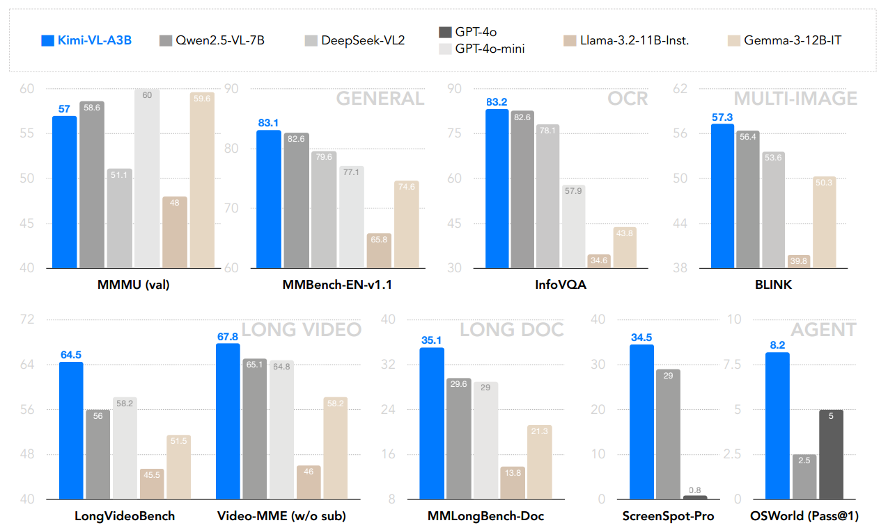

* [ ] 优化排版和内容

论文名称：Kimi-VL Technical Report

论文链接：https://arxiv.org/abs/2504.07491

#### Model Architecture

Kimi-VL的架构包含三个主要部分：

1. **MoonViT: Native-resolution Vision Encoder**

* 设计特点：直接处理不同分辨率的原始图像，无需像LLaVA-OneVision那样进行复杂的子图像分割和拼接操作

* 关键技术：采用NaViT的packing方法：

  * 将图像分割成patches

  * 展平后按顺序拼接成1D序列

* 优势：

  * 与language model共享核心计算算子（如variable-length sequence attention mechanism）

  * 支持FlashAttention优化

  * 保持不同分辨率图像的训练吞吐量

- **MLP projector**

3. **MoE language model**

#### Muon Optimizer

Kimi-VL使用改进版的Muon optimizer进行模型优化，主要改进包括：

1. **核心改进**（相比原始Muon optimizer）：

   * 增加weight decay正则项

   * 精细调整per-parameter更新尺度

2. **分布式实现**：

   * 基于ZeRO-1优化策略开发

   * 优势：

     * 保持算法数学特性

     * 实现最优内存效率

     * 降低通信开销

3) **应用范围**：

   * 全程用于优化所有模块参数：

     * vision encoder (MoonViT)

     * MLP projector &#x20;

     * MoE language model

#### Pre-Training Stages

Kimi-VL的预训练包含4个阶段（共消耗4.4T tokens）：

1. 独立的ViT训练阶段

2. 联合预训练阶段

3) 联合冷却阶段

4) 长上下文激活阶段

##### 1. 独立的ViT训练阶段（ViT Training Stages）

* **训练数据**：image-text pairs包含多种文本目标：

  * image alt texts

  * synthetic captions &#x20;

  * grounding bboxes

  * OCR texts

* **损失函数**：采用CoCa式混合损失

  * SigLIP contrastive loss (Lsiglip)

  * caption生成cross-entropy loss (Lcaption)

  * 最终损失：L = Lsiglip + 2\*Lcaption

* **初始化策略**：

  * image/text encoder：SigLIP SO-400M预训练权重

  * text decoder：tiny decoder-only LLM初始化

* **关键发现**：

  * 增加OCR数据时caption loss出现涌现现象

  * 后续用0.1T tokens进行MoonViT与MoE language model对齐

##### 1. 独立的ViT训练阶段（Joint Pre-training Stage）

* **数据混合**：

  * 纯文本数据（与初始LLM同分布）

  * 多模态数据

* **训练策略**：

  * 初始仅用language data

  * 逐步增加multimodal data比例

  * 总消耗1.4T tokens

##### 2. 联合冷却阶段（Joint Cooldown Stage）

* **语言数据优化**：

  * 合成数据显著提升math/code/knowledge能力

  * 采用混合数据策略：

    * 精选预训练子集

    * 合成QA对（通过proprietary LLM生成）

* **多模态数据优化**：

  * 学术视觉数据改写为QA对

  * 保持低比例QA数据防止过拟合

##### 3. 长上下文激活阶段（Joint Long-context Activation Stage）

* **上下文扩展**：

  * 从8K→128K分两阶段扩展（每次4倍）

  * 调整RoPE逆频率：50,000→800,000

* **数据构成**：

  * 25%长上下文数据（含long text/long video等）

  * 75%短上下文数据（保持原有能力）

* **验证方式**：

  * needle-in-a-haystack测试

  * 在128K范围内均保持高召回率

#### Post-Training Stages

##### Joint Supervised Fine-tuning (SFT)

通过instruction-based fine-tuning优化基础模型，主要技术要点：

* **数据格式**：采用ChatML格式保持架构一致性

* **训练目标**：仅对answers和special tokens计算loss，mask系统/用户prompts

* **训练策略**：

  * 两阶段训练：32K上下文（1 epoch）→128K上下文（1 epoch）

  * 动态学习率：

    * 第一阶段：$$2×10^{−5} → 2×10^{−6}$$

    * 第二阶段：重新warmup到$$1×10^{−5}$$后衰减至$$1×10^{−6}$$

* **数据打包**：多个训练样本pack到单个sequence提升效率

##### Long-CoT Supervised Fine-Tuning

构建高质量long-CoT预热数据集：

* **认知过程建模**：

  * planning（步骤规划）

  * evaluation（中间评估）

  * reflection（反思优化）

  * exploration（多方案探索）

* **轻量级SFT**：使模型内化多模态推理策略

* **效果**：生成更详细且逻辑连贯的响应

##### Reinforcement Learning

采用改进的online policy mirror descent算法，关键公式：

公式解析：

1. **第一项**：期望奖励最大化，其中：

   * $$r(x,y,y^*)∈\{0,1\}$$是基于ground truth $$y^*$$的二元奖励

2. **第二项**：相对熵正则项：

   * $$τ>0$$控制正则化强度

   * $$KL(π_θ||π_{θ_i})$$约束策略更新幅度

**训练优化技术**：

1. **长度惩罚**：抑制过长的推理链（overthinking问题）

2. **采样策略**：

   * curriculum sampling（基于难度标签）

   * prioritized sampling（基于实例成功率）

**推理特性**：

* 保持标准自回归生成

* 内生性学习能力：

  * error detection（错误检测）

  * backtracking（回溯修正）

  * iterative refinement（迭代优化）

#### Performance

