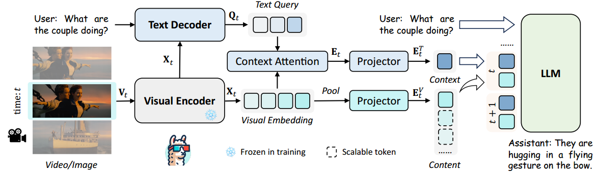
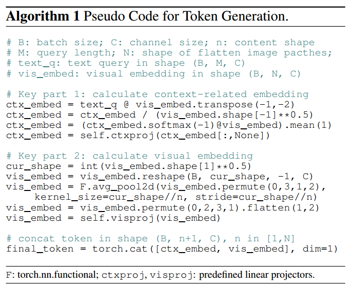
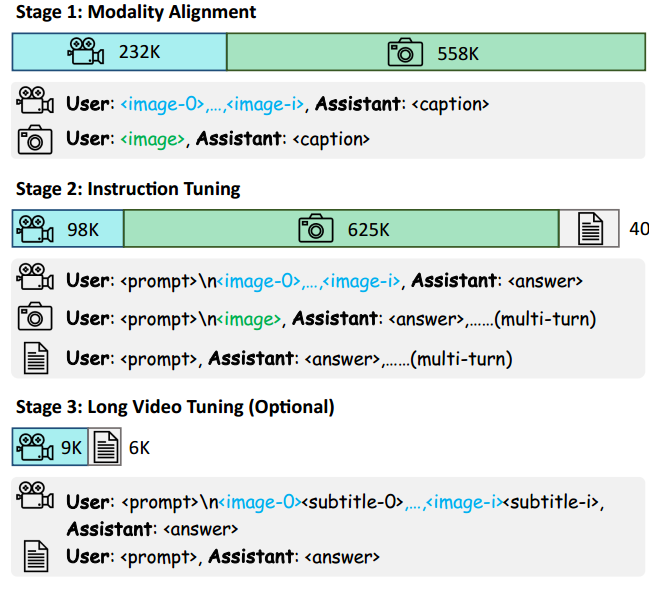

* [ ] 优化排版和内容

论文名称：LLaMA-VID: An Image is Worth 2 Tokens in Large Language Models

论文链接：https://arxiv.org/abs/2311.17043

#### 1. 框架概述

* **Encoder 和 Decoder**：LLaMA-VID 使用 Vision encoder 生成 visual embedding，Text decoder 生成 text-guided features。

* **Token 生成策略**：通过定制的 token 生成策略生成 context token 和 content token。

* **Instruction Tuning**：通过 instruction tuning 释放 LLMs 在图像和视频任务中的潜力。

#### 2. Encoder 和 Decoder

* **输入**：视频帧 $$V_t \in \mathbb{R}^{H \times W \times 3}$$。

* **Visual Encoder**：基于 transformer 的 vision encoder 生成 visual embedding $$X_t \in \mathbb{R}^{N \times C}$$，其中 $$N = \frac{H}{p} \times \frac{W}{p}$$，$$C$$ 为 embedding 通道数，patch size $$p$$ 通常为 14。

* **Text-Guided Query**：用户指令生成 text-guided query $$Q_t \in \mathbb{R}^{M \times C}$$，$$M$$ 为 query 数量。

* **Cross-Modality Interaction**：在 text decoder 中进行跨模态交互，可使用 BERT 或 QFormer。

#### 3. Token 生成

* **Context Attention**：生成 context-related embedding $$E_t \in \mathbb{R}^{1 \times C}$$：

  $$E_t = \text{Mean}(\text{Softmax}(Q_t \times X_t^T) \times X_t)$$

  * **Softmax** 沿 $$N$$ 维度计算。

  * **Mean** 沿 $$M$$ 维度计算。

* **Context Token**：通过线性投影将 $$E_t$$ 转换为 context token $$E^T_t \in \mathbb{R}^{1 \times C}$$。

* **Content Token**：根据计算约束使用 adaptive pooling 生成 content token $$E^V_t \in \mathbb{R}^{n \times C}$$，$$n \in [1, N]$$。

* **Token 拼接**：将 $$E^T_t$$ 和 $$E^V_t$$ 拼接表示时间 $$t$$ 的帧。

#### 4. 训练策略

####

##### 4.1 Modality Alignment

* **数据集**：790K 高质量 image- 和 video-caption 对。

* **优化目标**：优化 context attention 和 projectors，冻结预训练的 visual encoder 和 text decoder。

##### 4.2 Instruction Tuning

* **数据集**：包含 ShareGPT 的 40K 文本对话、625K 视觉 QA 对、98K 视频 QA 对。

* **优化目标**：优化所有模块，除了冻结的 visual encoder。

##### 4.3 Long Video Tuning

* **数据集**：15K 长视频 QA 对，包括 9K 电影场景对话和 6K LongLoRA 数据。

* **优化目标**：通过拼接 visual tokens 和 subtitle tokens 进行 instruction tuning，支持 64K tokens 和超过 3 小时的视频输入。

