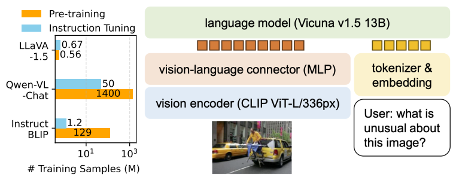
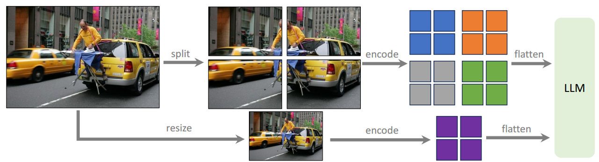
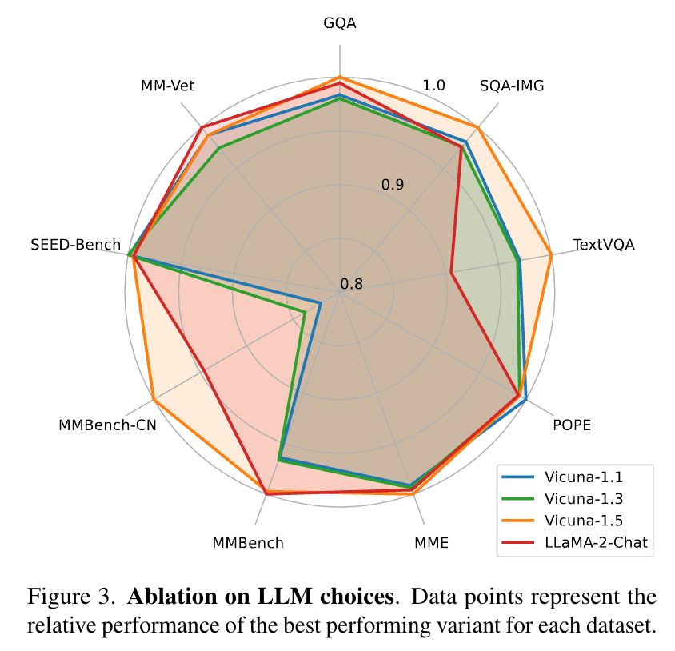
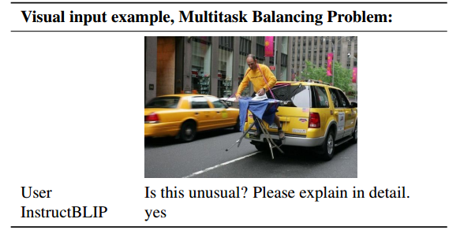
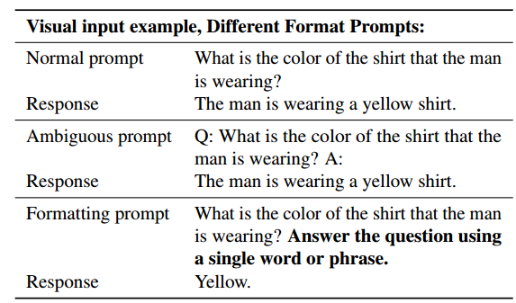
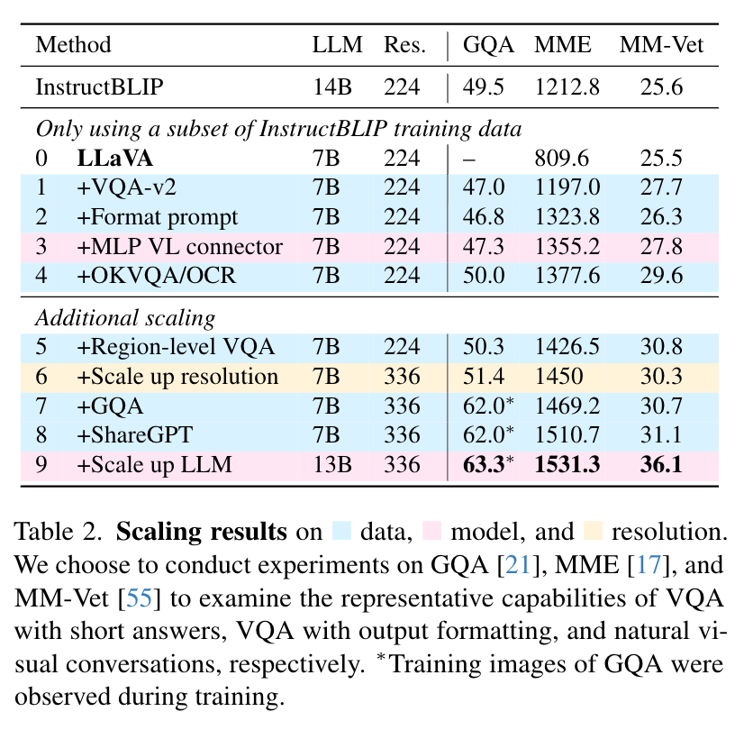

> **论文：Improved Baselines with Visual Instruction Tuning**
>
> **论文链接：https://arxiv.org/pdf/2310.03744**
>
> **可以参考的博客：https://zhuanlan.zhihu.com/p/696402890，https://blog.csdn.net/sherlockMa/article/details/143186119，https://zhuanlan.zhihu.com/p/28971454220**
>
> **可以参考的视频：https://www.bilibili.com/video/BV12PznYuExg/?spm\_id\_from=333.337.search-card.all.click**

# 1. **LLaVA-1.5 简介**

> **LLaVA-1.5** 是在 LLaVA 框架基础上的一次重要升级。**LLaVA-1.5** 采用**更高分辨率的 CLIP ViT-L/336px 作为图像编码器，并在图像特征后加入轻量级 MLP 连接器，替代原有的线性投影，进一步增强了图文对齐能力。**&#x6A21;型训练仅使用 120 万条公开图文指令数据，在单机 8×A100 环境下约 24 小时即可完成，展现出很高的数据利用效率。
>
> 在性能方面，LLaVA-1.5 在 11 个公开基准上均取得领先表现，成为视觉问答、多模态推理等任务中的常用参考模型。其改进不仅提升了多任务泛化能力，还在高分辨率输入、响应格式提示等方面做了探索，部分缓解了模型幻觉问题，为多模态模型的进一步研究提供了可复现的坚实基础。

## 1.1 **LLaVA 的背景**

> * 大型多模态模型（LMM）是通用助手的核心组件，视觉指令调优是其关键技术，现有模型（如 LLaVA、InstructBLIP）在自然对话与学术任务（如 VQA）上存在性能不平衡
>
> * 多数系统计算-数据成本高，难以平价复现
>
> * LLaVA-1.5 证明：只要**放大视觉分辨率 + 精简投影 + 精选学术任务数据**，无需修改核心架构，也能显著抬高性能门槛

## 1.2 **LLaVA 的核心贡献**

| 更强视觉编码器  | ViT-L/336px 提供更细粒度空间线索；冻结参数，无需大幅计算开销                                |
| -------- | ------------------------------------------------------------------- |
| 极简投影层    | 4 层 MLP 替换原全连接，维度对齐至 Vicuna 13B 隐向量；参数 < 10 M                       |
| 学术任务风格数据 | 在原 158 K GPT-4 合成指令外，引入约 1 M VQA/ScienceQA 等问答对，并统一回答格式，使模型善于长答案与推理 |
| 高效训练范式   | 完整 13B 版一天内即可复现；论文公开代码、数据脚本，降低再现门槛                                  |

# 2. **LLaVA-1.5 方法详解**

## 2.1 **模型架构**

> **整体架构**
> `image → CLIP ViT-L/336 → MLP 投影 →  Token → Vicuna-13B`。模型完全复用 Vicuna 的自回归推理，无需额外跨模态注意力
>
> **指令格式**
>
> 单轮 / 多轮 都可

```plain&#x20;text
USER: <image> 这张图里有什么问题？  
ASSISTANT: 首先描述……然后解释……  
```



### 2.1.1 **Vision Encoder**



> 采用 CLIP-ViT-L/336px，支持更高分辨率输入（336×336），提升细节感知能力
>
> **动态高分辨率策略：**
>
> 将图像分割为 vision encoder 原始训练分辨率的小图像块并独立编码。在获得单个图像块的特征图后，将它们合并为目标分辨率的单个大特征图，并输入到 LLM 中。为了向 LLM 提供全局上下文并减少 split-encode-flatten 操作的伪影，将下采样图像的特征与合并后的特征图连接起来。此结果模型称为 LLaVA-1.5-HD

### 2.1.2 **Vision-Language Connector**

> 受自监督学习中从线性投影改为 MLP 的性能提升启发，Llava-1.5 发现**使用两层 MLP 改进视觉-语言连接器的表示能力，相比原始线性投影可以提升 LLaVA 的多模态能力，增强跨模态表示能力，提升多模态理解性能**

### 2.1.3 **LLM**

> 主要对比了两类 LLM 家族：**基于 LLaMA 的模型（**&#x56;icuna-v1.1、Vicuna-v1.3）和**基于 LLaMA2 的模型**（Vicuna-v1.5、LLaMA-2-Chat）：
>
> * Vicuna-v1.5 在所有基准测试中整体表现最佳，且 LLaMA2 系列模型（Vicuna-v1.5、LLaMA-2-Chat）普遍优于 LLaMA1 系列（Vicuna-v1.1、Vicuna-v1.3），表明**基础语言模型的性能对多模态能力有显著影响**
>
> * **不同任务对 LLM 的能力需求存在差异：**
>
>   * LLaMA-2-Chat 与 Vicuna-v1.5 在 MMBench（英文基准）上性能接近，但前者在 MMBench-CN 上表现较差，可能因 LLaMA-2-Chat 的微调数据以英文为主，缺乏多语言数据（而 ShareGPT 包含更多多语言样本）
>
>   * TextVQA（需处理 OCR 噪声）任务中，Vicuna 系列表现更优，可能因 ShareGPT 数据包含更多真实场景的噪声样本，与 OCR 任务的噪声特性更匹配




## 2.2 **数据策略**

### 2.2.1 **响应格式提示**

> InstructBLIP等方法无法平衡简短和长形式的 VQA，主要是由于以下原因：
>
> 1. **模糊的提示**：例如“Q: {问题} A: {答案}”这样的提示没有明确指示所需的输出格式，可能导致 LLM 行为上过拟合于简短答案
>
> 2. **未微调 LLM**：InstructBLIP 仅微调 Qformer 进行指令微调，这加剧了第一个问题。它要求 Qformer 的视觉输出 token 控制 LLM 输出的长度，但 Qformer 可能缺乏适当执行此操作的能力，因为其容量远小于 LLaMA 等 LLM




> 为了使 LLaVA 更好地处理简短答案并解决 InstructBLIP 的问题，Llava-1.5 提出**使用单一响应格式提示，明确指示输出格式**
>
> 例如，在需要简短答案时，在 VQA 问题末尾附加：“用一个词或短语回答问题”
>
> 当 LLM 使用此类提示进行微调时，LLaVA 能够根据用户指令适当调整输出格式，并从而进一步扩展到各种数据源



### 2.2.2 **数据扩展**

> **学术任务导向数据：**&#x5F15;入 VQAv2、GQA、OKVQA、OCRVQA 等数据集，覆盖 VQA、OCR、区域级感知任务
>
> * VQA、OCR 和区域级感知
>
> * &#x20;InstructBLIP 中使用的四个数据集：开放知识 VQA（OKVQA、A-OKVQA）和 OCR（OCRVQA、TextCaps）。A-OKVQA 被转换为多选题，并使用特定响应格式提示：“直接从给定选项中选择答案字母”
>
> * 加入区域级 VQA 数据集（Visual Genome、RefCOCO）
>
> * GQA 数据集
>
> * ShareGPT数据
>
> **额外扩展**：输入图像分辨率扩展到 336²，将视觉编码器替换为 CLIP-ViT-L-336px（CLIP 可用的最高分辨率）



数据、模型和分辨率 scaling 的结果

## 2.3 **训练细节**

> * **总训练数据：**&#x36;6.5 万指令微调数据（含 LLaVA 对话数据、ShareGPT 文本对话、学术 VQA 数据等）
>
> * **训练模式：**&#x4C;LaVA 的两阶段训练
>
> * **计算成本**：LLaVA-1.5使用相同的预训练数据集，并保持指令微调的训练迭代次数和批量大小与 LLaVA 大致相同。由于输入图像分辨率提高到 336²，LLaVA-1.5 的训练时间约为 LLaVA 的 2 倍：预训练约 6 小时，视觉指令微调约 20 小时，使用 8 张 A100 GPU

| 阶段     | 目标             | 数据                                    | 是否冻结 CLIP/Vicuna | 训练细节             |
| ------ | -------------- | ------------------------------------- | ---------------- | ---------------- |
| 对齐预训练  | 学会把图像嵌入映射到文本空间 | CC3M + COCO captions (\~6 M)          | ✓                | 4 epochs, AdamW  |
| 视觉指令调优 | 获得多步骤推理与长答案能力  | 1.2 M 视觉指令（原 158 K + VQA/ScienceQA 等） | ✓                | 8×A100-80G, 24 h |

推理时仅需：`CLIP 前向 + Vicuna 自回归`，典型 336×336 图片一次前向约 0.5 s（A100）

# 3. **LLaVA-1.5 实验结果**

| 基准测试      | LLaVA-1.5（13B） | InstructBLIP（14B） | Qwen-VL-Chat（7B） |
| --------- | -------------- | ----------------- | ---------------- |
| VQAv2     | 80.0           | -                 | 78.2             |
| GQA       | 63.3           | 49.5              | 57.5             |
| MM-Vet    | 36.1           | 25.6              | -                |
| MME       | 1531.3         | 1212.8            | 1487.5           |
| POPE（抗幻觉） | 87.1（rand）     | 87.7（rand）        | -                |

* **高分辨率版本（LLaVA-1.5-HD）：**&#x901A;过图像分块编码支持 448×448 输入，在 VQAv2（81.8）、GQA（64.7）等任务上进一步提升性能

* **开放问题探索：**

  * **数据效率：**&#x968F;机采样 50% 训练数据，模型仍保持98% 以上性能；30% 数据时性能稳定，部分任务（如 MMBench）甚至小幅提升，显示 “少即是多” 的潜力

  * **模型幻觉：**&#x9AD8;分辨率输入（如 448×448）可显著减少幻觉，因模型能更清晰感知细节；幻觉与数据粒度和模型处理能力的平衡相关，而非仅由训练数据误差导致

  * **组合能力：**&#x8DE8;任务训练（如文本对话 + 视觉推理）可泛化至复合任务（如多语言视觉对话），但部分领域（如韩语对话）仍有误差，需更多针对性数据

# 4. **LLaVA-1.5 结论**

> * **结论：**&#x4C;LaVA-1.5 以简单架构、少量公开数据实现 SOTA 性能，为开源 LMM 提供可复现基线，挑战了 “需大规模预训练” 的传统认知，**算力受限场景，巧妙的工程调优往往比盲目堆参数更划算**
>
> * **局限：**&#x9AD8;分辨率训练耗时；不支持多图理解；部分领域问题解决能力有限；仍可能产生幻觉，不适用于关键场景（如医疗）
>
> ### **关键问题**
>
> 1. **LLaVA-1.5 在架构和数据上的核心改进是什么，为何能提升性能？**
>    架构上，用 MLP 替代线性投影作为视觉 - 语言连接器，增强跨模态表示能力；采用 CLIP-ViT-L/336px 提升分辨率支持。数据上，引入学术导向 VQA 数据（如 VQAv2、GQA），并添加响应格式提示（如限定回答格式），解决短 / 长文本回答不平衡问题。这些改进使模型同时优化自然对话与学术任务能力，实现性能跃升
>
> 2. **与 InstructBLIP、Qwen-VL 等模型相比，LLaVA-1.5 的性能和效率优势体现在哪里？**
>    性能上，在 11 个基准测试中达 SOTA，如 VQAv2（80.0 vs Qwen-VL-Chat 的 78.2）、GQA（63.3 vs InstructBLIP 的 49.5）。效率上，仅用 120 万公开数据（InstructBLIP 用 1.2 亿，Qwen-VL 含私有数据），在单台 8-A100 节点约 1 天完成训练，远低于同类模型的计算成本
>
> 3. **研究关于 LMM 幻觉问题有何新发现，对实际应用有何启示？**
>
>    发现高分辨率输入（如 448×448）可显著减少幻觉，因模型能更清晰感知图像细节；幻觉不仅源于训练数据误差，还与数据粒度和模型处理能力的平衡相关。启示：提升输入分辨率、匹配数据粒度与模型能力，比单纯 “清洗数据” 更能减少幻觉，有助于优化 LMM 在实际场景中的可靠性
