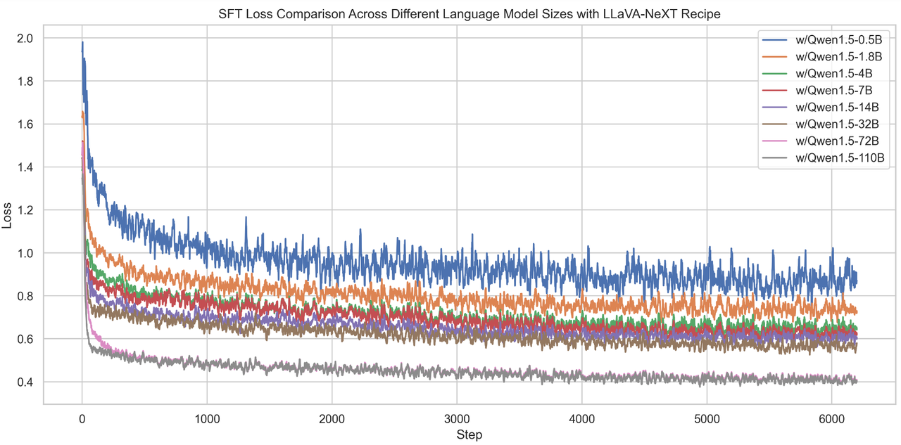
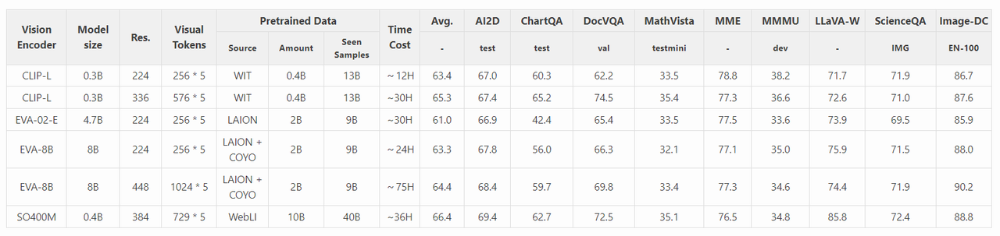
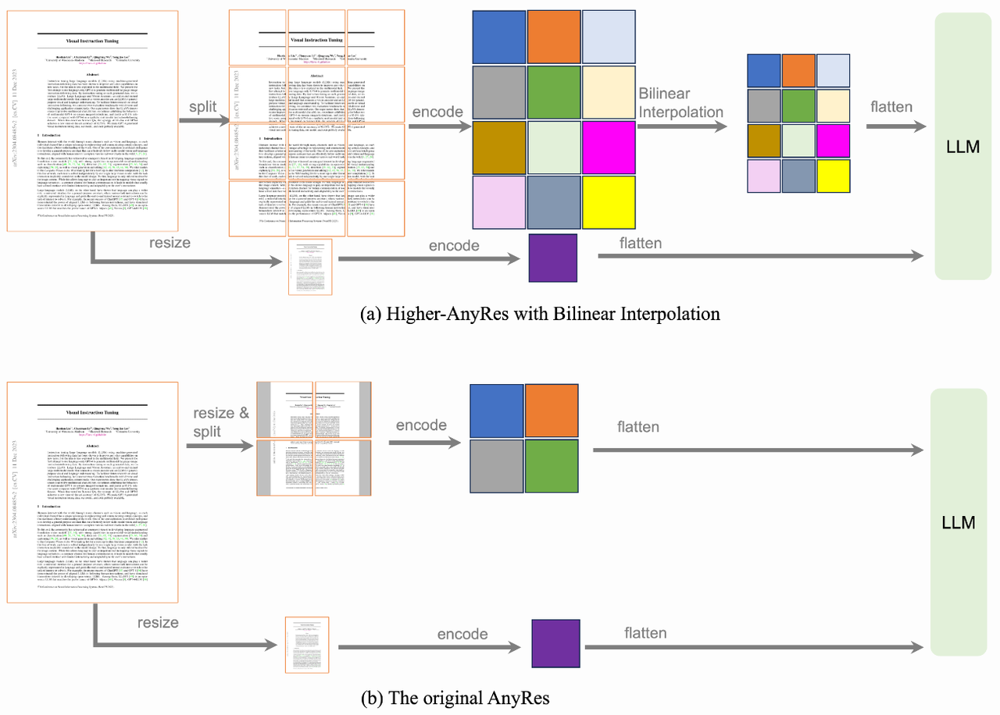
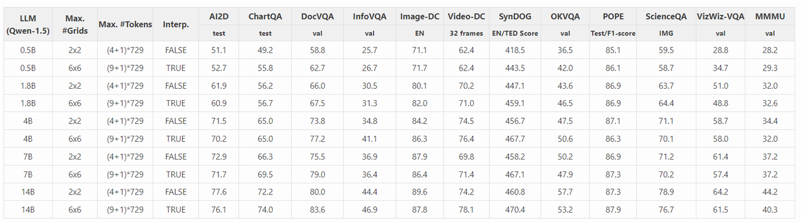
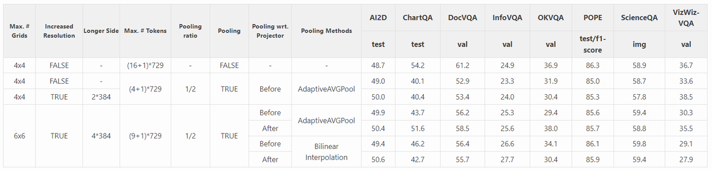
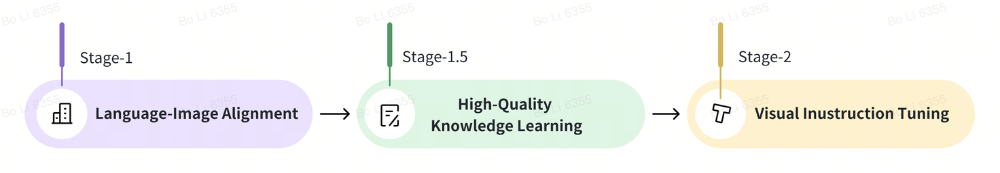
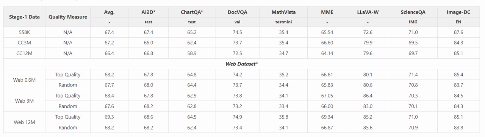
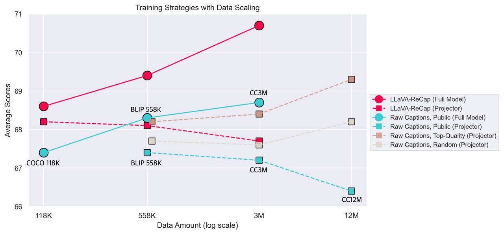

> **论文：Visual Instruction Tuning**
>
> **论文链接：[https://llava-vl.github.io/blog/2024-05-25-llava-next-ablations/](https://link.zhihu.com/?target=https%3A//llava-vl.github.io/blog/2024-05-25-llava-next-ablations/)**
>
> **项目地址：[GitHub - LLaVA-VL/LLaVA-NeXT](https://link.zhihu.com/?target=https%3A//github.com/LLaVA-VL/LLaVA-NeXT)**
>
> **可以参考的博客：https://zhuanlan.zhihu.com/p/695100288，https://zhuanlan.zhihu.com/p/702993772，https://zhuanlan.zhihu.com/p/1934322862388385543，https://zhuanlan.zhihu.com/p/716459350，https://huggingface.co/docs/transformers/en/model\_doc/llava\_next**
>
> **可以参考的视频：https://www.bilibili.com/video/BV12PznYuExg/?spm\_id\_from=333.337.search-card.all.click**

# 1. **LLaVA-Next 简介**

> **LLaVA-Next（v1.6）** 是对 LLaVA 系列的一次关键升级，继承了 LLaVA-1.5 的简洁设计思路，在**连接器不变的前提下，通过引入更高分辨率的图像输入（约为原来的 4 倍）和改进的数据混合策略**，显著提升了模型在视觉推理、OCR 和常识问答等任务中的表现，部分场景甚至超过了商业模型 Gemini Pro。训练依然高效：样本量不到 100 万，最大 34B 模型仅用 32 张 A100 训练一天即可完成
>
> 该研究系统分析了**除数据外影响视觉指令调优效果的关键因素，**&#x5B9E;验表明：
>
> * **模型框架：语言模型规模的提升比视觉编码器更能带来性能收益。LLM的模型大小比image encoder更重要，image encoder的图像配置（分辨率、token数）比模型更重要**
>
> * **视觉表示：扩大图像分辨率、图像特征token数均有效**；性能和效果balance的话，扩分辨率（如AnyRes技术 pooling）更有效
>
> * **训练策略：**&#x9664;仅图文对齐、visual instruction tuning阶段外，引入中间阶&#x6BB5;**&#x20;Stage-1.5 阶段（专注于高质量知识学习）同样关键**，尤其是使用 LLaVA-Next-34B 生成的重描述（re-caption）数据进行全模型训练，能有效提升性能
>
> 本研究**通过消融实验，探究除数据外影响视觉指令调优的因素，包括架构、视觉表征和训练策略**，以 LLaVA-NeXT 为研究对象（其 110B 模型在部分基准上接近 GPT-4V 性能），研究还同步发布了新的图像与视频描述评测基准，进一步推动模型在细粒度理解任务上的发展

# 2. **LLaVA-Next 具体消融结果**

## 2.1 **框架**

#### 2.1.1 **语言模型**

> * **关键发现：**&#x66F4;大的 LLM 能直接提升多模态性能，与多模态性能呈强相关性（因更丰富的语言知识支持跨模态泛化）：
>
>   1. **更大的LM：**&#x73;cale up LM，能够提升多模态理解能力（能够相对减少对高质量数据的依赖）
>
>   2. **更低的loss：**&#x4C;M越大，loss越低（因为有能学到更多更复杂的知识）
>
>   3. **调整lr：**&#x4C;M越大，lr需要越小保证训练稳定（减少spike的情况）；visual encoder的lr一般比LM的lr小10倍或5倍
>
>   4. **batch size：**&#x4C;M较小时，小的batch效果反而更好；LM较大时，大batch效果更好

| LLM 大小（Qwen-1.5） | 平均得分 | AI2D（test） | ChartQA（test） | 图像详细描述（EN-100） |
| ---------------- | ---- | ---------- | ------------- | -------------- |
| 0.5B             | 52.8 | 49.4       | 54.8          | 71.6           |
| 110B             | 76.0 | 80.4       | 79.7          | 95.5           |

#### 2.1.2 **视觉编码器**

> * **关键发现：**&#x6027;能与输入配置（分辨率、令牌数） 和预训练数据的相关性强于模型大小，模型大小的缩放增益有限，如下图SO400M效果最好（更大的token、分辨率、及训练数据）

## 2.2 **视觉表示**

视觉表示与**图像分辨率、token个数**两部分有关，同时扩大两者，能提升效果，但也增加耗时

#### 2.2.1 **图像分辨率和token的影响**

> 1. 提升图像分辨率能提升图像理解能力，同等条件下，提升token能提升ocr理解能力
>
> 2. 综合效果和计算资源，可**优先扩大图像分辨率，其次提升token**（因为token增多，训练耗时增加更多）
>
> 扩充图像分布率的方式，即 **Higher-AnyRes技术**：

#### 2.2.2 **语言模型扩大的有效性**

采用新扩大后的视觉表示（扩分辨率或扩token数），LM的scaling law依旧存在

#### 2.2.3 **分辨率和pooling的影响**

> 1. **扩大图像分辨率：**&#x63D0;升图像分辨率效果提升不明显，但训练耗时增多
>
> 2. **有效的策略：**&#x5982;果需要更效率，可以pool降低特征尺寸（作者给出的是缩放4倍）
>
> 3. **Pooling：**&#x62;ilinear interpolation 比 adaptive average pooling效果好，project之后进行pooling比project之前好

## 2.3 **训练策略**

将训练方案拆分成“图文对齐”（1）->"高质量知识学习"（1.5）->“视觉指令微调”（2）三部分，重点探究前两阶段的影响

| 阶段        | 目标        | 训练数据             | 可训练模块 | 关键发现                                                                  |
| --------- | --------- | ---------------- | ----- | --------------------------------------------------------------------- |
| Stage-1   | 语言 - 图像对齐 | 558K（如 BLIP558K） | 连接器   | 高质量混合数据（如 Web 12M top quality）比公开原始数据更有效（平均得分 69.3 vs 66.4）           |
| Stage-1.5 | 高质量知识学习   | 重 - caption 数据等  | 全模型   | 重 - caption 数据（LLaVA-ReCap）效果最佳，3M 数据平均得分 70.7，显著高于原始数据；全模型训练优于仅调优连接器 |
| Stage-2   | 视觉指令调优    | 790K             | 全模型   | 基于前两阶段，进一步提升任务适应性                                                     |

#### 2.3.1 **图文对齐**

用公开数据和处理互联网数据对比，结论：数据质量大于数量（精选的互联网过滤后数据 > 随机互联网过滤后数据 > 公开数据）

#### 2.3.2 **高质量知识学习**

> 1. caption数据能提升效果
>
> 2. 新的领域内知识能提升效果
>
> 3. 混合数据集能提升模型综合能力

## 2.4 **新基准与数据集**

1. 评估任务

   * 图像详细描述任务：100 英文、200 中文实例，GPT-4V 评分

   * 视频详细描述任务：499 个视频（源自 ActivityNet），GPT-3.5-Turbo 评分

2. 开源数据

   * LLaVA-ReCap 系列：COCO-118K、LCS-558K、CC3M（由 LLaVA-NeXT-34B 重 - caption 生成）

# 3. **LLaVA-Next 总结**

> LLaVA‑Next 通过 **高分辨率视觉输入、混合指令数据、强大 LL M backbone** 的组合，实现了开放多模态模型在推理、OCR、结构化理解任务上的显著提升，训练高效且设计简洁。后续 NeXT‑Video 和 Interleave 架构进一步拓展至视频、多图和三维场景。未来可期待 NeXT 系列在**抽象视觉推理、更复杂交互、多模态跨界泛化**方向持续突破
>
> ### **关键问题**
>
> 1. **在 LLaVA-NeXT 的架构设计中，语言模型和视觉编码器对性能的影响有何差异？**
>
>    * 语言模型的大小对性能影响更显著，更大的 LLM（如 110B）通过丰富的语言知识提升跨模态泛化能力，平均得分从 0.5B 的 52.8 提升至 76.0；而视觉编码器的性能更依赖输入配置（分辨率、令牌数）和预训练数据，模型大小的缩放增益有限，例如 SO400M（0.4B）因 384x384 分辨率和 10B 预训练数据，平均得分（66.4）高于更大的 EVA-8B（8B，63.3）
>
> 2. **在视觉表征优化中，分辨率和令牌数的权衡策略是什么？为何？**
>
>    * 优先提升分辨率，因其缩放比令牌数更有效（性能 - 成本比更高）。原因是分辨率提升能更直接增强视觉细节捕捉能力（如 InfoVQA、视频详细描述任务性能提升），且训练时间增加更少；而令牌数增加虽能提升 OCR 等任务性能，但会显著增加计算成本（如 6x6 网格 +（16+1）\*729 令牌训练时间达 13h10min，远超同网格低令牌数的 8h05min）。推荐采用带阈值双线性插值的 AnyRes 策略平衡两者
>
> 3. **训练策略中新增的 Stage-1.5（高质量知识学习阶段）为何重要？其关键数据支撑是什么？**
>
>    * 该阶段通过全模型训练引入高质量知识（如重 - caption 数据），弥补了仅依赖指令调优的局限。关键数据：使用 3M 重 - caption 数据时，模型平均得分达 70.7，显著高于无此阶段的 67.4；在 DocVQA（77.7 vs 74.5）、AI2D（72.7 vs 67.4）等任务上提升明显，且全模型训练比仅调优连接器更有效（因需更大容量消化高质量知识）。此外，混合文档 / OCR、多语言数据能进一步提升模型多样性
