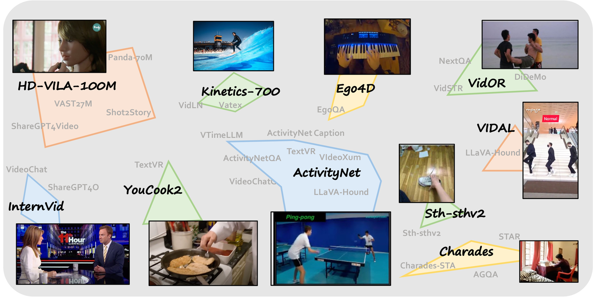
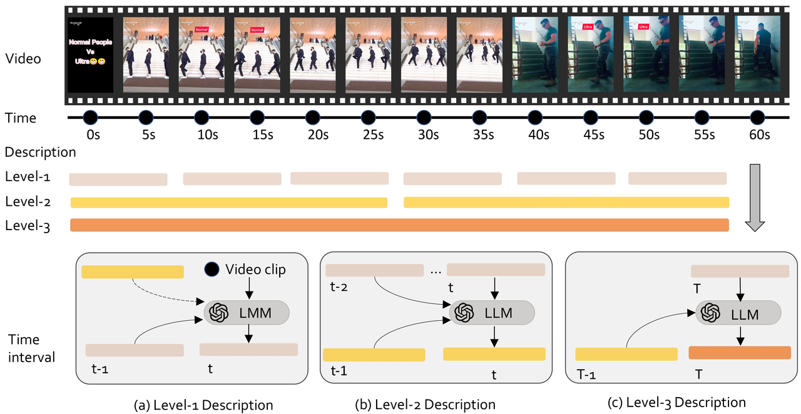
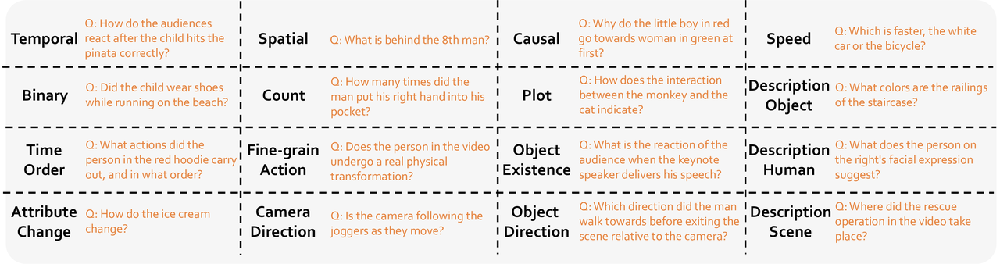
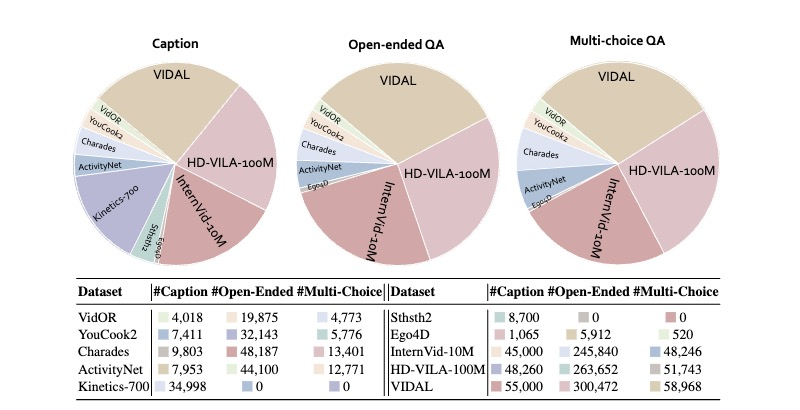
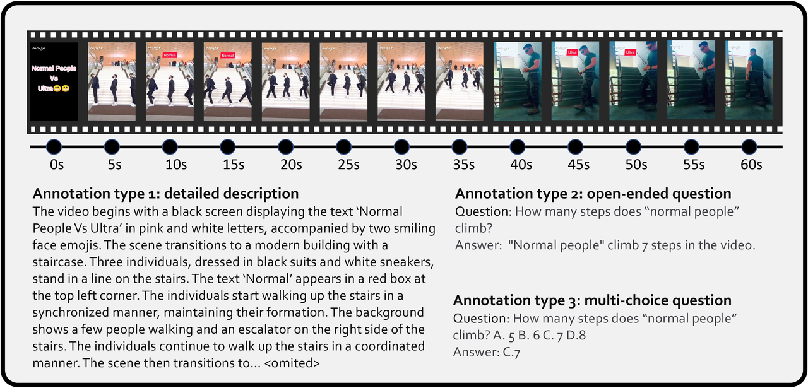
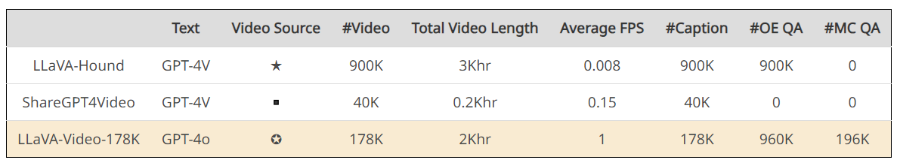
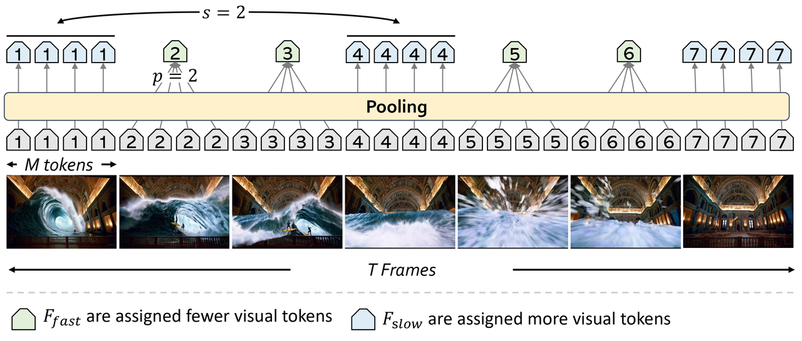
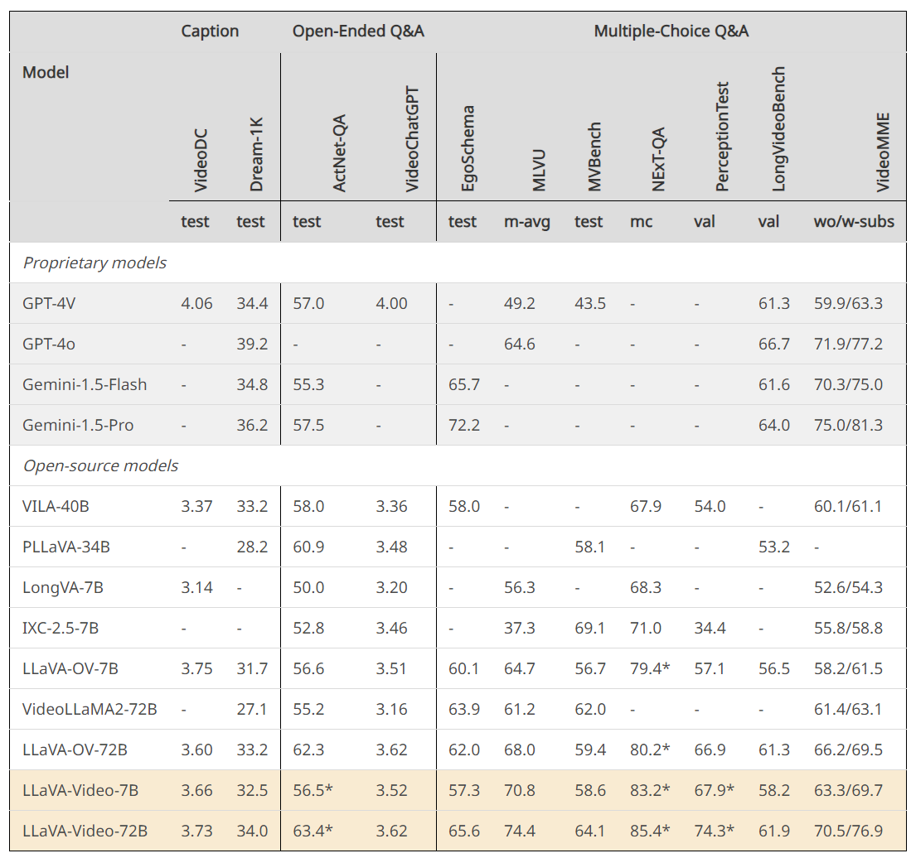

* [ ] 优化排版和内容

原blog链接：https://llava-vl.github.io/blog/2024-09-30-llava-video/

数据集：https://huggingface.co/datasets/lmms-lab/LLaVA-Video-178K

论文名称：Video Instruction Tuning with Synthetic Data

论文链接：http://arxiv.org/abs/2410.02713

代码：https://github.com/LLaVA-VL/LLaVA-NeXT

模型：https://huggingface.co/collections/lmms-lab/llava-video-661e86f5e8dabc3ff793c944

demo：https://huggingface.co/spaces/Tonic/Llava-Video

#### 视频指令跟随数据合成

* **关键因素**：视频内容和语言注释的丰富性与多样性。

* **数据来源**：10个独特视频来源，贡献40+视频-语言基准。

* **视频选择**：选择具有显著时间动态的视频。

* **注释生成**：建立管道生成详细字幕，定义16种问题类型，使用GPT-4o生成问答对。

#### 视频详细描述的自动生成

* **帧采样**：1 fps采样，受限于GPT-4o输入大小，按顺序描述。

* **三级描述**：

  1. **层次1**：基于当前帧、前一时间间隔字幕和层次2的最新描述摘要。

  2. **层次2**：基于前一个层次2字幕和层次1最近三个时间间隔的字幕。

  3) **层次3**：基于层次2的最新字幕和层次1的当前字幕。

#### 视频问答的自动生成

* **问题类型**：16种问题类型，参考公共视频问答基准。

* **生成过程**：使用GPT-4o生成每种类型最多一个问题-答案对。

#### 数据集统计

* **总数据量**：178K视频，1.3M指令跟随样本。

* **样本类型**：178K字幕，960K开放式问答，196K多项选择问答。

#### 数据集比较

1. **动态视频**：LLaVA-Video选择动态、未修剪、复杂情节的视频。

2. **高帧率**：1 fps采样，确保详细时间信息。

3) **多样化任务**：涵盖字幕、自由形式和封闭式问答，样本质量和数量更高。

#### 视频表示

* **SlowFast表示**：根据采样率s将帧分为慢帧组和快帧组，应用不同池化率。

* **参数化表示**：V=(T,M,s,p)。

#### 基准性能

* **微调数据集**：LLaVA-Video-178K + 4个公共数据集（ActivityNet-QA, NExT-QA, PerceptionTest, LLaVA-Hound-255K）。

* **总样本量**：1.6M视频-语言样本（193,510视频描述，1,240,801开放式问题，215,625多项选择问题）。

* **新注释比例**：92.2%视频描述，77.4%开放式问题，90.9%多项选择问题。

