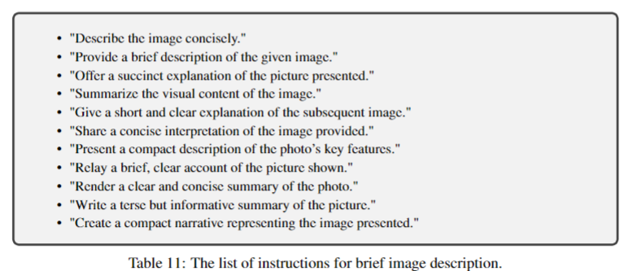
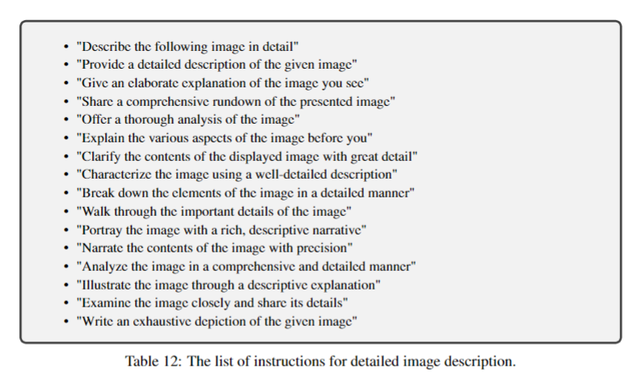
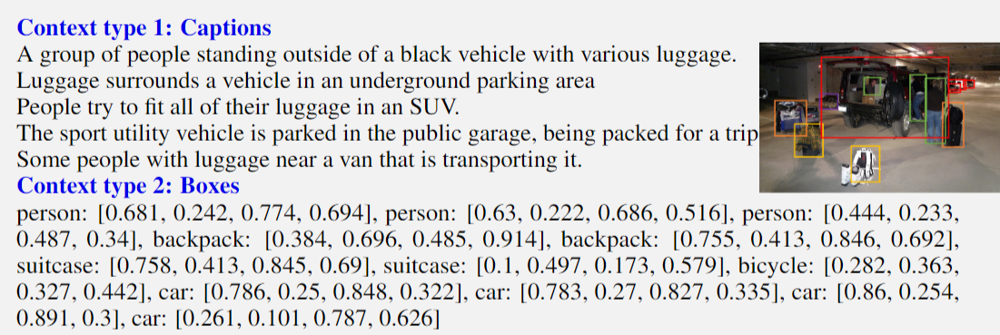
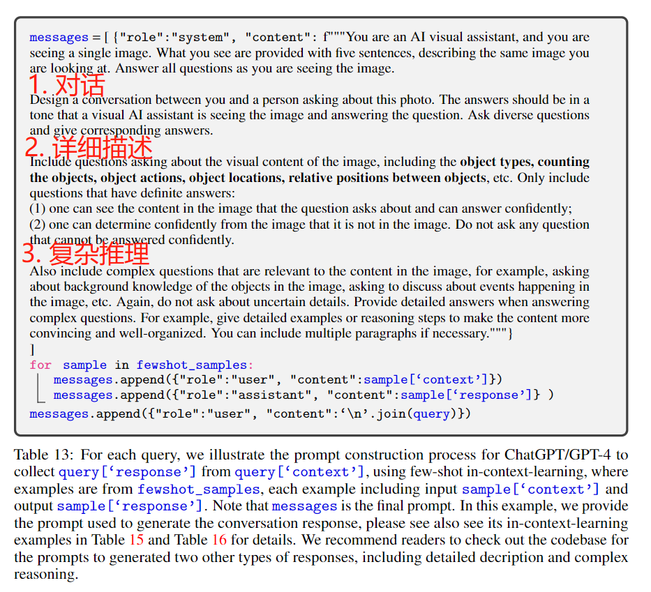
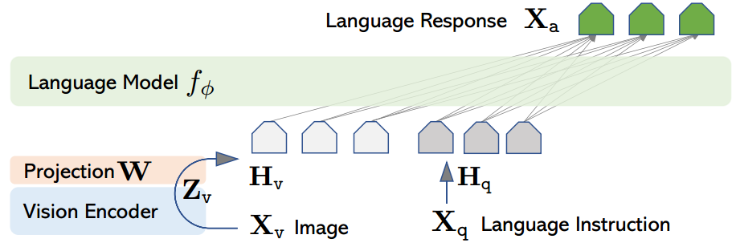
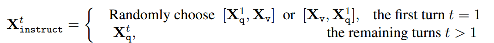
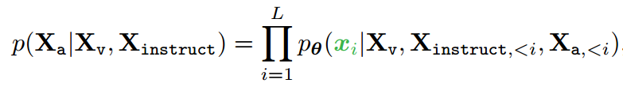
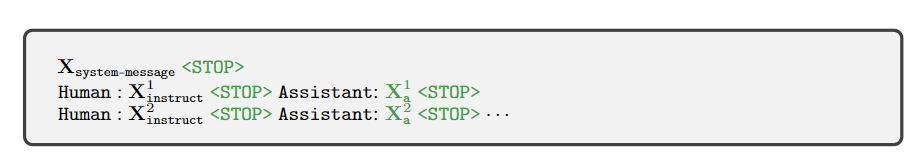

> **论文：Visual Instruction Tuning**
>
> **论文链接：https://arxiv.org/pdf/2304.08485.pdf**
>
> **可以参考的博客：https://llava-vl.github.io/，https://blog.csdn.net/qq\_35812205/article/details/136586853，https://blog.csdn.net/Wang\_Dou\_Dou\_/article/details/146390905，https://zhuanlan.zhihu.com/p/1934322862388385543，https://zhuanlan.zhihu.com/p/721647840**
>
> **可以参考的视频：https://www.bilibili.com/video/BV1nw4m1S7nZ/?spm\_id\_from=333.337.search-card.all.click，https://www.bilibili.com/video/BV1n14y1k7B9/?spm\_id\_from=333.337.search-card.all.click**

# 1. **LLaVA 简介**

> **LLaVA（Large Language and Vision Assistant）**&#x662F;一个开源视觉‐语言助手模型，提出了 **视觉指令调优（Visual Instruction Tuning）** 方法，首次尝试**将语言模型的指令调优扩展到图文多模态领域**
>
> 该方法利用 **无图像输入的 GPT-4&#x20;**&#x751F;成了 158K 的大规模图-文指令微调数据，涵盖对话、详细描述和复杂推理三类内容，并**将 CLIP 图像编码器与 Vicuna 语言模型连接**，通过指令调优 （instruction tuning）训练一个端到端的视觉-语言对话系统&#x20;
>
> 主要用一句话概括它的能力：
>
> > **“给一张图片 + 一句话式指令，它像聊天机器人一样回答问题，文字描述更丰富，甚至能做视觉推理”**
>
> 后续在 ScienceQA 多模态推理集上，LLaVA 单模型达 **90.9%** 准确率，与 GPT‑4 结合后冲上 **92.53%** 新 SOTA

## 1.1 **LLaVA 的背景**

> * 语言模型（如 GPT-3、Vicuna）通过指令调优可以显著提升零样本能力，但多模态领域（图文交互）的指令调优尚未深入探索
>
> * 之前的多模态模型，像 Flamingo 或 BLIP‑2，被训练成“图 → 文”，或“问 → 答”，多是一次性任务。它们很难自然对话，更不能接收丰富指令
>
> * GPT‑4V 等闭源系统虽能做视觉对话，但我们看不见背后的训练细节，也没法复制
>
> * 因此，LLaVA 的意义在于：
>
>   * **首次公开示范图像+语言指令微调** 的方案
>
>   * **用语言模型替代人工标注**，低成本生成高质量多模态对话验证集
>
>   * **开源全过程**：模型、数据、代码

## 1.2 **LLaVA 的动机与核心思想**

> LLaVA 的核心思路非常直接：
>
> 1. **视觉理解，通过语言表达**
>    图像中要理解的东西，可用文字描述。**GPT‑4 虽不能看图，但能 听一堆文字描述 并生成回答**
>
> 2. **用 GPT‑4 来制造“图文指令-回答”示例集**
>    团队先把 COCO 图像的 caption + 边界框信息转成文本，然后**以描述为背景向 GPT‑4 提问**，生成三种类型：
>
>    * 对话式问答（conversations）
>
>    * 详细描述（detailed description）
>
>    * 复杂推理（complex reasoning）
>
>    共生成约 **158 K** 条指令示例&#x20;
>
> 3. **把这些示例接入现成的大语言模型（Vicuna）里做微调**
>    使用类似 LLaMA/Vicuna 的基础模型与 CLIP 视觉编码器拼接，再微调整个系统执行图文指令任务。
>
> > 核心就是“**万物都用语言做桥梁**”：把图片变描述，让 GPT‑4 构造指令，再让语言模型学着答
>
> 使用上面这些数据训练可以强化 LLaVA 在 **VQA 和视觉推理**等多模态场景下的能力

# 2. **LLaVA 方法详解**

## 2.1 **多模态指令数据生成**

> LLaVA 利用 ChatGPT/GPT-4，基于广泛存在的图文对数据来收集多模态指令跟随数据
>
> 对于图像$$X_v$$和对应的 Caption 字幕$$X_c$$，LLaVA prompt GPT-４去生成一系列的问题$$X_q$$，然后就可以简单将图文对数据扩展成指令跟随的格式如下`Human-Assistant`的格式，问题列表也如下所示：

**简单图像描述指令列表**

**详细图像描述指令列表**

> 但是上述的**简单扩展在指令和响应两方面都缺乏多样性和深度推理**
>
> LLaVA 进一步采用两种方式将图像编码为视觉特征，从而提示纯文本 ChatGPT / GPT-4 模型生成数据
>
> * **Caption 字幕：**&#x901A;常从多个角度描述视觉场景
>
> * **Bounding Boxes 边界框：**&#x901A;常用于定位场景中的物体，每个框都编码了物体概念及其空间位置

> LLaVA 具体使用 **COCO 数据集的图像**，生成**三类指令跟随的数据，输入则为 Caption + Bounding Boxes**
>
> 对于每类数据，LLaVA 首先手动设计了几个示例，并在上下文学习中用作种子示例提供给 GPT-4

> ### **对话 Conversation**
>
> * **形式：**&#x4E00;段助手与询问者之间关于这张照片的对话
>
> * **内容：**&#x56DE;答的语气要仿佛助手正在看着这张图像并进行回应。对话中包含一系列关于图像视觉内容的多样化问题，涉及物体类型、物体数量、物体动作、物体位置以及物体间的相对位置等方面
>
> * **方法：**&#x9488;对提供的图像的信息，生成一系列问题并让 GPT-4 回答

> ### **详细描述 Detailed Description**
>
> * **内容：**&#x5BF9;一张图像进行丰富且全面的描述
>
> * **方法：**&#x8BBE;计多个 prompt 模板（上图详细图像描述指令列表），随机选择让一个问题让 GPT-4 生成详细描述

> ### **复杂推理 Complex Reasoning**
>
> 上述两种类型侧重于视觉内容本身
>
> * **内容：**&#x8FD9;类问题的答案通常需要遵循严谨的逻辑，通过逐步推理过程得出
>
> * **方法：**&#x5728;已有对话和描述基础上，要求模型提出更加复杂、更需要推理的问题

**生成指令跟随数据的 Prompt**

## 2.2 **模型架构**

> LLaVA 的主要目标是有效结合预训练的大型语言模型（LLM）和视觉模型的能力
>
> * **语言模型**：选择 Vicuna-13B 作为 LLM（参数化为$$ ϕ$$）
>
> * **视觉编码器**：对于输入图像 $$X_v$$，使用预训练的 CLIP Vision Encoder ViT-L/14，提取视觉特征$$Z_v = g(X_v)$$
>
> * **投影层**：使用简单的线性层将图像特征映射到词嵌入空间。具体来说，通过可训练的投影矩阵 $$W$$ 将 $$Z_v$$ 转换为语言嵌入 token $$H_v$$，其维度与语言模型的词嵌入空间一致：
>
> $$H_v = W · Z_v, \quad Z_v = g(Xv)$$
>
> 这样就得到了一系列视觉 token $$H_v$$，然后将其与文本特征 $$H_q$$ 拼接起来，输入语言模型 LLM 中得到回答 response $$X_a$$

## 2.3 **模型训练**

对于每张图像 $$X_v$$，生成多轮对话数据$$(X_1^q , X_1^a , · · · , X_T^q , X_T^a)$$，其中 T 是总轮数。将其组织为一个序列，将所有答案视为助手的响应，第 t 轮的指令为：

这种格式统一了多模态指令跟随序列。使用 LLM 的原始自回归训练目标对预测 token 进行指令微调

具体来说，对于长度为 L 的序列，目标答案 $$X_a$$ 的概率计算为：

其中 $$θ $$是可训练参数，$$X_{instruct,<i} 和 X_{a,<i} $$分别是当前预测 token $$x_i$$ 之前的所有指令和答案 token。在条件中显式添加 $$X_v$$ 以强调图像对所有答案的基础作用

此外，训练模型的目的是**让其预测助手的回答以及停止位置**，因此**在自回归模型中，仅使用回答&#x20;**$$X_a$$和`<STOP>`**来计算损失**

具体的 LLaVA 的训练分为两个阶段：

**阶段 1：特征对齐的预训练**

* **数据准备**：从 CC3M 数据集中筛选出 595K 图像-文本对，使用简单的扩展方法将其转换为指令跟随数据

* **输入构造**：对于图像 $$X_v$$，随机采样一个问题 $$X_q$$，要求助手简要描述图像，真实答案 $$X_a$$ 是原始标题

* **训练目标**：冻结视觉编码器和 LLM 的权重，仅训练投影矩阵 W，最大化目标答案的似然。这一阶段可以理解为为冻结的 LLM 训练一个兼容的视觉 encoder

**阶段 2：端到端微调**

* **参数更新**：保持vision encoder权重冻结，更新投影层和 LLM 的预训练权重（即 $$θ = {W, ϕ}$$）

* **应用场景**：

  1. **多模态聊天机器人**：在 158K 语言-图像指令跟随数据上微调，支持多轮对话和单轮任务

  2. **科学问答（Science QA）**：在 ScienceQA 基准测试上评估，将问题和上下文作为 $$X_{instruct}$$，推理过程和答案作为 $$X_a$$，组织为单轮对话进行训练

# 3. **LLaVA 实验结果**

## 3.1 **评估基准 LLaVA-Bench**

> * 包含两个子集：COCO（30 张图像，90 个问题）和 In-the-Wild（24 张图像，60 个问题），覆盖对话、详细描述、复杂推理任务
>
> * **评估方式：**&#x7528; **GPT-4 作为评判者，以相对得分（对比 GPT-4 文本模型）衡量性能**

## 3.2 **具体实验结果**

* 定性对比：在 “极端熨烫” 等案例中，LLaVA 能准确理解指令并推理，表现优于 BLIP-2 和 OpenFlamingo（后两者仅描述图像），部分结果接近 GPT-4

* LLaVA-Bench（COCO）消融实验：

| 训练数据组合 | 对话（%） | 详细描述（%） | 复杂推理（%） | 整体（%） |
| ------ | ----- | ------- | ------- | ----- |
| 全数据    | 83.1  | 75.3    | 96.5    | 85.1  |
| 仅对话    | 76.5  | 59.8    | 84.9    | 73.8  |
| 无指令调优  | 22.0  | 24.0    | 18.5    | 21.5  |

* LLaVA-Bench（In-the-Wild）对比：

| 模型           | 对话（%） | 详细描述（%） | 复杂推理（%） | 整体（%） |
| ------------ | ----- | ------- | ------- | ----- |
| LLaVA        | 57.3  | 52.5    | 81.7    | 67.3  |
| BLIP-2       | 54.6  | 29.1    | 32.9    | 38.1  |
| OpenFlamingo | 19.3  | 19.0    | 19.1    | 19.1  |

* Science QA 任务：

  * 数据集：21K 多模态科学问题，含图文上下文

  * 结果：LLaVA 单独训练达 90.92% 准确率；与 GPT-4 协同（GPT-4 作为评判者）达 92.53%，创 SOTA

* **消融实验结果：**

  1. **视觉特征：**&#x4F7F;用 CLIP 视觉编码器倒数第二层特征时性能更优（准确率高于最后一层 0.96%）。推测原因是最后一层特征侧重全局、抽象的图像属性，而倒数第二层更关注有助于理解特定图像细节的局部属性

  2. **思维链（Chain-of-thought）：**

     * “答案优先” 在 12 个 epoch 时达到 89.77% 的最佳准确率

     * “推理优先” 能在 6 个 epoch 快速达到同等准确率，但后续训练无提升，且训练 24 个 epoch 也未改善性能

     * 结论：“推理优先” 策略可大幅加快收敛，但对最终性能贡献较小

  3. **预训练：**&#x8DF3;过预训练直接在 ScienceQA 上从头训练时，准确率降至 85.81%，比正常训练低 5.11%，表明预训练在对齐多模态特征和保留预训练知识方面至关重要

  4. **模型规模：**&#x37;B 模型（89.84%）比 13B 模型（90.92%）准确率低 1.08%，体现了模型规模对性能的重要性

# 4. **LLaVA 总结**

> LLaVA 的亮点在于：
>
> * **架构简单：**&#x6838;心只有三部分（CLIP / 投影层 / Vicuna），易复制
>
> * **数据创新：**&#x7528; GPT‑4 自动生成多模态指令，省事又高质量
>
> * **弥补空白：**&#x7B2C;一个让公开社区能跨进 GPT‑4V 等闭源阵地的模型
>
> LLaVA 的局限性在于：
>
> * **局限性：**&#x9AD8;分辨率图像细节识别不足、知识覆盖有限、存在视觉幻觉、多语言能力弱

> 关键问题
>
> 1. **LLaVA 的多模态指令数据是如何生成的？与传统图文对相比有何优势？**
>    LLaVA 的指令数据通过 GPT-4 生成，基于图像的符号表示（字幕和边界框），经人工设计的种子示例引导，生成对话、详细描述、复杂推理三类样本（共 158K）
>
>    优势在于：相比传统图文对（仅图像-文本关联），其格式更贴近真实交互场景（指令-响应），包含更丰富的推理和多轮对话，能更好地训练模型的指令跟随能力
>
> 2. **LLaVA 的两阶段训练过程有何特点？为何要分阶段训练？**
>    两阶段训练包括：
>
>    1. 特征对齐预训练：冻结 CLIP 和 Vicuna，仅训练投影层，用 595K 过滤的 CC3M 数据对齐视觉与语言特征
>
>    2. 端到端微调：冻结 CLIP，微调投影层和 Vicuna，用 158K 指令数据优化。
>
>    分阶段的原因是：先通过预训练确保视觉特征能被语言模型理解（避免破坏预训练知识），再通过微调提升特定指令任务的表现，平衡了特征对齐与任务适配
>
> 3. **LLaVA 在 Science QA 任务中与 GPT-4 协同的策略是什么？为何能达到 SOTA？**
>
>    1. 协同策略为 “GPT-4 作为评判者”：当 LLaVA 与 GPT-4 答案不同时，让 GPT-4 基于问题和两者结果给出最终答案
>
>    2. 优势在于：GPT-4 具备强大的语言推理和外部知识，而 LLaVA 擅长处理视觉信息，两者互补；GPT-4 能修正 LLaVA 的视觉理解误差，尤其对无需图像的问题可利用自身知识优化，最终实现 92.53% 的 SOTA 准确率
