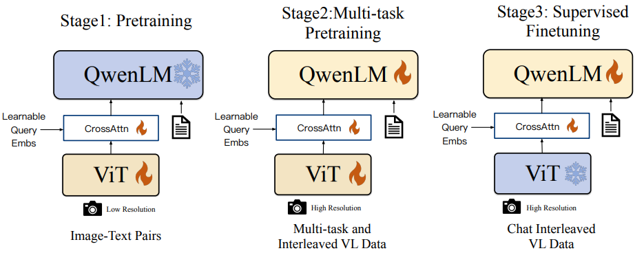
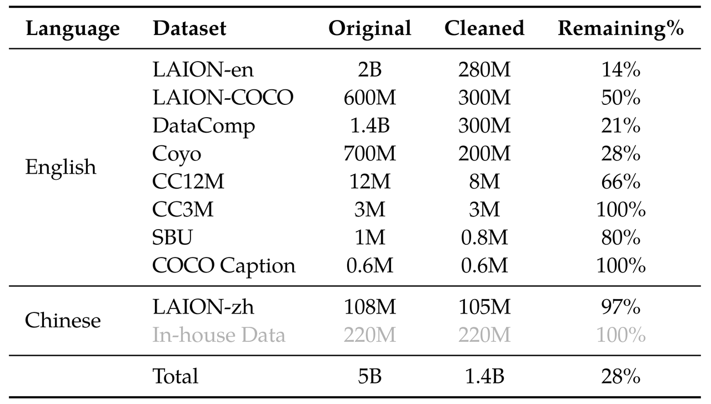

* [ ] 优化排版和内容

> **论文：Qwen-VL: A Versatile Vision-Language Model for Understanding, Localization, Text Reading, and Beyond**
>
> **论文链接：https://arxiv.org/abs/2308.12966**
>
> **项目地址：https://github.com/QwenLM/Qwen-VL**
>
> **Demo：https://modelscope.cn/studios/qwen/Qwen-VL-Chat-Demo/summary**
>
> **可以参考的博客：https://github.com/QwenLM/Qwen-VL/blob/master/TUTORIAL.md**
>
> **可以参考的视频：**

#### 模型架构

Qwen-VL 的整体网络架构由三个组件组成，总计9.6B参数：

* **Vision Encoder**: 1.9B

* **VL Adapter**: 0.08B

* **LLM**: 7.7B

##### 1.1 大型语言模型（Large Language Model）

* **作用**：作为模型的基础组件，负责文本生成和理解。

* **初始化**：使用预训练的 **Qwen-7B** 模型权重。

##### 1.2 视觉编码器（Visual Encoder）

* **作用**：处理输入图像并生成图像特征。

* **架构**：基于 Vision Transformer（ViT），使用 **OpenCLIP ViT-bigG** 的预训练权重。

* **输入处理**：将图像调整为 448x448 分辨率，分割为 14x14 的图块进行处理。

##### 1.3 位置感知的视觉-语言适配器（Position-aware Vision-Language Adapter）

* **作用**：压缩图像特征序列，解决长序列带来的效率问题。

* **结构**：单层交叉注意力模块，随机初始化。

  * 使用一组可训练的向量作为query，vision encoder的图像特征作为key。

  * 将图像特征序列压缩为固定长度 256。

* **位置编码**：引入 2D 绝对位置编码，保留图像细节的位置信息。

#### 训练过程

Qwen-VL 的训练分为三个阶段：

##### Stage 1：预训练

* **目标**：对齐视觉模块和语言模型的特征。

* **数据**：使用大规模图文对数据集（约 1.4B 图文对）。

* **训练目标**：最小化文本token的交叉熵损失。

* **优化器**：AdamW（β1=0.9, β2=0.98, ε=1e-6）。

* **学习率调度**：余弦学习率调度，最大学习率 2e-4，最小学习率 1e-6，linear warmup 500 步。

* **训练规模**：50,000 步，消耗约 1.5B 图文样本和 500B 图文 token。

##### Stage 2：多任务预训练

* **目标**：提升模型在多任务上的表现。

* **数据**：高质量、细粒度的视觉-语言标注数据，交错图像-文本数据。

* **任务**：并行训练以下任务：

  1. 图像描述（Captioning）

  2. 视觉问答（VQA）

  3) 定位任务（Grounding）

  4) 参考定位和定位描述（Ref Grounding & Grounded Cap.）

  5. 光学字符识别（OCR）

  6. 文本生成（Text Generation）

* **训练方式**：全参数训练，输入分辨率提升至 448x448。

##### Stage 3：监督微调（SFT）

* **目标**：增强模型的交互和对话能力。

* **数据**：通过大模型 Self-Instruction 生成的多模态指导数据，涵盖单图和多图对话。

* **训练方式**：

  * 冻结vision encoder，仅优化语言模型和adapter模块。

  * 使用 ChatML 格式构建对话数据，添加图像标识（如 "Picture id:"）以支持多图输入。

* **训练参数**：

  * 全局批次大小：128

  * 学习率调度：最大学习率 1e-5，最小学习率 1e-6，linear warmup 3000 步。
