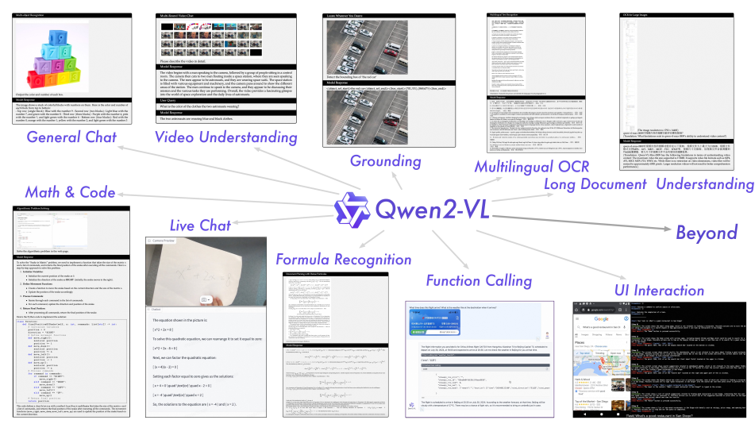
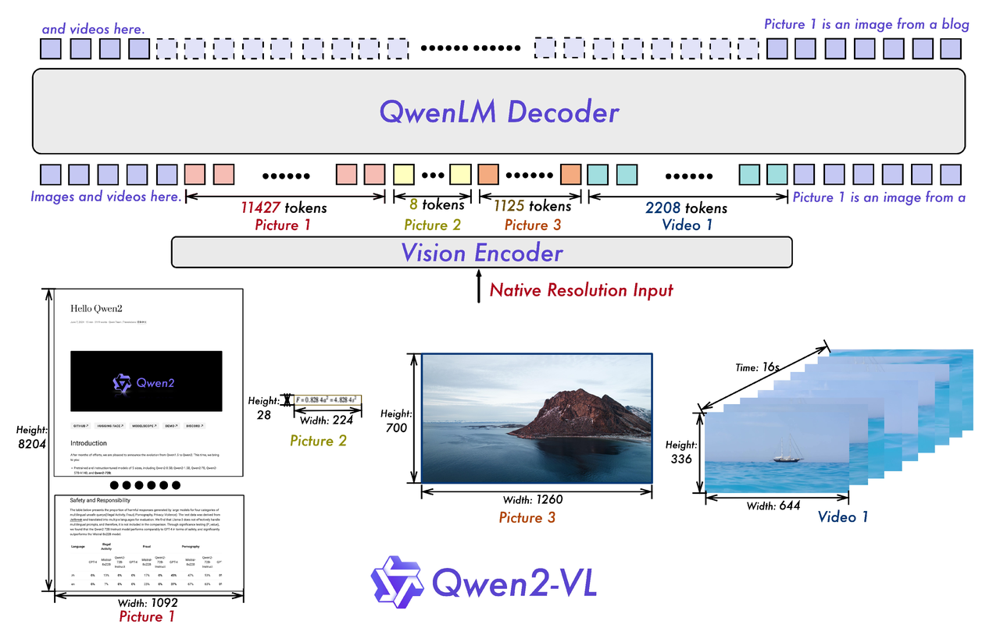
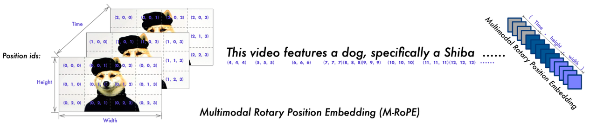

* [ ] 优化排版和内容

论文名称：Qwen2-VL: Enhancing Vision-Language Model’s Perception of the World at Any Resolution

论文链接：https://arxiv.org/pdf/2409.12191

项目地址：https://github.com/QwenLM/Qwen2-VL

#### **提出背景**

* **现有问题**：

  * 当前的大型视觉语言模型（LVLMs）通常受限于固定图像输入尺寸，例如将图像编码为固定分辨率（如224×224），导致高分辨率图像中的细节信息损失。

  * 大多数LVLM依赖于静态的、冻结的CLIP风格视觉编码器，限制了复杂推理任务中的表现。

* **解决方案**：

  * 引入动态分辨率训练，使用二维旋转位置嵌入（RoPE）增强模型对不同分辨率的适应性。

  * 开发多模态旋转位置嵌入（M-RoPE），通过独立的组件表示时间和空间信息，提升对动态内容（如视频）的理解能力。

#### 模型架构与训练方法

* **框架基础**：保留了Qwen-VL的框架，集成了视觉编码器和语言模型。

* **视觉编码器**：采用675M参数的视觉Transformer（ViT），支持图像和视频输入。

* **语言模型**：选择了更强大的Qwen2系列语言模型。

**关键改进**：

1. **Naive动态分辨率**：

   * 支持处理任意分辨率的图像，动态转换为可变数量的视觉token。

   * 引入2D-RoPE捕获图像的二维位置信息。

   * 在推理阶段，通过控制打包长度限制GPU内存使用。

   * 使用MLP层将相邻的2×2 token压缩为一个token，并在开头和结尾添加特殊token（`<|vision_start|>`和`<|vision_end|>`）。

2. **多模态旋转位置嵌入（M-RoPE）**：

   * 将旋转嵌入分解为三个组件：时间、高度和宽度。

   * 对于文本输入，组件使用相同的位置ID；对于图像和视频，分别分配不同的ID。

   * 支持多模态输入的位置信息建模，减少位置ID值，提升推理效率。

3. **统一图像和视频理解**：

   * 采用混合训练方案，结合图像和视频数据。

   * 以每秒两帧的速率采样视频，结合3D卷积处理视频输入。

   * 动态调整视频帧分辨率，将每个视频的token总数限制为16384，平衡计算需求与训练效率。
