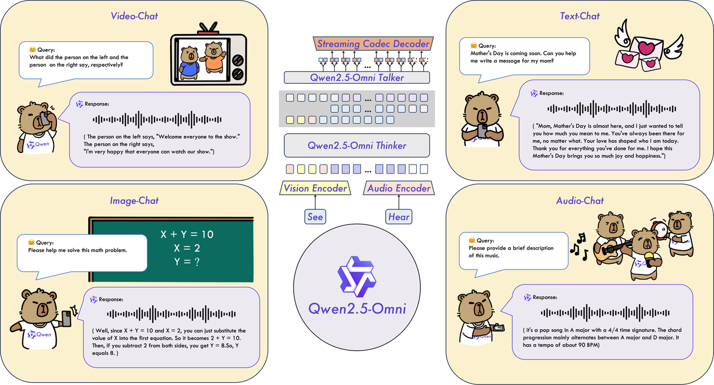
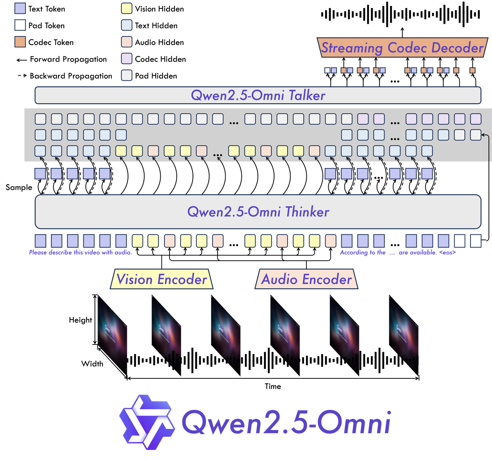
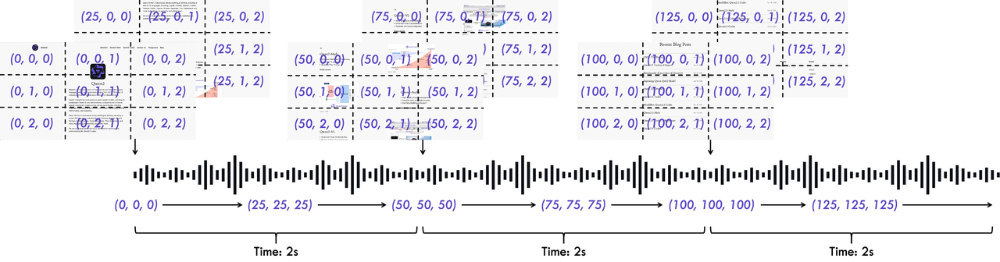
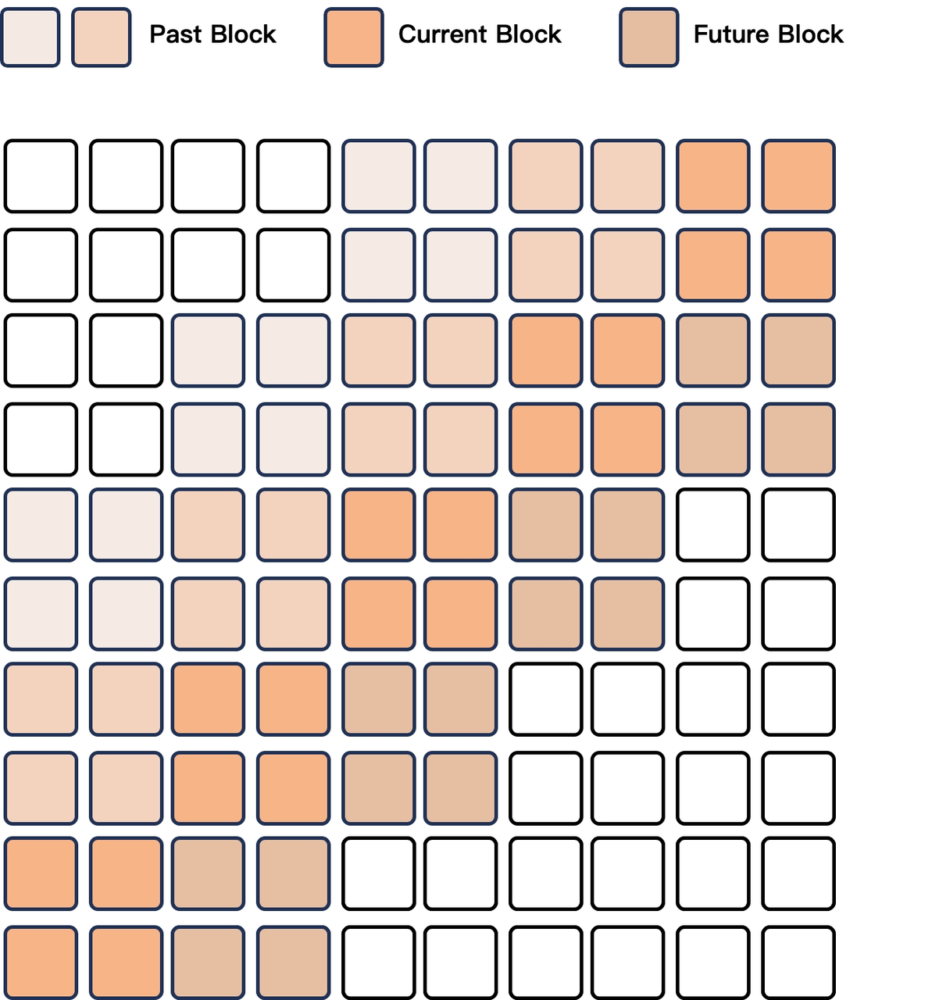
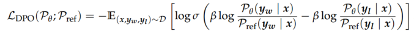
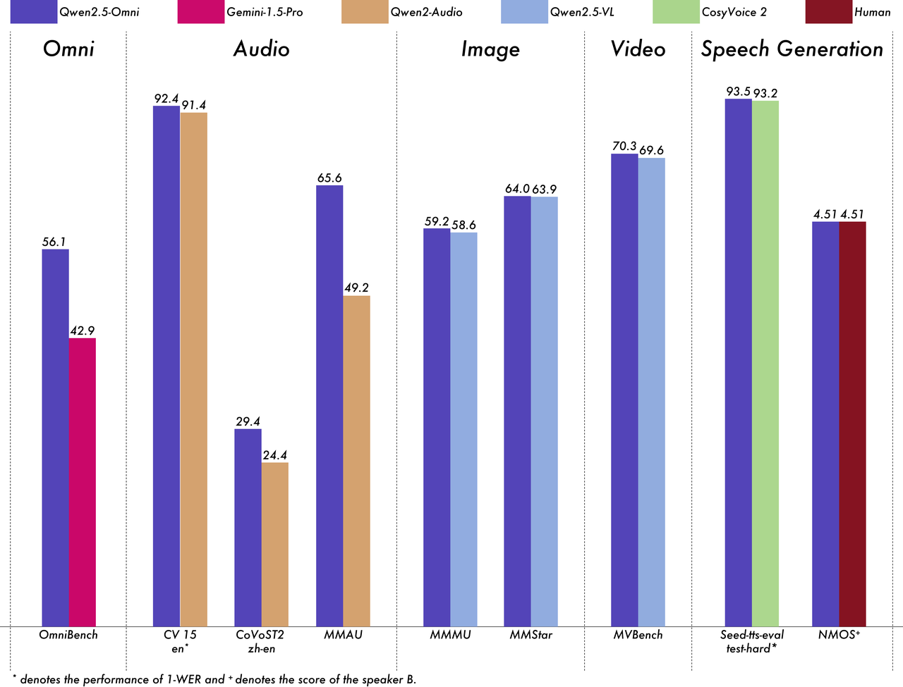

* [ ] 优化排版和内容

Paper: https://arxiv.org/abs/2503.20215

Blog:https://qwenlm.github.io/zh/blog/qwen2.5-omni/

Github:https://github.com/QwenLM/Qwen2.5-Omni

作者提出Qwen2.5-Omni作为一个统一的多模态模型，其核心创新可概括为以下四点： &#x20;

* **统一架构**：该模型能够感知所有输入模态（text/audio/video），并以流式方式同步生成文本与自然语音响应。&#x20;

* **时序编码算法**：提出新型positional embedding方法TMRoPE（Temporal-aware Rotary Position Embedding），通过显式编码时序信息实现音视频同步。 &#x20;

* **双模块设计**：采用Thinker-Talker架构实现实时理解与语音生成的协同工作流。 &#x20;

* **多模态性能**：在同等规模单模态模型对比中展现全面优势，尤其在语音指令跟随任务上达到接近纯文本输入的精度。基于OmniBench的多模态融合任务评估显示SOTA性能，并在seed-tts-eval语音生成基准中表现突出。 &#x20;

#### 架构设计

如图所示，Qwen2.5-Omni采用双模块架构： &#x20;

* **Thinker模块**：类比人类大脑，基于Transformer decoder结构，集成audio encoder与vision encoder进行多模态信息提取。主要负责处理文本/音频/视频输入，生成高层语义表征（high-level representations）及对应文本输出。 &#x20;

* **Talker模块**：仿效人类发声器官，采用双轨自回归Transformer decoder架构（灵感源于Mini-Omni）。以流式方式接收Thinker产生的高维表征与历史上下文信息，实时输出离散语音token序列。 &#x20;

训练与推理阶段，Talker直接共享Thinker的全部上下文信息，使整个系统作为单一 cohesive 模型运行。这种设计支持： &#x20;

* 跨模态表征的端到端联合优化 &#x20;

* 语音生成时保持与语义理解模块的实时状态同步 &#x20;

* 避免传统级联式架构的误差累积问题 &#x20;

##### **输入模态处理** &#x20;

**文本处理：**&#x4F5C;者采用Qwen tokenizer对文本输入进行编码，该tokenizer基于byte-level byte-pair encoding技术构建，包含151,643个常规token的词汇表。文本序列被转换为hidden representations作为Thinker模块的输入。 &#x20;

**音频处理流程：**&#x5BF9;于音频输入（包括视频中的音频轨），处理流程包含以下步骤： &#x20;

1. 重采样至16kHz标准频率 &#x20;

2. 通过25ms窗口尺寸与10ms步长转换为128通道mel-spectrogram &#x20;

3) 采用Qwen2-Audio的audio encoder进行特征提取，每个音频帧表征对应原始信号中40ms的片段 &#x20;

**视觉信号处理：**&#x89C6;觉信号（图像/视频）通过Qwen2.5-VL的vision encoder处理，该模块特点包括： &#x20;

* 基于Vision Transformer（ViT）架构，参数量约6.75亿 &#x20;

* 支持图像与视频双模态输入 &#x20;

* 采用混合训练策略（image+video数据联合训练） &#x20;

视频输入的特殊处理： &#x20;

* 动态帧率采样以匹配音频采样率 &#x20;

* 单张图像视为两帧相同画面输入 &#x20;

##### **时序编码与多模态对齐** &#x20;

**TMRoPE位置编码机制：**&#x5982;图3所示，作者提出的TMRoPE（Temporal-aware Multimodal Rotary Position Embedding）通过三维位置编码实现多模态同步。 &#x20;

**编码维度分解**：将原始rotary embedding解耦为三个分量： &#x20;

1. Temporal：绝对时间位置 &#x20;

2. Height：垂直空间位置 &#x20;

3) Width：水平空间位置 &#x20;

**模态差异化编码规则** &#x20;

| 输入类型    | Temporal ID规则     | 空间ID规则                 |
| ------- | ----------------- | ---------------------- |
| 文本      | 所有token相同         | 等同于1D-RoPE             |
| 音频      | 每40ms片段相同ID       | 不适用                    |
| 图像      | 所有visual tokens固定 | 按像素位置分配height/width ID |
| 视频（含音频） | 动态调整帧间ID（每40ms单位） | 同图像处理规则                |

**跨模态位置初始化：**&#x5F53;处理多模态混合输入时，各模态的位置ID按前序模态最大ID值递增初始化，确保模态间位置编码的连续性。 &#x20;

**音视频交织策略** &#x20;

**时间分块处理**：对含音频的视频输入，每2秒实际时长作为一个处理单元： &#x20;

1. 将视觉表征置于单元前端 &#x20;

2. 音频表征置于单元后端 &#x20;

**动态交织原理：**&#x901A;过时间对齐算法实现： &#x20;

* 视频帧的temporal ID根据实际时间戳动态计算（保持40ms/ID的对应关系） &#x20;

* 音频帧的temporal ID严格按40ms间隔递增 &#x20;

* 最终形成视觉与听觉表征交替排列的序列结构 &#x20;

该设计使得模型能够： &#x20;

* 保持音视频信号的严格时序同步 &#x20;

* 在Transformer架构中实现跨模态注意力计算 &#x20;

* 端到端优化多模态融合效果 &#x20;

##### 输出模态处理

**文本生成机制：**&#x7531;Thinker模块直接完成，其生成逻辑与主流LLMs保持一致：

* 基于vocabulary的概率分布进行自回归采样

* 采用repetition penalty和top-p sampling等技术提升生成多样性

**语音生成**：Talker模块接收来自Thinker的两类输入：

1. 高层语义表征（high-level representations）

2. 采样文本token的embeddings

**双输入设计必要性**：

* 高层表征隐含语调/情感信息，支持流式生成时的语音预判

* 语义空间表征（而非语音相似性）可能导致同义异音词具有相似表征，需离散token消除歧义

**语音编解码系统**：

* 开发专用qwen-tts-tokenizer高效编码语音关键信息

* 通过ausal audio decoder实现流式解码

* 生成过程无需文本-语音的单词级/时间戳对齐，显著简化训练数据要求

##### 流式交互优化

**延迟构成要素**：流式场景下初始数据包延迟受四方面影响：

1. 多模态信息预处理延迟

2. 首文本输入到首语音token输出的推理延迟

3) 首段语音token到音频信号的转换延迟

4) 模型固有架构延迟（与参数量/计算量正相关）

**预填充支持：**&#x4E3A;支持chunked-prefills机制，进行以下改进：

* **音频编码器**：将全局注意力改为2秒分块的时序注意力

* **视觉编码器**：

  * 采用flash attention加速训练推理

  * 通过MLP层合并相邻2×2的visual tokens

  * 固定patch size为14，支持多分辨率图像序列化处理

##### 流式编解码生成

**滑动窗口注意力机制**：

* 采用Flow-Matching DiT模型

* 限制当前token仅关注有限上下文窗口（4个代码块）：

  * 包含2个历史块（lookback）

  * 1个前瞻块（lookahead）

**分块处理流程**：

1. 相邻语音代码分组处理

2. 分块生成mel-spectrogram（Flow-Matching）

3) 改进版BigVGAN分块重构波形

该设计通过维护上下文块信息，在保证流式生成的同时提升输出质量。

#### 预训练流程

##### **三阶段训练策略**

Qwen2.5-Omni采用分阶段渐进式训练方法：

1. **第一阶段**：锁定LLM参数，专注训练vision encoder和audio encoder，使用大规模audio-text和image-text配对数据增强LLM的语义理解能力

2. **第二阶段**：解冻所有参数，采用更广泛的多模态数据进行综合训练

3) **第三阶段**：使用32k长序列数据提升模型处理复杂长序列的能力

##### **预训练数据构成**

训练数据集包含多种类型：

* image-text配对数据

* video-text配对数据 &#x20;

* video-audio配对数据

* audio-text配对数据

* 纯文本语料

采用Qwen2-Audio的自然语言提示替代层级标签，显著提升模型的泛化能力和指令跟随能力。

##### **初始化配置**

* LLM组件：基于Qwen2.5参数初始化

* vision encoder：沿用Qwen2.5-VL架构

* audio encoder：基于Whisper-large-v3初始化

##### **关键训练细节**

1. 编码器采用分步训练策略：

   * 先固定LLM训练adapter模块

   * 再联合训练完整encoder

2. 第二阶段引入增量数据：

   * 8000亿token图像/视频相关数据

   * 3000亿token音频相关数据 &#x20;

   * 1000亿token音视频混合数据

3) 序列长度扩展：

   * 前两阶段最大token长度限制为8192

   * 最终阶段扩展至32768以支持长音频/视频处理

#### 微调优化

##### **Thinker模块优化**

采用ChatML格式的指令微调数据，包含：

* 纯文本对话数据

* 视觉模态对话数据 &#x20;

* 音频模态对话数据

* 混合模态对话数据

##### **Talker模块三阶段训练**

1. **上下文延续训练**：基础语音生成能力培养

2. **DPO强化训练**：提升语音生成稳定性

3) **多说话人微调**：增强语音响应的自然度和可控性

##### **In-Context Learning专项优化**

* 通过next-token预测实现语音延续任务

* 建立语义表征到语音的单调映射

* 学习上下文相关的语音属性表达（韵律/情感/口音）

* 采用音色解耦技术避免异常关联

##### **稳定性增强措施**

对预训练数据中的标签噪声和发音错误问题，引入强化学习阶段：

1. 构建三元组数据集D=(x, yw, yl)：

   * x：输入文本序列

   * yw：优质生成语音

   * yl：劣质生成语音 &#x20;

2. 基于WER（词错误率）和标点停顿错误率进行样本排序

3) 采用LDPO目标函数优化：

##### **说话人自适应**

在基础模型上进行说话人专项微调，使Talker能够：

* 模仿特定音色特征

* 显著提升生成语音的自然度

#### 性能

Qwen2.5-Omni在包括图像，音频，音视频等各种模态下的表现都优于类似大小的单模态模型以及封闭源模型，例如Qwen2.5-VL-7B、Qwen2-Audio和Gemini-1.5-pro。在多模态任务OmniBench，Qwen2.5-Omni达到了SOTA的表现。此外，在单模态任务中，Qwen2.5-Omni在多个领域中表现优异，包括语音识别（Common Voice）、翻译（CoVoST2）、音频理解（MMAU）、图像推理（MMMU、MMStar）、视频理解（MVBench）以及语音生成（Seed-tts-eval和主观自然听感）。

