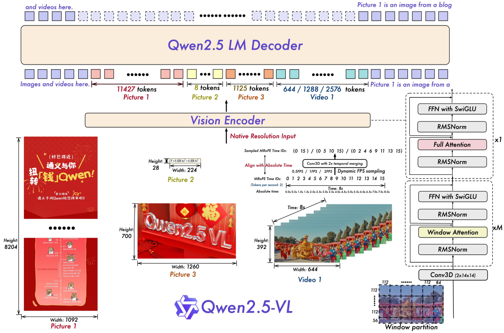
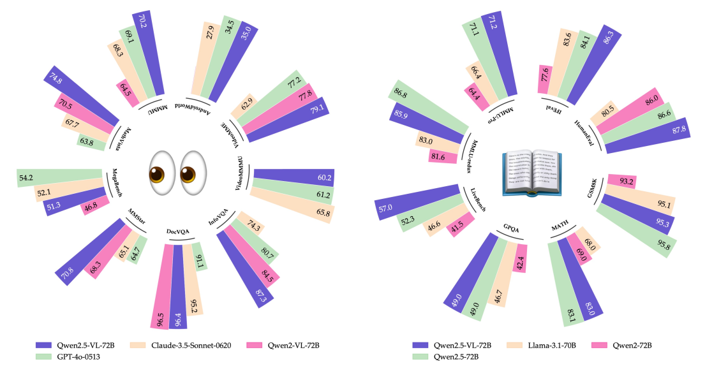
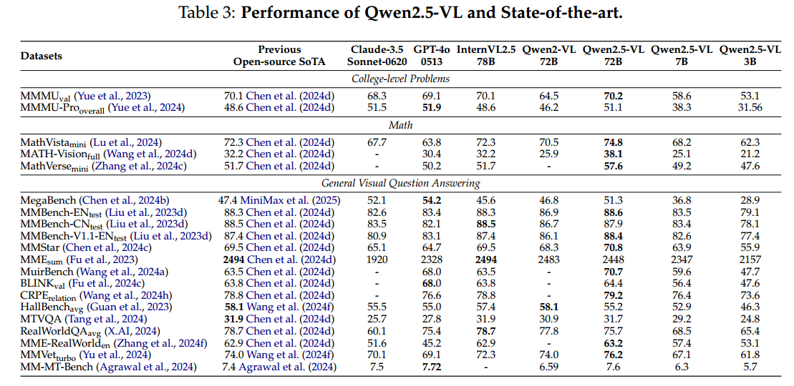
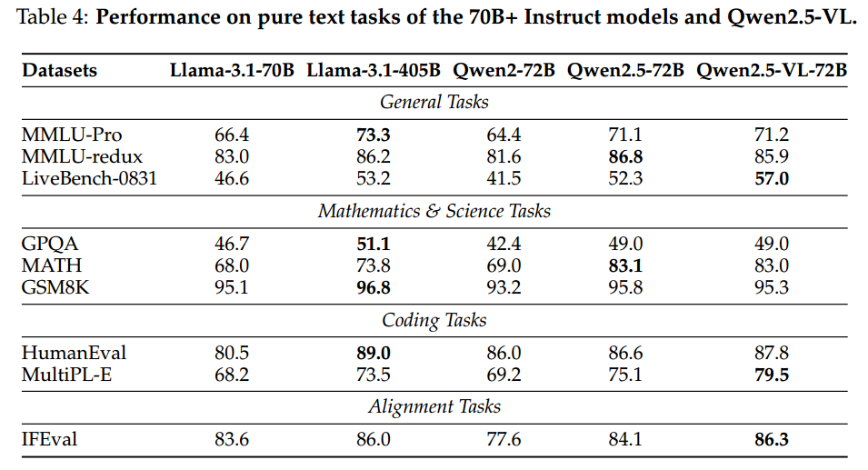
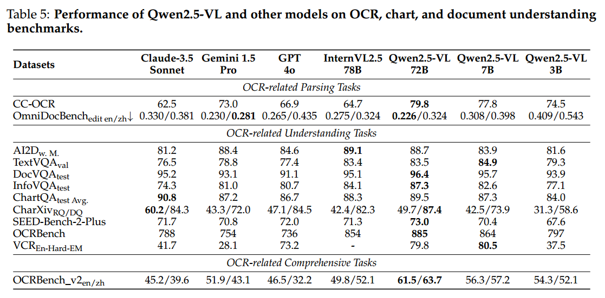
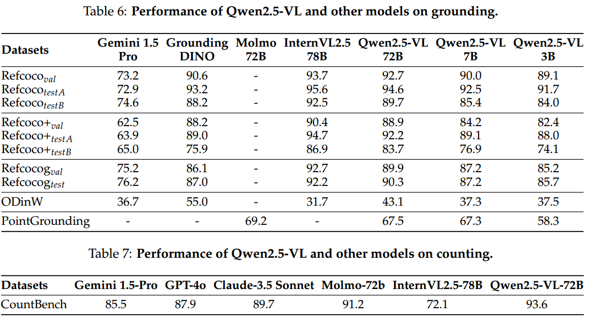
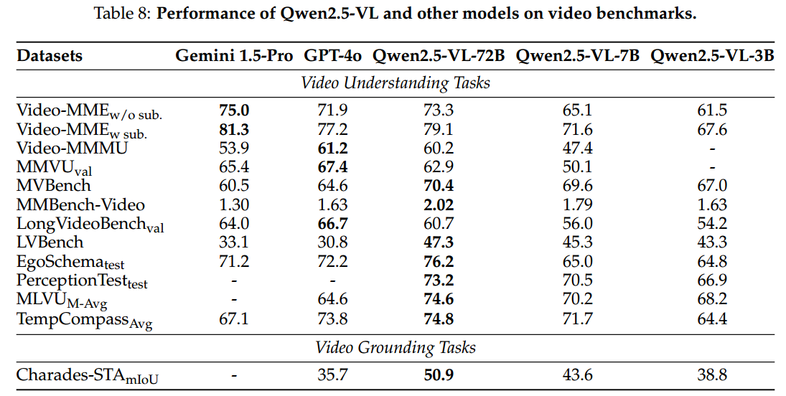
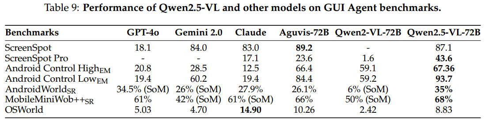

* [ ] 优化排版和内容

论文名称: Qwen2.5-VL Technical Report

论文链接: https://arxiv.org/pdf/2502.13923

Demo：https://chat.qwenlm.ai/

模型：https://huggingface.co/Qwen

代码:  https://github.com/QwenLM/Qwen2.5-VL

#### 1 训练与动态分辨率

##### 1.1 动态分辨率训练

* **随机采样**：训练过程中，图像根据其原始宽高比随机采样，使模型能够有效泛化到不同分辨率的输入。

* **优势**：

  * 提升模型的适应性。

  * 确保在不同尺寸视觉数据上的稳定和高效训练。

##### 1.2 原生动态分辨率与帧率

Qwen2.5-VL 在空间和时间维度上引入了改进，以有效处理多样化的多模态输入。

* **空间维度**：

  * 动态将不同尺寸的图像转换为对应长度的 token 序列。

  * 直接使用输入图像的实际尺寸表示边界框、点和其他空间特征，使模型能够学习尺度信息，提升处理不同分辨率图像的能力。

* **时间维度（视频输入）**：

  * 引入动态帧率（FPS）训练和绝对时间编码。

  * 通过适应可变帧率，模型能够更好地捕捉视频内容的时间动态。

  * 提出一种新颖高效的策略，将 MRoPE ID 直接与时间戳对齐，使模型能够通过时间维度 ID 之间的间隔理解时间节奏，无需额外计算开销。

##### 1.3 多模态旋转位置嵌入（MRoPE）与绝对时间对齐

位置嵌入对于建模视觉和语言模态中的序列数据至关重要。

* **MRoPE 的改进**：

  * 在 Qwen2-VL 的基础上，扩展了 MRoPE 的能力，以更好地处理视频中的时间信息。

  * MRoPE 将位置嵌入分解为三个独立组件：时间、高度和宽度，以有效建模多模态输入。

    * **文本输入**：三个组件使用相同的位置 ID，使 MRoPE 功能等同于传统的 1D RoPE。

    * **图像输入**：时间 ID 保持不变，高度和宽度组件根据 token 在图像中的空间位置分配唯一 ID。

    * **视频输入**：视频被视为帧序列，时间 ID 逐帧递增，高度和宽度组件遵循与图像相同的分配模式。

* **Qwen2.5-VL 的关键改进**：

  * 将 MRoPE 的时间组件与绝对时间对齐。

  * 通过利用时间 ID 之间的间隔，模型能够学习不同 FPS 采样率视频之间的一致时间对齐。

#### 2 模型架构与训练方法

##### 2.1 动态分辨率与帧率训练

* **动态分辨率**：

  * 支持处理任意分辨率的图像，动态转换为可变数量的视觉 token。

  * 引入 2D-RoPE 捕获图像的二维位置信息。

  * 在推理阶段，通过控制打包长度限制 GPU 内存使用。

  * 使用 MLP 层将相邻的 2×2 token 压缩为一个 token，并在开头和结尾添加特殊 token（`<|vision_start|>` 和 `<|vision_end|>`）。

* **动态帧率训练**：

  * 通过动态 FPS 采样，将动态分辨率扩展到时间维度。

  * 更新了时间维度上的 mRoPE，增加 ID 和绝对时间对齐，使模型能够学习时间顺序和速度，精确定位特定时刻。

##### 2.2 精简高效的视觉编码器

* **窗口注意力机制**：在 ViT 中战略性地实施窗口关注，提高训练和推理速度。

* **架构优化**：通过 SwiGLU 和 RMSNorm 进一步优化 ViT 架构，使其与 Qwen2.5 LLM 的结构保持一致。

#### 3. 效果与评估

####

