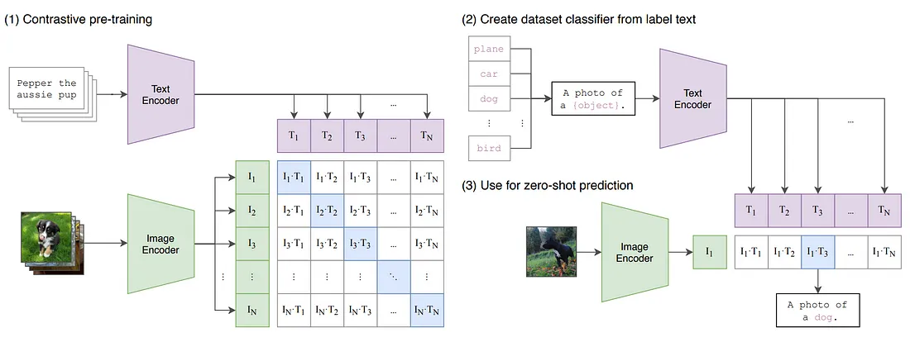
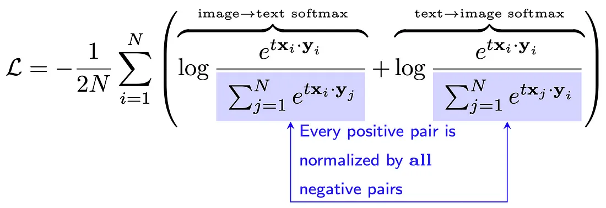
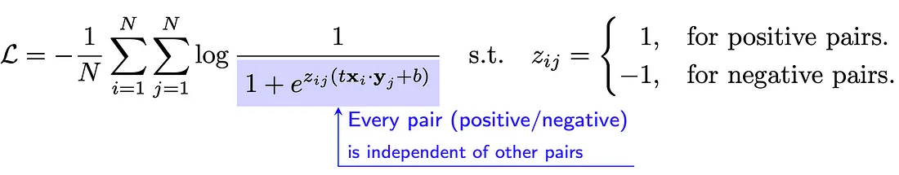
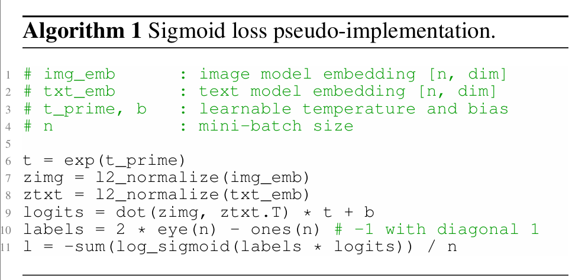
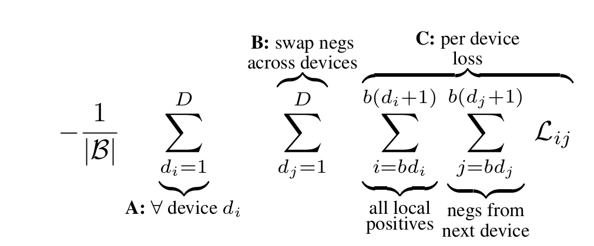
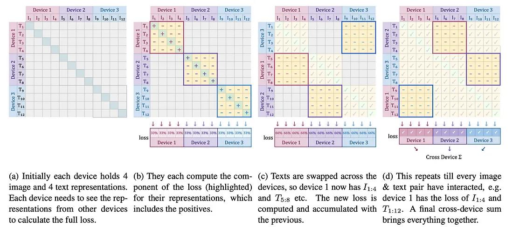
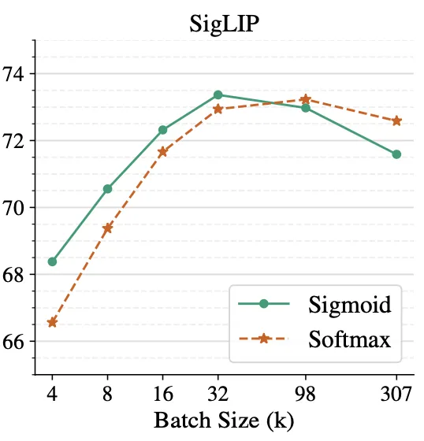
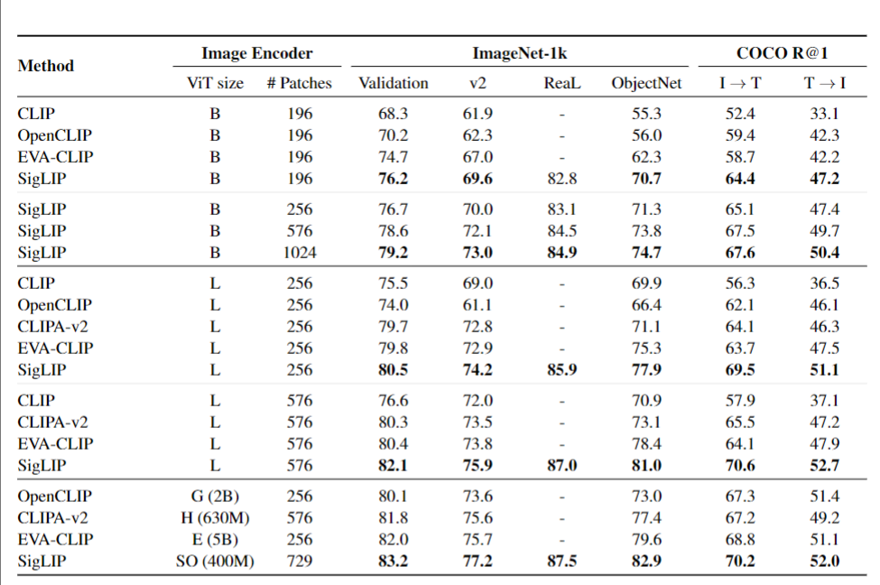

> **论文：Sigmoid Loss for Language Image Pre-Training**
>
> **论文链接：<https://arxiv.org/pdf/2303.15343>**
>
> **可以参考的博客：https://zhuanlan.zhihu.com/p/709572492，https://blog.csdn.net/weixin\_42357472/article/details/136638067，https://zhuanlan.zhihu.com/p/714731384，https://ahmdtaha.medium.com/sigmoid-loss-for-language-image-pre-training-2dd5e7d1af84**
>
> **可以参考的视频：https://www.bilibili.com/video/BV1i6kBYEELj/?spm\_id\_from=333.337.search-card.all.click，https://www.bilibili.com/video/BV1HTzEYbEv3/?spm\_id\_from=333.337.search-card.all.click，https://www.bilibili.com/video/BV14NZBYTEU8/?spm\_id\_from=333.337.search-card.all.click**

# 1. **SigLIP 概述**

## 1.1 SigLIP 的**背景与动机**

> 视觉-语言对比预训练（如 CLIP、ALIGN）通过对齐图像-文本嵌入成为主流，**但传统 softmax 损失存在缺陷：需全局归一化，计算复杂，内存成本高**（依赖 $$∣B∣×∣B∣$$相似度矩阵）
>
> SigLIP 是一种用于视觉-语言预训练的新方案，核心是在 CLIP 架构中**引入 pairwise sigmoid 损失，替代传统的 softmax contrastive loss**，以提升训练效率和性能表现。与传统 softmax 对比损失不同，它**无需全局归一化，仅基于图像-文本对操作，提升了内存效率和分布式实现的简便性**
>
> 该损失在小 `batch_size`（<16k）时表现优于 softmax，且支持更大 `batch_size`（高达 100w, 32k 已足够达到接近最优性能）。结合 Locked-image Tuning，仅用 4 个 TPUv4 芯片训练两天的 SigLiT 模型实现了 84.5% 的 ImageNet 零样本准确率。此外，多语言版本 mSigLIP 在 36 种语言的跨模态检索任务中表现优异，且模型对数据噪声的鲁棒性更强

## 1.2 CLIP 的局限性

**参考：[ CLIP ](https://kcnd4kn8i6ap.feishu.cn/wiki/XN8MwI8CliF1iKk50RlcXTqTnBg)**

> CLIP 使用图像-文本对通过对比损失预训练网络。这种方法具有多个优势：
>
> 1. 通过爬取互联网数据，收集图像-文本对数据集的成本相对较低
>
> 2. 支持零样本迁移到下游任务（如图像分类/检索）
>
> 3) 性能随模型和数据集的规模扩展，即更大的网络和数据集带来更好的性能
>
> 在训练过程中，CLIP 联合训练一个图像编码器和一个文本编码器，以预测一批`（图像，文本）`训练样本的正确配对。在测试过程中，学习到的文本编码器通过嵌入目标数据集类别的名称或描述，生成一个零样本线性分类器

> 然而，CLIP 存在两个技术挑战：
>
> 1. **它需要大批量训练。**&#x4F8B;如，CLIP 使用了 32K 的批量大小，这需要大量的 GPU
>
> 2. **它需要这些 GPU 之间进行大量通信。**&#x5177;体来说，图像和文本特征都需要在所有 GPU 之间进行全收集操作（all-gather）。考虑到所需的大批量，这种通信量非常大
>
> 这些主要是因为**其使用的基于 softmax 损失函数本身具有的问题**，给定正样本对（图像-文本）的损失依赖于对 batch 中的所有负样本对进行 normalize，如下图所示：

> CLIP 使用 softmax 操作，**每个正样本对的相似度通过所有负样本对进行归一化**。因此，**每个 GPU 需要维护一个$$N\times N $$的矩阵来存储所有成对相似度**，这为 CLIP 带来了二次复杂度
>
> 其中，$$N$$表示批量大小（正样本对的数量），$$x $$表示图像特征，$$y $$表示文本特征，$$t $$是一个标量温度超参数，用于控制 softmax 输出的锐度/平滑度
>
> 上述公式中有两个关键细节：
>
> 1. CLIP（softmax）**损失是非对称的**，第一项为给定查询图像找到最佳匹配文本，而第二项为给定查询文本找到最佳匹配图像
>
> 2. CLIP（softmax）损失需要**全局归一化因子**（高亮的分母），这引入了二次内存复杂度，是一个 NxN 的成对相似度矩阵
>
> 总结：通过图像-文本双向 softmax 归一化，**需两次全局归一化，依赖全批量信息，内存效率低**

# 2. **SigLIP 方法**

## 2.1 **SigLIP 的loss**

> SigLIP 减少了 CLIP 对大批量的需求，SigLIP 的核心思想是使用 sigmoid 操作替代 softmax 操作
>
> 与 CLIP 相比，SigLIP **既不是非对称的，也不需要全局归一化因子。因此，每个样本对（正样本或负样本）的损失独立于小批量中的其他样本对**，如下图所示：

> Sigmoid 损失：将**任务转化为二元分类，对正样本（匹配对）和负样本（非匹配对）分别计算损失**，其中$$z_{ij}=1$$（正样本，即图文匹配）或 $$-1$$（负样本，图文不匹配），引入可学习温度$$t $$和偏置$$b$$避免初始优化波动
>
> * 每个 image-text pair 的正 / 负关系直接计算，**不局限于 batch 全局 normalization**
>
> * **对数 sigmoid 简化运算**，显著节省内存和通信时间

> SigLIP 使用 sigmoid 操作，**每个图像-文本对（正样本或负样本）独立评估。不需要维护全局的 NxN 归一化矩阵。因此，SigLIP 的损失可以逐步计算，适合大批量训练**
>
> 值得注意的是，CLIP 和 SigLIP 都计算小批量中每个样本对（正样本/负样本）的相似度。然而，两者的内存需求存在细微差异。对于 CLIP，每个 GPU 需要维护一个 $$N\times N$$的矩阵来存储所有成对相似度，以便对正样本对进行归一化。而对于 SigLIP，由于每个正/负样本对是独立的，因此不需要维护 NxN 矩阵
>
> **另一种理解 CLIP 和 SigLIP 之间差异的方法是检查它们的问题表述:**
>
> * 给定查询图像$$I$$，**CLIP 解决一个多分类问题**，将图像$$I$$分配给其对应的正文本$$T$$，而忽略 batch 中的所有其他负文本
>
> * 相反，**SigLIP 解决一个二分类问题**，为正样本对$$  (I, T)  $$分配正标签，为所有其他对分配负标签。因此，CLIP 计算全局归一化因子，而 SigLIP 不需要

## 2.2 SigLIP的高效实现

> * 一般进行对比学习训练的时候会使用数据并行，CLIP 的基于 softmax 的损失函数需要**在所有 GPU 之间传递图像和文本特征以计算$$N\times N$$归一化矩阵**，这**需要两次 all-gathers 操作, GPU 之间的通信需求很高**
>
> * 相比之下，**SigLIP 只需要在所有 GPU 之间传递文本特征以计算所有成对相似度。这只需要一次 all-gathers 操作**
>
> 然而，all-gathers 操作仍然很昂贵，因为所有 GPU 在接收所有特征之前都会保持空闲状态以计算损失，因此，SigLIP 提出了一种高效的分块实现
>
> **Sigmoid 损失特别适合一种内存高效、速度快且数值稳定的实现方式，这种方式能够同时缓解上述两个问题。高效实现的目标是逐步进行损失计算和特征通信，简单来说就是将 batch 拆分到多设备，通过设备间交换负样本分块计算损失，避免全局矩阵存储：**
>
> 将每个设备上的批量大小记为 $$b=\frac{|B|}{D}$$，则该损失可重新表述为下图的公式

> 方法的具体流程如下：
>
> 1. 首先，计算与正样本对以及$$b-1$$个负样本对 对应的损失分量
>
> 2. 然后，在设备间对 embedding 进行置换，使每个设备从相邻设备获取负样本（即求和项 B 的下一轮迭代）
>
> 3. 接着，针对这部分样本块计算损失（求和项 C）。上述过程在每个设备上独立进行，因此每个设备仅需基于其本地批量 $$b$$计算损失
>
> 4. 之后，只需在所有设备上对损失进行求和即可（求和项 A）
>
> 单个集合置换操作（用于求和项 B）速度很快（实际上，D 次集合置换通常比 D 个设备间的两次 all-gathers 操作更快），且**任一时刻的内存成本都从 $$|B|^2$$降至 $$b^2$$**（针对求和项 C）。由于原始损失计算与批量大小呈二次关系，其会迅速成为缩放的瓶颈。而这种分块方法能够**在相对较少的设备上支持超过 100 万的批量大小进行训练**

> 在 3 个 GPU 和全局 batch size 大小为 12 的玩具设置中（上图）演示的高效 SigLIP。没有全收集操作，任何时候只有亮黄色方块（大小为 4×4）被实例化在内存中，分块实现可以总结为每个 GPU（设备）的以下步骤：
>
> 1. 计算其本地文本和图像特征的损失
>
> 2. 从单个相邻 GPU 接收文本特征
>
> 3) 使用其本地图像特征和相邻 GPU 的文本特征计算新的损失
>
> 4) 将新计算的损失累加到总损失中
>
> 5. 重复步骤 2，直到所有相邻 GPU 传递完其文本特征

# 3. **SigLIP 实验**

在实验部分，SigLIP（sigmoid）与 CLIP（softmax）进行了对比评估。在预训练模型后，报告了 ImageNet 上的零样本性能，比较了 SigLIP 和 CLIP 在不同预训练批量大小下的 ImageNet 零样本性能。主要发现如下：

1. 在小批量（例如 4-8K）情况下，SigLIP 的性能优于 CLIP；这一点很重要，因为许多研究人员缺乏大批量训练的计算资源（GPU）

2. 尽管相关文献声称大批量可以提高性能，但本文表明，SigLIP 和 CLIP 在 32K 批量大小时达到饱和

3) 随着批量大小的增加，SigLIP 和 CLIP 之间的性能差距逐渐缩小

# 4. **SigLIP 代码**

官方实现：https://github.com/huggingface/transformers/blob/main/src/transformers/models/siglip/modeling\_siglip.py

# 5. **SigLIP 的关键问题**

> 1. Sigmoid 损失**相比传统 softmax 损失的核心优势是什么？&#x20;**
>
>    Sigmoid 损失无需全局批量归一化，仅基于图像 - 文本对独立计算，简化了分布式实现；内存效率更高；在小批量（<16k）时性能更优，且支持更大批量（如 100 万）；对数据噪声的鲁棒性更强
>
> 2. 语言-图像预训练中，批量大小对模型性能的具体影响是什么？&#x20;
>
>    32k 批量性能接近最优，小批量（<16k）时 Sigmoid 损失显著优于 softmax；超大规模批量（如 100 万）增益微弱，甚至因优化不稳定导致性能下降；多语言场景中，32k 批量同样是最优选择
>
> 3. SigLiT 与 SigLIP 的核心区别是什么，各自适用于什么场景？&#x20;
>
>    SigLiT 冻结预训练视觉模型，仅训练文本模型，资源需求低（如 4 TPUv4 即可），适用于有限资源场景；SigLIP 从零训练视觉和文本模型，性能更高但资源需求大（如 32 TPUv4），适用于追求高精度的场景
