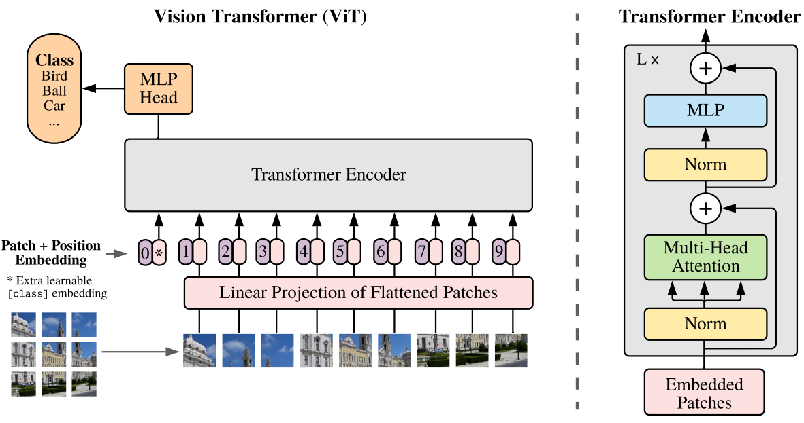
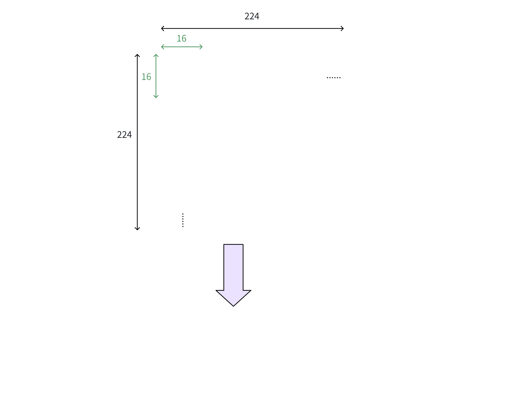
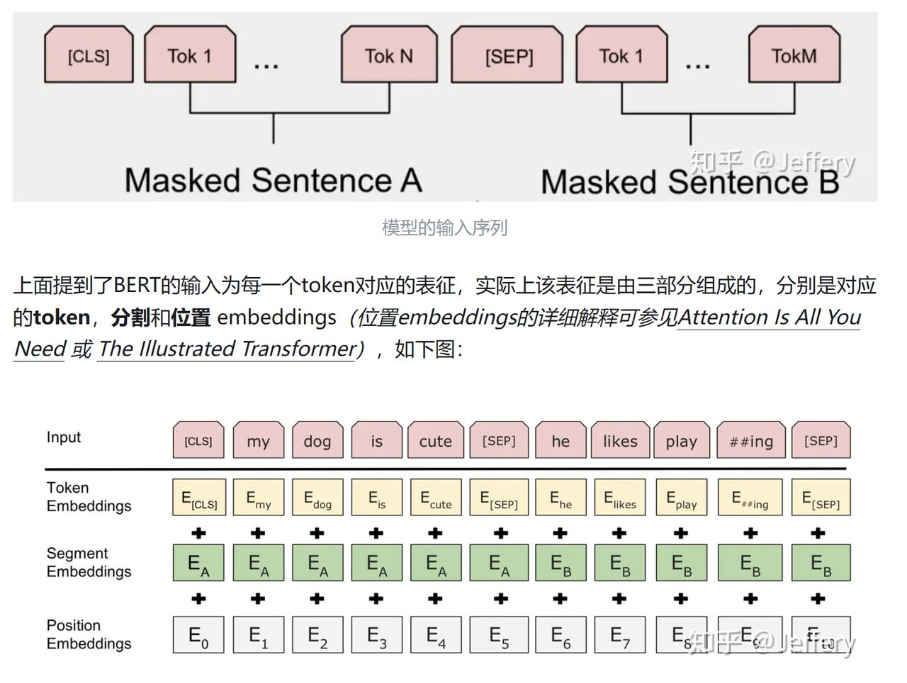
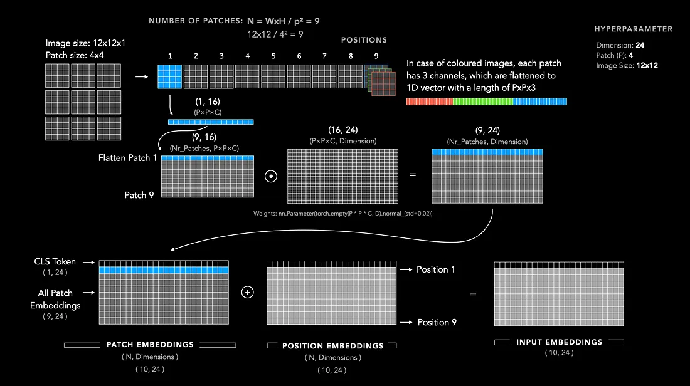
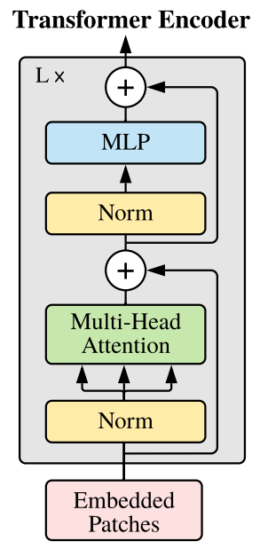
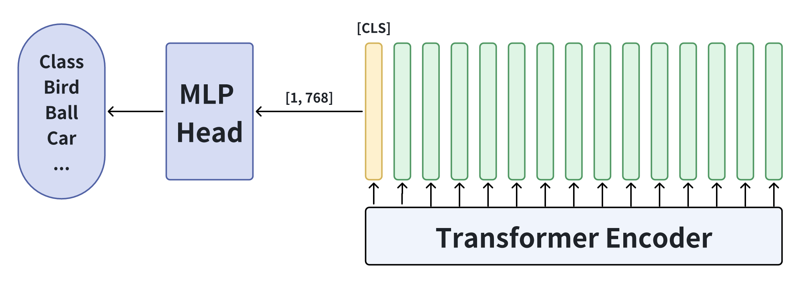
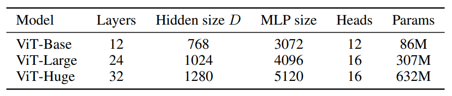

> **论文：An Image Is Worth 16x16 Words: Transformers For Image Recognition At Scale**
>
> **论文链接：https://arxiv.org/abs/2010.11929**
>
> **可以参考的博客：https://zhuanlan.zhihu.com/p/427388113，https://zhuanlan.zhihu.com/p/640013974，https://medium.com/%40frederik.vl/understanding-vision-transformers-vit-70ca8d817ff3，[A Visual Guide to Vision Transformers ​](https://blog.mdturp.ch/posts/2024-04-05-visual_guide_to_vision_transformer.html)，https://zhuanlan.zhihu.com/p/370979971，[ViT论文复现笔记](https://palind-rome.github.io/2025/04/18/ViT%E8%AE%BA%E6%96%87%E5%A4%8D%E7%8E%B0%E7%AC%94%E8%AE%B0/)**
>
> **可以参考的视频：[ViT论文逐段精读【论文精读】\_哔哩哔哩\_bilibili](https://www.bilibili.com/video/BV15P4y137jb/?spm_id_from=333.337.search-card.all.click)**

# 1. **ViT 的背景和意义**

> Transformer 最早在 2017 年的《Attention Is All You Need》中提出，通过自注意力机制彻底改变了自然语言处理（NLP）的格局。2020 年，Google团队首次将 Transformer 结构应用于图像识别，提出 **Vision Transformer (ViT)，并在大规模预训练下，ViT 超越传统 CNN，在 ImageNet 等任务上取得 SOTA 结果**，证明了纯 Transformer 在视觉领域的潜力。这标志着视觉网络架构进入**由卷积向注意力机制主导的新时代**

# 2. **ViT 模型结构详解**

> 如下图所示，ViT 的整体架构可以分为三大模块，核心思想是**将图像分割成多个固定大小的小块（patches）**，并将这些小块视为序列输入到 **Transformer Encoder** 中。同时借鉴类似BERT的结构，ViT 在序列的前面增加了一个用于**分类的 CLS token**，最后在分类任务上可以**使用 CLS token 学习到的语义特征通过一个 MLP Head 进行分类**

> * **Linear Projection of Flattened Patches：**&#x45;mbedding层，Embedding + Position Embedding + CLS token
>
> * **Transformer Encoder：**&#x63D0;取图像特征，叠加 N 个 Transformer Encoder Block
>
> * **MLP Head：**&#x5206;类头，使用 CLS token作为输入，输出分类结果

> **ViT动态演示视频**如下：

[5343dd80-72eb-11ec-b388-ba3d1869bcc4.mp4]()

## 2.1 **输入处理**

### 2.1.1 **Patch Embedding**

> ### **Patches 图像分块**
>
> Transformer 的输入要求是**二维矩阵`[num_token, token_dim]`**，其&#x4E2D;**`num_token`是序列长度**，**`token_dim`是序列中每个 token 的向量维度**，而**图像的格式是三维矩阵`[H, W, C]`，长、宽和通道数**。为了将图像转换为 Transformer 所需的格式，ViT 首先对图像进行了分块，将输入图&#x50CF;**`[H, W, C]`**&#x6309;固定大&#x5C0F;**`[P, P]`**&#x5212;分为$$H\times W / P^2$$个 patches
>
> 以 ViT-Base-16 为例，原始图像的尺寸&#x662F;**`[224, 224, 3]`，**&#x33; 表示RGB三通&#x9053;**，**&#x4F7F;&#x7528;**`[16, 16]`**&#x7684; patch 大小进行划分，总共被划分&#x4E3A;**`(224/16)^2 = 14x14 = 196` 个 patches，**&#x6BCF;个 patch 的形状为 **`[16, 16, 3]`**

> ### **Patch Embedding 线性映射**
>
> 得到分块操作之后的 patches ，每个 patch 在进入线性映射层之前会被展平（flatten），从三维向量的 patch 变成一维向量 token，即形状&#x4ECE;**`[16, 16, 3]`**&#x5230;**`[768]`**
>
> 在实际代码中，这一步通过一个卷积层(或者等价的全连接层)实现。卷积核大小&#x4E3A;**`16x16`**，步距&#x4E3A;**`16`**。输入 **`[224, 224, 3]`** 经过卷积后得&#x5230;**`[14, 14, 768]`**，然后展平为 **`[196, 768]`**

> ### **选择 Patch Size&#x20;**$$P$$**&#x20;的权衡**
>
> Patch size 直接决定模型的 token 数量 N，从而影响计算量、内存需求、及表达能力
>
> #### 较小的 Patch（如 8×8 或更小）
>
> * **优势**：
>
>   * 每个 token 覆盖更小的图像区域，更细粒度的特征提取，更容易捕捉边缘、纹理等局部细节
>
>   * 增强表达能力，能更好处理复杂图像结构
>
> * **劣势**：
>
>   * token 数 N 增多，使自注意力复杂度 $$O(N^2)$$显著增加
>
>   * 占用更多显存与计算资源，训练慢且消耗大
>
> #### 较大的 Patch（如 16×16、32×32或更大）
>
> * **优势**：
>
>   * token 数较少，计算更高效，训练资源消耗低；
>
>   * 对全局结构建模更直接，速度快
>
> * **劣势**：
>
>   * **粗粒度代表图像内容，可能遗漏精细特征（但其实在图像信息中会有大量冗余信息，所以一般来说可以取大一些的 patch size）**
>
>   * 某些任务性能下降，识别小物体、纹理等能力受限

### 2.1.2 **Class Token**

> 这里主要是参考BERT，**ViT 在 patch embedding 后的序列前插入一个可训练的`[CLS]` token**，用于后续的分类任务。该token与其他token拼接，得到形状&#x4E3A;**`[197, 768]`**&#x7684;序列，&#x5373;**`[CLS]` token形状是`[1, 768]`**。`[CLS]`token 在 Transformer Encoder 的**双向注意力机制**下进行训练，最后模型学习到的`[CLS]` 的输出**聚合了整个序列的信息，可以代表整个序列的特征，也就是整个图像的特征**，然后使用该特征维度应用到分类任务

### 2.1.3 **Position Embedding**

> 为了保留图像的位置信息，ViT 引入了**可训练的 1D 绝对位置编码**，直接叠加在 token embedding 上，其shape 与 token embedding 相同，即`[197, 768]`，可以**学习图像位置相关的语义信息**

**整体输入处理流程示意图**

图源：https://medium.com/%40frederik.vl/understanding-vision-transformers-vit-70ca8d817ff3

## 2.2 **Transformer Encoder**

> Transformer Encoder 主要用来进行特征提取，由**多个 Encoder Block堆叠而成**，&#x5728;**&#x20;ViT-Base 中是12个 Block**，每个Encoder Block包含两个部分：**LayerNorm + MHA +残差，LayerNorm + MLP +残差**

> 1. **Layer Norm：**&#x5BF9;每个token进行归一化处理，保持数值稳定。一般来说，**Batch Norm适用于CV**，**Layer Norm适用于NLP**。关键是要看需要保留什么信息，举个例子就明白
>
>    * NLP 中，`['搜推yyds', 'LLM大法好', 'CV永不为奴']`三句话做样本间 normalization，假设一个词是一个token，Batch Norm效果是`['搜', 'L', 'C']`, `['推', 'L', 'V']` ...做归一化；Layer Norm是三句话分别各自归一化；前者归一到同一分布后变无法保留一个句子里的分布信息了（比如`'搜推yyds'`用Batch Norm后就变了），而Layer Norm可以成功保留上下文分布信息
>
>    * CV 中Batch Norm是对一个图像的不同channel（比如RGB通道）各自进行归一化，本身CV任务不需要channel之间的信息交互，归一化后仅保留各channel的分布信息作后续判断即可
>
>    * 但是在 ViT 这里，是**将图像分块后，切割成了 patch，每个patch当做是一个词/token，更加关注的是 patch 之间的语义信息**
>
> 2. **Multi-Head Attention：**&#x591A;头自注意力机制，用于捕捉token之间的关系。对输入序列（包括 patch embeddings 与 `[CLS]` token）进行 Q、K、V 线性映射，执行如下计算，并行执行多头注意力（H 头），每个头可捕捉不同角度的语义关系，最后 concat 并线性映射输出：
>
>    $$Q_i = X W_i^Q,\quad K_i = X W_i^K,\quad V_i = X W_i^V$$
>
>    $$\text{Attention}(Q_i, K_i, V_i) = \text{softmax}\left( \frac{Q_i K_i^\top}{\sqrt{d_k}} \right) V_i$$
>
> 3. **残差连接：transformer结构一般会堆叠多个block，产生类似神经网络深度增加的优化问题**。**残差链接**提供**梯度回传的高速公路，一开始残差块的影响比较小，这样梯度也可以很好的回传到输入，即使网络很深，随着训练继续，残差块的梯度逐渐扩大影响**。加法会平等的分散梯度。这样的话，至少在初始化的时候，梯度是可以很好的从监督信号回传到输入，从而避免因为很深的网络对优化的难度
>
> 4. **Dropout/DropPath：**&#x7528;于防止过拟合。原论文中使用Dropout，部分实现中使用DropPath（随机深度）
>
> 5. **MLP Block：**&#x7531;两个全连接层、GELU激活函数和Dropout组成。第一个全连接层将输入维度扩展到4&#x500D;**`[197, 768] -> [197, 3072]`**，第二个全连接层将其还&#x539F;**`[197, 3072] -> [197, 768]`，先升维再降维的操作可以增强特征表达的能力**
>
> Transformer Encoder的输出与输入shape保持一致。以ViT-Base-16 为例，输入 `[197, 768]`，输出仍为` [197, 768]`，且在 Encoder 后还有一个Layer Norm层

## 2.3 **MLP Head**

> Transformer Encoder的输出中，只需要提取`[class]`token 对应的结果（`[1, 768]`）。MLP Head 用其作为输入，输出分类的 logits ，映射到最终的分类结果。MLP Head 的具体结构如下：
>
> 1. **训练ImageNet21K时：**&#x4C;inear + tanh激活函数 + Linear
>
> 2. **迁移到ImageNet1K或其他数据集时：**&#x4EC5;使用一个Linear层

> ### **Pooling**
>
> 除了使用 `[CLS]` token 做分类，也可以用 pooling 的方法来做分类
>
> #### 2.3.1 **全局平均 pooling (GAP)**
>
> * 丢弃 `[CLS]`，直接对所有 patches（最终 layer 输出）做均值 pooling
>
> * 得到的向量通过 LayerNorm+MLP 进行分类
>
>   * **优势**：
>
>     * 翻译不变性，能更稳健处理拥有位移的特征
>
>     * 实验表明 patch tokens 均值聚合在分类任务上“常胜”于 `[CLS]` token。参考 https://proceedings.neurips.cc/paper\_files/paper/2023/file/7dd309df03d37643b96f5048b44da798-Paper-Conference.pdf
>
>   * **劣势**：
>
>     * 舍弃了由 Transformer 层训练的 `[CLS]` 聚合信息，依赖 token 内部 feature 分布
>
> #### 2.3.2 **多头注意力 pooling (MAP)**
>
> * 引入一个 learnable query 向量，通过多头注意力机制从 patch tokens 池中“关注”信息
>
> * 输出为新的聚合向量，类似增强版的 pooling 方法。参考 https://arxiv.org/pdf/2212.04114
>
>   * **优势**：能够根据 token 内容自适应聚焦，灵活提取有用信息
>
>   * **劣势**：引入额外参数，计算复杂度高，实际提升有限，采用较少

# 3. **ViT 代码**

## 3.1 **Simple ViT**

## 3.2 **Huggingface Transformers ViT 实现**

Huggingface 实现：https://github.com/huggingface/transformers/blob/main/src/transformers/models/vit/modeling\_vit.py

需要注意的是下面的代码中，使用的是 post norm，即在残差之后再进行 Layer norm

# 4. **ViT 训练**

## 4.1 **ViT 模型参数**

> ViT 原文设计了三个模型：Base、Large 和 Huge。此外，源码中还提供了 Patch Size 为 16x16 和 32x32 的配置。
>
> * **Layers:** 决定了模型的深度，层数越多，模型的表达能力越强，但计算复杂度也越高
>
> * **Hidden Size:&#x20;**&#x51B3;定了每个 token 的向量维度，维度越大，模型的表达能力越强
>
> * **MLP Size:&#x20;**&#x51B3;定了 MLP Block 的第一个全连接层的节点数，通常是 Hidden Size 的四倍
>
> * **Heads:&#x20;**&#x51B3;定了 Multi-Head Attention 的头数，头数越多，模型可以捕捉到更多的特征信息
>
> * **Patch Size:&#x20;**&#x51B3;定了图像被分割成多少个 patch，patch 越小，模型可以捕捉到更多的细节信息

## 4.2 **ViT 训练数据集**

| **类别**      | **数据集名称**            | **描述**              |
| ----------- | -------------------- | ------------------- |
| **预训练数据集**  | ILSVRC-2012 ImageNet | 1k 类别，130万张图像       |
|             | ImageNet-21k         | 21k 类别，1400万张图像     |
|             | JFT                  | 18k 类别，3.03亿张高分辨率图像 |
| **下游任务数据集** | ImageNet (ReaL)      | 原始验证标签和清洗后的 ReaL 标签 |
|             | CIFAR-10             | 10 类别的低分辨率图像数据集     |
|             | CIFAR-100            | 100 类别的低分辨率图像数据集    |
|             | Oxford-IIIT Pets     | 宠物图像数据集             |
|             | Oxford Flowers-102   | 102 类别的花卉图像数据集      |

## 4.3 **ViT 训练细节**

### 4.3.1 **预训练**

> 1. **预训练目标**：以图像分类为监督任务，使用`[class]`标记的输出通过MLP分类头进行预测
>
> 2. **数据规模影响：**&#x5C0F;数据集（如 ImageNet）ViT 性能略低于 ResNet，大数据集（如 JFT-300M）则显著反超
>
>    **关键处理**：所有预训练数据集均针对下游任务的测试集进行去重处理，避免数据重叠影响迁移效果
>
> 3. **迁移流程**：在大规模数据集（ImageNet-21k、JFT）上预训练后，去除预训练头，替换为随机初始化的线性层，迁移至下游任务并微调。
>
> 4. **训练参数设置：**
>
>    * **优化器**：使用Adam优化器（β₁=0.9，β₂=0.999），在ResNet对比实验中发现Adam比SGD更适合预训练迁移
>
>    * **学习率调度**：所有模型采用线性或余弦衰减，并搭配10k步的 Warmup
>
>    * **正则化**：在小数据集（如ImageNet）上增加权重衰减（0.3）和dropout（0.1），缓解过拟合；大规模数据集（JFT）则使用较低正则化（权重衰减0.1，无dropout）
>
>    * **输入分辨率**：预训练时统一使用224×224分辨率，微调时再提升至更高分辨率（如384×384或512×512）以提升性能

| **模型类型**    | **数据集**      | **训练epochs** | **基础学习率** | **学习率衰减** | **权重decay** | **dropout** | **batchsize** |
| ----------- | ------------ | ------------ | --------- | --------- | ----------- | ----------- | ------------- |
| ViT-B/16/32 | JFT-300M     | 7            | 8×10⁻⁴    | 线性衰减      | 0.1         | 0.0         | 4096          |
| ViT-L/32    | JFT-300M     | 7            | 6×10⁻⁴    | 线性衰减      | 0.1         | 0.0         | 4096          |
| ViT-L/16    | JFT-300M     | 7/14         | 4×10⁻⁴    | 线性衰减      | 0.1         | 0.0         | 4096          |
| ViT-H/14    | JFT-300M     | 14           | 3×10⁻⁴    | 线性衰减      | 0.1         | 0.0         | 4096          |
| ViT-B/16/32 | ImageNet-21k | 90           | 10⁻³      | 线性衰减      | 0.03        | 0.1         | 4096          |
| ViT-L/16/32 | ImageNet-21k | 30/90        | 10⁻³      | 线性衰减      | 0.03        | 0.1         | 4096          |
| ViT-\*      | ImageNet     | 300          | 3×10⁻³    | 余弦衰减      | 0.3         | 0.1         | 4096          |

### 4.3.2 **微调迁移**

> 1. **模型调整：**
>
>    * 在大规模数据集上预训练后，去除预训练的 MLP 分类头，替换为随机初始化的线性层，输出维度调整为下游任务目标类别数
>
>    * 对于 ViT，保留 `[class]` 标记和 Transformer 编码器参数，仅更新分类头；混合模型（CNN+ViT）则冻结 CNN 部分，微调 Transformer 组件
>
> 2. **训练策略：**
>
>    * **参数冻结：仅微调分类头，或在高数据场景下微调全部参数（如 ImageNet）**
>
>    * **分辨率适配：**&#x5FAE;调时使用更高分辨率图像，通过 **2D 插值调整预训练的位置嵌入**，保持空间信息（如 ViT-L/16 在 ImageNet 微调时使用 512×512 分辨率）

# 5. **ViT 与 CNN**

> 1. **ViT 与 CNN 的架构差异**
>
>    1. **感受野定义方式**
>
>       * **CNN**：通过**堆叠卷积层与 pooling 构建局部连接**，形成**逐层扩大的感受野，具备固定的平移不变结构**
>
>       * **ViT**：将图像切&#x6210;**&#x20;patch token** 后，全&#x5C40;**&#x20;token 间自注意力机制自动形成可变感受野，能捕获长程依赖**
>
>    2. **参数共享 vs 灵活加权**
>
>       * CNN 利用共享卷积核降低参数、提高平移等性质
>
>       * ViT 的每个 token 对其他所有 token 都有独立注意力权重，能更灵活地强化关键区域
>
>    3. **计算复杂度**
>
>       * **CNN**：卷积是局部操作，计算复杂度呈线性增长，适用于移动设备部署
>
>       * **ViT**：全局 attention 的计算复杂度为 O(N^2)，在高分辨率下消耗大；可通过 window attention、Hybrid Stem（小卷积 + attention）等方式优化
>
> 2. **数据效率和依赖**
>
>    * **归纳偏置 Inductive Bias：**&#x56;iT 相比 CNN 缺乏翻译等变性和局部性等归纳偏置，但大规模预训练可弥补这一不足。即 ViT 对数据量依赖更高，在大数据集上表现优越，但中小数据集上需借助预训练、自监督或 混合结构
>
>      > 我们希望算法从有限的数据中学到一个“普遍适用”的规则，但因为数据是有限的，光靠数据是不够的。**归纳偏置**就是算法的“预设立场”或“先验知识”，它告诉算法应该偏好哪种类型的解释或模型
>
>    * **混合架构：**&#x4E5F;可将 CNN 的特征图作为输入序列，形成混合模型，在小计算量时性能略优
>
> 3. **表达能力与泛化性**
>
>    1. **ViT 优势**：
>
>       * 擅长捕捉全局关联与远程上下文，对遮挡、变形等更鲁棒
>
>       * 在大规模数据监督或自监督训练下的效果优异
>
>    2. **CNN 强项**：
>
>       * 局部细节提取更精准，适合边缘检测与纹理模式的学习
>
>       * 适用于密集预测任务（如 segmentation/detection）
>
> 4. **ViT 在大规模预训练时为何能超越 CNN？**
>
>    * 虽然 ViT 缺乏 CNN 的归纳偏置，但大规模数据（如 JFT-300M）提供了足够的信息让模型直接学习图像特征，而 Transformer 的可扩展性和全局注意力机制在处理大量数据时更具优势
>
> 5. **ViT 在小数据集上的表现如何？为什么？**
>
>    * 在小数据集（如 ImageNet）上，ViT 性能通常略低于 ResNet。因为 ViT 缺乏 CNN 的局部性和翻译等变性等归纳偏置，在数据量不足时泛化能力较弱
>
> ViT 的核心在于把图像看作 patch token 序列，用 Transformer 解码器层提取全局信息，再通过 `[CLS]` token 或 pooling 层输出分类结果。其架构结构清晰、模块统一，可高度并行，容易集成预训练与多模态训练策略，这些也使得 ViT 在现代视觉任务中获得快速推广与持续优化
