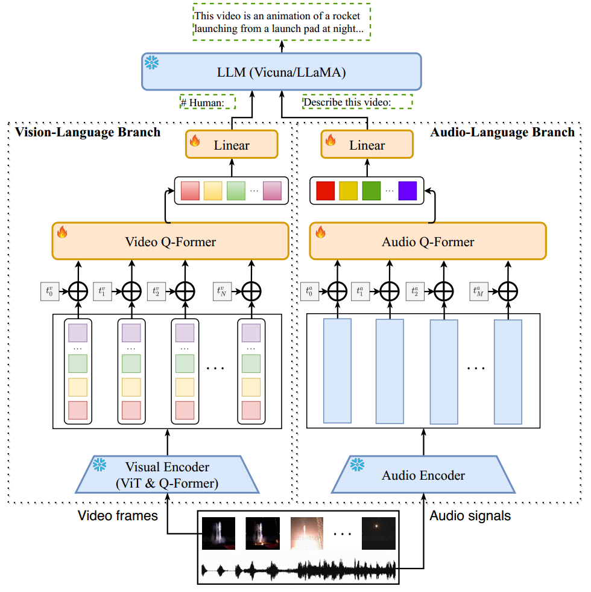
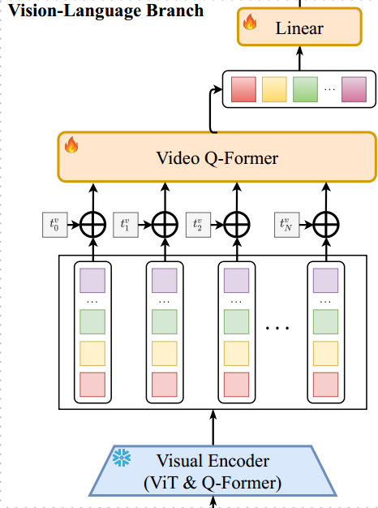
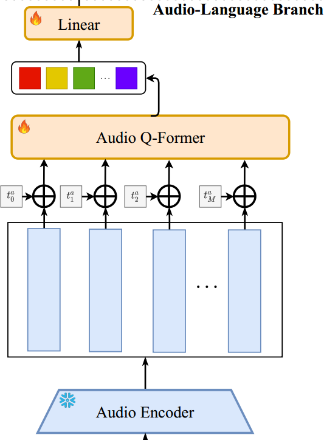

* [ ] 优化排版和内容

论文名称：Video-LLaMA: An Instruction-tuned Audio-Visual Language Model for Video Understanding

论文地址：https://arxiv.org/abs/2306.02858

代码：https://github.com/DAMO-NLP-SG/Video-LLaMA

#### 视觉-语言分支

视觉-语言分支旨在使LLM能够理解视觉输入。如上图左侧所示，该分支由以下组件构成：

1. **预训练图像编码器**：从视频帧中提取特征。

2. **位置嵌入层**：为视频帧注入时间信息。

3) **视频Q-Former**：聚合帧级表示。

4) **线性层**：将视频表示投影到与LLM文本嵌入相同的维度。

**流程**：

* 给定一个包含N帧的视频，vision encoder将每帧映射为$$K_f$$个图像嵌入向量，生成视频帧表示$$V = [v_1, v_2, ..., v_N]$$，其中$$v_i ∈ R^{K_f ×d_f}$$表示第$$i$$帧的$$d_f$$维图像嵌入。

* 由于图像编码器生成的帧表示未考虑时间信息，我们通过位置嵌入为不同帧注入时间信息。

* 将位置编码后的帧表示输入视频Q-Former（与BLIP-2中的Query Transformer架构相同），生成$$k_V$$个维度为$$d_v$$的视频嵌入向量$$\hat{v} ∈ R^{K_f ×d_f}$$。

* 通过线性层将视频嵌入向量转换为视频查询向量，其维度与LLM的文本嵌入相同。在前向传播中，视频查询向量与文本嵌入拼接，作为视频软提示，指导LLM生成基于视频内容的文本。

**实现细节**：

* 使用BLIP-2的预训练视觉组件作为冻结vision encoder，包括EVA-CLIP的ViT-G/14和预训练的Q-Former。

* 位置嵌入层、视频Q-Former和线性层随机初始化并优化，以连接冻结vision encoder和冻结LLM。

#### 音频-语言分支

音频-语言分支用于处理视频中的听觉内容，具体包括：

1. **预训练音频编码器**：从原始音频的短片段中计算特征。

2. **位置嵌入层**：为音频片段注入时间信息。

3) **音频Q-Former**：融合不同音频片段的特征。

4) **线性层**：将音频表示映射到LLM的嵌入空间。

**流程**：

* 从视频中均匀采样M段2秒的音频片段，并将其转换为128个梅尔频谱图。

* 音频编码器将每个频谱图映射为密集向量，生成音频表示$$A = [a_1, a_2, ..., a_M]$$。

* 音频Q-Former通过添加可学习的位置嵌入为音频片段注入时间信息，并生成固定长度的音频特征$$\hat{A} ∈ R^{K_a×d_a}$$。

* 通过线性层将音频特征映射到LLM的嵌入空间。

**实现细节**：

* 使用ImageBind作为audio encoder。

* 音频Q-Former与Q-Former架构相同。

#### 视觉-语言分支训练

视觉-语言分支和音频-语言分支分别训练。第一阶段使用大规模视觉-字幕数据集进行训练，第二阶段使用高质量指令跟随数据集进行微调。

**预训练阶段**：

* 使用Webvid-2M（来自股票素材网站的短视频数据集）和CC595k（来自CC3M的图像字幕数据集）。

* 采用视频到文本生成任务，即给定视频表示，提示冻结LLM生成相应的文本描述。

* 尽管部分文本描述无法完全反映视频内容，但此阶段旨在利用大量数据，使视频特征尽可能包含丰富的视觉知识。

**微调阶段**：

* 使用高质量指令数据微调模型，包括MiniGPT4的图像细节描述数据集、LLaVA的图像指令数据集和Video-Chat的视频指令数据集。

* 微调后，Video-LLaMA展现出显著的指令跟随和图像/视频理解能力。

#### 音频-语言分支训练

**挑战**：

* 直接使用音频-文本数据训练音频-语言分支非常困难，因为此类数据稀缺。

**解决方案**：

* 利用ImageBind的多模态对齐能力，使用视觉-文本数据训练音频-语言分支。

* 尽管音频接口从未在音频数据上训练，但由于ImageBind提供的共享嵌入空间，Video-LLaMA在推理时能够理解音频。
