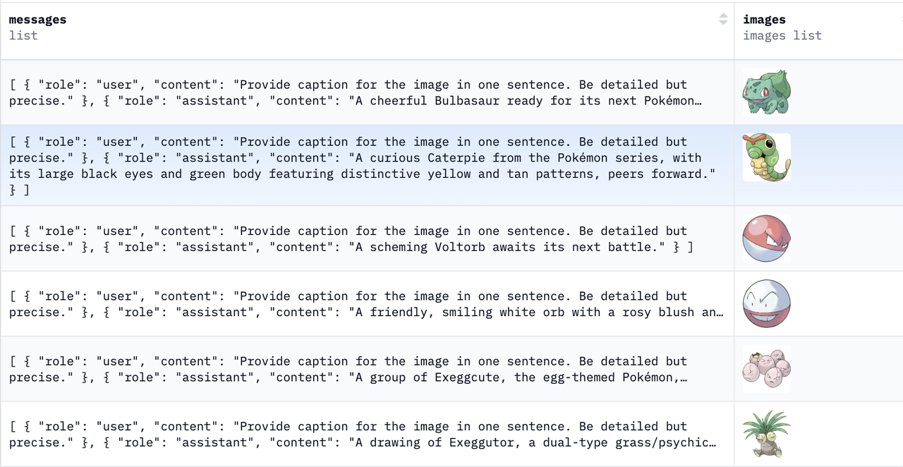

**本文档大部分的代码部分和简历模板都在代码简历子文档内，需要的同学  进行下载**

> 上一期讲了如何通过api的方式构建一套完备的多模态RAG对话系统，从今天开始，笔者将**从微调开始聊聊如何从零开始训练多模态大模型**，后续还会出有关MLLM RL、ReRank 微调等工作内容。

## **一、环境准备**

> 在开始训练前，需导入必要的库和模块，包括 `PyTorch、Datasets、ModelScope、Transformers `以及 `PEFT`组件等，另外还集成了 `SwanLab` 的回调与可视化功能。

```python
import torch
from datasets import Dataset
from modelscope import snapshot_download, AutoTokenizer
from swanlab.integration.transformers import SwanLabCallback
from qwen_vl_utils import process_vision_info
from peft import LoraConfig, TaskType, get_peft_model, PeftModel
from transformers import (
    TrainingArguments,
    Trainer,
    DataCollatorForSeq2Seq,
    Qwen2VLForConditionalGeneration,
    AutoProcessor,
)
import swanlab
import pandas as pd
```

## **二、微调数据**

> 本次训练选用的多模态数据集&#x4E3A;**`BUAADreamer/pokemon-gpt4-1k`。**
>
> 该数据集为多轮对话数据集，图片涵盖了海量的宝可梦相关的对话信息。
>
> **具体的微调数据格式如下：**

```json
[
  {
    "messages": [
    {
        "role": "user",
        "content": "Provide caption for the image in one sentence. Be detailed but precise."
    },
    {
        "role": "assistant",
        "content": "A five-pointed, star-shaped illustration of a Staryu Pokémon with a reddish center surrounded by a yellow and beige body."
    }
    ],
    "images": [
      "xxxxx"
    ]
  }
]

```



## **三、数据预处理**

### **读取 Parquet 数据**

* 利用 pandas 从本地 Parquet 文件读取多模态对话数据，并转换为 Hugging Face 格式的 `Dataset`。

```python
df = pd.read_parquet("data/train-00000-of-00001.parquet")
dataset = Dataset.from_pandas(df)
```

### **划分训练集与测试集**

* 将数据集按最后 20条记录作为测试集，其余记录用于训练。

```python
train_len = len(dataset) - 20
train_ds = dataset.select(range(train_len))
test_ds = dataset.select(range(train_len, len(dataset)))
```

### **数据预处理函数**

* 从单条样本中提取文本对话列表和可选的图像路径列表

```python
chat_messages = example["messages"]
image_paths = example.get("images", [])
```

* 拼接多模态上下文：将图像消息转为带 `type=image` 标记的用户输入，并与文本消息按照时间顺序合并。

```go
proc_messages = []
for img_path in image_paths:
    proc_messages.append({
        "role":"user",
        "content":[{"type":"image","image":img_path}]
    })
for msg in chat_messages:
    proc_messages.append({"role":msg["role"],"content":msg["content"]})
```

* 将合并后的序列除最后一条外作为上下文输入，将最后一条作为模型生成目标。

```python
input_msgs = proc_messages[:-1]
output_msg = proc_messages[-1]
```

* 通过 `apply_chat_template` 构造对话提示，通过自定义 `process_vision_info` 处理视觉数据，再由 `processor` 同步编码文本和视觉特征为张量并转为列表。

```python
text = processor.apply_chat_template(
    input_msgs, tokenize=False, add_generation_prompt=True
)
image_inputs, video_inputs = process_vision_info(input_msgs)
inputs = processor(
    text=[text], images=image_inputs, videos=video_inputs,
    padding=True, return_tensors="pt"
)
inputs = {k:v.tolist() for k,v in inputs.items()}
```

* 对目标回复进行分词后，将上下文和回复的 ID、注意力掩码拼接，并对上下文部分的标签置 `-100` 以忽略损失，必要时对序列进行截断。

```python
response = tokenizer(output_msg["content"], add_special_tokens=False)
input_ids = inputs["input_ids"][0] + response["input_ids"] + [tokenizer.pad_token_id]
attention_mask = inputs["attention_mask"][0] + response["attention_mask"] + [1]
labels = [-100]*len(inputs["input_ids"][0]) + response["input_ids"] + [tokenizer.pad_token_id]
if len(input_ids) > MAX_LENGTH:
    input_ids, attention_mask, labels = (
        input_ids[:MAX_LENGTH],
        attention_mask[:MAX_LENGTH],
        labels[:MAX_LENGTH]
    )
```

* 将拼接后的列表转换回 PyTorch 张量，输出包含文本、标签和视觉特征的完整训练样本字典。

```sql
return {
    "input_ids": torch.tensor(input_ids),
    "attention_mask": torch.tensor(attention_mask),
    "labels": torch.tensor(labels),
    "pixel_values": torch.tensor(inputs["pixel_values"]),
    "image_grid_thw": torch.tensor(inputs["image_grid_thw"]).squeeze(0)
}
```

## **四、模型配置**

> 首先下载模型，将 Qwen2-VL 生成模型加载到 GPU，并设置为 bfloat16 精度以提升显存利用效率。
>
> 同时打开输入嵌入层的梯度计算，为后续注入 LoRA 低秩适配器做好准备。

```python
model_dir = snapshot_download(
    "Qwen/Qwen2-VL-2B-Instruct",
    cache_dir="./",
    revision="master"
)

model = Qwen2VLForConditionalGeneration.from_pretrained(
    model_dir,
    device_map="auto",
    torch_dtype=torch.bfloat16,
    trust_remote_code=True
)

model.enable_input_require_grads()
```

## **五、训练配置**

### **配置LoRA**

> 指定将 LoRA 注入到注意力机制的查询、键、值和输出等投影层，并**设置秩、缩放系数和丢弃率等超参**。
>
> 通过 `get_peft_model` 将低秩适配器与原模型融合，仅需更新少量参数即可完成微调。

```sql
config = LoraConfig(
    task_type=TaskType.CAUSAL_LM,
    target_modules=[
        "q_proj","k_proj","v_proj","o_proj",
        "gate_proj","up_proj","down_proj"
    ],
    inference_mode=False,
    r=64, lora_alpha=16, lora_dropout=0.05, bias="none"
)
peft_model = get_peft_model(model, config)
```

### **配置训练参数**

* 设置输出路径、批大小、梯度累积、日志频率、训练轮数、保存频率、学习率及梯度检查点等关键超参。

```python
args = TrainingArguments(
    output_dir="./output/Qwen2-VL-2B",
    per_device_train_batch_size=4,
    gradient_accumulation_steps=4,
    logging_steps=10,
    logging_first_step=5,
    num_train_epochs=2,
    save_steps=100,
    learning_rate=1e-4,
    save_on_each_node=True,
    gradient_checkpointing=True,
    report_to="none",
)
```

## **六、启动训练**

> 以注入 LoRA 的模型和预处理后的训练集为输入，结合 Seq2Seq 数据整理器与 SwanLab 回调，调用 `trainer.train()` 进行两轮微调并实时记录可视化日志。

```python
trainer = Trainer(
    model=peft_model,
    args=args,
    train_dataset=train_ds.map(process_func),
    data_collator=DataCollatorForSeq2Seq(tokenizer=tokenizer, padding=True),
    callbacks=[SwanLabCallback(
        project="Qwen2-VL-finetune",
        experiment_name="qwen2-vl-coco2014",
        config={
            "model": model_dir,
            "prompt": "COCO Yes: ",
            "train_data_number": train_len,
            "lora_rank": 64, "lora_alpha": 16, "lora_dropout": 0.1,
        }
    )],
)
trainer.train()
```

## **七、推理验证**

> 该函数重用训练时的多模态输入构造逻辑，调用模型的 `generate` 方法生成最多 **128 个新 token**，并解码返回最终回复文本。
>
> 将保存的 `LoRA checkpoint `权重加载回主模型，并开启推理模式以冻结原参数，仅使用适配器进行生成。
>
> 遍历测试集调用 `predict` 打印模型回复，并通过 `swanlab.finish()` 结束本次实验的可视化记录。

```python
# 定义预测函数
def predict(example, model):
    proc_messages = []
    for img_path in example.get("images", []):
        proc_messages.append({"role":"user","content":[{"type":"image","image":img_path}]})
    proc_messages.extend(example["messages"])
    text = processor.apply_chat_template(proc_messages, tokenize=False, add_generation_prompt=True)
    image_inputs, video_inputs = process_vision_info(proc_messages)
    inputs = processor(text=[text], images=image_inputs, videos=video_inputs, padding=True, return_tensors="pt").to("cuda")
    generated_ids = model.generate(**inputs, max_new_tokens=128)
    trimmed = [out[len(inp):] for inp, out in zip(inputs.input_ids, generated_ids)]
    return processor.batch_decode(trimmed, skip_special_tokens=True, clean_up_tokenization_spaces=False)[0]


val_peft = PeftModel.from_pretrained(
    model,
    model_id="./output/Qwen2-VL-2B/checkpoint",
    config=LoraConfig(..., inference_mode=True)
)
```

