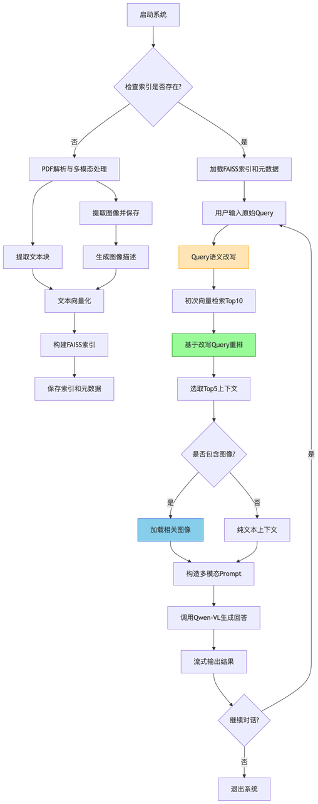
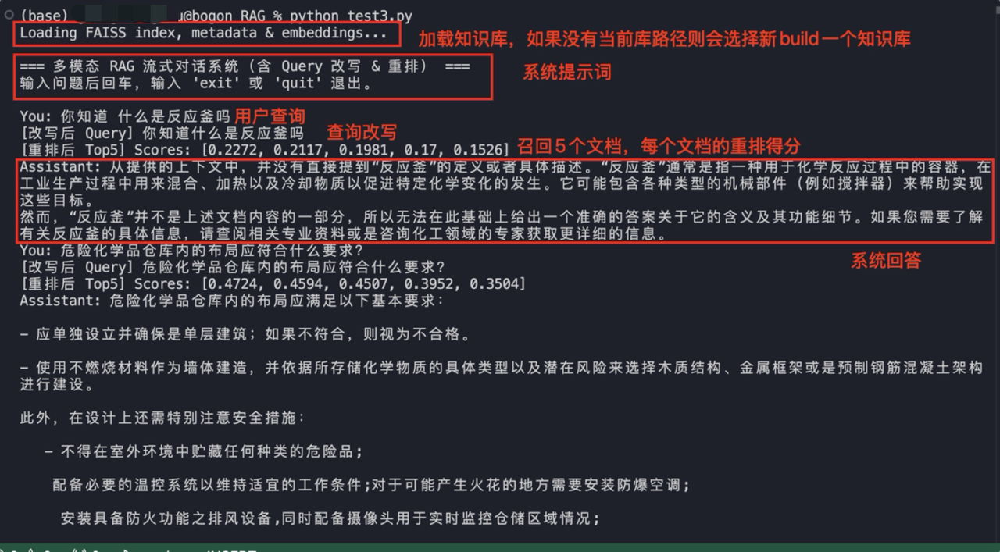

**本文档的代码部分和简历模板都在代码简历子文档内，需要的同学  进行下载**

> 本项目构建了一个支持文本与图像理解的多模态RAG对话系统。它基于 DashScope API 提供的 Qwen 文本嵌入与 Qwen-VL 多模态能力，并结合本地 FAISS 实现知识检索与问答。
>
> 其中包括了查询改写、知识库构建、embedding召回、重排、生成模块，代码非常轻量，适合入门的同学在此基础上进行魔改。




## **依赖环境**

**涵盖文本嵌入、图像处理、PDF 解析、FAISS 向量库、环境变量加载等**

```bash
pip install dashscope Pillow faiss-cpu pymupdf numpy scikit-learn python-dotenv
```


## **初始化配置**

> 加载所需模块。`fitz` 用于解析 PDF 中的文本和图像，`faiss` 用于构建向量索引，`dashscope` 是调用通义千问 API 的官方库（也可以换成OPENAI）。

```python
load_dotenv()
DASHSCOPE_API_KEY = os.getenv("DASHSCOPE_API_KEY")
dashscope.api_key = DASHSCOPE_API_KEY
```

> 配置模型参数、知识库参数

```python
DATA_DIR = "knowledge_base_multimodal"
IMAGE_SAVE_DIR = os.path.join(DATA_DIR, "extracted_images")
VECTOR_STORE_PATH = "faiss_index_qwen_api_rag"
TEXT_EMBEDDING_MODEL_ID = "text-embedding-v1"
QWEN_VL_MODEL_ID = "qwen-vl-plus"
os.makedirs(IMAGE_SAVE_DIR, exist_ok=True)
```

## **数据处理**

> 数据可以是海量的PDF，也可以是各类图片数据都可。
>
> 笔者选用的是法律法规相关的PDF，可以通过爬虫技术从国家法律法规数据库进行爬取。

### **PDF解析**

> **核心点：**
>
> * 使用PyMuPDF实现PDF结构化解析
>
> * 智能过滤短文本块（长度>30字符）
>
> * 支持PNG/JPEG/WebP等主流图像格式提取
>
> * 采用UUID生成唯一图像文件名

```python
def extract_and_index_api(data_dir, image_save_dir, index_path):
    """Extracts text/images, captions, embeddings, builds FAISS index."""
    texts_meta, images_meta = [], []
    # --- Extract from PDFs ---
    for fn in os.listdir(data_dir):
        if not fn.lower().endswith(".pdf"):
            continue
        path = os.path.join(data_dir, fn)
        try:
            doc = fitz.open(path)
            for pno in range(len(doc)):
                page = doc.load_page(pno)
                # text blocks
                for blk in page.get_text("blocks"):
                    txt = blk[4].strip()
                    if len(txt) > 30:
                        texts_meta.append({
                            "type": "text", "content": txt,
                            "source": f"{fn}:page{pno+1}"
                        })
                # images
                for imginfo in page.get_images(full=True):
                    xref = imginfo[0]
                    img_dict = doc.extract_image(xref)
                    ext = img_dict["ext"]
                    if ext.lower() not in ("png","jpg","jpeg","webp"):
                        continue
                    img_bytes = img_dict["image"]
                    fname = f"img_{uuid.uuid4()}.{ext}"
                    savep = os.path.join(image_save_dir, fname)
                    Image.open(io.BytesIO(img_bytes)).save(savep)
                    images_meta.append({
                        "type": "image", "path": savep,
                        "source": f"{fn}:page{pno+1}"
                    })
            doc.close()
        except Exception as e:
            print(f"Error processing {fn}: {e}")
```

### **文本向量生成**

> 调用通义 DashScope 的 `text-embedding-v1` 接口，将文本列表转换为向量，返回值为嵌入向量列表。支持批量处理，并加入异常处理与嵌入缺失检测。

```python
def generate_caption_api(image_path):
    local_file = f"file://{os.path.abspath(image_path)}"
    messages = [{
        "role": "user",
        "content": [
            {"image": local_file},
            {"text": "Describe this image in detail."}
        ]
    }]
    try:
        resp = dashscope.MultiModalConversation.call(
            api_key=DASHSCOPE_API_KEY,
            model=QWEN_VL_MODEL_ID,
            messages=messages
        )
        if resp.status_code == HTTPStatus.OK:
            caption = resp.output['choices'][0]['message']['content']
            return caption or "No description."
        else:
            print(f"Error MM API: {resp.code} {resp.message}")
    except Exception as e:
        print(f"Exception in generate_caption_api: {e}")
    return "Could not generate description."
```

## **知识库构建**

> 利用Faiss构建知识库，并执行知识文档解析、图像提取与描述、文本嵌入生成、索引构建等完整流程

### **PDF文件处理**

对每一页提取文本块（若字数足够）与图像。图像通过 `xref` 提取后保存到本地文件系统，并记录源位置。

```python
doc = fitz.open(path)
...
page.get_text("blocks")
...
page.get_images(full=True)
```

### **图像描述生成**

图像生成 caption 并加入文档列表，同时记录元信息。

```python
def generate_caption_api(image_path):
    local_file = f"file://{os.path.abspath(image_path)}"
    messages = [{
        "role": "user",
        "content": [
            {"image": local_file},
            {"text": "Describe this image in detail."}
        ]
    }]
    try:
        resp = dashscope.MultiModalConversation.call(
            api_key=DASHSCOPE_API_KEY,
            model=QWEN_VL_MODEL_ID,
            messages=messages
        )
    ...
```

### **向量化与 FAISS 建索引**

> 对所有文本/图像描述进行批量向量化，归一化后用 FAISS 构建内积索引（IP 模型适合与 L2-normalized 向量结合）。索引保存为 `.faiss` 文件，同时将元数据序列化为 `.pkl` 文件。

```python
embeddings = get_text_embeddings_api(batch)
...
# build FAISS
    arr = np.array(embeddings, dtype='float32')
    arr = normalize(arr, axis=1, norm='l2')
    dim = arr.shape[1]
    index = faiss.IndexFlatIP(dim)
    index.add(arr)
    os.makedirs(index_path, exist_ok=True)
    faiss.write_index(index, os.path.join(index_path, "index.faiss"))
    with open(os.path.join(index_path, "index_to_doc.pkl"), "wb") as f:
        pickle.dump(final_meta, f)
    print(f"Built FAISS with {index.ntotal} vectors.")
    return index, final_meta
```

## **查询改写**

> 使用  `qwen-plus` 对用户原始查询进行语义优化，使其更利于检索，返回改写后的查询字符串。其中，若成功则返回改写后的内容，否则返回原始查询。

```python
def rewrite_query(original_query: str) -> str:
    """
    调用 ChatCompletion 将用户原始查询改写为更适合检索的形式。
    """
    system = {"role":"system","content":"Rewrite the user's query to a concise, search-optimized form."}
    user   = {"role":"user","content":original_query}
    try:
        resp = dashscope.ChatCompletion.call(
            model=CHAT_MODEL,
            messages=[system, user]
        )
        if resp.status_code == HTTPStatus.OK:
            return resp.output['choices'][0]['message']['content'].strip()
    except Exception as e:
        print(f"[Rewrite Error] {e}")
    return original_query  # 失败则退回原始
```

## **检索&重排**

### 检索

> 1. 调用API获取查询文本的嵌入向量；
>
> 2. 若嵌入失败，返回空列表；
>
> 3. 对嵌入结果归一化处理；
>
> 4. 使用FAISS索引搜索最近邻的k个条目；
>
> 5. 将检索结果与映射表结合，构造包含距离分数的结果列表返回。

```python
def retrieve_from_index_api(query, index, mapping, k=5):
    """初次检索，返回 top k items（已按距离排序）"""
    embs = get_text_embeddings_api([query])
    if not embs or embs[0] is None:
        return []
    q = normalize(np.array([embs[0]],dtype='float32'),axis=1)
    D,I = index.search(q,k)
    res=[]
    for dist,idx in zip(D[0],I[0]):
        if 0<=idx<len(mapping):
            itm = mapping[idx].copy()
            itm['score']=float(dist)
            res.append(itm)
    return res
```

### **重排**

> 使用改写后query的 embedding 与每个候选的原始 embedding 做内积，重新计算得分并排序。

```python
def rerank_results(query, candidates, embeddings_array):
    # 1. embed 改写查询
    embs = get_text_embeddings_api([query])
    if not embs or embs[0] is None:
        return candidates
    qv = normalize(np.array([embs[0]],dtype='float32'),axis=1)[0]

    # 2. 遍历 candidates，根据 mapping index 找到 embedding
    scored=[]
    for c in candidates:
        idx = c.get('mapping_idx')
        if idx is None: 
            # 没有 idx 信息则保持原 score
            scored.append((c['score'],c))
        else:
            vec = embeddings_array[idx]
            new_score = float(np.dot(qv,vec))
            c['score'] = new_score
            scored.append((new_score,c))
    # 3. 重排
    scored.sort(key=lambda x:x[0],reverse=True)
    return [c for _,c in scored]
```

## **&#x20;主流程 & 对话循环**

### 加载建库

```python
# 加载或建库
idx_file = os.path.join(VECTOR_STORE_PATH,"index.faiss")
meta_file = os.path.join(VECTOR_STORE_PATH,"index_to_doc.pkl")
emb_file  = os.path.join(VECTOR_STORE_PATH,"embeddings.pkl")

if os.path.exists(idx_file) and os.path.exists(meta_file) and os.path.exists(emb_file):
    print("Loading FAISS index, metadata & embeddings...")
    faiss_index      = faiss.read_index(idx_file)
    with open(meta_file,"rb") as f: mapping = pickle.load(f)
    with open(emb_file,"rb")  as f: embeddings_array = pickle.load(f)
else:
    print("Building new FAISS index...")
    faiss_index, mapping = extract_and_index_api(DATA_DIR, IMAGE_SAVE_DIR, VECTOR_STORE_PATH)
    with open(os.path.join(VECTOR_STORE_PATH,"embeddings.pkl"),"rb") as f:
        embeddings_array = pickle.load(f)
```

### **主函数**

```python
def main_chat_loop():
    print("\n=== 多模态 RAG 流式对话系统（含 Query 改写 & 重排） ===")
    print("输入问题后回车，输入 'exit' 或 'quit' 退出。\n")
    while True:
        raw = input("You: ").strip()
        if raw.lower() in ("exit","quit"):
            print("再见！"); break

        # 1. Query 改写
        rewritten = rewrite_query(raw)
        print(f"[改写后 Query] {rewritten}")

        # 2. 初次检索
        topn = retrieve_from_index_api(rewritten, faiss_index, mapping, k=10)
        # **记录 mapping 索引，便于重排**
        for i,item in enumerate(topn):
            item['mapping_idx'] = i  # 简单映射到 embeddings_array 前 10

        # 3. 重排（取前 5）
        reranked = rerank_results(rewritten, topn, embeddings_array)[:5]
        print(f"[重排后 Top5] Scores: {[round(x['score'],4) for x in reranked]}")

        # 4. 生成回答
        print("Assistant: ",end="",flush=True)
        ans = generate_qwen_vl_response_api(raw, reranked)
        stream_print(ans)
```

## **效果展示**



