## 多模态大模型相关综述

没找到很新的综述论文，下面这些都是23、24年的，25年的只有一个还不是纯MLLM相关

* **A Survey on Multimodal Large Language Models**，链接：https://arxiv.org/pdf/2306.13549

* **Multimodal Large Language Models: A Survey**，链接：https://arxiv.org/pdf/2311.13165

* **Visual Instruction Tuning towards  General-Purpose Multimodal Model: A Survey**，链接：https://arxiv.org/pdf/2312.16602

* **MM-LLMs: Recent Advances in Multi Modal Large Language Models**，链接：https://arxiv.org/pdf/2401.13601

* **The Revolution of Multimodal Large Language Models: A Survey**，链接：https://arxiv.org/pdf/2402.12451

* **Efficient Multimodal Large Language Models:  A Survey，**&#x94FE;接：https://arxiv.org/pdf/2405.10739

* **&#x20;A Comprehensive Review of Multimodal Large  Language Models: Performance and Challenges  Across Different Tasks**，链接：https://arxiv.org/pdf/2408.01319

* **A Survey on Mechanistic Interpretability for  Multi-Modal Foundation Models**，链接：https://arxiv.org/pdf/2502.17516（这篇除了多模态大模型还有Diffusion）

## 多模态大模型相关仓库

下面第一个GitHub仓库就是综述论文A Survey on Multimodal Large Language Models中提供的仓库，非常全面

* **Awesome-Multimodal-Large-Language-Models，**&#x68;ttps://github.com/BradyFU/Awesome-Multimodal-Large-Language-Models?tab=readme-ov-file

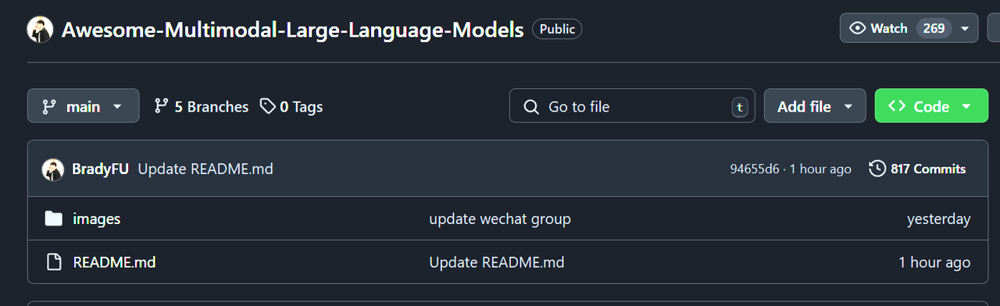

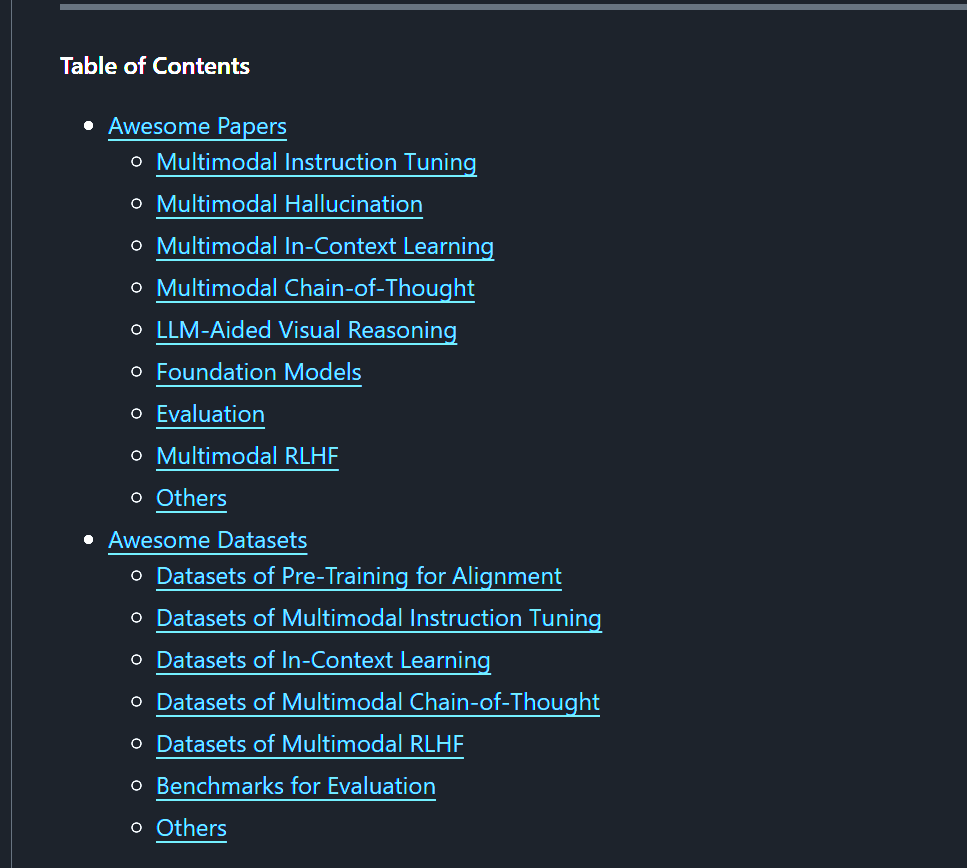

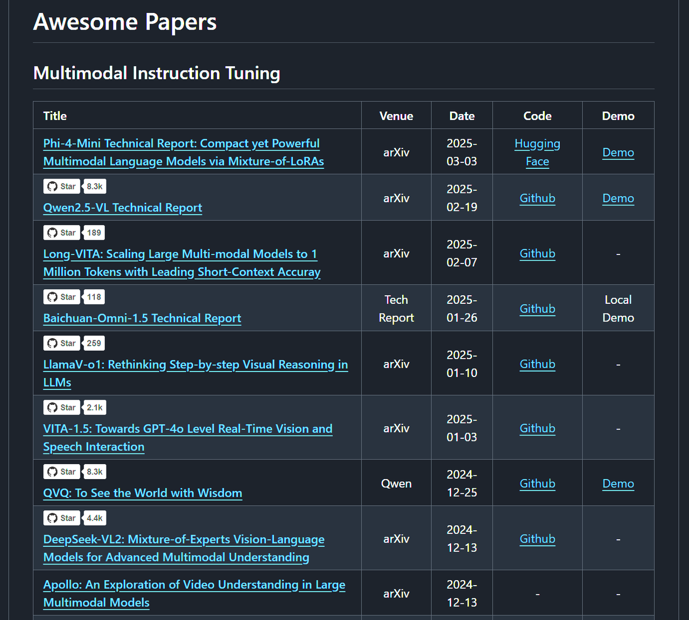

* **Awesome-Multimodal-Large-Language-Models，**&#x68;ttps://github.com/yfzhang114/Awesome-Multimodal-Large-Language-Models

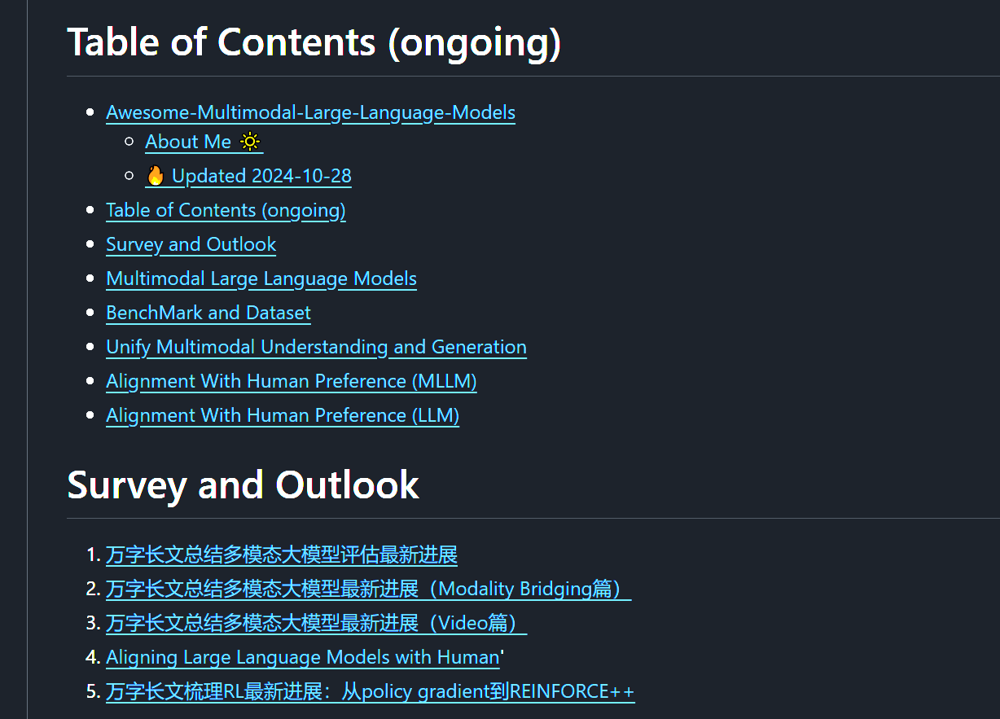

## 多模态大模型相关博客

* **Understanding Multimodal LLMs，**&#x94FE;接：https://magazine.sebastianraschka.com/p/understanding-multimodal-llms（看不懂的话知乎有翻译版本，**深入解析多模态大模型-主要技术和最新发展综述，**&#x68;ttps://zhuanlan.zhihu.com/p/15941853186）

* 知乎：**万字长文总结多模态大模型最新进展（Modality Bridging篇）**，**@yearn**，上面第二个仓库就是这位大佬的，链接：https://zhuanlan.zhihu.com/p/688215018

* 知乎博主：**@Lei Li，@林夕AIGC，@yearn，@北方的郎，@杜佳慧**

* 小红书：@古希腊掌管代码的神，@李磊NLP

* b站：@偷星九月333（全是实践代码干货），@跟着李沐学AI

## **多模态大模型的结构**

典型的**多模态大模型（Multimodal Large Language Model, MLLM）的结构**可以分为：

* **预训练的模态编码器（Pre-trained Modality Encoder）：**&#x5904;理编码图像、音频、视频、点云等模态数据

* **预训练的大语言模型（Pre-trained Large Language Model）：**&#x5BF9;编码过的文本和多模态数据理解和推理

* **连接模态的接口（Modality Connector）：**&#x5BF9;齐不同的模态

* **模态生成器（Modality Generator）：**&#x8F93;出除了文本以外的模态信息

### **模态编码器**

模态编码器（Modality Encoder）通常使用已经与其他模态对齐的预训练 Encoder：

* **视觉编码器：**&#x4E;FNet、**ViT**、**CLIP**、EVA-CLIP(MiniGPT-4)、ConvNext-L(Osprey)

* **语音编码器：**&#x57;hisper、**CLAP**

* **视频编码器：**&#x56;iViT 、**VideoPrism**

* **综合编码器：**&#x49;mageBind（支持**图像、文本、音频、深度、热成像以及惯性测量单元（IMU）数据**编码）

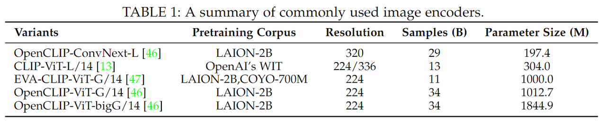

### **预训练LLM**

常用的预训练LLM：

* FlanT5，早期用于如**BLIP-2**、InstructBLIP

* **LLaMA、Vicuna、Qwen**

* MoE架构的：MM1、**MoE-LLaVA**

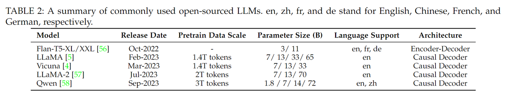

### **模态接口**

LLM只能感知文本，所以需要对齐自然语言和其他模态之间的差距。但是端到端（end to end）方式训练多模态大模型的成本极高，所以有两类更实际的方法：

* 在预训练的模态编码器与 LLM 之间引入**可学习的连接器：**

  * **Token-level 融合：**

    * **Projection-based：**&#x4C;laVa采用一两层的MLP来直接映射视觉token，使其维度和word embedding对齐

    * **Query-based：**&#x42;LIP-2以及后续一些工作采用 Q-Former 的方法，通过可学习的Queries将视觉token压缩为数量更少的表示向量

  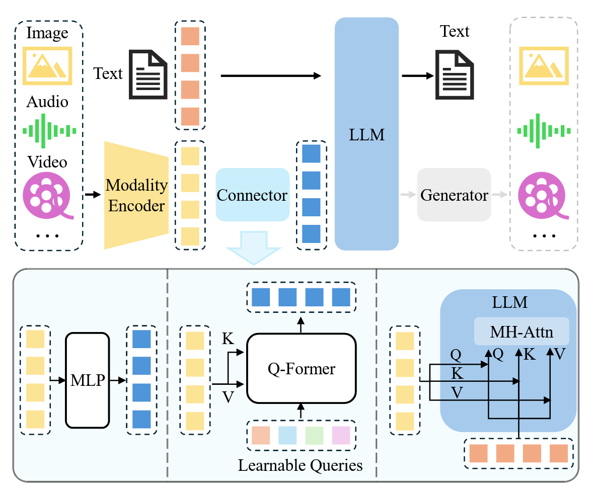

  * **Feature-level 融合：**&#x901A;过插入额外的模块，让文本特征与视觉特征之间能够进行深度交互与融合。**Flamingo&#x20;**&#x5728;预训练LLM的Transformer层之间插入额外的Cross-attention层；**CogVLM**在每个Transformer层中插入一个视觉专家模块；**LLaMA-Adapter**向Transformer层中引入了可学习的、嵌入了视觉知识的prompt，作为前缀与文本特征连接起来

  * **可学习模态接口参数通常只占总体的一小部分。以Qwen-VL为例，Q-Former的参数规模约为0.08B，占整个模型参数的比例不到1%**

* 借助**专家模型**将图像转换为语言描述然后再输入 LLM：**VideoChat-Text**使用预训练的视觉模型来提取动作之类的视觉信息，并利用语音识别模型来丰富描述内容。尽管使用专家模型的方法简单直接，但是**将其他模态的信息转换为文本形式可能会导致信息丢失**

## **多模态大模型的训练策略及数据**

多模态大模型也分为**预训练、指令微调（SFT/IFT）以及对齐微调（Alignment）**，每个训练阶段都需要不同类型的数据，并实现不同的目标

### **预训练**

> ### **训练形式**
>
> 预训练主要是在**对齐不同的模态**，并学习**多模态的世界知识（World Knowledge）**。预训练阶段通常需要大量的的**文本配对数据**，例如**图像描述数据**。更一般的配对数据是**以自然语言句子来描述图像、音频或视频**
>
> 考虑视觉与文本的对齐的场景，**给定一张图像，模型以自回归的方式预测图像的描述文本**。上面模板&#x4E2D;**`<image>`**&#x662F;visiontoken的占位符，**`<caption>`**&#x662F;描述内容，**只有红色的部分用于交叉熵loss的计算。**
>
> 预训练的通常是**冻结预训练的模块**（例如Vision Encoder和LLM），**只训练模态接口**，在不丢失预训练知识的情况下对齐不同的模态。有时候也会训练更多的模块，比如 Vision Encoder来更好地实现对齐。对于**简短且包含噪声的图像描述数据**，可以**采用较低的分辨率（如224）来加快训练过程**；对于**较长且更干净的数据**，**使用较高的分辨率（如448或更高）减少幻觉**

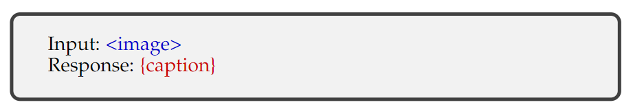

> ### **训练数据**
>
> * **粗粒度数据：**（1）数据量庞大，因为样本**通常来源于互联网**。（2）通过网络爬取而来，**图像描述通常简短且包含噪声**，因为源自网页图像的替代文本（alt-text）。这些数据可以通过自动工具进行清理和筛选，例如，使用CLIP来过滤掉图像-文本对之间相似度低于预定义阈值的样本
>
> * **细粒度数据：**&#x901A;过**提示强大的MLLM 如GPT-4V 来生成高质量的细粒度数据，通常包含对图像更长且更准确的描述**，从而能够在图像和文本模态之间实现更细粒度的对齐

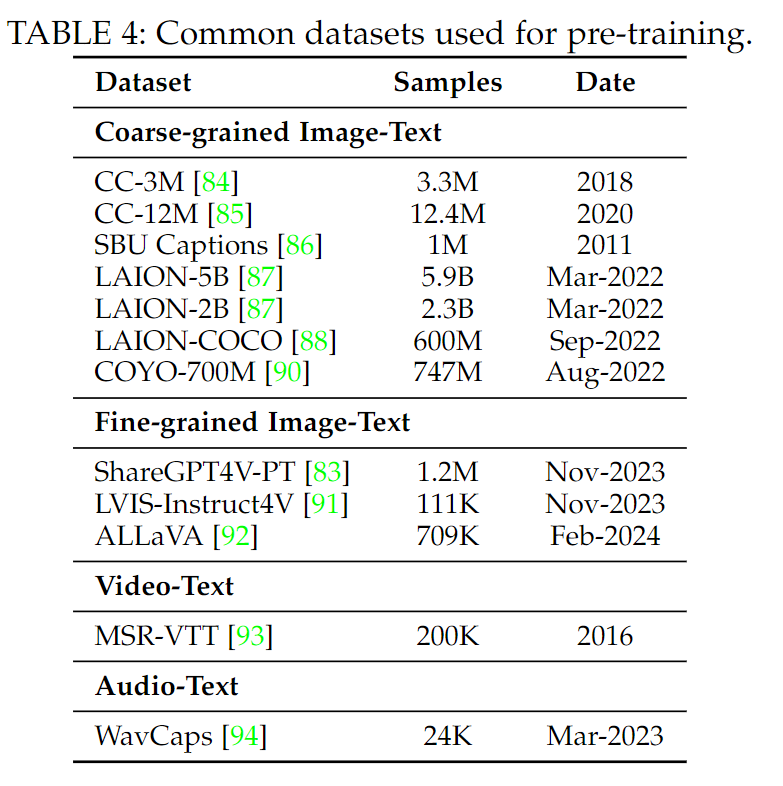

### **指令微调**

> ### **训练细节**
>
> 多模态指令微调样本通常包&#x542B;**`<Instruction, Input, Response>`**&#x7684;三元组 $$(\mathcal{I}, \mathcal{M}, \mathcal{R})$$，指令`Instruction`是一个**描述任务的自然语言句子**，比如“请详细描述这张图片”，输入`Input`可以是**VQA任务中的图文对，或者也可以只是一张图片**
>
> **MLLM**在给定**指令**和**多模态输入**的情况下预测一个**答案**：$$\mathcal{A}=f(\mathcal{I}, \mathcal{M} ; \theta)$$
>
> **训练目标**则可以表示为**Next Token Prediction**：$$\mathcal{L}(\theta)=-\sum_{i=1}^{N} \log p\left(\mathcal{R}_{i} | \mathcal{I}, \mathcal{R}_{<i} ; \theta\right)$$

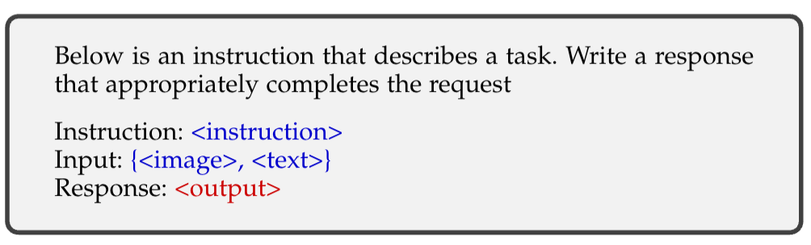

> ### **数据收集**
>
> 指令数据在格式上更加灵活，在**任务表述方面多种多样**，因此收集数据样本通常更具难度，成本也更高
>
> * **Data Adaption 数据适配：利用现有的特定任务的高质量数据集来转换构建指令数据集。**&#x4EE5;**VQA（视觉问答）数据集**的转换为例，原始样本是一个**输入-输出对**，其中**输入包括一张图像和一个自然语言问题**，**输出则是基于该图像对问题的文本答案**。对应的的输入-输出对可以自然地**构成指令样本中的多模态输入Input和响应Response**。对于指令Instruction来说，可以来自**人工设计**，也可以借助**GPT进行半自动生成**。下图是针对VQA数据集的指令模板示例

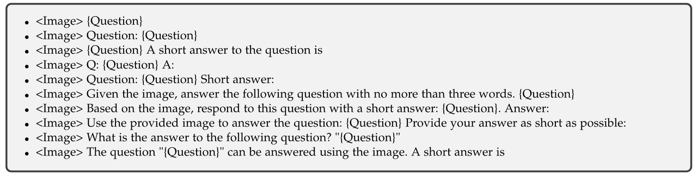

> * **Self-Instruction：先手工设计一些指令遵循的样本，然后Prompt GPT4等模型去生产更多的类似的指令样本。LLaVA** 将这种方法**扩展到了多模态领域**，它把图像转化为**caption和bounding box的文本形式**，然后Prompt GPT-4生成新的数据，构建了**LLaVA-Instruct-150k的多模态指令数据集**。下表是一些通过Self-Instruction生成的数据集

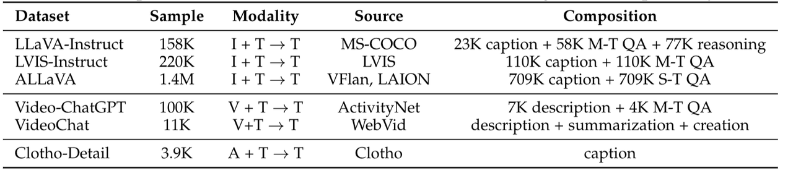

> * **Data-Mixture：混合纯文本形式的对话数据也可以提高对话能力和指令遵循能力**。LaVIN 从**纯文本数据和多模态数据中随机采样**。MultiInstruct **探索融合单模态和多模态数据进行训练的不同策略**，其中包括**混合指令微调（将两种类型的数据结合起来，并进行随机打乱）以及顺序指令微调（先使用文本数据，接着使用多模态数据）**

> ### **数据质量**
>
> 在**大规模但存在噪声的图像-文本对上进行预训练的模型，其表现不如在规模较小但更干净的数据集上进行预训练的模型**。数据质量最重要的两个方面：
>
> * **提示多样性：**&#x6307;令的多样性对模型性能至关重要，多样化的提示有助于提升模型性能和泛化能力
>
> * **任务覆盖范围：**&#x5C31;训练数据中涉及的任务而言，**视觉推理任务**在提升模型性能方面优于图像注释任务（Image Caption）和问答（VQA）任务。此外，提高**指令的复杂性**可能比**增加任务多样性**和**细粒度的空间注释**更有益

### **对齐微调**

> ### **数据细节**
>
> Alignment Tuning 对齐调优更多地应用于模型需要与特定的人类偏好保持一致的场景中，例如减少幻觉生成。目前，**基于人类反馈的强化学习（RLHF）和直接偏好优化（DPO）**&#x662F;用于对齐调优的两种主要技术（这篇综述比较早了这里只提到RLHF-PPO和DPO，但实际上现在也有类似R1的在多模态大模型推理方面的工作）。PPO和DPO的技术细节这里不多赘述，主要看一下**多模态的偏好数据长啥样**（用来训练奖励模型RM或者直接用来做DPO），下面是几个常见的多模态偏好数据集，以RLHF-V为例，其中的一条样本如下所示：

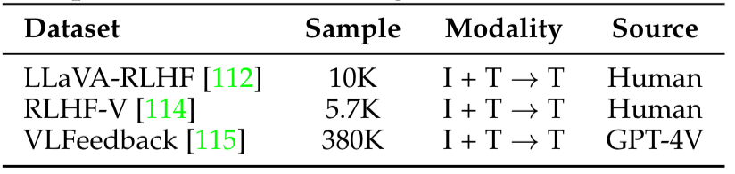

**常见多模态偏好数据集**

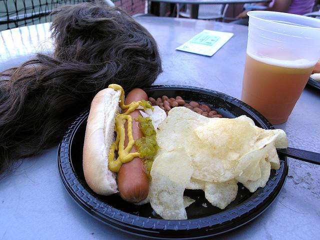

**RLHF-V数据集示例**

