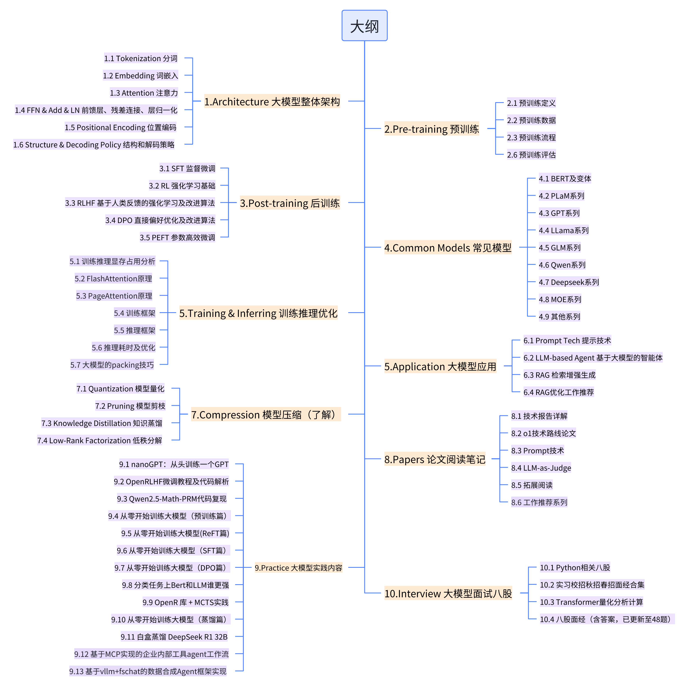

**压缩包解压出现问题可以换360解压软件再次尝试～～**

## **大模型部分**

[LLM代码汇总 2.zip](<files/LLM代码汇总 2.zip>)

**增量更新部分：**

[mcp\_agent\_code.zip](files/mcp_agent_code.zip)

[SynthesisAgent.zip](files/SynthesisAgent.zip)

[shousi.zip](files/shousi.zip)

## **多模态部分**

[RAG 2.zip](<files/RAG 2.zip>)

[qwen\_vl\_sft.zip](files/qwen_vl_sft.zip)

## **简历模板**

**简历模板本身文件格式没有问题，文档在线预览右边没有对齐，下载后是正常的**

[简历模版.docx](files/简历模版.docx)

[1\_简历模板.docx](files/1_简历模板.docx)

